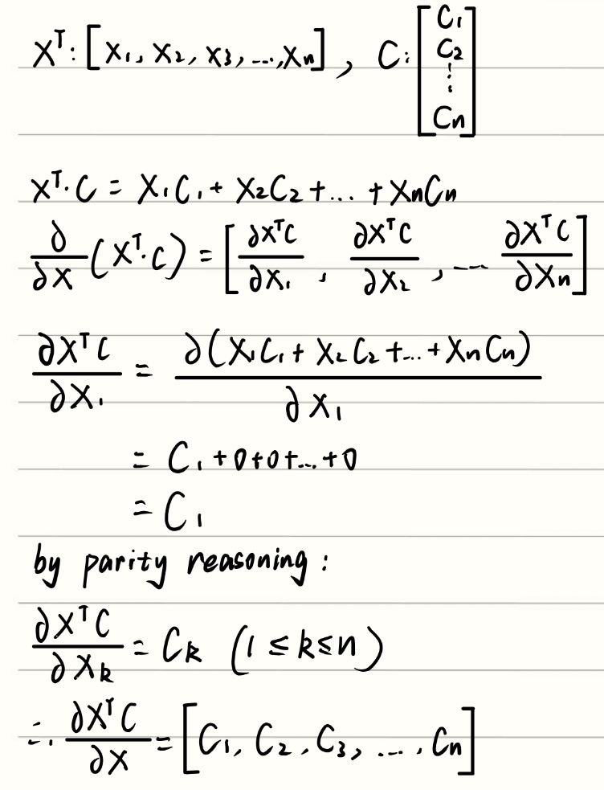
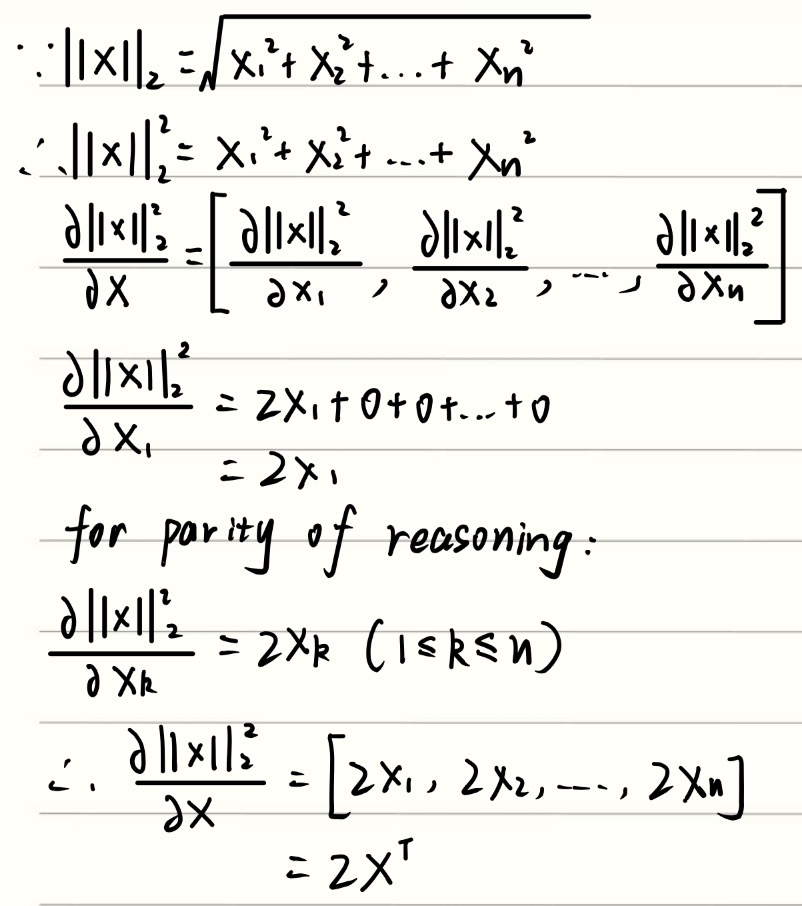
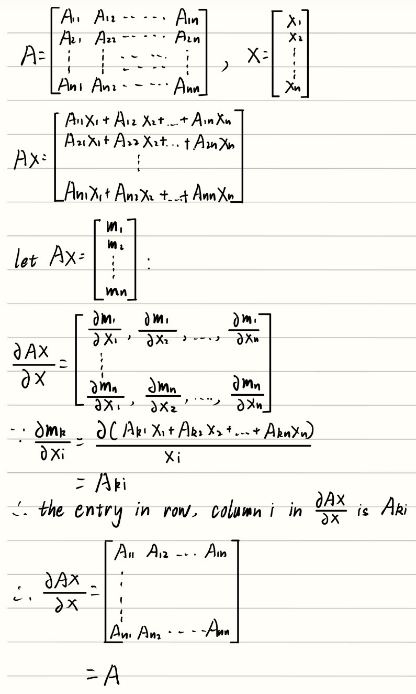
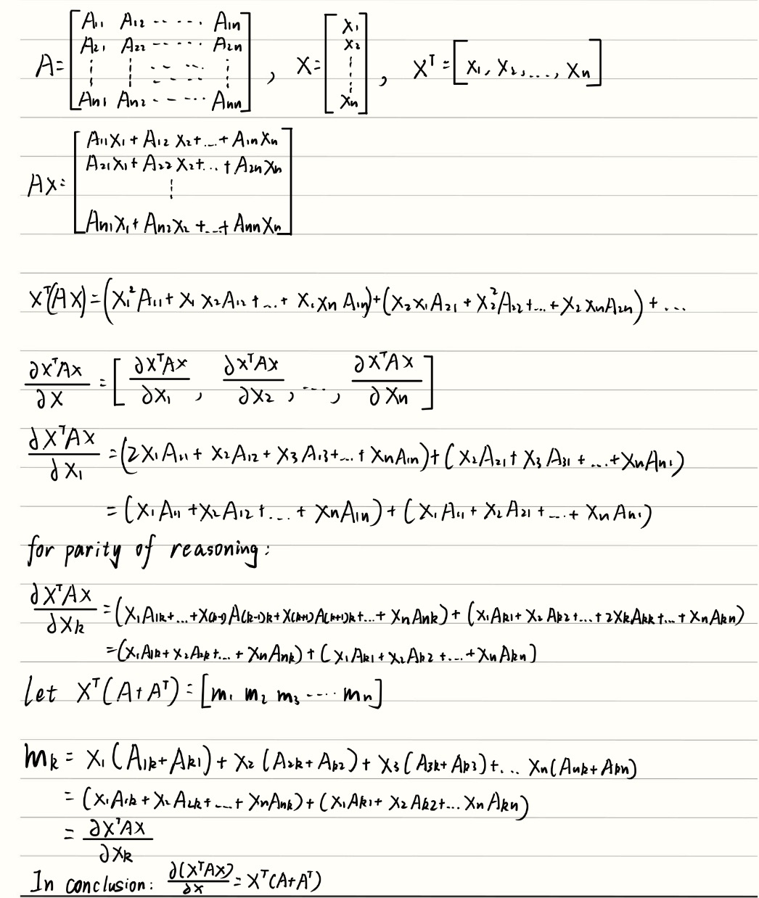

## 1. Attention is all you need

I have already filled out this form. I am a concurrent student.

My name: Chenyang Zhang

My Student ID: 3043218909

My email: chenyangzhang310@berkeley.edu

## 2. Reflection on Your Learning Goals at the Start of the Semester

### (a)

I hope to develop a clear understanding of the mathematical principles behind deep learning through CS182. I also hope to apply what I learn in this course to robot learning, which is one of my main research interests.

I have previously studied CS231n, which helped me build a basic foundation in machine learning, deep learning and computer vision. However, I felt that it was more like an introductory course in some aspects. Many concepts were introduced without detailed mathematical derivations, and conclusions were sometimes presented directly. This made it difficult for me to fully understand why certain methods work.

Berkeley courses are well known for their rigorous mathematical treatment of technical topics, so I hope CS182 will help me understand the mathematical foundations of deep learning in a much more systematic way. I am really looking forward to the course.
### (b)
I told GPT that CS231n did not spend much time explaining the mathematical principles behind many deep learning concepts, which made the learning process difficult for me. Therefore, I said that I hoped CS182 could help me clearly understand the mathematics behind deep learning and eventually apply this knowledge to robot learning, which is one of my main research interests. GPT then discussed these goals with me.

After the discussion, I realized that understanding the mathematics behind deep learning is not only about being able to follow derivations. I also have to understand how these mathematical ideas explain the behavior of neural networks, such as how optimization works, why certain architectures are effective, and how models learn useful representations from data.

This did not fundamentally change my original learning goal, but it made the goal more concrete. I still hope to build a strong mathematical foundation in deep learning through CS182, while also learning how to connect mathematical principles with the behavior of real models and eventually with applications in robot learning.

### (c)

Before looking at the Fall 2026 course website, I had already looked through the Fall 2025 website and the spring 2021 of CS182. The 2021 version was taught by Sergey Levine, and I noticed that the course content in 2021 was already quite different from that in Fall 2025. This made me realize how quickly the field of deep learning evolves. I also expect that the Fall 2026 version of CS182 will contain some new topics or changes compared with Fall 2025.

Donoho's paper further strengthened my impression that machine learning is developing at an extremely fast pace. His discussion of data sharing, code sharing, and reproducibility showed me how new ideas can be tested, reproduced, and improved very quickly. It made me realize that simply learning the methods that are currently popular is probably not enough, because some of them may soon be replaced by newer approaches.

Tao's paper made me think about this issue from another perspective. As AI becomes increasingly capable of assisting people with mathematical and technical work, simply knowing how to use an AI system or obtain an answer from it is becoming less valuable by itself. What seems more important to me is understanding the reasoning and principles behind the answer, and being able to judge whether the result actually makes sense.

After reading the course website and these two papers, I now think the role of CS182 is not simply to teach me a collection of current deep learning methods. Since deep learning is changing so quickly, it is impossible for one course to cover every technique that I may encounter in the future. Instead, I hope CS182 can give me a strong mathematical foundation and a way of thinking about deep learning, so that when new models and methods appear, I will be able to understand them from their underlying principles rather than only learning how to use them.

### (d)

I think doing projects can significantly improve my understanding of deep learning. Sometimes I may think that I already understand a mathematical principle when I read the derivation or follow an example, but when I actually try to implement it in code, I suddenly realize that there are still many details that I do not fully understand. To me, this means that my understanding was not deep enough.

Projects can help solve this problem because they require me not only to understand the mathematical ideas, but also to translate them into actual implementations. In addition, completing a project usually requires strong engineering skills. I believe this process can greatly deepen my understanding of deep learning and help me connect mathematical principles with how models actually work in practice.

For course staff, I think the most helpful guidance would be helping me understand questions or concepts that I could not fully understand during lectures, especially difficult mathematical derivations and the intuition behind them.

I also think group collaboration can help me experience the atmosphere of research in advance. Different people usually have different strengths: some may be better at mathematics, some at designing the engineering framework, and others at coding and implementation. A good project often requires everyone to contribute what they are best at. I think research works in a similar way. It is usually a process of teamwork and division of responsibilities rather than one person trying to do everything alone. Working with peers in this way would not only help me learn deep learning, but also give me a better understanding of how collaborative research is actually carried out.

---

## 3. Vector Calculus Review

### (a):

### (b)

### (c)

### (d)

### (e)

---

# 4. Least Squares and the Min-Norm Problem from the Perspective of SVD

# 5. The Five Interpretations of Ridge Regression

# 6. ReLU Elbow Update under SGD

---

# 7. Coding Fully Connected Networks

Complete the provided `networks.ipynb` notebook using NumPy and export the completed notebook as a PDF.

## (a)

**Fill this part in after running the three-layer and five-layer networks.**

A possible answer, if it agrees with the experimental results, is:

> I found that the five-layer network was more difficult to train than the three-layer network. The deeper network was more sensitive to optimization choices and generally required more careful tuning to obtain good performance. This is consistent with the fact that gradients must propagate through more layers in the five-layer network.

---

# 8. Homework Process and Study Group

## (a)

I used the course materials, the assigned readings, and ChatGPT to discuss and check some of the mathematical derivations.

## (b)

I did not work with other students on this homework.

## (c)

Approximately **[fill in the actual number] hours**.