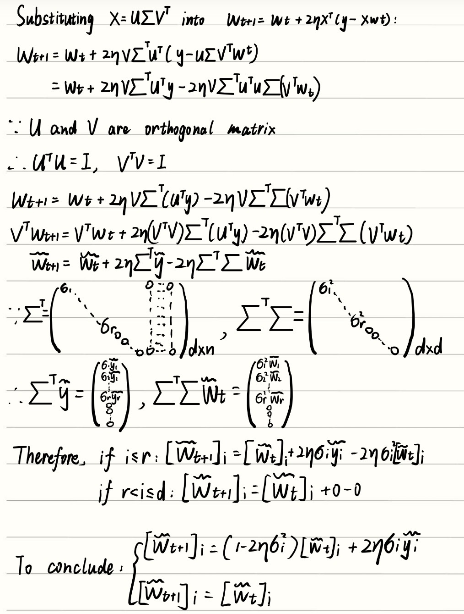
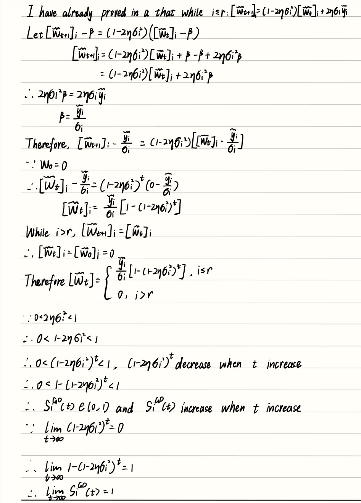
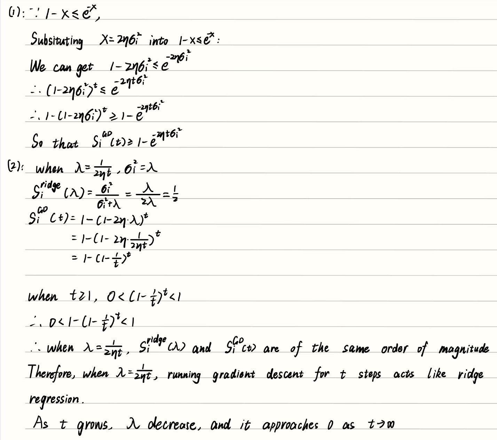
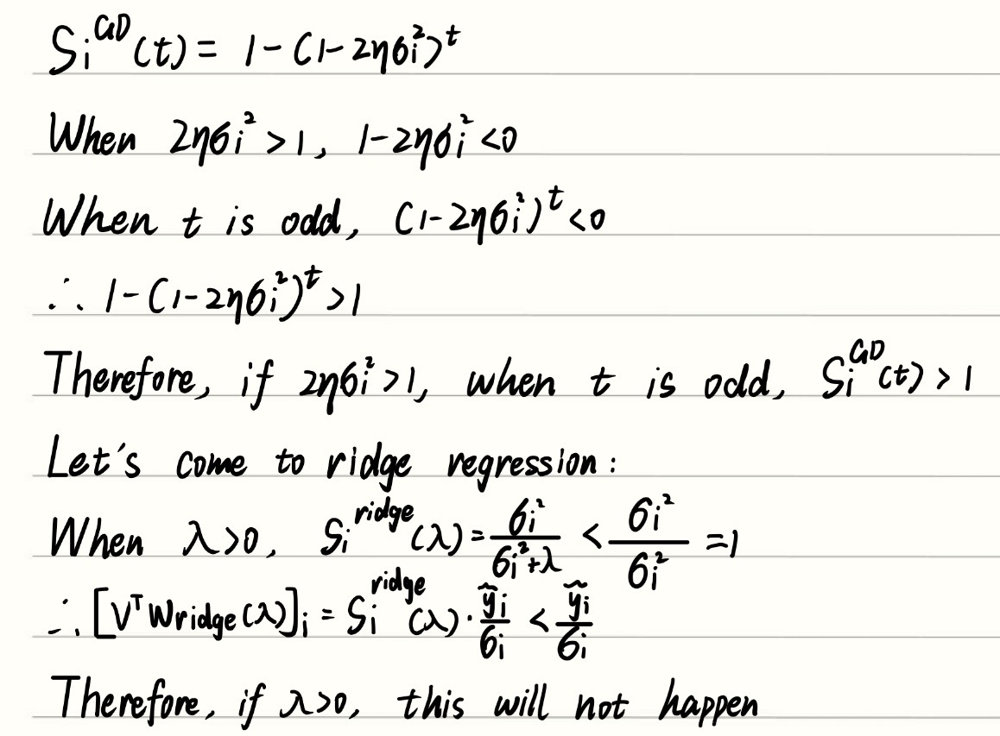

Name: Chenyang Zhang

Student ID: 3043218909

chenyangzhang310@berkeley.edu
## 1

### (a)

### (b)

### (c)

### (d)

### (e)

### (f)

### (g)

Through singular value decomposition, we can transform the original complicated matrix problem into many independent dimensions, which makes the problem much easier to analyze and solve.

---

## 2

### (a)

### (b)

### (c)

### (d)

---

## 3

---

## 4

### (a)

### (b)

### (c)

### (d)

---

## 5

### (a)

The training datas contain noise, while the test datas are noiseless.

### (b)

As the hidden layer width increases, the network has more ReLU units and therefore more possible elbows. This makes the learned function more flexible and allows it to better approximate the piecewise-linear target, which generally reduces the test error.

I would place them near the locations where the target function changes slope.

### (c)

Ridge regression is the most computationally efficient because it directly solves for the output-layer weights instead of using many SGD iterations. Training only the output layer with SGD is slower, while training all layers is generally the most expensive. The ReLU elbows remain fixed when only the output layer is trained, either with SGD or ridge regression, because the hidden-layer parameters do not change. When all layers are trained, the elbows can move. This is important because the network can move the slope-change locations toward the bends in the target function, which can improve the learned function and reduce test error.
