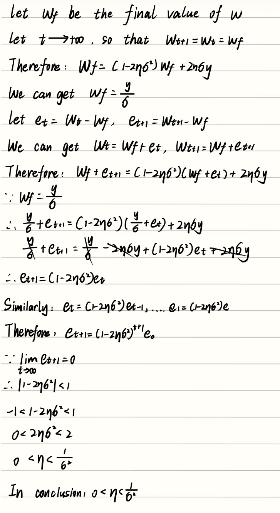
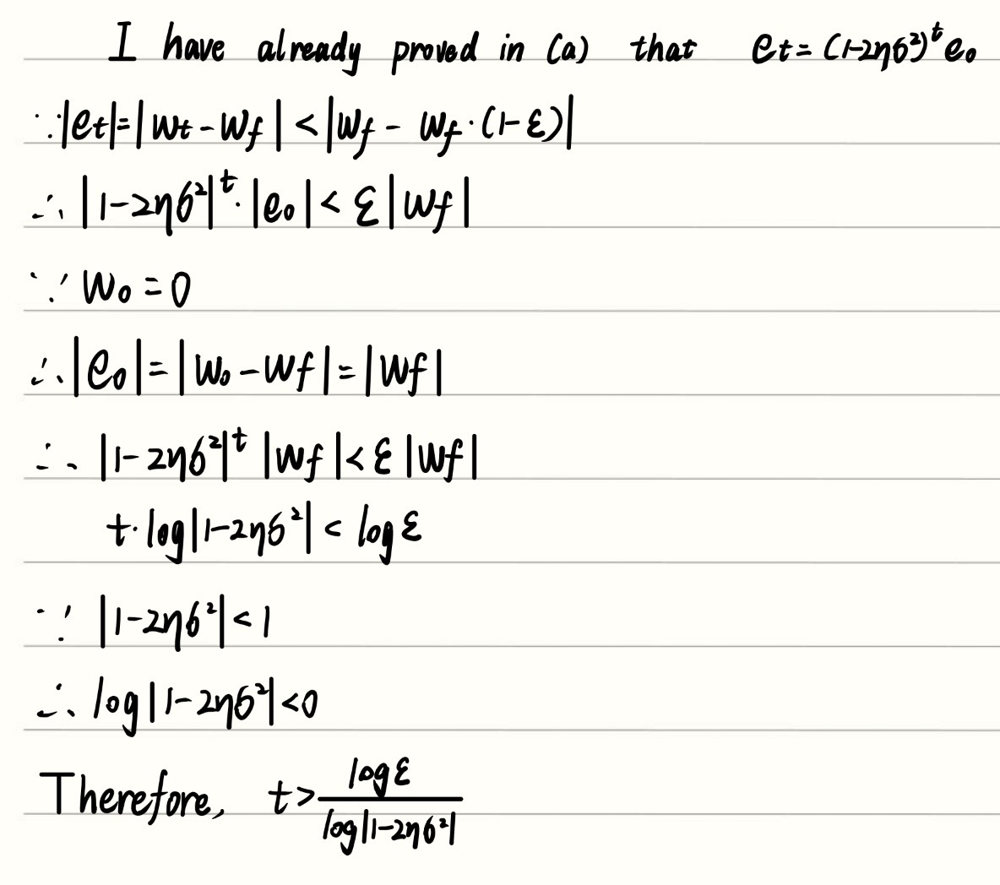
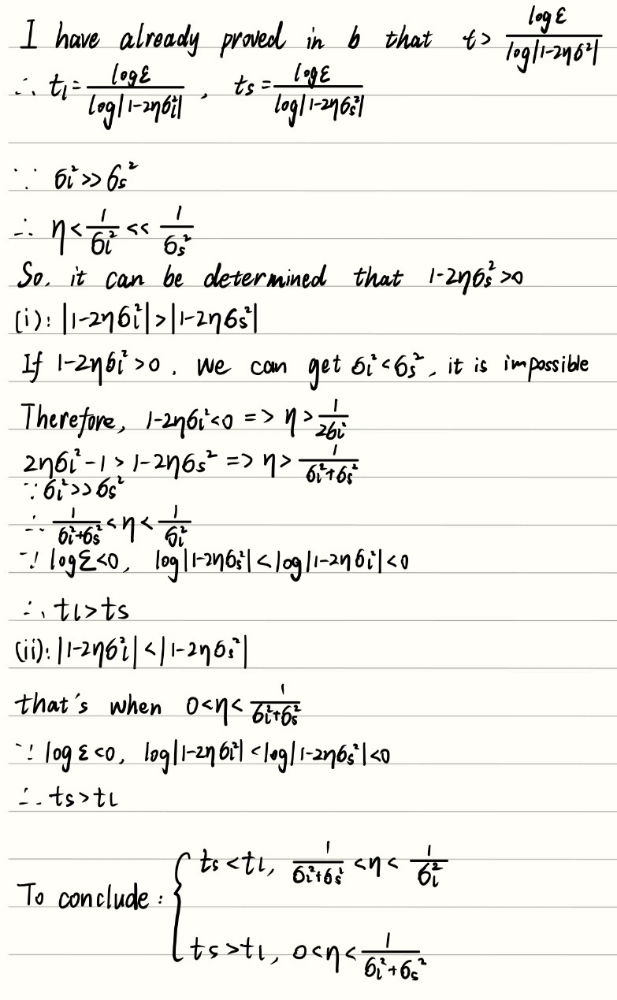
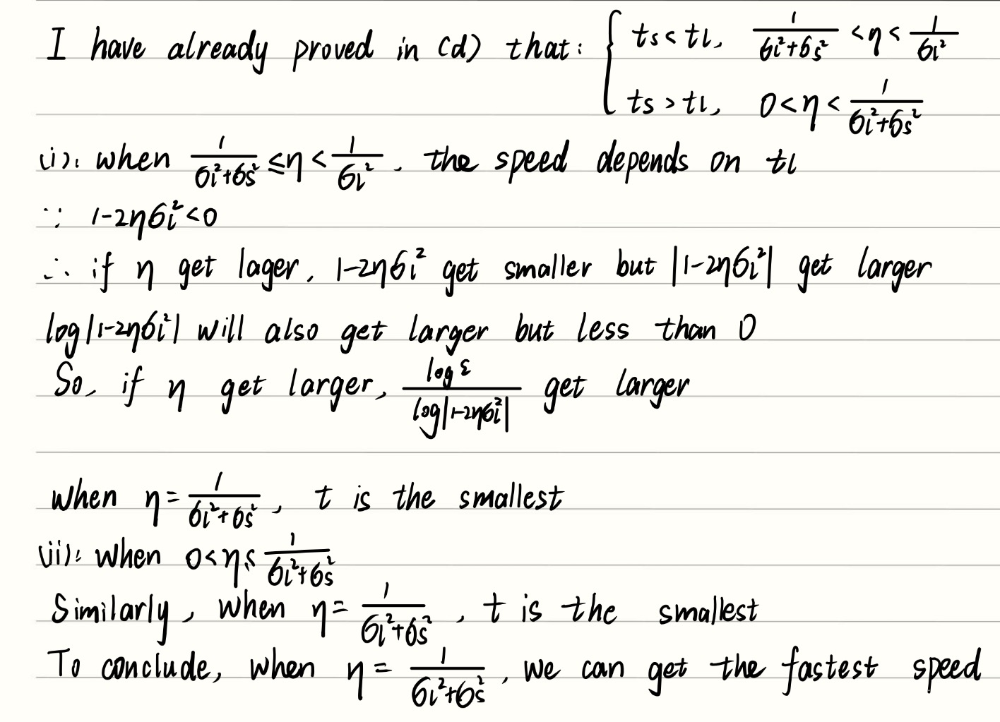
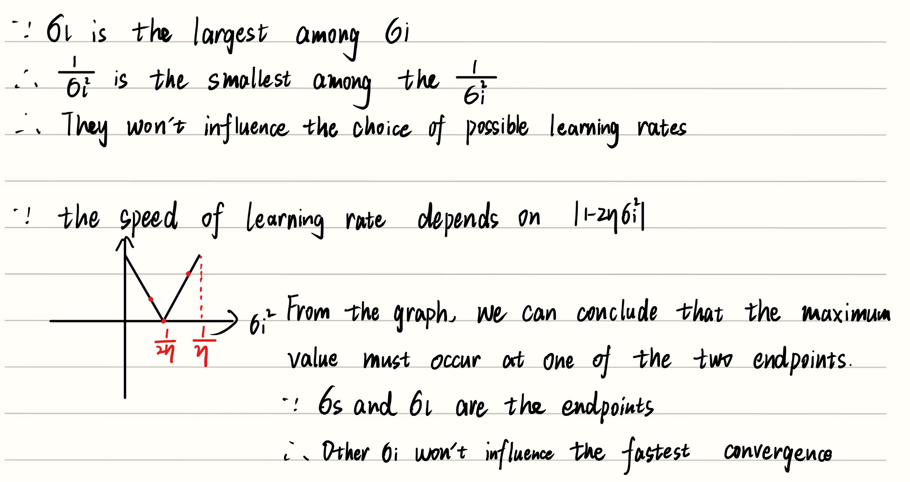
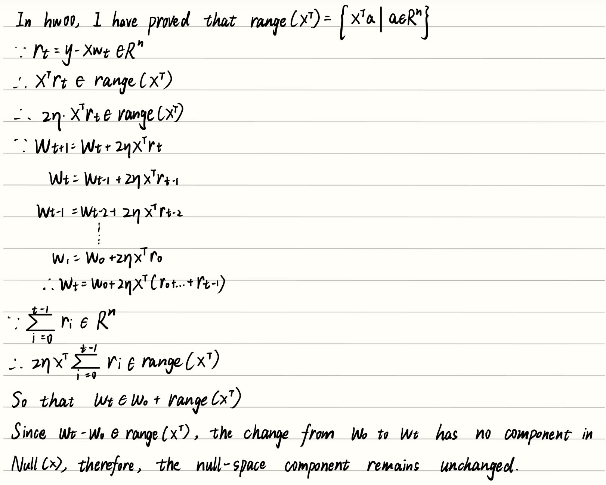
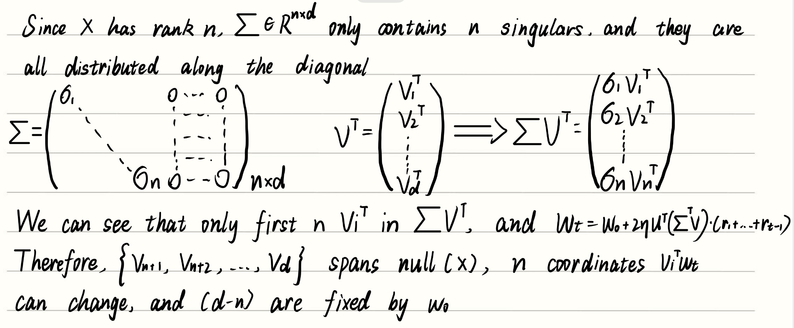
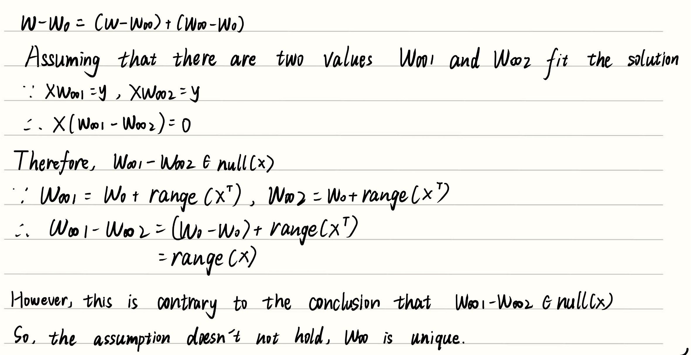
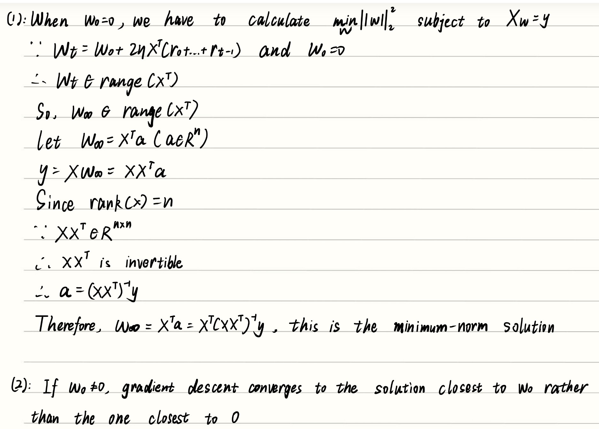

## 1

### (a)

### (b)

### (c)

### (d)

### (e)

### (f)

### (g)
Through singular value decomposition, we can transform the original complicated matrix problem into many independent dimensions, which makes the problem much easier to analyze and solve.

---
## 2

### (a)

### (b)

### (c)

### (d)

---
## 3