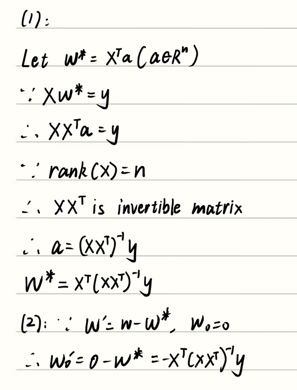
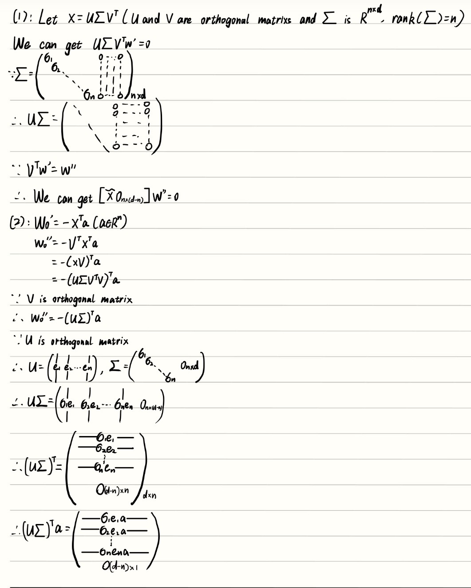
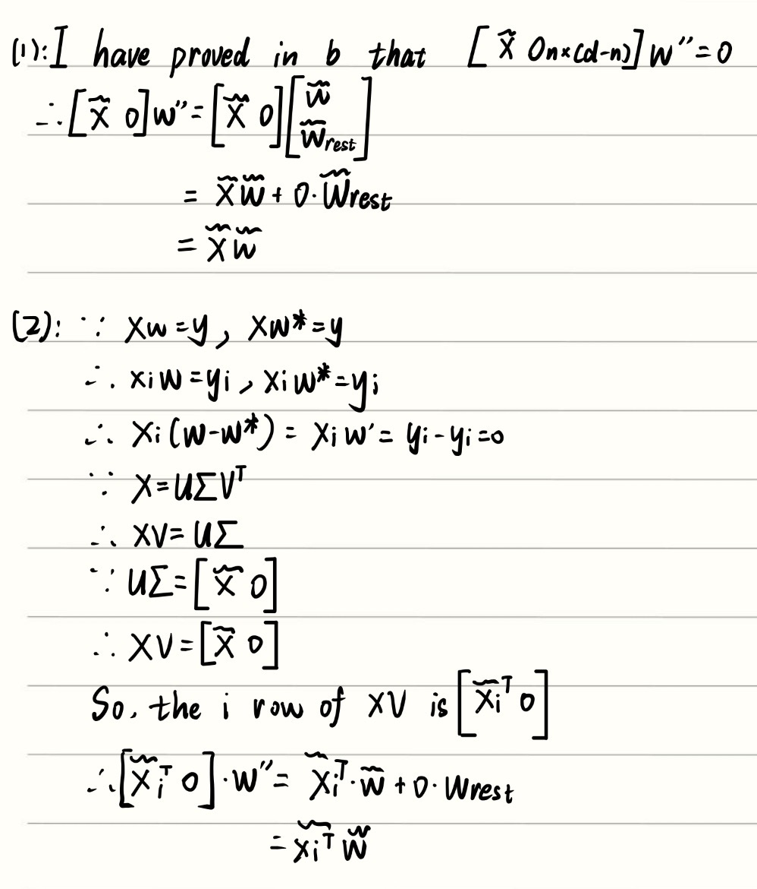
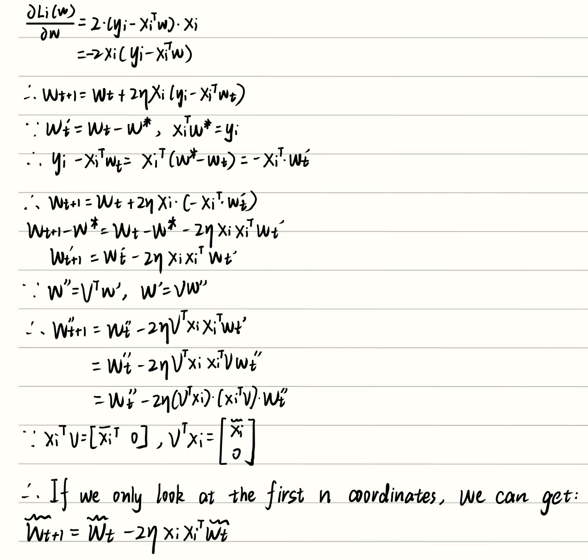
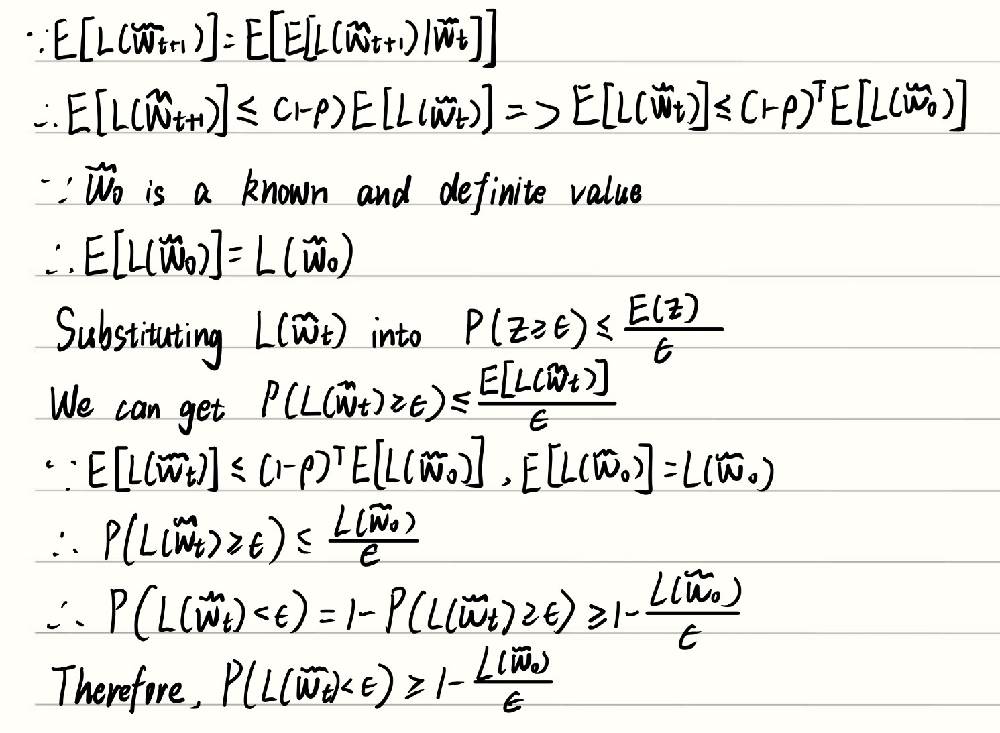
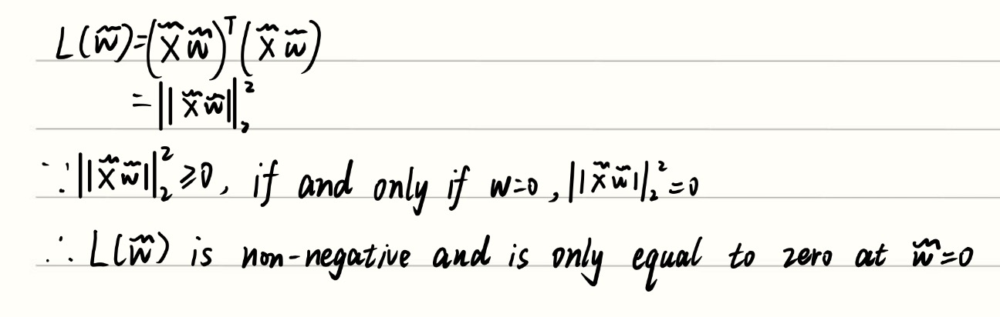
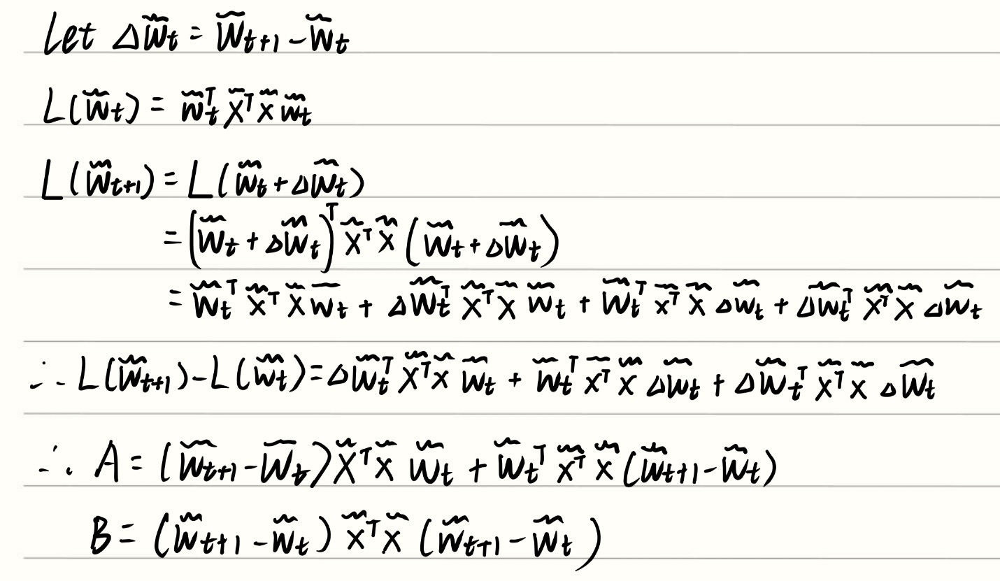
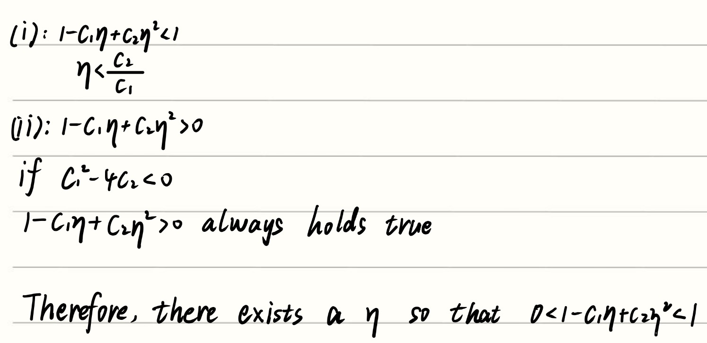

## 1
### (a)

### (b)

### (c)

### (d)

### (e)

### (f)

### (g)

### (h)

### (i)

### (j)

### (k)

The original ridge SGD decreases rapidly at first, but then fluctuates around a nonzero error level. In contrast, the feature-augmented SGD keeps decreasing and approaches zero. Thus, the feature-augmented method continues converging toward the ridge solution, while the original ridge SGD reaches a nonzero error floor.