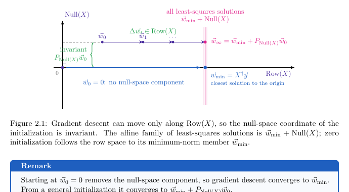
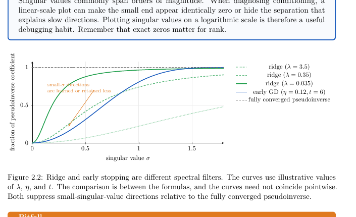
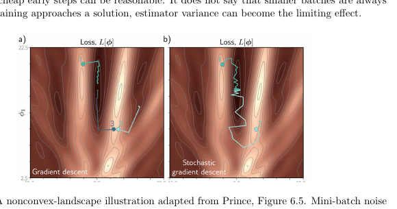

这两份 note 其实是连在一起看的：

- `02.pdf`：Least-Squares Optimization, Ridge, and Implicit Regularization
- `03.pdf`：Gradient Descent and Stochastic Gradient Descent

它们的核心不是单纯讲“怎么写 optimizer”，而是借最小二乘这个可以完全算清楚的例子，理解几个更深的东西：

1. 为什么梯度下降在某些方向上会动，在某些方向上完全不会动。
2. 为什么 ridge regularization 和 early stopping 都可以看成“不要太相信小奇异值方向”。
3. 为什么 SGD 虽然有噪声，但在某些 overparameterized/interpolation 情况下仍然能收敛到 minimum-norm solution。

---

# 1. Least Squares as a Dynamical System

## 1.1 最小二乘问题

给定：

$$
X \in \mathbb{R}^{n \times d}, \quad \vec{y} \in \mathbb{R}^{n}, \quad \vec{w} \in \mathbb{R}^{d}
$$

最小二乘的目标是让预测 $X\vec{w}$ 尽量接近真实标签 $\vec{y}$：

$$
L(\vec{w}) = \|X\vec{w} - \vec{y}\|_2^2
$$

它的梯度是：

$$
\nabla L(\vec{w}) = 2X^T(X\vec{w} - \vec{y})
$$

所以梯度下降更新为：

$$
\vec{w}_{t+1}
= \vec{w}_t - 2\eta X^T(X\vec{w}_t - \vec{y})
$$

也可以整理成：

$$
\vec{w}_{t+1}
= (I - 2\eta X^TX)\vec{w}_t + 2\eta X^T\vec{y}
$$

这个式子的重点是：虽然我们在做 optimization，但是因为 loss 是一个 quadratic，所以整个过程其实变成了一个线性 dynamical system。

!!! explanation "为什么说它是 dynamical system"
    普通理解里，gradient descent 就是“每一步沿着负梯度走”。
    
    但在 least squares 里，每一步更新都可以写成：
    
    $$
    \vec{w}_{t+1} = A\vec{w}_t + b
    $$
    
    其中：
    
    $$
    A = I - 2\eta X^TX,\quad b = 2\eta X^T\vec{y}
    $$
    
    这就像一个固定规则反复作用在 $\vec{w}$ 上。我们可以分析它每一步到底怎么收缩、往哪里收敛、哪些方向快、哪些方向慢。

## 1.2 Minimum-norm least-squares solution

least squares 的解不一定唯一。

特别是在 overparameterized 情况下：

$$
d \gg n
$$

参数维度比样本数量还多，那么可能有很多个 $\vec{w}$ 都能让：

$$
X\vec{w} = \vec{y}
$$

也就是说，很多参数都能在训练集上完美拟合。

在这些解里面，有一个特殊的解叫 **minimum-Euclidean-norm solution**：

$$
\vec{w}_{min} = X^\dagger \vec{y}
$$

其中 $X^\dagger$ 是伪逆。这个解满足：

$$
X^TX\vec{w}_{min} = X^T\vec{y}
$$

并且：

$$
\vec{w}_{min} \in Row(X)
$$

即：它在 $X$ 的 row space 里面。

---

# 2. Row Space 和 Null Space

## 2.1 两个关键空间

为了理解 gradient descent 最后会到哪个解，需要看两个子空间。

### 2.1.1 Row Space

$Row(X)$ 是 $X$ 的所有行向量张成的空间。

等价地：

$$
Row(X) = Range(X^T)
$$

也就是说，凡是能写成 $X^T\vec{v}$ 的向量，都在 $Row(X)$ 里。

### 2.1.2 Null Space

$Null(X)$ 是所有被 $X$ 乘完之后变成 0 的方向：

$$
Null(X)=\{\vec{z}\in\mathbb{R}^d: X\vec{z}=0\}
$$

如果沿着 null space 方向改变参数：

$$
\vec{w}' = \vec{w} + \vec{z},\quad \vec{z}\in Null(X)
$$

那么预测不会变：

$$
X\vec{w}' = X(\vec{w}+\vec{z}) = X\vec{w}+X\vec{z}=X\vec{w}
$$

所以 null space 的方向是训练数据看不见的方向。

!!! explanation "直觉理解"
    可以把 $X$ 想成一个只会检查某些方向的检测器。
    
    如果某个方向在 $Null(X)$ 里，那么你沿着这个方向移动 $\vec{w}$，$X\vec{w}$ 完全不变。
    
    对训练数据来说，这些参数变化就像没有发生过。

## 2.2 Gradient descent 只能在 row space 里动

看梯度下降更新：

$$
\vec{w}_{t+1}
= \vec{w}_t - 2\eta X^T(X\vec{w}_t-\vec{y})
$$

更新量是：

$$
-2\eta X^T(X\vec{w}_t-\vec{y})
$$

它一定是 $X^T(\text{某个向量})$ 的形式，所以一定在：

$$
Range(X^T)=Row(X)
$$

这说明：

> Gradient descent 每一步只能沿着 row space 的方向改参数。

因此，$\vec{w}$ 的 null-space component 永远不会被改变：

$$
P_{Null(X)}\vec{w}_t = P_{Null(X)}\vec{w}_0
$$

## 2.3 为什么 zero initialization 很重要

如果从：

$$
\vec{w}_0 = 0
$$

开始，那么初始参数没有 null-space component：

$$
P_{Null(X)}\vec{w}_0 = 0
$$

而 gradient descent 又不会改变 null-space component，所以整个训练过程中：

$$
P_{Null(X)}\vec{w}_t = 0
$$

最后它会收敛到：

$$
\vec{w}_{min}=X^\dagger\vec{y}
$$

也就是所有 least-squares solution 里面 norm 最小的那个。

如果从一般初始化出发，那么最后会到：

$$
\vec{w}_{min} + P_{Null(X)}\vec{w}_0
$$

!!! note "这里的重点"
    在 overparameterized 问题里，训练集可能无法唯一确定参数。
    
    这时候 optimizer 和 initialization 会参与“选解”。
    
    所以即使没有显式加正则项，gradient descent 也会因为自己的更新结构产生一种 implicit bias。

---

# 3. Contraction and Condition Number

定义误差：

$$
\Delta_t = \vec{w}_t - \vec{w}_{min}
$$

由前面的更新式可以得到：

$$
\Delta_{t+1} = (I - 2\eta X^TX)\Delta_t
$$

这说明误差每一步都会被矩阵：

$$
I - 2\eta X^TX
$$

乘一下。

如果 $X^TX$ 的正特征值是：

$$
0 < \lambda_1 \le \cdots \le \lambda_r = \lambda_{max}
$$

那么在第 $i$ 个 eigen-direction 上，误差会被乘上：

$$
1 - 2\eta\lambda_i
$$

所以只要学习率满足：

$$
0 < \eta < \frac{1}{\lambda_{max}(X^TX)}
= \frac{1}{\sigma_{max}(X)^2}
$$

每个正特征值方向上的误差都会收缩。

## 3.1 为什么 condition number 大会收敛慢

最优的 constant learning rate 会让最大特征值方向和最小正特征值方向的收缩速度尽量平衡：

$$
\eta_* = \frac{1}{\lambda_{max}+\lambda^+_{min}}
$$

对应的最坏收缩因子是：

$$
\rho(\eta_*) = \frac{\kappa - 1}{\kappa + 1}
$$

其中：

$$
\kappa = \frac{\lambda_{max}}{\lambda^+_{min}}
$$

$\kappa$ 就是 condition number。

如果 $\kappa$ 很大，那么：

$$
\frac{\kappa - 1}{\kappa + 1} \approx 1
$$

这表示每一步收缩得很少，因此收敛很慢。

!!! example "直觉"
    如果 loss landscape 是一个又长又窄的山谷，陡的方向和缓的方向差别很大。
    
    学习率太大时，陡的方向会来回震荡；学习率太小时，缓的方向又走得特别慢。
    
    condition number 大，本质上就是这些方向的尺度差异太大。

---

# 4. Ridge Regression

## 4.1 Ridge 的目标函数

Ridge regression 在 least squares 后面加一个 L2 penalty：

$$
\vec{w}_{ridge}
= \arg\min_{\vec{w}}
\left(
\|X\vec{w}-\vec{y}\|_2^2
+ \lambda\|\vec{w}\|_2^2
\right),
\quad \lambda>0
$$

它的闭式解是：

$$
\vec{w}_{ridge}
= (X^TX+\lambda I_d)^{-1}X^T\vec{y}
$$

也可以写成 kernel form：

$$
\vec{w}_{ridge}
= X^T(XX^T+\lambda I_n)^{-1}\vec{y}
$$

## 4.2 用 SVD 看 Ridge

令：

$$
X = U\Sigma V^T
$$

那么 ridge solution 可以写成：

$$
\vec{w}_{ridge}
= \sum_i v_i
\frac{\sigma_i}{\sigma_i^2+\lambda}
u_i^T\vec{y}
$$

而 pseudoinverse 的系数是：

$$
\frac{u_i^T\vec{y}}{\sigma_i}
$$

所以 ridge 相对于 pseudoinverse，在第 $i$ 个 singular direction 上保留的比例是：

$$
r_{\lambda}(\sigma_i)
= \frac{\sigma_i^2}{\sigma_i^2+\lambda}
$$

这就是一个 spectral filter。

如果：

$$
\sigma_i^2 \gg \lambda
$$

那么：

$$
r_{\lambda}(\sigma_i)\approx 1
$$

这个方向几乎被保留。

如果：

$$
\sigma_i^2 \ll \lambda
$$

那么：

$$
r_{\lambda}(\sigma_i)\approx 0
$$

这个方向会被强烈压制。

!!! explanation "为什么要压小 singular value 方向"
    大 singular value 方向说明数据在这个方向上信息很足。
    
    小 singular value 方向说明数据在这个方向上约束很弱。为了完美拟合训练集，模型可能会沿着这些很弱的方向去追噪声。
    
    Ridge 的想法就是：对这些不可靠方向保持一点“不信任”。

## 4.3 Ridge 的概率解释

假设：

$$
\vec{y}\mid X,\vec{w}\sim \mathcal{N}(X\vec{w},\sigma_y^2I_n)
$$

并且参数先验是：

$$
\vec{w}\sim \mathcal{N}(0,\tau^2I_d)
$$

那么负 log joint density 里面和 $\vec{w}$ 有关的部分是：

$$
\frac{1}{2\sigma_y^2}\|X\vec{w}-\vec{y}\|_2^2
+\frac{1}{2\tau^2}\|\vec{w}\|_2^2
$$

最小化它就相当于做 ridge regression，其中：

$$
\lambda = \frac{\sigma_y^2}{\tau^2}
$$

!!! explanation "这个概率解释怎么理解"
    第一项来自 observation noise：我们希望预测 $X\vec{w}$ 接近 $\vec{y}$。
    
    第二项来自 prior：我们先验上相信 $\vec{w}$ 不应该太大。
    
    所以 ridge 可以看成 MAP estimation：在拟合数据和相信先验之间折中。

## 4.4 为什么不能直接把 $\lambda$ 也一起学

如果直接最小化：

$$
\|X\vec{w}-\vec{y}\|_2^2+\lambda\|\vec{w}\|_2^2
$$

并且让 $\lambda$ 也作为变量一起优化，那么对固定的 $\vec{w}$ 来说，这个目标函数会随着 $\lambda$ 增大而增大。

所以最优解会直接把：

$$
\lambda = 0
$$

这就等于没有 regularization。

因此 $\lambda$ 一般应该作为 hyperparameter，用 validation set 来选；或者放到真正的 hierarchical probabilistic model 里处理。

## 4.5 Ridge gradient descent = weight decay

如果对 ridge objective 做 gradient descent：

$$
\vec{w}_{t+1}
= (1-2\eta\lambda)\vec{w}_t
-2\eta X^T(X\vec{w}_t-\vec{y})
$$

第一项：

$$
(1-2\eta\lambda)\vec{w}_t
$$

就是每一步都把当前参数缩小一点。

所以在这个 quadratic setting 里：

> Ridge regularization 和 coupled weight decay 是同一件事的两个视角。

---

# 5. Early Stopping as Implicit Regularization

## 5.1 在 SVD 坐标里看 gradient descent

把参数和标签写到 SVD basis 里：

$$
\tilde{w}_t = V^T\vec{w}_t,\quad \tilde{y}=U^T\vec{y}
$$

gradient descent 的每个 singular direction 会解耦成一个 scalar recurrence：

$$
\tilde{w}_{t+1,i}
= (1-2\eta\sigma_i^2)\tilde{w}_{t,i}
+2\eta\sigma_i\tilde{y}_i
$$

如果从：

$$
\vec{w}_0 = 0
$$

开始，那么可以解出：

$$
\tilde{w}_{t,i}
=
\frac{1-(1-2\eta\sigma_i^2)^t}{\sigma_i}
\tilde{y}_i
$$

这里的 multiplier 是：

$$
q_t(\sigma_i)
=1-(1-2\eta\sigma_i^2)^t
$$

## 5.2 为什么 early stopping 像 regularization

如果 $\eta$ 选得合适，那么：

- 大 singular value 方向会先学会。
- 小 singular value 方向会学得很慢。

因此，如果在完全收敛之前停止训练，模型就会优先保留大 singular value 方向，而小 singular value 方向还没来得及完全进入解里。

这和 ridge 的效果很像：都在抑制小 singular value 方向。

!!! note "Ridge 和 Early Stopping 不是同一个 estimator"
    Ridge 和 early stopping 的 filter shape 不一样。
    
    Early stopping 还依赖 initialization、learning rate、训练步数等因素。
    
    所以它们不是数学上完全相同的估计器，只是方向上有相似的 regularization 效果。

---

# 6. Hyperparameters: 这些旋钮怎么选

这两份 note 里面出现了几个重要的控制旋钮：

- regularization strength：$\lambda$
- learning rate：$\eta$
- stopping time：训练到哪一步停
- batch size：mini-batch 的大小

这些值的有效范围经常跨好几个数量级，所以一般不会线性扫：

$$
0.1, 0.2, 0.3, ...
$$

而是用 log scale：

$$
10^{-5}, 10^{-4}, 10^{-3}, 10^{-2}, ...
$$

!!! note "validation 和 test 的分工"
    validation set 用来选 hyperparameters。
    
    test set 只在最终 procedure 固定之后用一次，用来估计真正泛化性能。
    
    如果拿 test set 反复调参，那 test set 就不再是“没见过的数据”了。

## 6.1 Early stopping 实际上怎么做

Early stopping 不是随便挑一个很小的 iteration count。

实际做法通常是：

1. 训练过程中不断存 checkpoint。
2. 在 validation set 上评估每个 checkpoint。
3. 选 validation performance 最好的那个 checkpoint。

也就是说，early stopping 本身也是一种由 validation set 控制的 regularization 方法。

---

# 7. From Full Gradients to Mini-batches

## 7.1 Full gradient

假设经验风险可以写成所有样本 loss 的平均：

$$
f(\theta)=\frac{1}{n}\sum_{i=1}^{n} f_i(\theta)
$$

那么 full gradient 是：

$$
\nabla f(\theta)
=\frac{1}{n}\sum_{i=1}^{n}\nabla f_i(\theta)
$$

问题是：如果 $n$ 很大，每一步都算所有样本的梯度会非常贵。

## 7.2 Mini-batch gradient 是 unbiased estimator

如果从所有样本里均匀抽一个大小为 $b$ 的 mini-batch $B$，定义：

$$
g_B(\theta)
= \frac{1}{b}\sum_{i\in B}\nabla f_i(\theta)
$$

那么：

$$
\mathbb{E}_B[g_B(\theta)] = \nabla f(\theta)
$$

也就是说，mini-batch gradient 是 full gradient 的无偏估计。

!!! explanation "为什么是无偏的"
    每个样本被抽进 batch 的概率都是：
    
    $$
    \frac{b}{n}
    $$
    
    所以在 expectation 意义下，每个样本的梯度都会按正确比例出现。
    
    因此平均之后刚好等于 full gradient。

SGD 的更新是：

$$
\theta_{t+1}
=\theta_t-\eta g_{B_t}(\theta_t)
$$

## 7.3 SGD 的好处和问题

SGD 的好处很直接：

- 每一步只看 $b$ 个样本，所以计算更便宜。
- activation memory 也更低。
- mini-batch noise 有时可以帮助参数离开 shallow basin 或 saddle point。

但这不是保证。noise 也可能把参数推向更差的区域。

!!! warning "无偏不等于每一步都下降"
    $g_B(\theta)$ 是 full gradient 的 unbiased estimator，只说明平均方向是对的。
    
    但某一次抽到的 batch 可能方向很偏，所以单独一步不一定会让 full loss 下降。
    
    如果 learning rate 太大，甚至 sampled loss 自己也不一定下降。

## 7.4 为什么训练早期 mini-batch 往往够用

训练刚开始时，random initialization 离一个有用模型还很远。

这时候即使 mini-batch gradient 很粗糙，也通常能给出一个大致有意义的方向。没必要每一步都花很大代价计算 full gradient。

但越接近解，gradient noise 越可能成为限制因素。这也是为什么训练后期常常需要调小 learning rate，或者使用更稳定的 optimizer/schedule。

---

# 8. Constant-step SGD in an Interpolating Linear Model

## 8.1 Interpolation setting

考虑一个 overparameterized 的线性系统：

$$
X\vec{w}=\vec{y},
\quad
X\in\mathbb{R}^{n\times d},
\quad
d>n,
\quad
rank(X)=n
$$

因为 $d>n$，参数比方程多，所以有很多解。

minimum-norm interpolator 是：

$$
\vec{w}_*
= X^T(XX^T)^{-1}\vec{y}
$$

这里用 batch size 1 的 SGD，每次均匀抽一行 $I_t$：

$$
\vec{w}_{t+1}
= \vec{w}_t
-2\eta(x_{I_t}^T\vec{w}_t-y_{I_t})x_{I_t}
$$

并且初始化：

$$
\vec{w}_0=0
$$

## 8.2 误差递推

定义误差：

$$
\vec{q}_t = \vec{w}_t-\vec{w}_*
$$

因为是 interpolation，所以：

$$
x_{I_t}^T\vec{w}_* = y_{I_t}
$$

代入之后：

$$
\vec{q}_{t+1}
= (I-2\eta x_{I_t}x_{I_t}^T)\vec{q}_t
$$

这说明在这个特殊设定里，SGD 的误差也可以写成一个随机的线性 dynamical system。

!!! note "为什么这个设定特殊"
    一般 SGD 里，即使到了 minimizer，不同 mini-batch 的 gradient noise 也可能还在。
    
    但在 interpolation setting 里，所有样本都能被同一个 $\vec{w}_*$ 完美拟合。
    
    到了解以后，每个 sampled residual 都是 0，所以 stochastic gradient noise 也会消失。

## 8.3 Row-space invariance 仍然成立

从：

$$
\vec{w}_0=0
$$

开始，每一步更新都是某一行 $x_{I_t}$ 的倍数，因此也在 $Row(X)$ 里。

所以所有 $\vec{w}_t$ 和 $\vec{q}_t$ 都留在 $Row(X)$ 中。

这点很重要，因为 $X^TX$ 在整个 $\mathbb{R}^d$ 里有 $d-n$ 个零特征值；但在 $Row(X)$ 上，它的最小正 singular value 可以提供收缩下界。

## 8.4 Singular-value lower bound

设 $X$ 的最小 singular value 是：

$$
\sigma_{min}>0
$$

对于任何：

$$
\vec{q}\in Row(X)
$$

都有：

$$
\|X\vec{q}\|_2^2
\ge
\sigma_{min}^2\|\vec{q}\|_2^2
$$

这句话的含义是：只要误差还在 row space 里，$X$ 就不会完全看不见它。

## 8.5 收敛结论

定义：

$$
\rho = \max_i \|x_i\|_2
$$

如果学习率满足：

$$
0<\eta<\frac{1}{\rho^2}
$$

那么 SGD 满足：

$$
\mathbb{E}\|\vec{w}_t-\vec{w}_*\|_2^2
\le
\alpha^t\|\vec{w}_*\|_2^2
$$

其中：

$$
\alpha
=1-\frac{4\eta(1-\eta\rho^2)\sigma_{min}^2}{n}
\in[0,1)
$$

所以：

$$
\vec{w}_t \to \vec{w}_*
$$

in mean square。

也就是说，在这些条件下，constant-step SGD 会收敛到 minimum-norm interpolator。

!!! explanation "证明的主线"
    证明不是靠“每一步都下降一点所以一定到 0”。
    
    真正关键的是构造：
    
    $$
    \|\vec{q}_t\|_2^2
    $$
    
    作为 Lyapunov function，然后证明条件期望里有几何收缩：
    
    $$
    \mathbb{E}[\|\vec{q}_{t+1}\|_2^2\mid \vec{q}_t]
    \le
    \alpha\|\vec{q}_t\|_2^2
    $$
    
    其中 $\alpha<1$。
    
    这比单纯说“严格下降”强很多，因为严格下降的非负序列也可能收敛到一个正数。

## 8.6 这个 theorem 不能乱用

这个 constant-step convergence 结论依赖很多条件：

- exact interpolation
- full row rank
- uniform independent row sampling
- zero initialization
- squared loss
- learning rate 满足 $0<\eta<1/\rho^2$

如果这些条件不成立，constant-step SGD 通常不会精确收敛到 minimizer，而是可能在 minimizer 附近持续震荡。

!!! warning "不要把它理解成 SGD 的万能保证"
    这份 note 不是说 SGD 永远能用固定学习率收敛。
    
    它说的是：在一个可以精确分析的 overparameterized linear interpolation 模型里，由于解处的 stochastic noise 会消失，所以 constant-step SGD 可以 mean-square convergence。

---

# 9. 这两份 note 的总脉络

## 9.1 显式正则化

Ridge 是显式正则化：

$$
\|X\vec{w}-\vec{y}\|_2^2+\lambda\|\vec{w}\|_2^2
$$

它直接告诉模型：不要让权重太大。

在 SVD 视角下，它压制小 singular value 方向：

$$
r_\lambda(\sigma_i)
= \frac{\sigma_i^2}{\sigma_i^2+\lambda}
$$

## 9.2 隐式正则化

即使不显式加正则项，optimizer 也会有自己的偏好。

例如：

- zero initialization + gradient descent 会保留 null-space component 为 0。
- 因此在 overparameterized least squares 中，它会选 minimum-norm solution。
- early stopping 会让小 singular value 方向还没完全学进去，从而产生类似 ridge 的效果。

## 9.3 SGD 的随机性

SGD 的 mini-batch gradient 是 full gradient 的无偏估计：

$$
\mathbb{E}[g_B(\theta)]=\nabla f(\theta)
$$

但无偏不等于每一步都下降。

在一般问题里，constant learning rate 加 persistent noise 往往会导致在解附近波动。

但在 interpolation linear model 里，因为所有 sampled residual 在共同解处都为 0，所以噪声会消失，进而可以证明 mean-square convergence。

!!! summary "一句话总结"
    这两份 note 的主线是：
    
    > Optimization 不只是“把 loss 降下来”的工具，它本身也会决定模型偏向哪个解、先学习哪些方向、以及如何在显式/隐式正则化之间形成联系。
