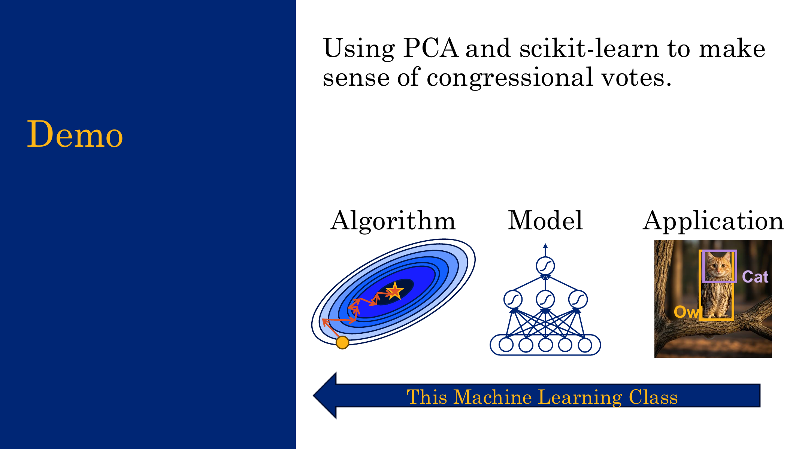
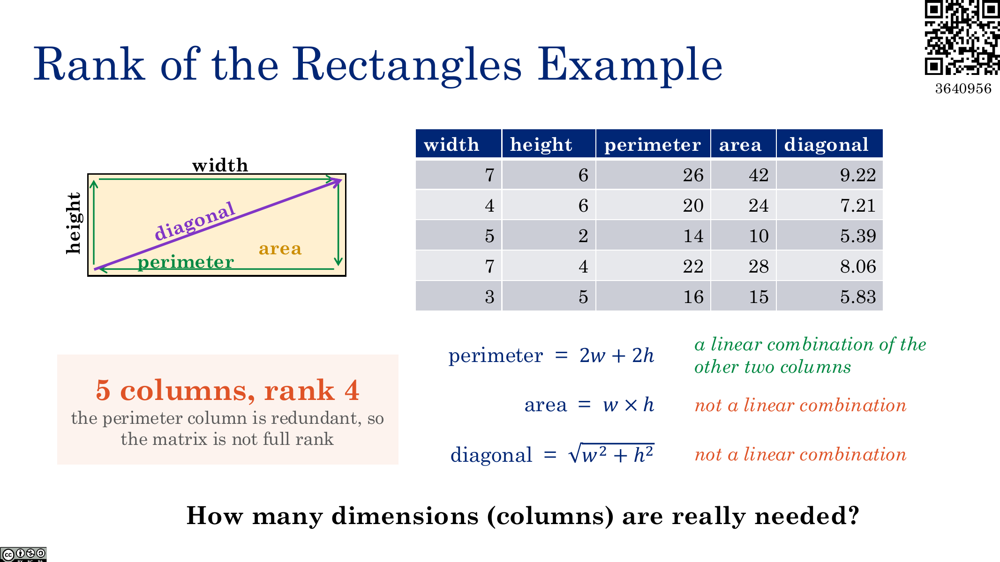
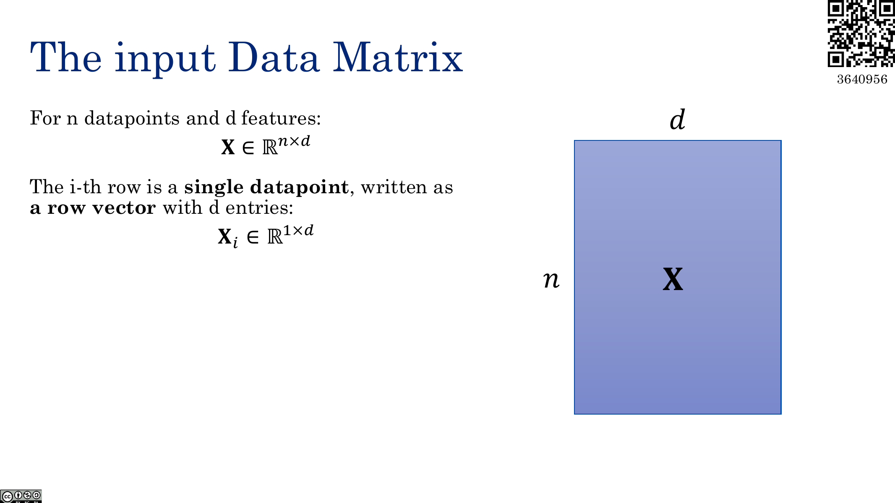
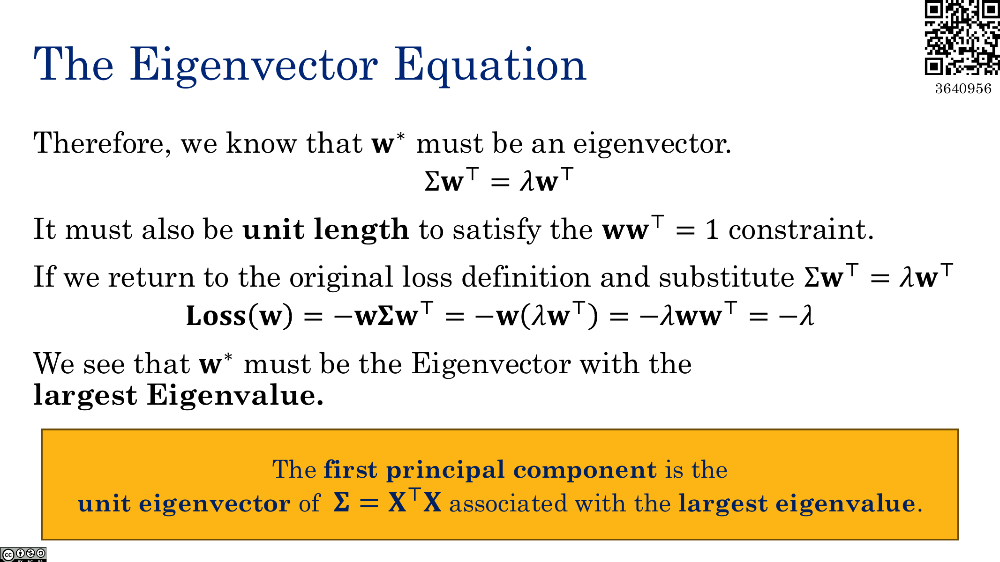

这节课主要讲 **PCA（Principal Component Analysis，主成分分析）**。

PCA 要解决的问题是：原始数据维度很高，但是这些高维特征里面可能有很多冗余信息。我们希望把数据投影到一个低维空间里，同时尽可能保留原始数据中的主要信息。

例如 lecture 里面的 congressional votes demo：

1. 原始数据是一个 $441\times 41$ 的矩阵。
    - $441$ 表示 441 个 legislators。
    - $41$ 表示 41 次投票记录。
    - 每个元素是 $0/1$，表示某个人对某个议案的投票结果。
2. PCA 把它降到 $441\times 2$。
    - 每个 legislator 变成二维平面上的一个点。
    - 这里选择 $2$ 维是一个 hyperparameter decision。
3. 很有意思的是，算法没有拿到 party label，但是第一维坐标的符号和党派标签高度一致。



!!! explanation "为什么这很神奇"
    PCA 只看投票矩阵本身，也就是每个人在不同议案上的投票模式。
    
    它没有被告诉谁是民主党，谁是共和党。但是如果投票模式本身就主要沿着“党派差异”这个方向变化，那么 PCA 找到的第一主成分就很可能对应这个方向。
    
    所以 PCA 不是在做 supervised classification，而是在 unsupervised 地找数据里面最大的变化方向。

## 1.1 为什么需要降维

High-dimensional data 会带来几个问题：

1. 很难可视化。
    - 二维、三维还能画图。
    - 四维以上就很难直接看。
2. 有些模型在高维空间里面表现会变差。
    - 例如 KNN 和 K-means 都依赖距离。
    - 维度很高时，距离会变得不那么有区分度。
3. 很多数据本身虽然维度很高，但真正变化的自由度可能很少。

Dimensionality reduction 的目标可以写成：

$$
\text{high-dimensional data}\rightarrow \text{low-dimensional representation}
$$

并且这个 low-dimensional representation 要尽量 preserve information。

---

# 2. Rank 和 Intrinsic Dimension

## 2.1 Matrix Rank（矩阵的秩）

矩阵的 rank 可以从两个角度理解：

1. columns 张成的空间的维度。
2. 最大的 linearly independent columns 的数量。

如果一个 column 能由其他 columns 线性组合得到，那么它就是 redundant 的。

对于一个矩阵：

$$
X\in\mathbb{R}^{n\times d}
$$

它的 rank 满足：

$$
\operatorname{rank}(X)\leq \min(n,d)
$$

如果达到了这个上界，就叫 full rank。

## 2.2 Rectangle 例子

假设我们有很多 rectangles，每一行是一个 rectangle，每一列是它的属性：

$$
\text{width},\quad \text{height},\quad \text{perimeter},\quad \text{area},\quad \text{diagonal}
$$

其中：

$$
\text{perimeter}=2w+2h
$$

所以 perimeter 这一列可以由 width 和 height 线性组合得到，它是 redundant column。

但是：

$$
\text{area}=wh
$$

$$
\text{diagonal}=\sqrt{w^2+h^2}
$$

这两个不是 width 和 height 的线性组合。因此从 matrix rank 的角度看，这个数据矩阵的 rank 是 $4$，不是 $2$。

## 2.3 Intrinsic Dimension（内在维度）

Intrinsic dimension 指的是：**真正描述这个数据所需要的最少变量数量**。

对于 rectangle 例子，其实只需要两个变量：

$$
w,\quad h
$$

因为其他所有属性都可以由 $w$ 和 $h$ 决定：

$$
\text{perimeter}=2w+2h
$$

$$
\text{area}=wh
$$

$$
\text{diagonal}=\sqrt{w^2+h^2}
$$

因此：

$$
\text{intrinsic dimension}=2
$$



!!! explanation "rank 和 intrinsic dimension 的区别"
    rank 只允许看 **linear relationship（线性关系）**。
    
    intrinsic dimension 允许看 **nonlinear relationship（非线性关系）**。
    
    在 rectangle 例子里，area 和 diagonal 虽然不是 width、height 的线性组合，但它们仍然完全由 width 和 height 决定。所以 rank 是 $4$，但是 intrinsic dimension 是 $2$。

## 2.4 真实数据通常不会严格 low rank

真实数据里面经常有 noise。

例如原本 perimeter 应该满足：

$$
\text{perimeter}=2w+2h
$$

但如果 perimeter 是用卷尺测出来的，就会有测量误差。这样精确的线性关系会被破坏，矩阵 rank 可能直接变回 full rank。

所以真实数据通常不是 exactly low rank，而是：

$$
\text{full rank but approximately low-dimensional}
$$

!!! warning "不要把 full rank 理解成不能降维"
    full rank 只说明从严格线性代数角度看，没有哪一列可以被完全丢掉。
    
    但是 PCA 关心的是近似：能不能用一个低维子空间把数据的大部分变化解释掉。
    
    所以一个矩阵可以 full rank，同时又非常适合被一个低维空间近似。

---

# 3. 把降维写成 Matrix Factorization

## 3.1 输入数据矩阵

假设有 $n$ 个数据点，每个数据点有 $d$ 个 features：

$$
X\in\mathbb{R}^{n\times d}
$$

第 $i$ 个数据点是第 $i$ 行：

$$
X_i\in\mathbb{R}^{1\times d}
$$

lecture 里面默认 $X$ 已经 centered，也就是每一列都减去了自己的均值。

$$
\frac{1}{n}\sum_{i=1}^{n}X_i=0
$$

## 3.2 降维作为矩阵分解

PCA 希望找到两个矩阵：

$$
Z\in\mathbb{R}^{n\times k}
$$

$$
W\in\mathbb{R}^{k\times d}
$$

使得：

$$
X\approx ZW
$$



其中 $k<d$，所以 $Z$ 是低维表示，$W$ 是把低维表示还原回原空间的 basis。

可以把它理解成：

$$
\underbrace{X}_{n\times d}
\approx
\underbrace{Z}_{n\times k}
\underbrace{W}_{k\times d}
$$

## 3.3 $Z$ 和 $W$ 分别是什么

$Z$ 的每一行表示一个数据点在低维空间里的坐标：

$$
Z_i\in\mathbb{R}^{1\times k}
$$

$W$ 的每一行表示原空间中的一个 basis direction：

$$
W_j\in\mathbb{R}^{1\times d}
$$

所以第 $i$ 个数据点的重建结果是：

$$
Z_iW
$$

!!! explanation "直观理解 ZW"
    $W$ 的每一行是一种“方向”或者“模板”。
    
    $Z_i$ 告诉我们：第 $i$ 个数据点要按什么比例混合这些方向。
    
    因此 $Z_iW$ 就是用 $k$ 个主要方向重新拼回一个 $d$ 维数据点。

## 3.4 为什么低维分解只能近似

矩阵乘积的 rank 满足：

$$
\operatorname{rank}(ZW)\leq \min(\operatorname{rank}(Z),\operatorname{rank}(W))\leq k
$$

如果原始数据 $X$ 的 rank 大于 $k$，那么 $ZW$ 的 rank 不可能等于 $X$ 的 rank。

所以当我们选择：

$$
k<\operatorname{rank}(X)
$$

时，$X\approx ZW$ 一定只是 approximation。

---

# 4. PCA 的 Objective Function

## 4.1 Reconstruction Error

PCA 要选择最好的 $Z$ 和 $W$。这里“最好”的意思是：重建误差最小。

对于第 $i$ 个数据点：

$$
X_i
$$

它的重建结果是：

$$
Z_iW
$$

所以 reconstruction error 是：

$$
\|X_i-Z_iW\|_2^2
$$

整体 loss 是平均 squared error：

$$
\operatorname{Loss}(Z,W)=\frac{1}{n}\sum_{i=1}^{n}\|X_i-Z_iW\|_2^2
$$

于是 PCA 的优化问题可以写成：

$$
Z^*,W^*
=
\arg\min_{Z\in\mathbb{R}^{n\times k},\ W\in\mathbb{R}^{k\times d}}
\frac{1}{n}\sum_{i=1}^{n}\|X_i-Z_iW\|_2^2
$$

## 4.2 为什么要先 subtract mean

模型：

$$
X\approx ZW
$$

表示所有重建点都落在一个经过 origin 的 subspace 上。

但是 origin 是人为选出来的，真实数据没有理由天然围绕 origin 分布。最好的低维子空间应该经过数据的 mean。

所以 PCA 会先做 centering：

$$
X_i\leftarrow X_i-\bar{x}
$$

这样数据均值变成 $0$，最好的 subspace 就可以被看成经过 origin。

!!! explanation "为什么 centered 以后可以过原点"
    原始数据如果集中在某个不经过原点的位置，那么用一个必须经过原点的 subspace 去拟合它，会浪费很多能力在“追位置”上。
    
    减去均值之后，数据云被平移到原点附近。此时 PCA 只需要关心数据主要沿哪些方向展开。

## 4.3 Factorization 不唯一

如果 $A$ 是任意 invertible 的 $k\times k$ 矩阵，那么：

$$
ZW=ZA^{-1}AW
$$

也就是说，同一个重建结果可以对应很多组不同的 $Z$ 和 $W$。

为了去掉这种 scale 和 basis 的 ambiguity，PCA 要求 $W$ 的行向量是 orthonormal 的：

$$
WW^T=I
$$

这包含两层意思：

1. 每一行长度为 $1$：

$$
W_iW_i^T=1
$$

2. 不同行互相垂直：

$$
W_iW_j^T=0,\quad i\neq j
$$

!!! explanation "为什么这样不会损失表达能力"
    一个 $k$ 维 subspace 可以有很多组 basis。
    
    即使用一组乱七八糟的 basis 能表示这个 subspace，我们也总能通过 Gram-Schmidt 或 SVD 找到一组 orthonormal basis 表示同一个 subspace。
    
    所以要求 $W$ 的行向量正交归一，只是在规范化表示方式，不是在缩小可表示的 subspace。

---

# 5. 先看 Rank-1 PCA

为了推导简单，先令：

$$
k=1
$$

这时只有一个 principal direction：

$$
w\in\mathbb{R}^{1\times d}
$$

并且它是 unit vector：

$$
ww^T=1
$$

每个数据点只有一个 coefficient：

$$
z_i\in\mathbb{R}
$$

因此：

$$
X_i\approx z_iw
$$

loss 变成：

$$
\operatorname{Loss}(z,w)
=
\frac{1}{n}\sum_{i=1}^{n}\|X_i-z_iw\|_2^2
$$

## 5.1 展开 loss

对单个数据点：

$$
\|X_i-z_iw\|_2^2
=
(X_i-z_iw)(X_i-z_iw)^T
$$

展开：

$$
\|X_i-z_iw\|_2^2
=
X_iX_i^T-2z_iX_iw^T+z_i^2ww^T
$$

因为：

$$
ww^T=1
$$

所以：

$$
\|X_i-z_iw\|_2^2
=
X_iX_i^T-2z_iX_iw^T+z_i^2
$$

其中 $X_iX_i^T$ 和 $z,w$ 无关，可以看成常数项。

所以 loss 可以写成：

$$
\operatorname{Loss}(z,w)
=
C+\frac{1}{n}\sum_{i=1}^{n}
\left(-2z_iX_iw^T+z_i^2\right)
$$

## 5.2 固定 $w$，求最优 $z_i$

对 $z_i$ 求导：

$$
\frac{\partial}{\partial z_i}\operatorname{Loss}(z,w)
=
\frac{1}{n}\left(-2X_iw^T+2z_i\right)
$$

令导数等于 $0$：

$$
\frac{1}{n}\left(-2X_iw^T+2z_i\right)=0
$$

得到：

$$
z_i^*=X_iw^T
$$

也就是说，最优的 $z_i$ 就是 $X_i$ 在方向 $w$ 上的 projection。

!!! explanation "为什么 z_i 是 projection"
    $w$ 是一个 unit direction。
    
    $X_iw^T$ 就是 $X_i$ 和 $w$ 的点积，表示 $X_i$ 在 $w$ 方向上的坐标。
    
    所以 rank-1 PCA 的重建过程就是：先把每个点投影到一条线上，再从这条线投影回原空间。

## 5.3 把 $z_i^*$ 代回 loss

将：

$$
z_i^*=X_iw^T
$$

代回：

$$
\operatorname{Loss}(z,w)
=
C+\frac{1}{n}\sum_{i=1}^{n}
\left(-2z_iX_iw^T+z_i^2\right)
$$

得到：

$$
\operatorname{Loss}(w)
=
C-\frac{1}{n}\sum_{i=1}^{n}(X_iw^T)^2
$$

把它写成矩阵形式：

$$
\operatorname{Loss}(w)
=
C-w\Sigma w^T
$$

其中：

$$
\Sigma=\frac{1}{n}X^TX
$$

!!! explanation "这个式子在说什么"
    $C$ 是固定常数，所以最小化 loss 等价于最大化：
    
    $$
    w\Sigma w^T
    $$
    
    也就是说，PCA 找到的方向不是随便找一条线，而是找让投影后 spread 最大的方向。
    
    这就是常说的：PCA finds the direction of maximum variance。

---

# 6. 用 Lagrange Multiplier 求 $w$

## 6.1 为什么必须加 constraint

现在我们要最小化：

$$
\operatorname{Loss}(w)=C-w\Sigma w^T
$$

如果不限制 $w$ 的长度，那么可以把 $w$ 放大很多倍，使得：

$$
w\Sigma w^T
$$

变得越来越大，于是 loss 会越来越小，甚至没有下界。

所以必须加约束：

$$
ww^T=1
$$

这表示 $w$ 是 unit vector。

## 6.2 Lagrangian

构造 Lagrangian：

$$
\mathcal{L}(w,\lambda)
=
C-w\Sigma w^T+\lambda(ww^T-1)
$$

然后分别对 $w$ 和 $\lambda$ 求 stationary point。

对 $\lambda$ 求导会把 constraint 找回来：

$$
\frac{\partial}{\partial\lambda}\mathcal{L}(w,\lambda)
=ww^T-1=0
$$

所以：

$$
ww^T=1
$$

## 6.3 对 $w$ 求导

因为：

$$
\Sigma=\frac{1}{n}X^TX
$$

所以 $\Sigma$ 是 symmetric matrix。

对 $w\Sigma w^T$ 求导：

$$
\nabla_w(w\Sigma w^T)=2\Sigma w^T
$$

对 $ww^T$ 求导：

$$
\nabla_w(ww^T)=2w^T
$$

因此：

$$
\nabla_w\mathcal{L}(w,\lambda)
=
-2\Sigma w^T+2\lambda w^T
$$

令它等于 $0$：

$$
-2\Sigma w^T+2\lambda w^T=0
$$

得到：

$$
\Sigma w^T=\lambda w^T
$$

这就是 eigenvector equation。

!!! explanation "为什么突然出现 eigenvector"
    特征向量的定义就是：
    
    $$
    Av=\lambda v
    $$
    
    这里令：
    
    $$
    A=\Sigma,\quad v=w^T
    $$
    
    就得到：
    
    $$
    \Sigma w^T=\lambda w^T
    $$
    
    所以最优方向 $w$ 必须是 $\Sigma$ 的 eigenvector。

## 6.4 为什么取最大 eigenvalue

把 eigenvector equation 代回：

$$
\operatorname{Loss}(w)=C-w\Sigma w^T
$$

由于：

$$
\Sigma w^T=\lambda w^T
$$

所以：

$$
w\Sigma w^T=w(\lambda w^T)=\lambda ww^T
$$

又因为：

$$
ww^T=1
$$

因此：

$$
w\Sigma w^T=\lambda
$$

loss 变成：

$$
\operatorname{Loss}(w)=C-\lambda
$$

要让 loss 最小，就要让 $\lambda$ 最大。

所以：

$$
w^*=\text{eigenvector of }\Sigma\text{ with the largest eigenvalue}
$$

这就是 first principal component。

!!! definition "First Principal Component"
    第一主成分是：
    
    $$
    \Sigma=\frac{1}{n}X^TX
    $$
    
    对应最大 eigenvalue 的 unit eigenvector。

---

# 7. 多个 Principal Components

如果我们要降到 $k$ 维，就需要 $k$ 个 principal components。

第一个 principal component 是最大 eigenvalue 对应的 eigenvector。

第二个 principal component 要满足两个条件：

1. 它也要让 reconstruction error 尽可能小。
2. 它要和第一个 principal component 垂直。

也就是：

$$
w_2w_1^T=0
$$

继续用 Lagrange multiplier 推导，可以得到：

$$
\Sigma w_2^T=\lambda_2 w_2^T
$$

并且 $w_2$ 是第二大 eigenvalue 对应的 eigenvector。

推广到 $k$ 维：

$$
W=
\begin{bmatrix}
- & w_1 & -\\
- & w_2 & -\\
& \vdots &\\
- & w_k & -
\end{bmatrix}
$$

其中 $w_1,\dots,w_k$ 是 $\Sigma$ 的前 $k$ 个 eigenvectors，按 eigenvalue 从大到小排列。

低维坐标是：

$$
Z=XW^T
$$

!!! explanation "为什么 Z = XW^T"
    $W$ 的每一行都是一个 principal direction。
    
    对某个数据点 $X_i$，它在第 $j$ 个主成分上的坐标是：
    
    $$
    X_iw_j^T
    $$
    
    把所有 $j=1,\dots,k$ 的坐标拼起来，就是 $Z_i$。
    
    所以整体矩阵形式就是：
    
    $$
    Z=XW^T
    $$

---

# 8. 用 SVD 计算 PCA

直接构造：

$$
X^TX
$$

再做 eigendecomposition 是正确的，但是可能很贵。

实际中通常使用 SVD：

$$
X=USV^T
$$

在代码里可以写成：

```python
U, S, Vt = np.linalg.svd(X, full_matrices=False)
```

其中 $V$ 的 columns 就是 $X^TX$ 的 eigenvectors。

因此 PCA 的 principal components 可以从 $V^T$ 里面拿到：

```python
W = Vt[:k, :]
Z = X @ W.T
```

!!! explanation "为什么 SVD 和 PCA 连在一起"
    如果：
    
    $$
    X=USV^T
    $$
    
    那么：
    
    $$
    X^TX=(USV^T)^T(USV^T)
    $$
    
    $$
    =VS^TU^TUSV^T
    $$
    
    因为 $U^TU=I$，所以：
    
    $$
    X^TX=VS^2V^T
    $$
    
    这正好就是 $X^TX$ 的 eigendecomposition。
    
    所以 $V$ 的 columns 是 eigenvectors，$S^2$ 对应 eigenvalues。

---

# 9. Explained Variance Ratio

PCA 每个 principal component 能解释多少数据 spread，可以用 explained variance ratio 表示。

如果 SVD 中的 singular values 是：

$$
S_{11},S_{22},\dots,S_{dd}
$$

那么第 $i$ 个 principal component 的 explained variance ratio 是：

$$
\frac{S_{ii}^2}{\sum_{j=1}^{d}S_{jj}^2}
$$

在 congressional votes demo 里：

$$
\text{PC1}:80.3\%
$$

$$
\text{PC2}:5.3\%
$$

两者合起来：

$$
85.6\%
$$

这说明只用二维就能解释数据中大部分 spread。



!!! explanation "为什么看 explained variance ratio"
    如果前几个 principal components 的 explained variance ratio 很高，说明数据主要变化确实集中在少数几个方向上。
    
    如果每个 component 都只能解释一点点，那么强行降到很低维就会丢掉很多信息。

---

# 10. 总结

PCA 的核心流程如下：

1. 先 center data：

$$
X_i\leftarrow X_i-\bar{x}
$$

2. 把降维写成矩阵分解：

$$
X\approx ZW
$$

3. 用 reconstruction error 定义目标函数：

$$
\operatorname{Loss}(Z,W)
=
\frac{1}{n}\sum_{i=1}^{n}\|X_i-Z_iW\|_2^2
$$

4. 固定 $w$ 时，最优 low-dimensional coordinate 是 projection：

$$
z_i^*=X_iw^T
$$

5. 最优 direction 会变成 eigenvector problem：

$$
\Sigma w^T=\lambda w^T
$$

6. principal components 是 $\Sigma=\frac{1}{n}X^TX$ 的前 $k$ 个 eigenvectors。

7. 低维坐标是：

$$
Z=XW^T
$$

!!! warning "PCA 到底在最大化什么"
    从 reconstruction error 的角度看，PCA 是在找能最小化重建误差的低维子空间。
    
    从 projection 的角度看，PCA 是在找让投影后 variance 最大的方向。
    
    这两个说法是等价的：保留的 spread 越多，丢掉的 reconstruction error 就越少。
