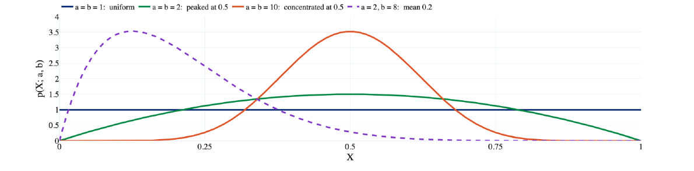
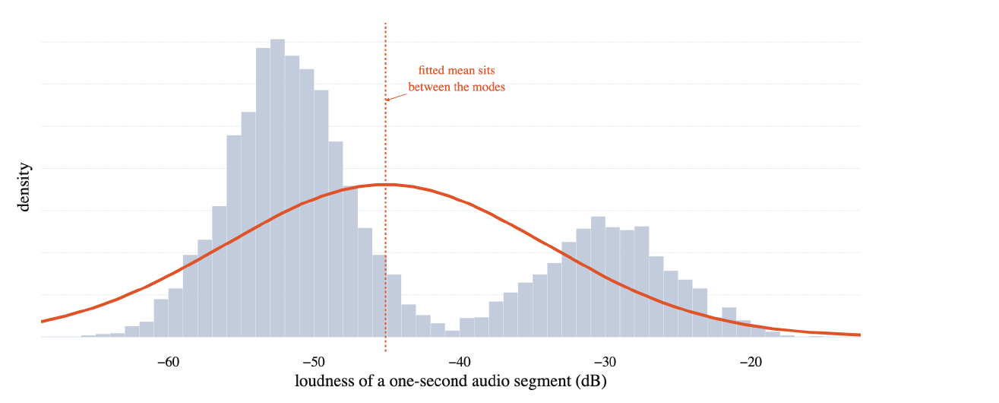
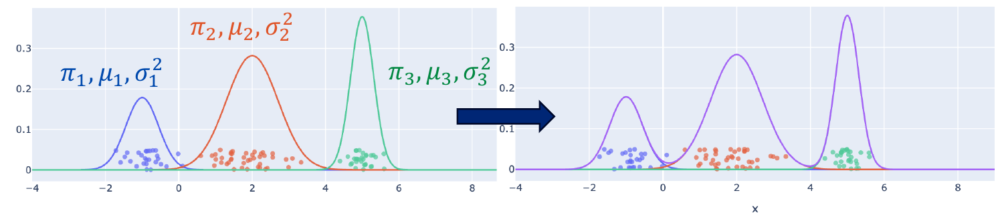

# 1. 从 MLE 到 MAP

上一节课讲了 density estimation：给定一组 observations，希望估计出数据背后的 probability distribution。

如果已经选好一个 parametric distribution：

$$
p(x\mid w)
$$

那么接下来要做的就是根据数据 $\mathcal D=\{x_1,\dots,x_N\}$，估计里面的参数 $w$。

这节课接着推导 MAP，然后讨论 Gaussian 的 MLE 和 bias，最后用 Gaussian Mixture Model（GMM）处理单个 Gaussian 无法描述的数据。

## 1.1 回顾 Bernoulli 的 MLE

假设每次抛硬币的结果是：

$$
x_n\in\{0,1\},\qquad x_n\sim\operatorname{Bern}(\mu)
$$

其中 $\mu$ 是出现正面的概率。设 $n_1$ 次正面、$n_0$ 次反面，$N=n_1+n_0$。

在 IID assumption 下：

$$
p(\mathcal D\mid\mu)=\mu^{n_1}(1-\mu)^{n_0}
$$

上一节课推导出来的结果是：

$$
\mu_{\mathrm{ML}}=\frac{n_1}{N}
$$

也就是直接用正面出现的比例来估计正面概率。

!!! example "如果只抛了 3 次，结果全是正面"
    MLE 会得到：

    $$
    \mu_{\mathrm{ML}}=\frac{3}{3}=1
    $$

    但是只看了 3 次，就认为这枚硬币以后绝对不会出现反面，显然是一个很极端的估计。

    如果我们原本认为硬币大致是公平的，能不能把这个 prior knowledge 也考虑进去？这就是 MAP 要做的事情。

## 1.2 把 parameter 看成 random variable

MLE 把 $\mu$ 看成一个未知但固定的常数。

Bayesian view 则用一个 distribution 描述我们对 $\mu$ 的不确定性：

$$
p(\mu)
$$

观察数据之后，通过 Bayes' theorem 更新：

$$
p(\mu\mid\mathcal D)
=\frac{p(\mathcal D\mid\mu)p(\mu)}{p(\mathcal D)}
$$

其中：

1. Prior $p(\mu)$：看数据之前，对参数的看法。
2. Likelihood $p(\mathcal D\mid\mu)$：给定参数之后，这组数据出现的概率。
3. Posterior $p(\mu\mid\mathcal D)$：看完数据之后，对参数更新后的看法。

!!! explanation "这里有两个不同的随机变量"
    $X$ 是一次抛硬币的结果，只能取 $0$ 或 $1$。

    $\mu$ 是正面出现的概率，可以取 $[0,1]$ 里面的值。

    所以 $p(x\mid\mu)$ 描述的是**硬币结果**，$p(\mu)$ 描述的是**我们对正面概率的不确定性**。

    参数有一个 distribution，并不意味着每抛一次硬币，真实的正面概率就必须变化。

## 1.3 MAP 的目标

MAP 选择 posterior density 最大的参数：

$$
\mu_{\mathrm{MAP}}=\arg\max_\mu p(\mu\mid\mathcal D)
$$

因为分母 $p(\mathcal D)$ 与 $\mu$ 无关，取 log 后可以写成：

$$
\mu_{\mathrm{MAP}}
=\arg\max_\mu\left[\log p(\mathcal D\mid\mu)+\log p(\mu)\right]
$$

也就是同时考虑：这个参数能不能解释数据，以及它符不符合原先的 prior。

---

# 2. Beta Distribution 作为 Prior

## 2.1 为什么选择 Beta Distribution

因为 Bernoulli 的参数满足：

$$
0\leq\mu\leq1
$$

所以我们需要一个定义在 $[0,1]$ 上的 prior。Beta distribution 正好符合这个要求，而且与 Bernoulli likelihood 相乘后，形式会非常好处理。

设：

$$
\mu\sim\operatorname{Beta}(a,b),\qquad a,b>0
$$

它的 density 是：

$$
p(\mu\mid a,b)=\frac{1}{B(a,b)}\mu^{a-1}(1-\mu)^{b-1}
$$

$B(a,b)$ 是 normalization constant，保证整个 density 的积分等于 $1$。这里估计的是 $\mu$，$a,b$ 是事先选好的 prior parameters。

## 2.2 $a,b$ 决定了什么



*课件第 8 页。*

1. $a=b=1$：在 $[0,1]$ 上是 uniform distribution，各个参数值同样合理。
2. $a=b=2$：更倾向于 $\mu$ 在 $0.5$ 附近，也就是认为硬币大致公平。
3. 保持 $a:b$ 不变，同时增大 $a,b$：分布越来越集中在 $a/(a+b)$ 附近，表示 prior 更有把握。

Beta distribution 的 mean 是：

$$
\mathbb E[\mu]=\frac{a}{a+b}
$$

当 $a,b>1$ 时，mode，也就是 density 最大的位置，是：

$$
\frac{a-1}{a+b-2}
$$

!!! warning "mean 和 mode 不是同一个东西"
    Mean 是整个 distribution 的加权平均，mode 是 density 最高的位置。

    MAP 找的是 posterior 的 mode。只有在某些情况下，比如对称的 $a=b>1$，mean 和 mode 才会相同。

---

# 3. Bernoulli + Beta 的 Posterior 和 MAP

## 3.1 先推导 Posterior

根据 Bayes：

$$
p(\mu\mid\mathcal D)\propto p(\mathcal D\mid\mu)p(\mu)
$$

代入 Bernoulli likelihood 和 Beta prior：

$$
\begin{aligned}
p(\mu\mid\mathcal D)
&\propto\mu^{n_1}(1-\mu)^{n_0}\mu^{a-1}(1-\mu)^{b-1}\\
&=\mu^{n_1+a-1}(1-\mu)^{n_0+b-1}
\end{aligned}
$$

它还是 Beta distribution，所以：

$$
\mu\mid\mathcal D\sim\operatorname{Beta}(a+n_1,b+n_0)
$$

!!! explanation "什么是 conjugate prior"
    如果 prior 和 likelihood 结合以后，posterior 仍然属于和 prior 相同的 distribution family，那么就称这个 prior 是 conjugate prior。

    这里 prior 是 Beta，posterior 也是 Beta，所以 Beta 是 Bernoulli likelihood 的 conjugate prior。

    好处是更新非常简单：观察到正面就加到 $a$ 上，观察到反面就加到 $b$ 上。

## 3.2 再求 MAP

去掉与 $\mu$ 无关的常数，log posterior 是：

$$
\ell(\mu)=(n_1+a-1)\log\mu+(n_0+b-1)\log(1-\mu)
$$

求导并令它等于 $0$：

$$
\frac{n_1+a-1}{\mu}-\frac{n_0+b-1}{1-\mu}=0
$$

因此：

$$
(n_1+a-1)(1-\mu)=(n_0+b-1)\mu
$$

整理得到：

$$
\boxed{\mu_{\mathrm{MAP}}=\frac{n_1+a-1}{N+a+b-2}}
$$

!!! warning "这个公式有适用条件"
    上面得到的是内部最大值，需要 posterior 的两个参数满足：

    $$
    n_1+a>1,\qquad n_0+b>1
    $$

    如果不满足，最大值可能出现在边界，或者不存在唯一的 mode，不能直接套这个内部解。

    本节常用的 $a,b>1$ 可以保证这个条件成立。

## 3.3 Prior as Pseudo-Counts

对比两个公式：

$$
\mu_{\mathrm{ML}}=\frac{n_1}{N},\qquad
\mu_{\mathrm{MAP}}=\frac{n_1+a-1}{N+a+b-2}
$$

在 MAP 公式中，prior 相当于额外加入了：

- $a-1$ 次虚拟正面。
- $b-1$ 次虚拟反面。

这些就叫 pseudo-counts。

当 $a=b=2$ 时：

$$
\mu_{\mathrm{MAP}}=\frac{n_1+1}{N+2}
$$

也就是给正面和反面各加一次计数，这种形式叫 Laplace smoothing。

!!! example "再看只抛了 3 次，全部是正面的情况"
    如果 prior 是 $\operatorname{Beta}(2,2)$：

    $$
    \mu_{\mathrm{MAP}}=\frac{3+1}{3+2}=0.8
    $$

    数据让我们觉得硬币偏向正面，但 prior 阻止我们直接把反面的概率估计成 $0$。

!!! explanation "posterior 参数加的是 a,b，为什么 MAP 里面却是 a-1,b-1"
    Posterior 的分布是：

    $$
    \operatorname{Beta}(a+n_1,b+n_0)
    $$

    但 Beta 的内部 mode 公式本来就要在两个参数上减去 $1$。

    如果求的是 posterior mean，则结果是：

    $$
    \mathbb E[\mu\mid\mathcal D]=\frac{n_1+a}{N+a+b}
    $$

    这是另一种 point estimate，不能和 MAP 混在一起。

## 3.4 数据越来越多时会发生什么

当 $a,b$ 固定、$N$ 很大时，prior 提供的常数相对于数据量越来越小：

$$
\mu_{\mathrm{MAP}}\approx\mu_{\mathrm{ML}}
$$

当 $a,b>1$、$N>0$ 时，还可以写成：

$$
\mu_{\mathrm{MAP}}
=\frac{N}{N+a+b-2}\mu_{\mathrm{ML}}
+\frac{a+b-2}{N+a+b-2}\frac{a-1}{a+b-2}
$$

因此 MAP 是 MLE 和 prior mode 的加权平均。数据少时 prior 的影响更明显，数据多时主要由数据决定。

!!! explanation "补充：MLE 和 MAP，哪个估计结果波动更大"
    固定真实的正面概率 $\mu$、样本数量 $N>0$ 和 prior parameters，多次重新采样数据。

    因为 $n_1$ 的 variance 是 $N\mu(1-\mu)$：

    $$
    \operatorname{var}(\mu_{\mathrm{ML}})=\frac{\mu(1-\mu)}{N}
    $$

    $$
    \operatorname{var}(\mu_{\mathrm{MAP}})
    =\frac{N\mu(1-\mu)}{(N+a+b-2)^2}
    $$

    所以课件提到的 $a,b>2$ 情况下，MAP 的 sampling variance 更小（真实 $0<\mu<1$ 时严格更小），但它可能引入 bias。

    这里比较的是**不同数据集算出来的估计值有多分散**，不是 posterior distribution 自己的 variance。

---

# 4. Gaussian Distribution 的 MLE

## 4.1 Normal Distribution

如果一个实数随机变量服从 Gaussian distribution：

$$
X\sim\mathcal N(\mu,\sigma^2)
$$

那么它的 density 是：

$$
p(x\mid\mu,\sigma^2)
=\frac{1}{\sqrt{2\pi\sigma^2}}
\exp\left(-\frac{(x-\mu)^2}{2\sigma^2}\right)
$$

其中 $\mu$ 决定中心，$\sigma^2>0$ 决定分布有多宽，并且：

$$
\mathbb E[X]=\mu,\qquad\operatorname{var}(X)=\sigma^2
$$

这里 $\sigma$ 是 standard deviation，$\sigma^2$ 才是 variance。本节课的主要推导使用一维 Gaussian。

## 4.2 写出 Log Likelihood

给定 $N$ 个 IID samples：

$$
\mathcal D=\{x_1,\dots,x_N\},\qquad x_n\sim\mathcal N(\mu,\sigma^2)
$$

Likelihood 是各个 sample density 的乘积，取 log 后得到：

$$
\begin{aligned}
\ell(\mu,\sigma^2)
&=\sum_{n=1}^N\log p(x_n\mid\mu,\sigma^2)\\
&=-\frac N2\log(2\pi)-\frac N2\log\sigma^2
-\frac{1}{2\sigma^2}\sum_{n=1}^N(x_n-\mu)^2
\end{aligned}
$$

现在要找到使这个函数最大的 $\mu$ 和 $\sigma^2$。

## 4.3 对 $\mu$ 求导

$$
\frac{\partial\ell}{\partial\mu}
=\frac{1}{\sigma^2}\sum_{n=1}^N(x_n-\mu)
$$

令它等于 $0$：

$$
\sum_{n=1}^Nx_n-N\mu=0
$$

所以：

$$
\boxed{\mu_{\mathrm{ML}}=\frac1N\sum_{n=1}^Nx_n}
$$

Gaussian mean 的 MLE 就是 sample mean，符合我们的直觉。

## 4.4 对 $\sigma^2$ 求导

为了避免把对 $\sigma$ 求导和对 $\sigma^2$ 求导混淆，先令：

$$
v=\sigma^2
$$

代入 $\mu_{\mathrm{ML}}$ 后：

$$
\frac{\partial\ell}{\partial v}
=-\frac{N}{2v}+\frac{1}{2v^2}\sum_{n=1}^N(x_n-\mu_{\mathrm{ML}})^2
$$

令它等于 $0$，两边乘上 $2v^2$：

$$
-Nv+\sum_{n=1}^N(x_n-\mu_{\mathrm{ML}})^2=0
$$

所以：

$$
\boxed{\sigma^2_{\mathrm{ML}}=\frac1N\sum_{n=1}^N(x_n-\mu_{\mathrm{ML}})^2}
$$

!!! warning "MLE 的分母是 N"
    我们熟悉的无偏 sample variance 的分母是 $N-1$，但是直接最大化 likelihood 得到的是 $N$。

    这不是推导出错了，而是 MLE 并不保证 estimator 无偏。下一部分就分析这个区别。

    上面的正方差解要求样本不全相同；若样本全相同，令均值等于该值、方差趋近 $0$，likelihood 会无限增大，没有有限的正方差最大值。

## 4.5 Sufficient Statistics

把方差展开：

$$
\begin{aligned}
\sigma^2_{\mathrm{ML}}
&=\frac1N\sum_{n=1}^N\left(x_n^2-2x_n\mu_{\mathrm{ML}}+\mu_{\mathrm{ML}}^2\right)\\
&=\frac1N\sum_{n=1}^Nx_n^2-\mu_{\mathrm{ML}}^2
\end{aligned}
$$

所以在 $N$ 已知的情况下，计算这两个估计只需要：

$$
\sum_{n=1}^Nx_n,\qquad\sum_{n=1}^Nx_n^2
$$

这两个量构成 Gaussian 的 sufficient statistics。更准确地说，这个 Gaussian model 的 likelihood 对数据的依赖可以通过这两个量表达出来。

!!! explanation "为什么叫 sufficient"
    对这个模型的参数估计来说，数据里面相关的信息已经被压缩到这些统计量里。

    并不是说任何问题都只需要这两个数。比如接下来要拟合多个 Gaussian，就不能只保留整个数据集的总和与平方和。

---

# 5. Bias of an Estimate

## 5.1 为什么 Estimate 也是 Random Variable

真实参数 $\mu,\sigma^2$ 是固定的，但每次重新采样，得到的数据集会不同。

所以根据数据算出来的 $\mu_{\mathrm{ML}}$ 和 $\sigma^2_{\mathrm{ML}}$ 也会变化。

在观察数据之前，可以把 estimator 看成 random variable。Bias 的定义是：

$$
\operatorname{Bias}(\hat w)=\mathbb E[\hat w]-w
$$

这里 expectation 是对**重复采样得到的数据集**取的。

!!! explanation "unbiased 不是每次都估计准确"
    Unbiased 表示重复很多次实验，把估计结果平均之后，会等于真实参数。

    某一次估计仍然可能离真实值很远。Bias 和 estimator 的 variance 是两个不同的概念。

## 5.2 Gaussian Mean 的 MLE 是 Unbiased

用大写 $X_n$ 表示还没有观察到的随机样本：

$$
\mathbb E[\mu_{\mathrm{ML}}]
=\mathbb E\left[\frac1N\sum_{n=1}^NX_n\right]
=\frac1N\sum_{n=1}^N\mathbb E[X_n]
=\mu
$$

所以：

$$
\operatorname{Bias}(\mu_{\mathrm{ML}})=0
$$

同时，由于 samples independent：

$$
\operatorname{var}(\mu_{\mathrm{ML}})
=\frac{1}{N^2}\sum_{n=1}^N\operatorname{var}(X_n)
=\frac{\sigma^2}{N}
$$

也就是数据越多，sample mean 在真实 mean 附近的波动越小。

## 5.3 Gaussian Variance 的 MLE 是 Biased

利用前面展开的形式：

$$
\sigma^2_{\mathrm{ML}}=\frac1N\sum_{n=1}^NX_n^2-\mu_{\mathrm{ML}}^2
$$

取 expectation：

$$
\mathbb E[\sigma^2_{\mathrm{ML}}]
=\frac1N\sum_{n=1}^N\mathbb E[X_n^2]-\mathbb E[\mu_{\mathrm{ML}}^2]
$$

根据 variance identity：

$$
\mathbb E[X_n^2]=\sigma^2+\mu^2
$$

而：

$$
\mathbb E[\mu_{\mathrm{ML}}^2]
=\operatorname{var}(\mu_{\mathrm{ML}})+\mathbb E[\mu_{\mathrm{ML}}]^2
=\frac{\sigma^2}{N}+\mu^2
$$

代回去：

$$
\begin{aligned}
\mathbb E[\sigma^2_{\mathrm{ML}}]
&=(\sigma^2+\mu^2)-\left(\frac{\sigma^2}{N}+\mu^2\right)\\
&=\frac{N-1}{N}\sigma^2
\end{aligned}
$$

所以它会在 expectation 上低估真实方差：

$$
\boxed{\operatorname{Bias}(\sigma^2_{\mathrm{ML}})=-\frac{\sigma^2}{N}}
$$

!!! explanation "为什么用 sample mean 会把 variance 算小"
    Sample mean 本身就是根据这批数据选出来的，它恰好最小化这批数据到中心的平方距离之和。

    因此围绕 sample mean 算出来的平方偏差，会比围绕真实 mean 算的小。

    可以用下面的等式直接看到：

    $$
    \sum_{n=1}^N(X_n-\mu_{\mathrm{ML}})^2
    =\sum_{n=1}^N(X_n-\mu)^2-N(\mu_{\mathrm{ML}}-\mu)^2
    $$

    右边减掉的那一项非负。我们用同一批数据先拟合中心，再测量 spread，所以会产生向下的 bias。

## 5.4 用 $N-1$ 修正 Bias

当 $N>1$ 时，把 MLE variance 乘上 $N/(N-1)$：

$$
s^2=\frac{N}{N-1}\sigma^2_{\mathrm{ML}}
=\frac{1}{N-1}\sum_{n=1}^N(X_n-\mu_{\mathrm{ML}})^2
$$

于是：

$$
\mathbb E[s^2]=\sigma^2
$$

这就是 unbiased sample variance，也叫 Bessel's correction。

自由度的直觉是：一旦估计了 sample mean，所有 residuals 就必须满足：

$$
\sum_{n=1}^N(X_n-\mu_{\mathrm{ML}})=0
$$

所以 $N$ 个 residuals 里面只有 $N-1$ 个能自由变化。

!!! example "课件里 np.var 的 ddof"
    对一维数据，`ddof` 决定分母用 $N-\text{ddof}$：

    ```python
    import numpy as np

    x = np.array([1.0, 2.0, 3.0])
    np.var(x, ddof=0)  # 分母为 N，结果为 2/3
    np.var(x, ddof=1)  # 分母为 N-1，结果为 1
    ```

!!! warning "unbiased 不代表一定更好"
    当 $N$ 很大时，MLE variance 的 bias 会趋近 $0$。

    评价 estimator 时还需要考虑 variance。一个有一点 bias、但波动更小的 estimator，有时会有更小的整体误差。

---

# 6. Gaussian Mixture Model（GMM）

## 6.1 为什么一个 Gaussian 不够

如果数据有多个峰，也就是 multiple modes，单个 Gaussian 往往拟合不好。



*课件第 30 页。横轴是一秒声音片段的 loudness，数据有两个明显的峰。*

一个 Gaussian 只能用一个中心和一个 spread 描述数据。它可能把 mean 放在两个峰中间，但这个位置恰恰没有多少数据。

因此我们可以用多个 Gaussian 的 weighted sum 来表示整个 distribution。

## 6.2 GMM 的定义

设一共有 $K$ 个 Gaussian components：

$$
\boxed{p(x\mid\theta)=\sum_{k=1}^K\pi_k\mathcal N(x\mid\mu_k,\sigma_k^2)}
$$

其中：

$$
\theta=\{\pi_k,\mu_k,\sigma_k^2\}_{k=1}^K
$$

1. $\pi_k$：第 $k$ 个 component 的 mixture weight。
2. $\mu_k$：第 $k$ 个 Gaussian 的 mean。
3. $\sigma_k^2$：第 $k$ 个 Gaussian 的 variance。

为了得到合法的 density，需要：

$$
\pi_k\geq0,\qquad\sum_{k=1}^K\pi_k=1,\qquad\sigma_k^2>0
$$



*课件第 32 页。每条 component 曲线带有自己的 weight，合起来得到右图的 mixture density。*

!!! warning "图上的颜色不是已知标签"
    这里的观测数据是一维的 $x_n$，并没有额外给我们 cluster label。

    颜色和散点的竖直偏移是为了可视化添加的。训练时并不知道每个点来自哪个 Gaussian。

## 6.3 Latent Variable

给每个数据点引入一个 latent variable：

$$
z_n\in\{1,\dots,K\}
$$

$z_n=k$ 表示这个点来自第 $k$ 个 Gaussian。Latent 就是这个变量没有被直接观察到。

模型规定：

$$
p(z_n=k\mid\theta)=\pi_k
$$

$$
p(x_n\mid z_n=k,\theta)=\mathcal N(x_n\mid\mu_k,\sigma_k^2)
$$

根据 product rule：

$$
p(x_n,z_n=k\mid\theta)=\pi_k\mathcal N(x_n\mid\mu_k,\sigma_k^2)
$$

因为不知道 $z_n$，把它 marginalize out：

$$
p(x_n\mid\theta)=\sum_{k=1}^Kp(x_n,z_n=k\mid\theta)
=\sum_{k=1}^K\pi_k\mathcal N(x_n\mid\mu_k,\sigma_k^2)
$$

这就回到了 GMM 的定义。

## 6.4 GMM 是 Generative Model

这个模型可以生成新数据，过程是：

1. 按 $\pi_1,\dots,\pi_K$ 的概率选一个 component，得到 $z_n$。
2. 从被选中的 Gaussian 里面采样，得到 $x_n$。

用 graphical model 表示就是：

$$
z_n\longrightarrow x_n
$$

先采样 parent，再根据 parent 采样 child，这叫 ancestor sampling。

!!! example "从 GMM 生成一个点"
    假设 mixture weights 是：

    $$
    \pi=(0.1,0.3,0.6)
    $$

    先以这三个概率选择 component。如果抽到了 $z_n=2$，就从：

    $$
    x_n\sim\mathcal N(\mu_2,\sigma_2^2)
    $$

    里面生成一个数。

    不是分别从三个 Gaussian 采样，再把三个数加权平均。**混合的是 distributions，生成每个点时只选择其中一个 component。**

---

# 7. Soft Assignment 和 Responsibilities

## 7.1 与 K-Means 的区别

Lecture 2 的 K-means 给每个点分配一个确定的 cluster，也就是 hard assignment。

但是如果一个点刚好处于两个 cluster 的中间，我们可能没有足够把握判断它属于哪一个。

GMM 会保留这个不确定性，计算：

$$
p(z_n=k\mid x_n,\theta)
$$

也就是看完这个点的位置后，它来自各个 component 的 posterior probability。

## 7.2 用 Bayes 求 Posterior

定义 responsibility：

$$
\gamma_{nk}=p(z_n=k\mid x_n,\theta)
$$

根据 Bayes' theorem：

$$
\begin{aligned}
\gamma_{nk}
&=\frac{p(x_n\mid z_n=k,\theta)p(z_n=k\mid\theta)}
{\sum_{j=1}^Kp(x_n\mid z_n=j,\theta)p(z_n=j\mid\theta)}\\
&=\frac{\pi_k\mathcal N(x_n\mid\mu_k,\sigma_k^2)}
{\sum_{j=1}^K\pi_j\mathcal N(x_n\mid\mu_j,\sigma_j^2)}
\end{aligned}
$$

这里分母对所有可能的 components 求和，保证：

$$
0\leq\gamma_{nk}\leq1,\qquad\sum_{k=1}^K\gamma_{nk}=1
$$

!!! explanation "responsibility 到底是什么意思"
    比如某个点的 responsibilities 是：

    $$
    (\gamma_{n1},\gamma_{n2},\gamma_{n3})=(0.7,0.2,0.1)
    $$

    表示在当前模型下，认为它来自 component 1 的概率是 $70\%$，来自 component 2 的概率是 $20\%$，来自 component 3 的概率是 $10\%$。

    更新模型时，这个点会分别以 $0.7,0.2,0.1$ 的权重参与三个 components 的参数估计。

## 7.3 $\pi_k$ 和 $\gamma_{nk}$ 的区别

| 符号 | 含义 | 是否依赖具体的数据点 |
| --- | --- | --- |
| $\pi_k$ | 生成数据前，选择 component $k$ 的 prior probability | 不依赖 $x_n$ |
| $\gamma_{nk}$ | 看到 $x_n$ 后，它来自 component $k$ 的 posterior probability | 依赖 $x_n$ |

所以不能只看 $x_n$ 离哪个 mean 最近。Mixture weight 和 variance 也会影响 responsibility。

---

# 8. 为什么 GMM 不能直接像单个 Gaussian 那样求解

## 8.1 Log 里面多了一个 Sum

GMM 的 log likelihood 是：

$$
\ell(\theta)=\sum_{n=1}^N\log\left[\sum_{k=1}^K\pi_k\mathcal N(x_n\mid\mu_k,\sigma_k^2)\right]
$$

单个 Gaussian 取 log 之后，指数项能直接变成平方误差。

但是 GMM 的 log 里面有多个 Gaussian 的和，而：

$$
\log(a+b)\neq\log a+\log b
$$

所以不能把它直接拆成每个 Gaussian 各自独立的优化问题。

## 8.2 尝试对 $\mu_k$ 求导

利用 chain rule：

$$
\frac{\partial\ell}{\partial\mu_k}
=\sum_{n=1}^N
\frac{\pi_k\mathcal N(x_n\mid\mu_k,\sigma_k^2)}
{\sum_{j=1}^K\pi_j\mathcal N(x_n\mid\mu_j,\sigma_j^2)}
\frac{x_n-\mu_k}{\sigma_k^2}
$$

前面的比例正好是 $\gamma_{nk}$，所以令导数为 $0$ 后：

$$
\sum_{n=1}^N\gamma_{nk}\frac{x_n-\mu_k}{\sigma_k^2}=0
$$

整理得到：

$$
\mu_k=\frac{\sum_{n=1}^N\gamma_{nk}x_n}{\sum_{n=1}^N\gamma_{nk}}
$$

!!! explanation "这不是已经求出 mean 了吗"
    问题是右边的 $\gamma_{nk}$ 也依赖 $\mu_k$，而且还依赖其他 components 的参数。

    所以这只是一个需要同时满足的方程，并不是把数据代进去就能直接得到答案的 closed-form solution。

    如果暂时把 $\gamma_{nk}$ 固定，它才会变成一个容易计算的 weighted mean。

## 8.3 如果知道 $z_n$ 就简单了

如果每个点的 component assignment 都已知，complete-data log likelihood 就是：

$$
\log p(\mathcal D,Z\mid\theta)
=\sum_{n=1}^N\left[\log\pi_{z_n}+\log\mathcal N(x_n\mid\mu_{z_n},\sigma_{z_n}^2)\right]
$$

现在 log 里面没有 sum 了，参数容易优化。

因此我们遇到一个循环：

- 知道模型参数，就可以算 assignments 的 posterior。
- 知道 assignments，就容易估计模型参数。

EM 的想法就是像 K-means 的 Lloyd's algorithm 一样，**先固定一边更新另一边，然后反复交替**。

---

# 9. Expectation-Maximization（EM）

先初始化模型参数，再重复两步：

1. E-step：固定当前参数，计算每个点的 soft assignment。
2. M-step：固定 soft assignments，重新估计模型参数。

为了区分先后，记当前参数为 $\theta^{\mathrm{old}}$，本轮更新得到的参数为 $\theta^{\mathrm{new}}$。

## 9.1 E-Step：计算 Responsibilities

用旧参数算：

$$
\gamma_{nk}
=\frac{\pi_k^{\mathrm{old}}\mathcal N(x_n\mid\mu_k^{\mathrm{old}},(\sigma_k^2)^{\mathrm{old}})}
{\sum_{j=1}^K\pi_j^{\mathrm{old}}\mathcal N(x_n\mid\mu_j^{\mathrm{old}},(\sigma_j^2)^{\mathrm{old}})}
$$

整个 responsibility matrix 有 $N$ 行、$K$ 列：每行对应一个点，每列对应一个 component，每行加起来等于 $1$。

定义第 $k$ 个 component 的 effective count：

$$
N_k=\sum_{n=1}^N\gamma_{nk}
$$

于是：

$$
\sum_{k=1}^KN_k=N
$$

!!! example "soft count 不一定是整数"
    假设三个点属于 component 1 的 responsibilities 是：

    $$
    0.9,\quad0.6,\quad0.2
    $$

    那么：

    $$
    N_1=0.9+0.6+0.2=1.7
    $$

    意思是这三个点合起来，为 component 1 提供了相当于 $1.7$ 个点的权重。

    课件也叫它 cluster pseudo-count。这里来自 soft assignments，和 Beta prior 额外提供的虚拟观测不是同一个来源。

## 9.2 E-Step 里的 Expectation 是对什么求的

我们不知道真实的 $Z$，但已经算出了它在旧参数下的 posterior。

所以对 complete-data log likelihood 求这个 posterior 下的 expectation：

$$
Q(\theta\mid\theta^{\mathrm{old}})
=\mathbb E_{Z\mid\mathcal D,\theta^{\mathrm{old}}}
\left[\log p(\mathcal D,Z\mid\theta)\right]
$$

展开就是：

$$
Q(\theta\mid\theta^{\mathrm{old}})
=\sum_{n=1}^N\sum_{k=1}^K\gamma_{nk}
\left[\log\pi_k+\log\mathcal N(x_n\mid\mu_k,\sigma_k^2)\right]
$$

!!! explanation "为什么这里可以把 log 里面的 sum 拿出来了"
    不是把原来的 $\log\sum_k$ 直接改写成了 $\sum_k\log$。

    原来的目标是 observed-data log likelihood $\log p(\mathcal D\mid\theta)$。

    这里构造的是另一个函数：对包含 latent assignments 的 complete-data log likelihood 取 expectation。

    由于 component assignment 已经进入 joint probability，每种 assignment 对应的 log 项可以拆开，然后用 posterior probability $\gamma_{nk}$ 加权。

    **E-step 用旧参数计算 $\gamma$；接下来 M-step 对新的候选参数求导时，把 $\gamma$ 当作常数。**

## 9.3 M-Step：更新 Mixture Weights

关于 $\pi_k$ 的部分是：

$$
\sum_{k=1}^KN_k\log\pi_k
$$

但是它们必须满足 $\sum_k\pi_k=1$，所以用 Lecture 3 的 Lagrange multipliers：

$$
\mathcal L=\sum_{k=1}^KN_k\log\pi_k-\lambda\left(\sum_{k=1}^K\pi_k-1\right)
$$

求导：

$$
\frac{\partial\mathcal L}{\partial\pi_k}=\frac{N_k}{\pi_k}-\lambda=0
\quad\Longrightarrow\quad\pi_k=\frac{N_k}{\lambda}
$$

利用 normalization：

$$
1=\sum_{k=1}^K\pi_k=\frac{\sum_kN_k}{\lambda}=\frac N\lambda
$$

因此 $\lambda=N$，得到：

$$
\boxed{\pi_k^{\mathrm{new}}=\frac{N_k}{N}}
$$

也就是这个 component 分到的有效样本数量占总数量的比例。

## 9.4 M-Step：更新 Means

对 $Q$ 中的 $\mu_k$ 求导：

$$
\frac{\partial Q}{\partial\mu_k}
=\frac1{\sigma_k^2}\sum_{n=1}^N\gamma_{nk}(x_n-\mu_k)=0
$$

所以：

$$
\boxed{\mu_k^{\mathrm{new}}=\frac1{N_k}\sum_{n=1}^N\gamma_{nk}x_n}
$$

这就是 weighted mean。一个点越可能来自这个 component，它对 mean 的影响就越大。

## 9.5 M-Step：更新 Variances

令 $v_k=\sigma_k^2$，与单个 Gaussian 的推导类似：

$$
\frac{\partial Q}{\partial v_k}
=-\frac{N_k}{2v_k}
+\frac1{2v_k^2}\sum_{n=1}^N\gamma_{nk}(x_n-\mu_k^{\mathrm{new}})^2=0
$$

所以：

$$
\boxed{(\sigma_k^2)^{\mathrm{new}}
=\frac1{N_k}\sum_{n=1}^N\gamma_{nk}(x_n-\mu_k^{\mathrm{new}})^2}
$$

!!! warning "更新 variance 时用哪个 mean"
    用本轮刚更新出来的 $\mu_k^{\mathrm{new}}$。

    但是权重 $\gamma_{nk}$ 仍然是本轮 E-step 用旧参数计算的。完成整个 M-step 后，下一轮才重新计算 responsibilities。

    这里分母是 $N_k$，不是 $N_k-1$，因为我们在最大化 $Q$，并不是在套无偏 sample variance 的公式。

## 9.6 完整算法

1. 初始化 $\pi_k,\mu_k,\sigma_k^2$。
2. E-step：用当前参数计算所有 $\gamma_{nk}$。
3. M-step：计算 $N_k$，更新 $\pi_k,\mu_k,\sigma_k^2$。
4. 用新参数计算 observed-data log likelihood，检查改善是否足够小。
5. 如果还没收敛，就回到第 2 步。

!!! explanation "K=1 时会怎样"
    如果只有一个 component，那么所有点的 responsibility 都是 $1$，$N_1=N$。

    更新公式就退化为前面单个 Gaussian 的 MLE：sample mean 和分母为 $N$ 的 sample variance。

---

# 10. EM 的 Convergence 和 Initialization

## 10.1 Likelihood 不下降，不代表找到 Global Maximum

在精确完成 E-step 和 M-step 的标准 EM 中：

$$
\ell(\theta^{\mathrm{new}})\geq\ell(\theta^{\mathrm{old}})
$$

但 GMM 的优化问题不是 convex 的。不同初始化可能得到不同的结果，通常会收敛到某个 local optimum，而不保证 global optimum。

如果目标值有上界，那么单调不下降能保证目标值收敛；仅凭这一点，还不能直接保证参数一定收敛到唯一的最优解。

## 10.2 怎么初始化

一种常见做法是：

1. 先运行 K-means，用 cluster centers 初始化 $\mu_k$。
2. 用整个数据集的 variance 初始化各个 $\sigma_k^2$。
3. 用 $1/K$ 初始化各个 $\pi_k$。

也可以从多个初始值分别运行 EM，再比较最终得到的 likelihood，减小落入较差 local optimum 的影响。

## 10.3 Variance Collapse

GMM 有一个特别的问题：某个 Gaussian 可能只盯住一个数据点。

如果：

$$
\mu_k=x_n,\qquad\sigma_k^2\rightarrow0
$$

那么该点处的 Gaussian density 是：

$$
\mathcal N(x_n\mid x_n,\sigma_k^2)=\frac1{\sqrt{2\pi\sigma_k^2}}\rightarrow\infty
$$

只要这个 component 保留正权重，而其他 components 仍能给剩余数据提供非零 density，整个 likelihood 就可能不断增大。

!!! warning "likelihood 越大，不一定代表学到了合理的分布"
    这个 component 只是把一条曲线压成了围绕单个点的极窄尖峰。

    因此不加约束的 GMM likelihood 一般没有有限的全局最大值。课件里“likelihood 有上界，所以收敛”的说法，需要排除这种退化情况。

常见处理方式有：

- 对 variance 设置一个正的下界，避免缩到 $0$。
- 用 prior 对过小的 variance 加以约束，进行 MAP 或 Bayesian estimation。
- 合理初始化；如果某个 component 的 $N_k$ 几乎为 $0$，重新初始化它，避免更新时除以接近 $0$ 的数。

## 10.4 再对比 K-Means 和 GMM

| | K-Means | GMM + EM |
| --- | --- | --- |
| Assignment | 每个点选一个 cluster | 每个点对所有 components 有一组 responsibilities |
| 每个 cluster 学什么 | Center | Mean、variance、mixture weight |
| Assignment 的依据 | 到 center 的平方距离 | Bayes posterior，同时考虑距离、variance 和 weight |
| 更新 center / mean | 对分到的点取平均 | 对所有点按 responsibility 加权平均 |
| 优化目标 | 减小 cluster 内平方距离之和 | 增大数据的 log likelihood |
| 初始化 | 影响最终结果 | 也影响最终结果 |

它们都有“分配点，再更新参数”的交替结构。GMM 进一步把 cluster assignment 的不确定性也建模进来了。

---

# 11. 这节课的主要公式

| 内容 | 结果 |
| --- | --- |
| Bernoulli + Beta posterior | $\mu\mid\mathcal D\sim\operatorname{Beta}(a+n_1,b+n_0)$ |
| Bernoulli MAP，内部 mode | $\mu_{\mathrm{MAP}}=(n_1+a-1)/(N+a+b-2)$ |
| Gaussian mean MLE | $\mu_{\mathrm{ML}}=\frac1N\sum_nx_n$ |
| Gaussian variance MLE | $\sigma^2_{\mathrm{ML}}=\frac1N\sum_n(x_n-\mu_{\mathrm{ML}})^2$ |
| Variance MLE 的 expectation | $\mathbb E[\sigma^2_{\mathrm{ML}}]=\frac{N-1}{N}\sigma^2$ |
| Unbiased sample variance，$N>1$ | $s^2=\frac1{N-1}\sum_n(x_n-\mu_{\mathrm{ML}})^2$ |
| GMM density | $p(x\mid\theta)=\sum_k\pi_k\mathcal N(x\mid\mu_k,\sigma_k^2)$ |
| E-step | $\gamma_{nk}=\frac{\pi_k\mathcal N(x_n\mid\mu_k,\sigma_k^2)}{\sum_j\pi_j\mathcal N(x_n\mid\mu_j,\sigma_j^2)}$ |
| Effective count | $N_k=\sum_n\gamma_{nk}$ |
| M-step：weight | $\pi_k^{\mathrm{new}}=N_k/N$ |
| M-step：mean | $\mu_k^{\mathrm{new}}=\frac1{N_k}\sum_n\gamma_{nk}x_n$ |
| M-step：variance | $(\sigma_k^2)^{\mathrm{new}}=\frac1{N_k}\sum_n\gamma_{nk}(x_n-\mu_k^{\mathrm{new}})^2$ |

课件：[Lecture 05 — Density Estimation and GMM](Lecture%2005%20--%20Density%20Estimation%20and%20GMM.pdf)。
