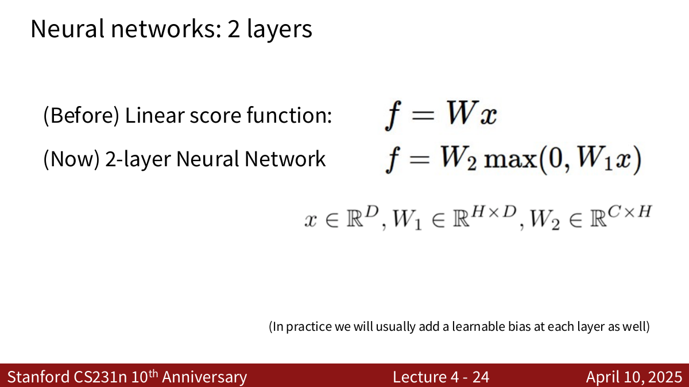
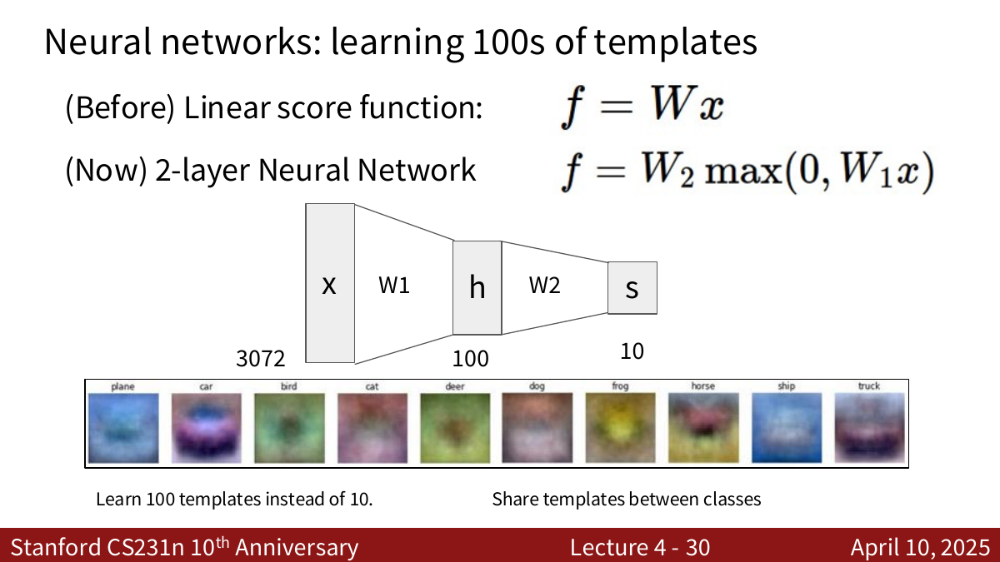
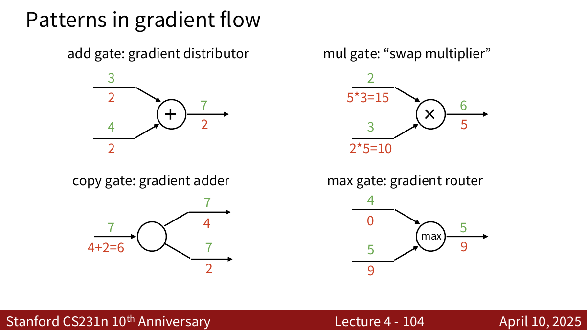

# 1. Neural Networks

## 1.1 从线性分类器到神经网络

在 Lecture 2 中，线性分类器的打分函数是：

$$
s=Wx
$$

它只做了一次线性变换。无论如何调整 $W$，每个类别的决策边界都只能是直线或高维空间中的超平面，因此无法处理本身不是线性可分的数据。

神经网络会把多个函数一层一层组合起来。一个两层神经网络可以写成：

$$
h=\operatorname{ReLU}(W_1x+b_1)
$$

$$
s=W_2h+b_2
$$

合在一起就是：

$$
s=W_2\operatorname{ReLU}(W_1x+b_1)+b_2
$$



其中：

1. $x$ 是输入图像展平后的向量。
2. $W_1,b_1$ 把输入变换成隐藏层表示 $h$。
3. $\operatorname{ReLU}$ 加入非线性。
4. $W_2,b_2$ 把隐藏层表示变成每个类别的分数 $s$。

!!! explanation "为什么叫两层神经网络？"
    $W_1$ 对应第一层，$W_2$ 对应第二层，所以它叫做 **2-layer Neural Network**。输入层不算一层，ReLU 也没有可学习参数，一般不单独计数。
    
    因为中间只有一个隐藏层，它也可以叫做 **1-hidden-layer Neural Network**。

## 1.2 为什么必须加入非线性

如果去掉 ReLU，两层网络就会变成：

$$
s=W_2(W_1x)=W_2W_1x
$$

令：

$$
W'=W_2W_1
$$

那么：

$$
s=W'x
$$

这仍然只是一个线性分类器。即使堆叠再多层线性变换，它们最终仍能合并成一次线性变换，模型的表达能力没有真正增强。

!!! explanation "非线性的作用"
    非线性激活函数会在每层之间“拐一下弯”，使整个函数不能再被合并成一个矩阵。

    可以把第一层理解成学习一个新的特征空间，ReLU 再对这个空间进行非线性切割，最后一层在新空间中完成分类。原空间中无法用一条直线分开的数据，经过非线性变换后可能变得线性可分。

## 1.3 Hidden Layer 学习的是什么

假设 CIFAR-10 图像被展开为 $3072$ 维向量，隐藏层有 $100$ 个神经元，最终有 $10$ 个类别，则：

$$
x\in\mathbb{R}^{3072},\quad W_1\in\mathbb{R}^{100\times3072},\quad h\in\mathbb{R}^{100}
$$

$$
W_2\in\mathbb{R}^{10\times100},\quad s\in\mathbb{R}^{10}
$$

$W_1$ 的每一行都可以看成一个模板。于是第一层不再像线性分类器那样只学习 $10$ 个类别模板，而是学习 $100$ 个可以被不同类别共享的中间特征。



例如，第一层可能学习“车轮”“红色区域”“动物耳朵”等局部模式；第二层再把这些模式组合成“汽车”“卡车”“猫”等类别分数。

## 1.4 Activation Functions（激活函数）
!!! show "诸多激活函数"
    

激活函数有非常多种，例如 $Sigmoid、\ Tanh、\ ReLU、\ Leaky \ ReLU、\ ELU 和 \\ GELU$。本讲最重要的是 ReLU：

$$
\operatorname{ReLU}(x)=\max(0,x)
$$

它对每个元素分别操作：正数保持不变，负数变成 $0$。

```python
hidden = np.maximum(0, x @ W1 + b1)
scores = hidden @ W2 + b2
```

## 1.5 网络深度、宽度与模型容量

神经网络可以从两个方向扩大：

1. **Depth（深度）**：增加隐藏层的数量。
2. **Width（宽度）**：增加每个隐藏层的神经元数量。

一般来说，神经元越多、层数越深，网络的 **capacity（容量）** 越大，能够表示的函数也越复杂。


但容量越大并不等于测试效果一定越好。大模型也更容易把训练集中的噪声学进去，因此仍然需要使用正则化、足够的数据和正确的优化方法。

!!! warning "不要用小网络代替正则化"
    需要注意的是，**缩小网络和正则化这两种方式都能限制模型的复杂度以防止过拟合，但是限制的方式不同**。
    
    ### 缩小网络的限制方式：
    隐藏层的每个神经元可以学习一种特征或一种判断模式。神经元变少以后，模型能够组合的模式也变少了，于是能画出的分类边界更简单。

    因此缩小网络防止过拟合的方式如下：

    $$ \text{减少神经元} \Longrightarrow \text{可学习的函数变少} \Longrightarrow \text{不容易拟合噪声} $$

    所以，缩小网络确实会产生类似正则化的效果。
    
    正则化的限制方式，在Lecture 3中已经记过了，这里就不讲了。
    
    ### 为什么不要用小网络代替正则化？
    网络大小决定**最多能学多少**，正则化决定**不要乱学**。
    
    例如，真实规律是一条弯曲的分类边界：

    1. 网络太小时，只能画出一条很简单的线，连训练数据都分不好。这叫 **欠拟合**。
    2. 网络很大且没有正则化时，可能画出一条极其曲折的线，绕过每个训练样本。这叫 **过拟合**。
    3. 网络足够大并加入正则化时，它有能力画复杂曲线，但会受到约束，最终更倾向于画出一条相对平滑、能够代表真实规律的曲线。

    所以，面对过拟合，不应该直接把网络砍得特别小，因为这会降低模型学习真实规律的能力。更常见的思路是：

    > 先给模型足够的学习能力，再用正则化约束它如何使用这种能力。
    
    因此，合理的做法为：使用容量足够的网络，再通过正则化来防止过拟合。这就避免了小网络可能因为容量不够，连训练数据的真实规律都学不会的情况。

$\lambda$ 越大，防止过拟合的强度越高。


---

# 2. 为什么需要 Backpropagation

将神经网络接到损失函数后，完整目标可以写成：

$$
L=L_{data}(s,y)+\lambda R(W_1,W_2)
$$

为了使用梯度下降训练网络，我们需要计算：

$$
\frac{\partial L}{\partial W_1},\quad
\frac{\partial L}{\partial b_1},\quad
\frac{\partial L}{\partial W_2},\quad
\frac{\partial L}{\partial b_2}
$$

当然可以在纸上把整个复合函数展开，再进行矩阵求导。但是这种方式有几个问题：

1. 推导繁琐，很容易出错。
2. 换一个损失函数后往往需要重新推导。
3. 网络结构复杂后，直接写出整个函数几乎不可行。

更好的方法是把整个计算拆成很多简单节点组成的 **computational graph（计算图）**，然后在每个节点只处理一个简单的局部导数。

!!! definition "Backpropagation"
    反向传播就是：从最终的标量损失 $L$ 出发，沿计算图反向移动，在每个节点反复应用链式法则，求出所有输入、中间变量和参数对 $L$ 的梯度。

这幅图非常重要，表示的就是computational graph中的一个节点，理解了这幅图就OK了：


---

# 3. Computational Graph

## 3.1 Forward Pass（前向传播）

以函数为例：

$$
f(x,y,z)=(x+y)z
$$

可以先定义中间变量：

$$
q=x+y
$$

$$
f=qz
$$

当前向传播输入 $x=-2,y=5,z=-4$ 时：

$$
q=-2+5=3
$$

$$
f=3\times(-4)=-12
$$

前向传播的工作就是按照计算图从输入走到输出，并保存中间结果。保存中间结果非常重要，因为反向传播计算局部梯度时经常还要使用它们。

## 3.2 Backward Pass（反向传播）

现在要计算：

$$
\frac{\partial f}{\partial x},\quad
\frac{\partial f}{\partial y},\quad
\frac{\partial f}{\partial z}
$$

先看乘法节点 $f=qz$：

$$
\frac{\partial f}{\partial q}=z=-4,\qquad
\frac{\partial f}{\partial z}=q=3
$$

再经过加法节点 $q=x+y$：

$$
\frac{\partial q}{\partial x}=1,\qquad
\frac{\partial q}{\partial y}=1
$$

由链式法则：

$$
\frac{\partial f}{\partial x}
=\frac{\partial f}{\partial q}\frac{\partial q}{\partial x}
=(-4)\times1=-4
$$

$$
\frac{\partial f}{\partial y}
=\frac{\partial f}{\partial q}\frac{\partial q}{\partial y}
=(-4)\times1=-4
$$

最终得到：

$$
\boxed{\frac{\partial f}{\partial x}=-4,\quad
\frac{\partial f}{\partial y}=-4,\quad
\frac{\partial f}{\partial z}=3}
$$

!!! warning "我之前的错误理解"
    
    我之前以为 $x$ 和 $y$ 下面那两个红色数字都应该写1，因为我以为这个地方写的是局部梯度（$\frac{\partial q}{\partial x}$ 和 $\frac{\partial q}{\partial y}$）。这是错误的！！！这个地方代表的是应该是 $\frac{\partial f}{\partial x}$ 和 $\frac{\partial f}{\partial y}$！！！ 
    
    根据链式法则：
    
    $$\frac{\partial f}{\partial x}=\frac{\partial f}{\partial q}\frac{\partial q}{\partial x}$$
	由于 $\frac{\partial f}{\partial q}=-4$ ，$\frac{\partial q}{\partial x}=1$ 。所以 $\frac{\partial f}{\partial x}=1$，同理 $\frac{\partial f}{\partial y}=1$。


## 3.3 Upstream Gradient 与 Local Gradient

对计算图中的某个节点 $z=f(x,y)$，假设最终损失是 $L$。

节点从右边收到：

$$
\frac{\partial L}{\partial z}
$$

它叫做 **upstream gradient（上游梯度）**，表示节点输出 $z$ 对最终损失 $L$ 有多大影响。

节点自己只需要知道局部关系：

$$
\frac{\partial z}{\partial x},\frac{\partial z}{\partial y}
$$

它们叫做 **local gradient（局部梯度）**。

节点传给左边输入的 **downstream gradients（下游梯度）** 为：

$$
\frac{\partial L}{\partial x}
=\frac{\partial L}{\partial z}\frac{\partial z}{\partial x}
$$

$$
\frac{\partial L}{\partial y}
=\frac{\partial L}{\partial z}\frac{\partial z}{\partial y}
$$

因此反向传播的公式即为：

$$
\boxed{\text{downstream gradient}
=\text{upstream gradient}\times\text{local gradient}}
$$

!!! explanation "为什么反向传播很模块化？"
    每个节点不用知道整个网络有多复杂，也不用知道最终的损失函数是什么。

    它只做三件事：接收上游梯度、乘上自己的局部梯度、把结果传给自己的输入。所有简单节点连接起来，就能算出复杂网络中全部参数的梯度。


## 3.4 分支处为什么要把梯度相加

如果变量 $x$ 通过两条不同路径影响最终损失：

$$
L=L_1(x)+L_2(x)
$$

那么：

$$
\frac{\partial L}{\partial x}
=\frac{\partial L_1}{\partial x}
+\frac{\partial L_2}{\partial x}
$$

因此在计算图的 **copy gate（复制节点）** 处，反向传播需要把来自所有分支的梯度相加，而不是任选一条路径。

!!! warning "常见错误"
    沿一条路径传播时使用乘法；同一个变量通过多条路径影响损失时，在分支汇合处使用加法。

    简单记为：**链上相乘，分支相加。**

---

# 4. 常见 Gate 的梯度规律



## 4.1 Add Gate：梯度分发器

若：

$$
z=x+y
$$

则：

$$
\frac{\partial z}{\partial x}=1,\qquad
\frac{\partial z}{\partial y}=1
$$

所以加法节点会把上游梯度原样复制给两个输入。

## 4.2 Multiply Gate：交换后相乘

若：

$$
z=xy
$$

则：

$$
\frac{\partial z}{\partial x}=y,\qquad
\frac{\partial z}{\partial y}=x
$$

所以反向传播时，$x$ 的梯度乘以前向传播中的 $y$，$y$ 的梯度乘以前向传播中的 $x$。

## 4.3 Copy Gate：梯度累加器

Copy Gate 表示同一个变量被复制后，送到计算图中的多个分支。例如：

$$
y_1=x,\qquad y_2=x
$$

假设 $y_1$ 和 $y_2$ 最终都影响损失 $L$，那么反向传播到 $x$ 时，需要把两个分支传回来的梯度相加：

$$
\frac{\partial L}{\partial x}
=\frac{\partial L}{\partial y_1}\frac{\partial y_1}{\partial x}
+\frac{\partial L}{\partial y_2}\frac{\partial y_2}{\partial x}
$$

因为：

$$
\frac{\partial y_1}{\partial x}
=\frac{\partial y_2}{\partial x}=1
$$

所以：

$$
\boxed{
\frac{\partial L}{\partial x}
=\frac{\partial L}{\partial y_1}
+\frac{\partial L}{\partial y_2}
}
$$

## 4.4 Max Gate：梯度路由器

若：

$$
z=\max(x,y)
$$

较大的输入在前向传播中决定了输出，因此反向传播时，上游梯度只传给较大的那个输入，另一个输入得到 $0$。

这也是 ReLU 的反向传播规律：

$$
\frac{d}{dx}\operatorname{ReLU}(x)=
\begin{cases}
1,&x>0\\
0,&x<0
\end{cases}
$$

## 4.5 Sigmoid Gate

Sigmoid 函数为：

$$
\sigma(x)=\frac{1}{1+e^{-x}}
$$

它的导数可以用自己的输出表示：

$$
\sigma'(x)=\sigma(x)(1-\sigma(x))
$$

因此前向传播只要缓存输出 $s=\sigma(x)$，反向传播就能直接写成：

```python
dx = upstream_grad * s * (1 - s)
```

!!! note "计算图的拆法不唯一"
    Sigmoid 可以被拆成取负、指数、加法、倒数等多个节点，也可以直接看成一个 Sigmoid 节点。

    只要数学上等价，两种计算图都正确。实践中一般选择局部梯度容易表达、实现高效的拆法。

---

# 5. Backpropagation 的实现

## 5.1 Flat Code（直接展开）

简单函数可以把前向和反向过程直接写开：

```python
# Forward pass
q = x + y
f = q * z

# Backward pass
df = 1.0
dq = df * z
dz = df * q
dx = dq * 1.0
dy = dq * 1.0
```

反向传播从：

$$
\frac{\partial f}{\partial f}=1
$$

开始。这个 $1$ 是反向传播的 base case，然后沿计算图反向传递。

## 5.2 模块化的 `forward()` / `backward()` API

复杂网络不能把所有求导过程都手写在一段代码中。更好的方法是让每种运算实现统一接口：

```python
class Multiply:
    def forward(self, x, y):
        self.x = x
        self.y = y
        return x * y

    def backward(self, dout):
        dx = dout * self.y
        dy = dout * self.x
        return dx, dy
```

这里：

1. `forward()` 计算输出，并缓存反向传播需要的值。
2. `backward(dout)` 接收上游梯度 `dout`。
3. `backward()` 返回每个输入对应的下游梯度。

PyTorch 的自动求导系统本质上也采用类似思想：前向计算时记录计算图，调用 `loss.backward()` 时从损失出发反向执行每个算子的 backward 规则。

!!! explanation "Backpropagation 和 Gradient Descent 不是一回事"
    **Backpropagation** 负责计算梯度，表示的是**每个参数应该往哪个方向变化，以及影响有多大**。

    **Gradient Descent** 或 **Adam** 等优化器负责使用这些梯度更新参数，回答“这一步实际改多少”。

    顺序是：forward 得到 loss，backward 得到 gradients，optimizer 再更新 parameters。

---

# 6. Backpropagation with Vectors

## 6.1 标量、向量与 Jacobian

不同输入输出类型对应的导数形式不同：

1. Scalar to Scalar：导数是一个标量。
2. Vector to Scalar：导数是 gradient（梯度向量）。
3. Vector to Vector：导数是 Jacobian（雅可比矩阵）。


若：

$$
z=f(x),\qquad x\in\mathbb{R}^{D_x},\quad z\in\mathbb{R}^{D_z}
$$

把两个向量展开：

$$
x=
\begin{bmatrix}
x_1\\
x_2\\
\vdots\\
x_{D_x}
\end{bmatrix},
\qquad
z=
\begin{bmatrix}
z_1\\
z_2\\
\vdots\\
z_{D_z}
\end{bmatrix}
$$

$z$ 中的每个分量 $z_i$ 都可能同时受到 $x_1,x_2,\ldots,x_{D_x}$ 的影响。因此，我们需要把“每个输出对每个输入的偏导数”全部计算出来。

按照常见的 Jacobian 定义，**一行对应一个输出，一列对应一个输入**：

$$
J=\frac{\partial z}{\partial x}
=
\begin{bmatrix}
\dfrac{\partial z_1}{\partial x_1} &
\dfrac{\partial z_1}{\partial x_2} &
\cdots &
\dfrac{\partial z_1}{\partial x_{D_x}}\\
\dfrac{\partial z_2}{\partial x_1} &
\dfrac{\partial z_2}{\partial x_2} &
\cdots &
\dfrac{\partial z_2}{\partial x_{D_x}}\\
\vdots & \vdots & \ddots & \vdots\\
\dfrac{\partial z_{D_z}}{\partial x_1} &
\dfrac{\partial z_{D_z}}{\partial x_2} &
\cdots &
\dfrac{\partial z_{D_z}}{\partial x_{D_x}}
\end{bmatrix}
\in\mathbb{R}^{D_z\times D_x}
$$

例如，矩阵第 $i$ 行、第 $j$ 列的元素是：

$$
J_{ij}=\frac{\partial z_i}{\partial x_j}
$$

意思是：输入 $x_j$ 改变一点，会让输出 $z_i$ 改变多少。

### 6.1.1 Jacobian 怎么参与反向传播

最终的损失 $L$ 仍然是一个标量。假设反向传播已经算出了上游梯度：

$$
\frac{\partial L}{\partial z}
=
\begin{bmatrix}
\dfrac{\partial L}{\partial z_1}\\
\dfrac{\partial L}{\partial z_2}\\
\vdots\\
\dfrac{\partial L}{\partial z_{D_z}}
\end{bmatrix}
\in\mathbb{R}^{D_z}
$$

对于某一个输入 $x_j$，它可能通过所有 $z_i$ 影响损失，所以要把所有路径的贡献相加：

$$
\frac{\partial L}{\partial x_j}
=
\sum_{i=1}^{D_z}
\frac{\partial L}{\partial z_i}
\frac{\partial z_i}{\partial x_j}
$$

这里正好可以解释为什么 Jacobian 必须转置。

原本的 Jacobian 为：

$$
J=
\begin{bmatrix}
\dfrac{\partial z_1}{\partial x_1} &
\dfrac{\partial z_1}{\partial x_2} &
\cdots &
\dfrac{\partial z_1}{\partial x_{D_x}}\\
\dfrac{\partial z_2}{\partial x_1} &
\dfrac{\partial z_2}{\partial x_2} &
\cdots &
\dfrac{\partial z_2}{\partial x_{D_x}}\\
\vdots & \vdots & \ddots & \vdots\\
\dfrac{\partial z_{D_z}}{\partial x_1} &
\dfrac{\partial z_{D_z}}{\partial x_2} &
\cdots &
\dfrac{\partial z_{D_z}}{\partial x_{D_x}}
\end{bmatrix}
$$

它的排列方式是：

1. 每一行固定一个 $z_i$，记录这个 $z_i$ 对所有 $x$ 的偏导数。
2. 每一列固定一个 $x_j$，记录所有 $z$ 对这个 $x_j$ 的偏导数。

但是反向传播要求的是 $\dfrac{\partial L}{\partial x_j}$。根据多变量链式法则，我们要固定一个 $x_j$，收集它通过所有 $z_i$ 影响 $L$ 的路径：

$$
\frac{\partial L}{\partial x_j}
=
\frac{\partial z_1}{\partial x_j}\frac{\partial L}{\partial z_1}
+
\frac{\partial z_2}{\partial x_j}\frac{\partial L}{\partial z_2}
+
\cdots
+
\frac{\partial z_{D_z}}{\partial x_j}\frac{\partial L}{\partial z_{D_z}}
$$

也就是说，计算 $\dfrac{\partial L}{\partial x_j}$ 时需要使用 Jacobian 的第 $j$ **列**。但是在普通的矩阵乘法中，左边矩阵是用一行去乘右边的列向量。因此我们把 $J$ 转置，让同一个 $x_j$ 对应的那一列变成一行：

$$
J^T=
\begin{bmatrix}
\dfrac{\partial z_1}{\partial x_1} &
\dfrac{\partial z_2}{\partial x_1} &
\cdots &
\dfrac{\partial z_{D_z}}{\partial x_1}\\
\dfrac{\partial z_1}{\partial x_2} &
\dfrac{\partial z_2}{\partial x_2} &
\cdots &
\dfrac{\partial z_{D_z}}{\partial x_2}\\
\vdots & \vdots & \ddots & \vdots\\
\dfrac{\partial z_1}{\partial x_{D_x}} &
\dfrac{\partial z_2}{\partial x_{D_x}} &
\cdots &
\dfrac{\partial z_{D_z}}{\partial x_{D_x}}
\end{bmatrix}
$$

现在 $J^T$ 的第 $j$ 行正好包含：

$$
\frac{\partial z_1}{\partial x_j},
\frac{\partial z_2}{\partial x_j},
\ldots,
\frac{\partial z_{D_z}}{\partial x_j}
$$

再让这一行与上游梯度 $\dfrac{\partial L}{\partial z}$ 做点积，得到的就是 $\dfrac{\partial L}{\partial x_j}$。

因此，把所有 $x_j$ 的梯度一起写成矩阵形式，就是：

$$
\boxed{
\frac{\partial L}{\partial x}
=J^T\frac{\partial L}{\partial z}
}
$$

检查 shape：

$$
(D_x\times D_z)(D_z\times1)=D_x\times1
$$

### 6.1.2 完整例子：$x$ 是 2 维，$z$ 是 3 维

令：

$$
x=
\begin{bmatrix}
x_1\\
x_2
\end{bmatrix}
\in\mathbb{R}^2
$$

定义三个输出：

$$
z_1=x_1^2+x_2
$$

$$
z_2=x_1x_2
$$

$$
z_3=\sin(x_1)+3x_2
$$

于是：

$$
z=
\begin{bmatrix}
z_1\\
z_2\\
z_3
\end{bmatrix}
\in\mathbb{R}^3
$$

这里输入维度为 $D_x=2$，输出维度为 $D_z=3$，所以 Jacobian 应该是一个 $3\times2$ 矩阵。

**第一步：分别对三个输出求偏导。**

对于 $z_1=x_1^2+x_2$：

$$
\frac{\partial z_1}{\partial x_1}=2x_1,
\qquad
\frac{\partial z_1}{\partial x_2}=1
$$

对于 $z_2=x_1x_2$：

$$
\frac{\partial z_2}{\partial x_1}=x_2,
\qquad
\frac{\partial z_2}{\partial x_2}=x_1
$$

对于 $z_3=\sin(x_1)+3x_2$：

$$
\frac{\partial z_3}{\partial x_1}=\cos(x_1),
\qquad
\frac{\partial z_3}{\partial x_2}=3
$$

**第二步：每个输出的偏导数放在一行，构造 Jacobian。**

$$
J=
\frac{\partial z}{\partial x}
=
\begin{bmatrix}
2x_1 & 1\\
x_2 & x_1\\
\cos(x_1) & 3
\end{bmatrix}
$$

当 $x_1=2,x_2=1$ 时：

$$
J=
\begin{bmatrix}
4 & 1\\
1 & 2\\
\cos(2) & 3
\end{bmatrix}
$$

**第三步：接收上游梯度。**

假设损失函数为：

$$
L=z_1+2z_2-z_3
$$

那么：

$$
\frac{\partial L}{\partial z}
=
\begin{bmatrix}
1\\
2\\
-1
\end{bmatrix}
$$

这表示：$z_1$ 增加一点会让 $L$ 按 $1$ 倍增加；$z_2$ 增加一点会让 $L$ 按 $2$ 倍增加；$z_3$ 增加一点会让 $L$ 按 $1$ 倍减小。

**第四步：用链式法则反向传播到 $x$。**

$$
\begin{aligned}
\frac{\partial L}{\partial x}
&=J^T\frac{\partial L}{\partial z}\\
&=
\begin{bmatrix}
4 & 1 & \cos(2)\\
1 & 2 & 3
\end{bmatrix}
\begin{bmatrix}
1\\
2\\
-1
\end{bmatrix}\\
&=
\begin{bmatrix}
4+2-\cos(2)\\
1+4-3
\end{bmatrix}\\
&=
\begin{bmatrix}
6-\cos(2)\\
2
\end{bmatrix}
\end{aligned}
$$

所以：

$$
\boxed{
\frac{\partial L}{\partial x_1}=6-\cos(2),
\qquad
\frac{\partial L}{\partial x_2}=2
}
$$

!!! explanation "把矩阵乘法拆回普通链式法则"
    上面的第一个结果其实就是三条路径相加：

    $$
    \frac{\partial L}{\partial x_1}
    =
    \frac{\partial L}{\partial z_1}\frac{\partial z_1}{\partial x_1}
    +
    \frac{\partial L}{\partial z_2}\frac{\partial z_2}{\partial x_1}
    +
    \frac{\partial L}{\partial z_3}\frac{\partial z_3}{\partial x_1}
    $$

    代入数值：

    $$
    \frac{\partial L}{\partial x_1}
    =1\times4+2\times1+(-1)\times\cos(2)
    =6-\cos(2)
    $$

    因此 Jacobian 并不是新的求导规则。它只是把很多条普通链式法则整理成一个矩阵，方便一次性计算所有输入的梯度。

!!! note "最重要的 shape 规律"
    一个变量关于标量损失 $L$ 的梯度，shape 永远和这个变量本身相同：

    $$
    \operatorname{shape}\left(\frac{\partial L}{\partial x}\right)
    =\operatorname{shape}(x)
    $$

    如果代码中 `dx.shape != x.shape`，通常说明反向传播写错了。

## 6.2 向量 ReLU 的反向传播

ReLU 对向量中的每个元素分别操作。假设：

$$
x=
\begin{bmatrix}
1\\
-2\\
3\\
-1
\end{bmatrix},
\qquad
z=\operatorname{ReLU}(x)
=
\begin{bmatrix}
1\\
0\\
3\\
0
\end{bmatrix}
$$

把它按分量写开：

$$
z_1=\operatorname{ReLU}(x_1),\quad
z_2=\operatorname{ReLU}(x_2),\quad
z_3=\operatorname{ReLU}(x_3),\quad
z_4=\operatorname{ReLU}(x_4)
$$

### 6.2.1 先把完整 Jacobian 写出来

Jacobian 第 $i$ 行、第 $j$ 列是：

$$
J_{ij}=\frac{\partial z_i}{\partial x_j}
$$

先看对角线，也就是 $z_i$ 对对应输入 $x_i$ 的导数：

$$
\frac{\partial z_i}{\partial x_i}
=
\begin{cases}
1,&x_i>0\\
0,&x_i<0
\end{cases}
$$

当前输入中，$x_1=1$、$x_3=3$ 是正数，所以对应导数为 $1$；$x_2=-2$、$x_4=-1$ 是负数，所以对应导数为 $0$。

再看非对角线。例如：

$$
\frac{\partial z_1}{\partial x_2}=0
$$

因为 $z_1=\operatorname{ReLU}(x_1)$ 只由 $x_1$ 决定，改变 $x_2$ 不会影响 $z_1$。同理，只要 $i\ne j$，就有：

$$
\frac{\partial z_i}{\partial x_j}=0
$$

因此，完整 Jacobian 是：

$$
J=\frac{\partial z}{\partial x}
=
\begin{bmatrix}
\dfrac{\partial z_1}{\partial x_1} &
\dfrac{\partial z_1}{\partial x_2} &
\dfrac{\partial z_1}{\partial x_3} &
\dfrac{\partial z_1}{\partial x_4}\\
\dfrac{\partial z_2}{\partial x_1} &
\dfrac{\partial z_2}{\partial x_2} &
\dfrac{\partial z_2}{\partial x_3} &
\dfrac{\partial z_2}{\partial x_4}\\
\dfrac{\partial z_3}{\partial x_1} &
\dfrac{\partial z_3}{\partial x_2} &
\dfrac{\partial z_3}{\partial x_3} &
\dfrac{\partial z_3}{\partial x_4}\\
\dfrac{\partial z_4}{\partial x_1} &
\dfrac{\partial z_4}{\partial x_2} &
\dfrac{\partial z_4}{\partial x_3} &
\dfrac{\partial z_4}{\partial x_4}
\end{bmatrix}
=
\begin{bmatrix}
1&0&0&0\\
0&0&0&0\\
0&0&1&0\\
0&0&0&0
\end{bmatrix}
$$

这个 Jacobian 只有对角线上可能有值，因为每个 $z_i$ 只依赖对应的 $x_i$。本例中对角线上也只有两个 $1$，其余位置全是 $0$，所以它是一个非常稀疏的矩阵。

### 6.2.2 用 Jacobian 完成反向传播

假设收到上游梯度：

$$
\frac{\partial L}{\partial z}
=
\begin{bmatrix}
4\\
-1\\
5\\
9
\end{bmatrix}
$$

按照上一节的公式：

$$
\frac{\partial L}{\partial x}
=J^T\frac{\partial L}{\partial z}
$$

因为这里的 $J$ 是对角矩阵，所以 $J^T=J$：

$$
\begin{aligned}
\frac{\partial L}{\partial x}
&=
\begin{bmatrix}
1&0&0&0\\
0&0&0&0\\
0&0&1&0\\
0&0&0&0
\end{bmatrix}
\begin{bmatrix}
4\\
-1\\
5\\
9
\end{bmatrix}\\
&=
\begin{bmatrix}
4\\
0\\
5\\
0
\end{bmatrix}
\end{aligned}
$$

所以，正输入位置允许上游梯度通过，负输入位置把上游梯度变成 $0$。

### 6.2.3 为什么构造这个稀疏矩阵不值得

如果 ReLU 的输入是 $D$ 维，完整 Jacobian 就是 $D\times D$，一共有 $D^2$ 个位置。但最多只有对角线上的 $D$ 个位置可能非零，其余 $D^2-D$ 个位置必定为 $0$。

例如 $D=10000$ 时，完整 Jacobian 有：

$$
10000^2=100000000
$$

个位置，但真正有用的信息只有 10000 个输入分别是否大于 $0$。创建一个含一亿个位置的矩阵，再做矩阵乘法，只是为了把梯度中的某些位置变成 $0$，会浪费大量内存和计算时间。

因此，程序直接利用 Jacobian 的结构：

    # Python
    dx = dout * (x > 0)

其中 $(x>0)$ 是一个和 $x$ 同 shape 的 mask。正数位置是 $1$，负数位置是 $0$。它与上游梯度逐元素相乘，结果和完整的 Jacobian 矩阵乘法完全相同。


---

# 7. Backpropagation with Matrices

## 7.1 矩阵乘法层

设一个全连接层没有偏置：

$$
Y=XW
$$

其中：

$$
X\in\mathbb{R}^{N\times D},\quad
W\in\mathbb{R}^{D\times M},\quad
Y\in\mathbb{R}^{N\times M}
$$

收到上游梯度：

$$
dY=\frac{\partial L}{\partial Y}\in\mathbb{R}^{N\times M}
$$

下面用逐元素的链式法则推导反向传播公式。

### 7.1.1 先把矩阵乘法拆成元素形式

矩阵 $Y=XW$ 中，第 $i$ 行、第 $k$ 列的元素为：

$$
Y_{ik}=\sum_{r=1}^{D}X_{ir}W_{rk}
$$


上游梯度中的一个元素为：

$$
dY_{ik}=\frac{\partial L}{\partial Y_{ik}}
$$

接下来分别计算 $X$ 和 $W$ 中每个元素的梯度。

### 7.1.2 推导 $dX=dYW^T$

先固定 $X$ 中的任意一个元素 $X_{ij}$，其中：

$$
i\in\{1,\ldots,N\},\qquad
j\in\{1,\ldots,D\}
$$

这里的 $i$ 和 $j$ 都是固定的。我们的目标是求这一个位置的梯度 $\dfrac{\partial L}{\partial X_{ij}}$。

由于：

$$
Y_{ik}=\sum_{r=1}^{D}X_{ir}W_{rk}
$$

求和中的 $r$ 才是从 $1$ 到 $D$ 变化的下标。当 $r=j$ 时，求和式中包含：

$$
X_{ij}W_{jk}
$$

其他 $r\ne j$ 的项都不含 $X_{ij}$，对 $X_{ij}$ 求导后为 $0$。所以：

$$
\frac{\partial Y_{ik}}{\partial X_{ij}}=W_{jk}
$$

$X_{ij}$ 会影响 $Y$ 第 $i$ 行中的所有输出：

$$
Y_{i1},Y_{i2},\ldots,Y_{iM}
$$

因此需要把它经过所有 $Y_{ik}$ 影响损失 $L$ 的路径相加。这里的 $i,j$ 仍然固定，只有 $k$ 从 $1$ 遍历到 $M$。根据链式法则：

$$
\begin{aligned}
\frac{\partial L}{\partial X_{ij}}
&=
\sum_{k=1}^{M}
\frac{\partial L}{\partial Y_{ik}}
\frac{\partial Y_{ik}}{\partial X_{ij}}\\
&=
\sum_{k=1}^{M}dY_{ik}W_{jk}
\end{aligned}
$$

也就是：

$$
dX_{ij}=\sum_{k=1}^{M}dY_{ik}W_{jk}
$$

再观察矩阵乘法 $dYW^T$ 的第 $(i,j)$ 个元素：

$$
\begin{aligned}
(dYW^T)_{ij}
&=
\sum_{k=1}^{M}dY_{ik}(W^T)_{kj}\\
&=
\sum_{k=1}^{M}dY_{ik}W_{jk}\\
&=dX_{ij}
\end{aligned}
$$

因为矩阵中的每个元素都满足这个关系，所以：

$$
\boxed{dX=dY\,W^T}
$$

!!! explanation "$dX$ 的直觉"
    一个 $X_{ij}$ 会影响当前样本的所有 $M$ 个输出。计算它的梯度时，要把这 $M$ 条路径的贡献全部加起来。

    $dY$ 的第 $i$ 行记录当前样本所有输出的上游梯度，$W$ 的第 $j$ 行记录输入特征 $j$ 对所有输出的影响系数。二者做点积就得到 $dX_{ij}$。

### 7.1.3 推导 $dW=X^TdY$

现在固定 $W$ 中的任意一个元素 $W_{jk}$，其中：

$$
j\in\{1,\ldots,D\},\qquad
k\in\{1,\ldots,M\}
$$

这里的 $j,k$ 都固定。接下来只有样本下标 $i$ 从 $1$ 遍历到 $N$，因为同一个权重 $W_{jk}$ 被整个 batch 中的所有样本共享。

由元素形式可得：

$$
\frac{\partial Y_{ik}}{\partial W_{jk}}=X_{ij}
$$

同一个权重 $W_{jk}$ 会被 batch 中的所有 $N$ 个样本共享，因此它会影响：

$$
Y_{1k},Y_{2k},\ldots,Y_{Nk}
$$

根据链式法则，要把所有样本产生的梯度贡献相加：

$$
\begin{aligned}
\frac{\partial L}{\partial W_{jk}}
&=
\sum_{i=1}^{N}
\frac{\partial L}{\partial Y_{ik}}
\frac{\partial Y_{ik}}{\partial W_{jk}}\\
&=
\sum_{i=1}^{N}dY_{ik}X_{ij}\\
&=
\sum_{i=1}^{N}X_{ij}dY_{ik}
\end{aligned}
$$

也就是：

$$
dW_{jk}=\sum_{i=1}^{N}X_{ij}dY_{ik}
$$

再观察矩阵乘法 $X^TdY$ 的第 $(j,k)$ 个元素：

$$
\begin{aligned}
(X^TdY)_{jk}
&=
\sum_{i=1}^{N}(X^T)_{ji}dY_{ik}\\
&=
\sum_{i=1}^{N}X_{ij}dY_{ik}\\
&=dW_{jk}
\end{aligned}
$$

因此：

$$
\boxed{dW=X^T dY}
$$

!!! explanation "$dW$ 的直觉"
    一个权重会被整个 batch 中的所有样本共同使用，所以 $dW_{jk}$ 必须累加所有 $N$ 个样本对这个权重产生的梯度。

    $X^T$ 把同一个输入特征在所有样本中的数值排到一行，再与 $dY$ 中对应输出的上游梯度做点积，恰好完成 batch 维度上的梯度累加。

### 7.1.4 用 shape 检查推导结果

检查 shape：

$$
dX:(N\times M)(M\times D)=N\times D
$$

$$
dW:(D\times N)(N\times M)=D\times M
$$

可以看到，$dX$ 与 $X$ 同 shape，$dW$ 与 $W$ 同 shape。


```python
# Forward
y = x @ w

# Backward
dx = dy @ w.T
dw = x.T @ dy
```

## 7.2 加上 Bias

若：

$$
Y=XW+b
$$

其中 $b\in\mathbb{R}^{M}$ 会通过 broadcasting 加到 batch 中每一个样本上，则：

$$
db=\sum_{i=1}^{N}dY_i
$$

代码为：

```python
dx = dy @ w.T
dw = x.T @ dy
db = np.sum(dy, axis=0)
```

之所以要沿 batch 维度求和，是因为同一个 $b$ 被所有 $N$ 个样本共同使用。它通过 $N$ 条路径影响损失，所以这些路径贡献的梯度要相加。

---

# 8. 两层神经网络的完整前向与反向传播

考虑：

$$
H=\operatorname{ReLU}(XW_1+b_1)
$$

$$
S=HW_2+b_2
$$

再由 $S$ 计算标量损失 $L$。如果损失函数已经返回 $dS$，则网络部分的反向传播可以按计算图的逆序写成：

```python
# Forward
a1 = X @ W1 + b1
h = np.maximum(0, a1)
scores = h @ W2 + b2

# 假设 loss function 返回 loss 和 dscores
loss, dscores = loss_fn(scores, y)

# Backward: 第二个全连接层
dW2 = h.T @ dscores
db2 = np.sum(dscores, axis=0)
dh = dscores @ W2.T

# Backward: ReLU
da1 = dh * (a1 > 0)

# Backward: 第一个全连接层
dW1 = X.T @ da1
db1 = np.sum(da1, axis=0)
dX = da1 @ W1.T
```

如果损失中包含 L2 regularization，还要把正则化梯度加入权重梯度。例如正则项定义为：

$$
L_{reg}=\lambda\left(\lVert W_1\rVert_2^2+\lVert W_2\rVert_2^2\right)
$$

则：

$$
dW_1\leftarrow dW_1+2\lambda W_1
$$

$$
dW_2\leftarrow dW_2+2\lambda W_2
$$

!!! warning "反向传播的顺序"
    前向传播按 $X\rightarrow H\rightarrow S\rightarrow L$ 计算。

    反向传播必须严格反过来，按 $L\rightarrow S\rightarrow H\rightarrow X$ 计算。某个节点只有先收到上游梯度，才能继续计算输入的梯度。

---

# 9. 总结

1. 全连接神经网络是线性变换与非线性激活函数的堆叠。
2. 如果没有激活函数，多层线性变换仍然等价于一个线性分类器。
3. 隐藏层学习可以被多个类别共享的中间特征，提升模型的表达能力。
4. 反向传播是在计算图上递归应用链式法则。
5. 每个节点使用“上游梯度乘局部梯度”得到下游梯度；同一变量的多条路径贡献需要相加。
6. 梯度的 shape 必须与原变量相同。
7. 实际实现不会显式构造巨大的 Jacobian，而是直接计算 VJP。
8. 对矩阵乘法 $Y=XW$，最重要的两个公式是 $dX=dYW^T$ 与 $dW=X^TdY$。
9. `forward()` 负责计算并缓存，`backward()` 负责接收上游梯度并返回输入梯度。
10. Backpropagation 负责求梯度，SGD、Adam 等优化器负责使用梯度更新参数。
