# 1. Video Understanding 在做什么

前面几讲主要处理的是静态图像。图像分类、检测、分割的输入通常是一张二维图片：

$$
3\times H\times W
$$

到了 video understanding，输入不再是一张图，而是一段图像序列。

一段视频可以看成：

$$
T\times 3\times H\times W
$$

其中 $T$ 是帧数，$3$ 是 RGB channel，$H,W$ 是每一帧的空间尺寸。

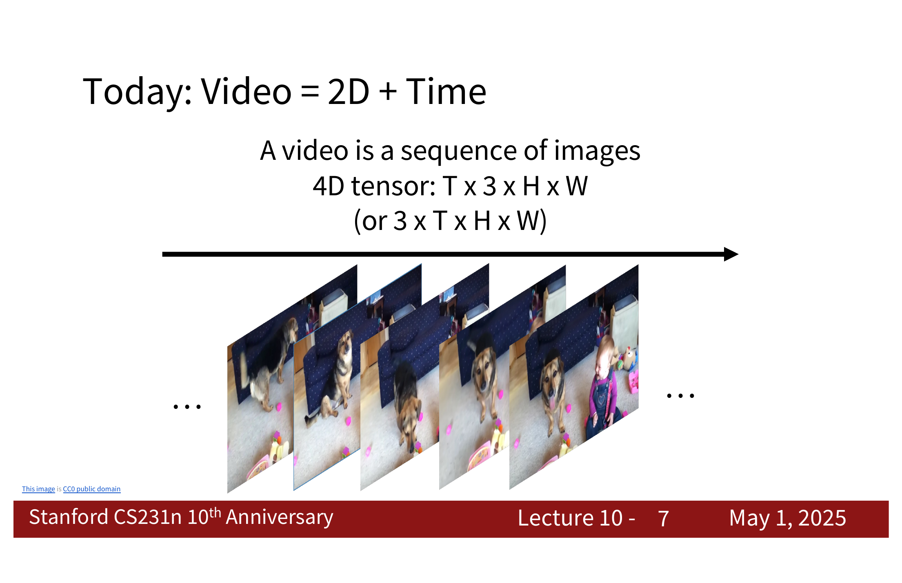

## 1.1 Video Classification

最基本的视频任务是 **Video Classification**：给定一段视频，输出一个类别。

例如：

```text
Swimming
Running
Jumping
Eating
Standing
```

对于图片分类，模型通常识别的是 object，例如 dog、cat、truck；对于视频分类，模型常常识别的是 action，例如 running、jumping。

这说明视频分类不能只依赖单帧 appearance，还可能需要 motion information。

## 1.2 视频数据为什么麻烦

视频非常大。假设每个像素用 3 bytes 存储，视频大约是 30 fps：

1. SD 视频 $640\times480$：每分钟大约 $1.5$ GB。
2. HD 视频 $1920\times1080$：每分钟大约 $10$ GB。

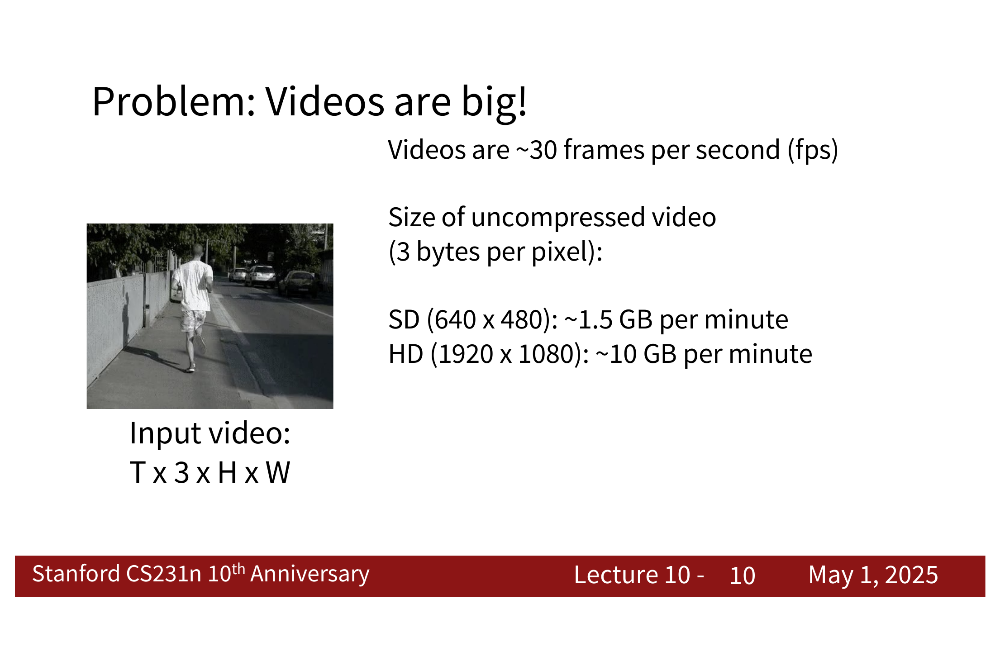

因此训练时通常不会直接把完整长视频喂进去，而是从视频中采样短 clip，并且降低 fps 和分辨率。

训练时：

```text
long raw video -> sample short low-fps clip -> model -> class score
```

测试时：

```text
long raw video -> sample multiple clips -> average predictions
```

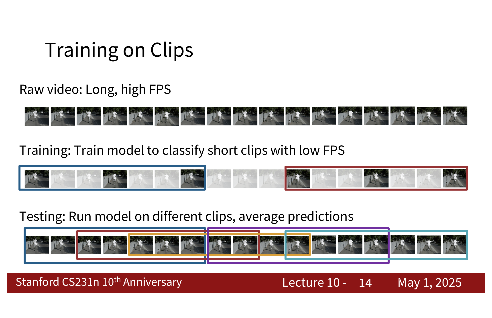

!!! warning "为什么不直接训练整段视频"
    直接处理完整视频会让 $T,H,W$ 都很大，计算和显存很快爆炸。
    
    所以视频模型通常只在短 clip 上训练。测试时再从整段视频中取多个 clip，把预测结果平均，近似得到整段视频的类别。

---

# 2. Video Classification 的几种基本模型

视频分类最自然的问题是：**如何把时间维度引入 CNN？**

几个由简单到复杂的方法：

1. Single-frame CNN。
2. Late Fusion。
3. Early Fusion。
4. 3D CNN。

## 2.1 Single-Frame CNN

最简单的 baseline：把视频拆成很多帧，每一帧都用普通 2D CNN 分类。

测试时把每一帧的预测概率平均：

$$
p(y\mid \text{video})
=
\frac{1}{T}
\sum_{t=1}^{T}
p(y\mid I_t)
$$

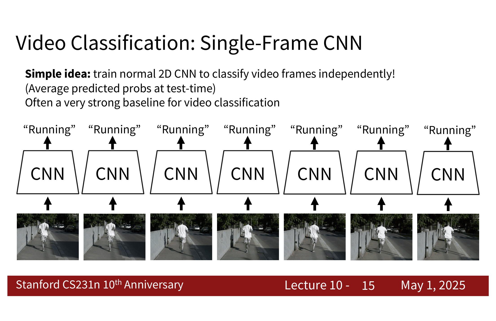

这个方法完全没有显式建模 motion，但经常是很强的 baseline。

!!! note "一定要先试 Single-Frame baseline"
    很多视频类别仅凭 appearance 就能猜得很准。
    
    例如 swimming 可能出现泳池，playing guitar 会出现吉他。即使没有看见动作变化，单帧图像也已经包含很多类别线索。

## 2.2 Late Fusion

### 2.2.1 Late fusion with FC layers

Late Fusion 的步骤：

1. 对视频中的每一帧，分别输入到 2D CNN 中，提取每一帧的 feature map
2. 把所有帧的 feature map 展平（Flatten），然后把它们连接起来，得到一个巨大的特征向量。
    - 对于每一帧：$I_t\in\mathbb{R}^{3\times H\times W}\quad\longrightarrow\quad f_t\in\mathbb{R}^{D}$
    - 然后把所有帧的特征合并：$f_1,f_2,\dots,f_T \quad\longrightarrow\quad \text{class scores}$
3. 将这个特征向量输入到 MLP（全连接网络），映射到类别空间。
4. 通过 softmax 得到最终的分类结果。

由于我们在非常晚的阶段才连接特征向量，所以称为 late fusion。


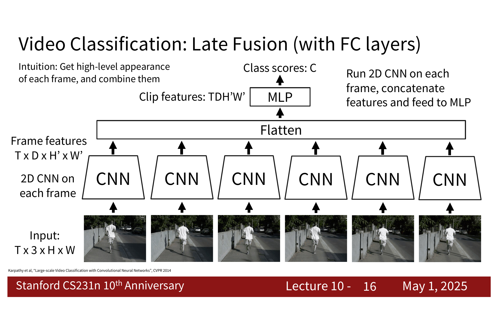

#### Late Fusion with FC layers的缺点
如果时间维度很大（T很大），那么特征向量就会非常大，要把这个特征向量映射到更低的维度，需要用到非常大的全连接层，这会引入大量的参数，效率并不高。

!!! warning "我的疑问"
    ### 我的疑问1
    我感觉时间维度很大也不影响全连接层的大小啊，假设每张图经过 2D CNN后输出一个 D 维的向量，那么 feature map 的维度就是 $T \times D$ ，那么 MLP 只需要将 W 设置为 $D \times C$ 不就好了吗，跟 T 没关系啊
    ### 解析
    MLP 的第一层是一个 Linear 层：$y=Wx+b$
    
    其中：
    
    $$输入 x \in R^n，输出 y \in R^m，对应的 W \in R^{m\times n}$$
    
    因此 $T \times D$ 的 feature map 需要被展平成一个超长的一维向量，即 $1 \times TD$ 的向量。若有 C 个类别，则：

    $$W \in R^{TD \times C}$$

    ### 我的疑问2
    既然这样，为什么不直接这样：不要把这个 feature map 展平，就让它为 $T \times D$ 维，然后我们让 $W$ 的维度为 $D \times C$ 维不就好了
    ### 解析：
    若是这样的话，输出的 y 将会是一个 $T \times C$ 的矩阵，而不是一个 $1\times C$ 的矩阵，相当于是给所有的帧都分类了，而不是给这个视频分类。而且哪怕是先通过这个 W 给所有的帧分好类了，后续我们想总结这个视频的类别，还是需要有一个 T 在内的 W 才能让最终的输出维度为 $1\times C$

为了应对需要超大的全连接层这个劣势，我们不再使用 Flatten，而是引入 Average Pool over space and time

### 2.2.2 Late fusion with pooling


它的操作是这样：

假设一个视频有 T 帧，那么输入视频的维度即为：

$$T \times 3\times H\times W$$

将它们逐帧输入 2D CNN 之后，得到：

$$T \times D \times H' \times W'$$

#### 第一步：空间平均

原先的每一帧都是 $D \times H' \times W'$。现在我们对 D 维中每个 $H' \times W'$ 求平均，即：**将这 $H' \times W'$ 个数加起来再除以 $H' \times W'$**，于是维度会产生如下变化：

$$D \times H'\times W' \rightarrow D$$

### 第二步：时间平均

第一步空间平均将每一帧中的 $D \times H'\times W'$ 降维为 $D$，因此现在的维度为：

$$T \times D$$

时间平均便是把所有帧按照时间求平均：

$$\frac{1}{T}\sum^T_{t=1}x_t$$

维度变换为：

$$T \times D \rightarrow D$$

所以，最终我们将一个 $T \times D \times H' \times W'$ 的维度降维为 $D$ ，便不再需要超大的全连接层。

#### Late fusion with pooling 的缺点

1. 把所有帧的信息压缩了，会失去比较帧与帧之间运动变化的能力。
2. 我们做卷积池化操作的时候，前期基本都只是包含一些低层次的信息，比如运动信息等等。只有到了后期才能够包含更多的高层次信息，比如语义信息。因此 Late fusion 很可能会将这些高层次的信息给弄没掉。


!!! example "举一个例子"
    比如一个人在跑步：
    
	第1帧：
	
	```
	人腿在后面
	```
	
	第2帧：
	
	```
	腿往前移动
	```
	
	第3帧：
	
	```
	腿继续往前
	```
	
	这些连续变化就是motion：
	
	$$frame_1 \rightarrow frame_2 \rightarrow frame_3$$
	
    但是我们取了平均之后，便不再知道这个过程究竟是 $f1 → f2 → f3$ 还是 $f3 → f2 → f1$


## 2.3 Early Fusion

为了应对 Late fusion with pooling 的第二个缺点，我们使用 early fusion，即早期融合。

### 具体做法

若输入视频的维度为：

$$T \times 3 \times H \times W$$

那么我们直接将其**按照帧的顺序排列起来**，reshape 为 3 维：

$$
(3T)\times H\times W
$$

reshape 之后将其作为 2D CNN 的输入，并输出一个 feature map，第一层 2D convolution 的 filter 会横跨所有时间帧：

$$
W\in\mathbb{R}^{C_{\text{out}}\times 3T\times K\times K}
$$

 将 feature map Flatten/Pooling 之后，输入到 Fully Connected Layer中

将全连接层的输出再输入到 softmax 中得出类别概率。

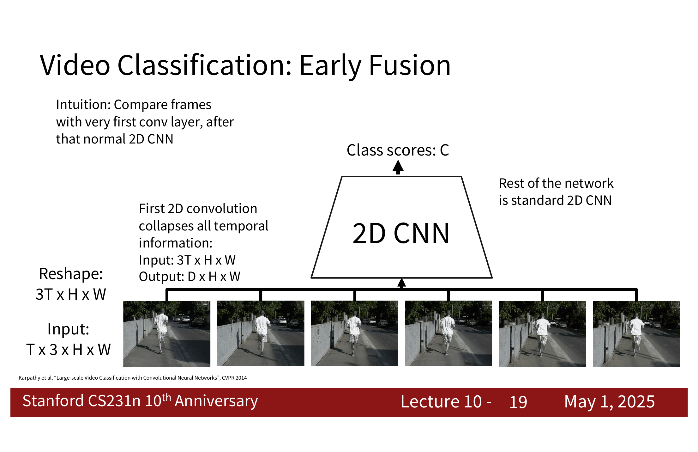


### Early fusion的缺点

尽管我们尝试了早期融合，但是把所有帧都拼接起来，然后在单个卷积网络里把所有的时序信息都压缩进去。这样还是会导致信息的丢失。

为了解决这个问题，我们引入 3D CNN

## 2.4 3D CNN

 2D convolution 的卷积核只能在空间上滑动（在 $x,\ y$ 上滑动），而 3D convolution的卷积核能同时沿时间和空间滑动（在 $x,\ y, \ t$ 上滑动）。

对于每一层 CNN，输入 feature map：

$$C_{\text{in}}\times T\times H\times W$$

!!! warning "注意"
    第一层 CNN 的输入为:
    
    $$C_{in}\times T \times H \times W$$ 
    我们需要将其转换为：

    $$T \times C_{in} \times H \times W$$

3D convolution kernel（卷积核）：

$$
C_{\text{out}}\times C_{\text{in}}\times K_T\times K_H\times K_W
$$

!!! warning "注意"
    注意，这里的卷积核是 5 维的，$K_T$ 跟 $C_{in}$ 不是同一个维度！！！因此需要在4维空间上来思考这个东西

输出仍然保留时间维度：

$$
C_{\text{out}}\times T'\times H'\times W'
$$

通过了 3D CNN 之后，将输出的 feature map 输入到 FC Layer 中

将 FC Layer 中的输出再输入到 softmax 中，输出最终的 Class Scores


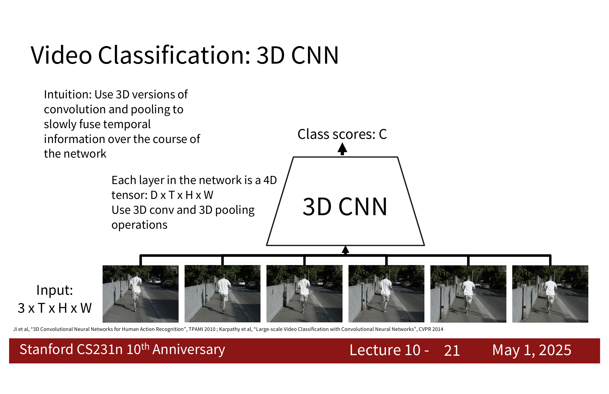

---

# 3. Early Fusion、Late Fusion 和 3D CNN 的对比

主要是对比三者的感受野
## 3.1 Late Fusion

以下面这个例子来分析一下感受野的变化过程：


Late Fusion 的 temporal receptive field 在前面的 2D CNN 中基本不增长。

#### 第一步：第一层 Conv2D

$$\begin{align*} &\because C_{in}=3, \ C_{out}=12
\\& \therefore 卷积核整体： W \in R^{12\times 3\times3\times3}
\\ &\because 感受野不统计\ channel 
\\ & \therefore 经过第一层\ ConV2D\ 后，感受野为\ 1\times3\times 3 
\end{align*}$$

注意：这里的 $1\times 3\times 3$ 中的 $1$ 代表的是**时间维度**而不是 $C_{in}\ 和\ C_{out}$。

#### 第二步：Pool2D

注意：这里的 pooling 就是正常的池化，而不是 2.2.2 中那个 average pool over space and time.

$$\begin{align*}
&\because 空间尺寸由\ 64\times64\ 变为\ 16\times 16
\\ &\therefore Pooling\ kernel\ 的空间尺寸为\ 4\times4
\\ & 相当于是把 \ 64\times 64 \ 中的每个\ 4\times4\ 都变成 \ 1
\\ &\because 这一层输入的\ feature\ map\ 中的每一个点都是原图中的\ 3\times3\ 转化来的
\\ &又 \because 这一层的\ 4\times4\ 又被合并成\ 1\ 了
\\ &\therefore 空间感受野的\ H\ 和\ W\ 都变为：3+(4-1)=6
\\ &\therefore 感受野由\ 1\times3\times3\ 变为\ 1\times6\times6
\end{align*}
$$

感受野此刻依然只在空间维度上有变化吗，在时间维度上还是没有变化。

#### 第三步：第二层 ConV2D


$$\begin{align*} &\because C_{in}=12, \ C_{out}=24
\\& \therefore 卷积核整体： W \in R^{24\times 12\times3\times3}
\\ &\because 刚刚经过了\ Pool(4\times4,\ stride=4)
\\ &\therefore Pool\ 之后输出的\ feature\ map\ 中，
\\&\ \ \ \ \ 点与点之间的间隔对应原图间隔\ junp=4
\\ &\therefore RF_{new}=6+(3-1)\times4=14
\\ &\therefore 感受野从\ 1\times6\times6\ 转变为\ 1\times14\times14
\end{align*}$$

#### 第四步：Pool over time and space

经过第二层 ConV 之后，feature map 的维度变为 $24\times 20\times 16\times 16$

Global Average Pool 会平均：

- 时间：$20$
- 空间：$16\times16$

最后输出的 feature map 维度为 $24\times 1\times 1\times1$

因此感受野变为 $20\times64\times64$

## 3.2 Early Fusion


Early Fusion 首先将输入的 $T\times3\times H \times W$ reshape 为 $3T\times H \times W$。故第一层 Conv2D 的卷积核在 channel 维度上同时覆盖所有时间帧对应的 RGB channel，因此**时间维度的感受野变为 $T$**。空间维度则是跟 Late Fusion 一样的推导方法。

## 3.3 3D CNN


3D CNN 同时对时间和空间维度进行卷积，因此感受野在时间维度和空间维度都是逐层扩大的。

!!! note "三种方法总结对比"
    Late Fusion：先理解每帧，再最后合并。
    
    Early Fusion：一开始就把多帧混在一起，后面按普通图像处理。
    
    3D CNN：整个网络都把视频当成时空体来处理。

---

# 4. C3D

C3D 可以理解成3维的 VGG：大量使用 $3\times3\times3$ convolution 和 pooling。

输入通常是一个短 clip：

$$
3\times16\times112\times112
$$

网络逐步降低空间和时间尺寸，并提高 channel 数。

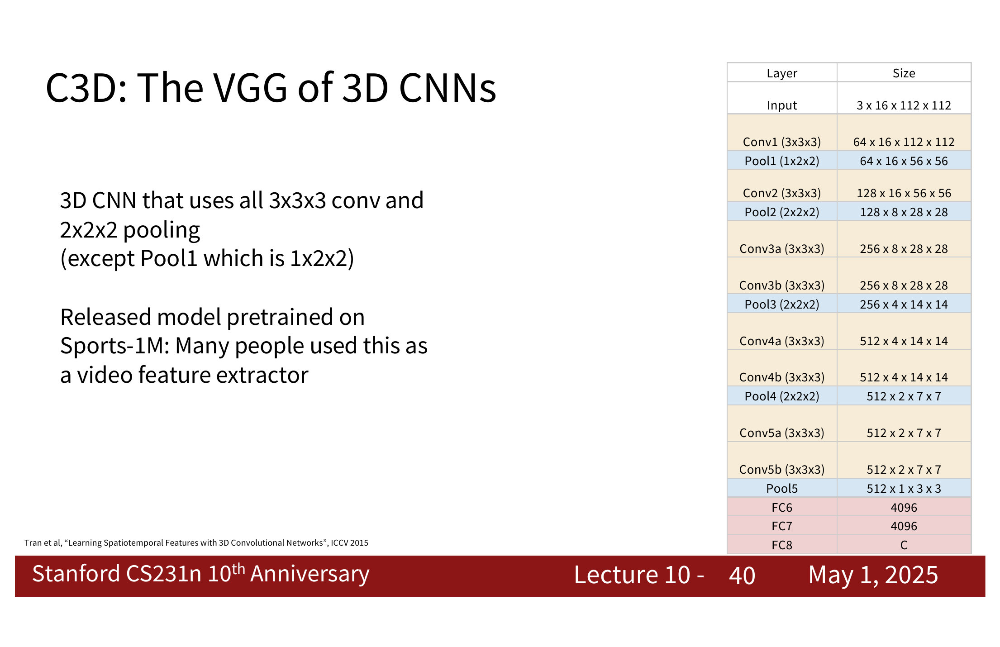

!!! note "C3D 的意义"
    C3D 不是最复杂的模型，但它说明了一个很重要的方向：
    
    如果我们把图像 CNN 中“局部卷积 + 层级特征”的思想扩展到时间维度，就可以学到视频动作中的时空模式。

---

# 5. Motion Information 和 Optical Flow

有些动作即使只看 motion 也能识别出来。人类看到几个运动光点，也能判断人在走路、跑步或做其他动作（像火柴人那样）。

所以视频理解里 appearance 和 motion 都重要。

## 5.1 Optical Flow

Optical Flow 描述相邻两帧之间每个像素的位移。

给定第 $t$ 帧图像 $I_t$ 和第 $t+1$ 帧图像 $I_{t+1}$，optical flow 会计算这一帧中的每一个像素在下一帧中移动到了哪里：

$$
F(x,y)=(dx,dy)
$$

表示第 $t$ 帧中位置 $(x,y)$ 的像素，在下一帧大约移动到：

$$
(x+dx,y+dy)
$$

即：

$$
I_{t+1}(x+dx,y+dy)\approx I_t(x,y)
$$

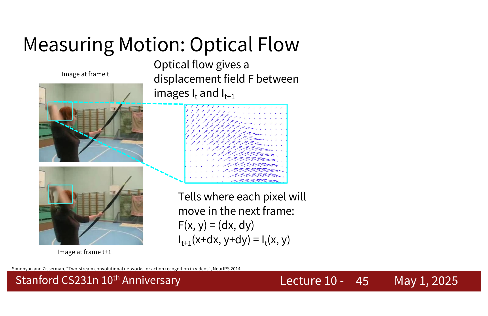

Optical flow 会突出局部运动。例如水平 flow $dx$ 表示像素在水平方向上的移动，垂直 flow $dy$ 表示像素在竖直方向上的移动。

!!! warning "Optical Flow 不是 RGB 图像"
    RGB 图像告诉模型每个位置长什么样。
    
    Optical flow 告诉模型每个位置怎么动。
    
    因此 optical flow 更直接地表达 motion，但通常需要额外计算或估计。

## 5.2 Two-Stream Networks

Two-Stream Network 把 appearance 和 motion 分开处理。

1. **Spatial stream**：输入单张 RGB 图像。
2. **Temporal stream**：输入一叠 optical flow。

然后融合两个 stream 的预测结果。

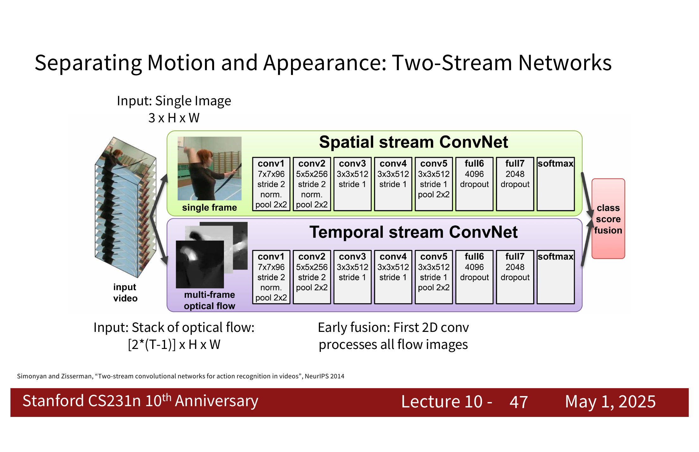

如果使用 $T$ 帧，那么相邻帧之间有 $T-1$ 个 flow，每个 flow 有两个 channel：

$$
(dx,dy)
$$

所以 temporal stream 的输入 channel 数是：

$$
2(T-1)
$$


---

# 6. 长时间结构：CNN + RNN

前面的 3D CNN 和 Two-Stream 主要处理短 clip，大约只有几秒。

但是很多视频任务需要长时间结构，此时我们需要引入 CNN+RNN（通常用 LSTM）。

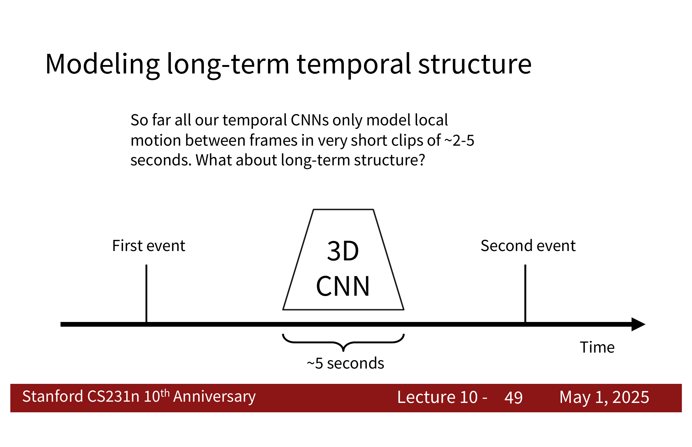

## 6.1 CNN 提取局部特征，RNN 建模全局时间

步骤：

1. 用 2D CNN 或 3D CNN 从每个 clip 提取 feature。
2. 把这些 feature 按时间顺序送入 RNN / LSTM。
3. 最后输出整段视频类别，或者每一帧的预测。

对于整段视频分类，是 many-to-one：

$$
f_1,f_2,\dots,f_T
\rightarrow
y
$$

对于逐帧标注，是 many-to-many：

$$
f_1,f_2,\dots,f_T
\rightarrow
y_1,y_2,\dots,y_T
$$

!!! note "为什么有时不反传到 CNN"
    长视频序列很占显存。
    
    实践中有时会先预训练 CNN，把它当作 feature extractor，只训练后面的 RNN。这样可以减少 backprop 需要保存的中间激活。

## 6.2 Recurrent Convolutional Network

CNN 只能在固定时间窗口内建模局部时序结构，而 RNN 可以把之前所有时间步的信息压进 hidden state。

问题是：能不能把 CNN 和 RNN 合到一起？

Recurrent Convolutional Network 的想法是：每一层仍然保持 2D feature map：

$$
C\times H\times W
$$

但当前时间步的 feature 同时依赖：

1. 同一层的上一时间步。
2. 前一层的当前时间步。

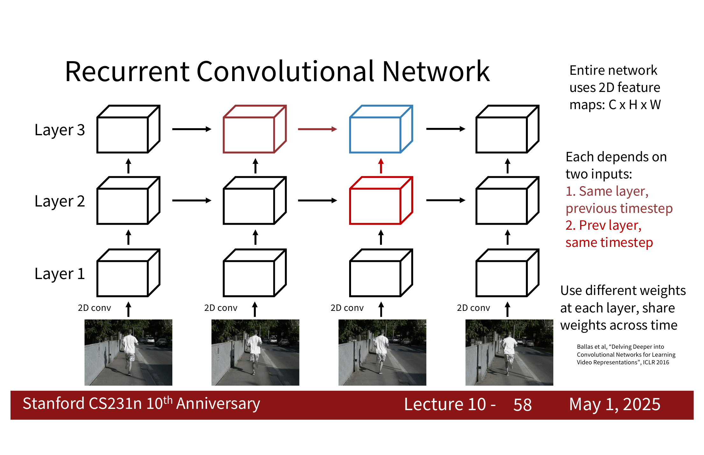

普通 RNN 是：

$$
h_t=\tanh(W_hh_{t-1}+W_xx_t)
$$

Recurrent CNN 把矩阵乘法替换成 2D convolution：

$$
H_t^L
=
\tanh
\left(
W_h^L * H_{t-1}^L
+
W_x^L * H_t^{L-1}
\right)
$$

其中 $*$ 表示卷积。

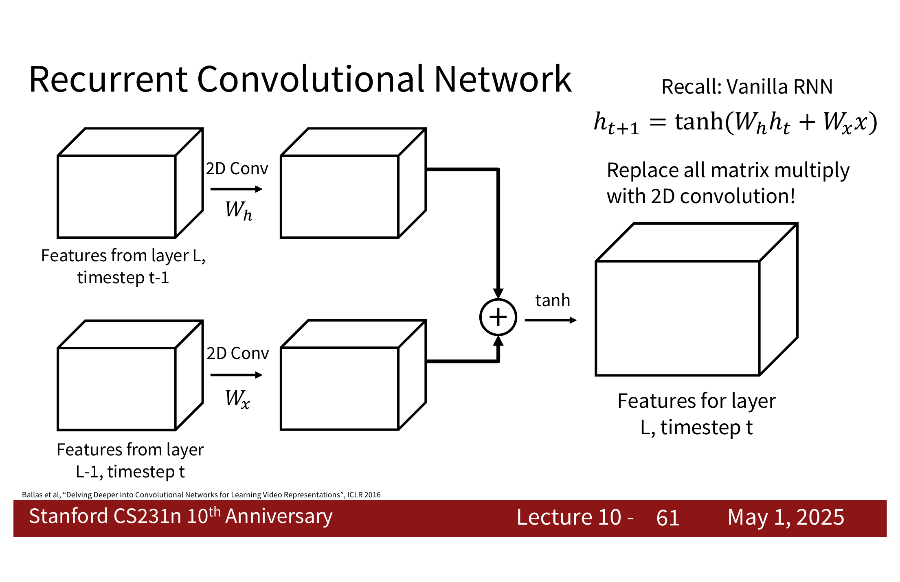

!!! explanation "为什么要用卷积代替矩阵乘法"
    如果直接把每一帧的 feature map flatten 成向量再做 RNN，会丢掉二维空间结构。
    
    用 convolution 处理 hidden state，可以让模型保留空间布局，同时沿时间递归传递信息。

## 6.3 RNN 的缺点

在 Lecture 7 中就已经学过，RNN 在处理长序列的时候速度非常慢。而视频通常是非常长的，需要做并行化处理，但是 RNN 很难并行化。

因为：

$$
h_t
\text{ 依赖 }
h_{t-1}
$$

所以必须按时间顺序一步步算。

这就引出了下一种方法：用 self-attention 建模长距离时空关系。

---

# 7. Spatio-Temporal Self-Attention：Nonlocal Block

Lecture 8 已经讲过 self-attention：每个 query 可以从所有 key/value 中取信息。

对于视频 feature：

$$
X\in\mathbb{R}^{C\times T\times H\times W}
$$

我们可以把每一个时空位置 $(t,h,w)$ 看成一个 token。因此 token 数量是：

$$
N=THW
$$

Nonlocal Block 就是在视频特征上做 spatio-temporal self-attention。

## 7.1 Nonlocal Block 的计算

先用 $1\times1\times1$ convolution 生成 queries、keys、values：

$$
Q,K,V\in\mathbb{R}^{C'\times T\times H\times W}
$$

然后把时空维度展平：

$$
Q,K,V\in\mathbb{R}^{(THW)\times C'}
$$

计算 attention weights：

$$
A
=
\operatorname{softmax}
\left(
QK^T
\right)
$$

其中：

$$
A\in\mathbb{R}^{(THW)\times(THW)}
$$

再对 value 加权求和：

$$
Y=AV
$$

最后用一个投影把 channel 变回 $C$，再加 residual connection：

$$
Z=X+\operatorname{Proj}(Y)
$$

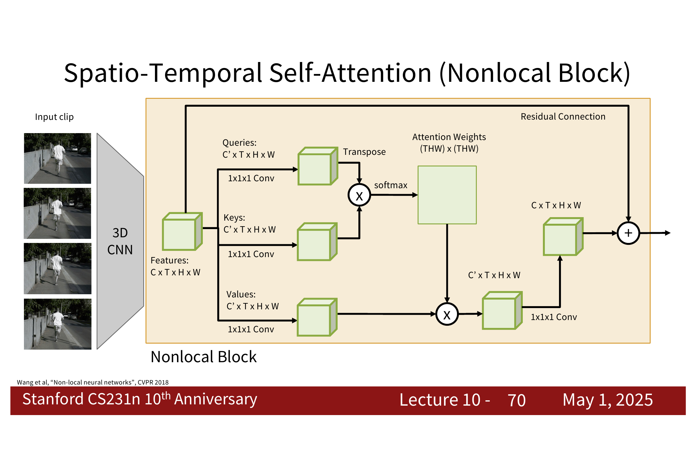

!!! warning "Nonlocal Block 的代价"
    如果 token 数是：
    
    $$
    N=THW
    $$
    
    那么 attention matrix 是：
    
    $$
    N\times N
    $$
    
    所以视频上的 full spatio-temporal attention 会非常贵。
    
    这也是后来很多 video transformer 要做 factorized attention、pooling 或 masked autoencoding 的原因。

!!! explanation "Nonlocal 这个名字是什么意思"
    普通卷积只看局部邻域，例如 $3\times3\times3$。
    
    Nonlocal Block 让一个时空位置可以直接关注所有其他时空位置，因此它不是 local operation。

---

# 8. I3D：把 2D 图像网络 Inflating 到 3D

图像领域已经有很多成熟架构，例如 Inception、ResNet。

问题是：能不能复用这些 2D CNN 架构来做视频？

I3D 的想法是：把 2D CNN inflate 成 3D CNN。

具体来说，把每一个 2D convolution / pooling：

$$
K_H\times K_W
$$

替换成 3D 版本：

$$
K_T\times K_H\times K_W
$$

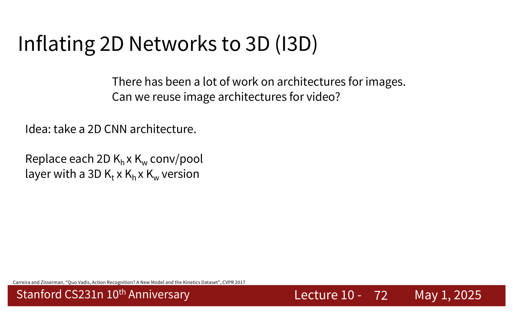

例如 2D Inception block 可以扩展成 3D Inception block，让每个分支都处理时空信息。

## 8.1 2D 权重如何变成 3D 权重

如果原来的 2D conv kernel 是：

$$
W_{\text{2D}}\in\mathbb{R}^{C_{\text{out}}\times C_{\text{in}}\times K\times K}
$$

inflate 后的 3D kernel 是：

$$
W_{\text{3D}}\in\mathbb{R}^{C_{\text{out}}\times C_{\text{in}}\times K_T\times K\times K}
$$

一种做法是：把 2D kernel 沿时间维复制 $K_T$ 次，并除以 $K_T$，使输出尺度大致不变。

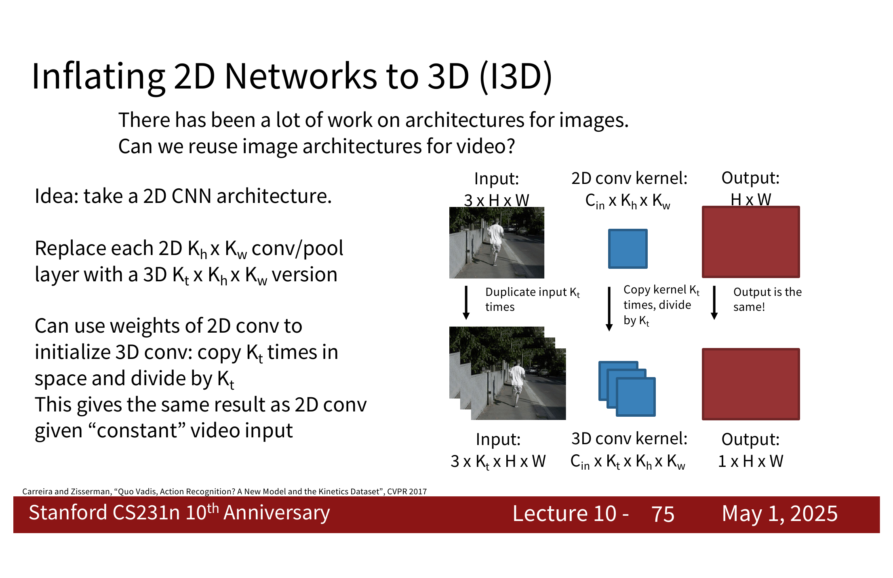

---

# 9. Vision Transformers for Video

随着 Transformer 在图像上成功，视频也可以被拆成一组 spatio-temporal tokens，然后用 Transformer 处理。

但是视频 token 数量很大。假设把每帧切成 $N_s$ 个 spatial patches，一共有 $T$ 帧，那么 token 数是：

$$
N=T N_s
$$

标准 self-attention 的代价是：

$$
O(N^2)
=
O(T^2N_s^2)
$$

这很容易变得非常贵。

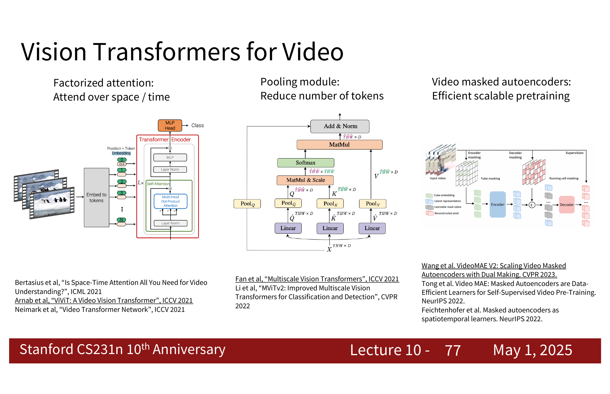

因此视频 Transformer 常见改动包括：

1. **Factorized attention**：把空间 attention 和时间 attention 分开做。
2. **Pooling module**：逐步减少 token 数量。
3. **Video masked autoencoders**：通过 masked reconstruction 做高效预训练。

## 9.1 Factorized Attention

Full spatio-temporal attention 是让每个 token 看所有时空 token。

Factorized attention 可以拆成：

1. 先在每一帧内部做 spatial attention。
2. 再沿时间对同一空间位置或聚合后的 token 做 temporal attention。

这样可以降低计算量，也更贴近视频的结构。

!!! explanation "为什么视频 Transformer 要特别处理 token 数"
    图像 ViT 的 token 数已经不小。
    
    视频相当于多了一个 $T$ 倍，如果直接做 full attention，attention matrix 会从：
    
    $$
    N_s\times N_s
    $$
    
    变成：
    
    $$
    (TN_s)\times(TN_s)
    $$
    
    因此计算和显存都会随 $T^2$ 增长。

---

# 10. 从短 clip 到长视频任务

到目前为止，很多方法都是在短 clip 上做分类。

但是真实视频往往很长，而且动作只发生在其中一段时间。

## 10.1 Temporal Action Localization

Temporal Action Localization 的任务是：

> 给定一段未裁剪的长视频，找出不同动作发生的时间区间。

例如：

```text
running: frame 10 -> frame 80
jumping: frame 90 -> frame 120
```

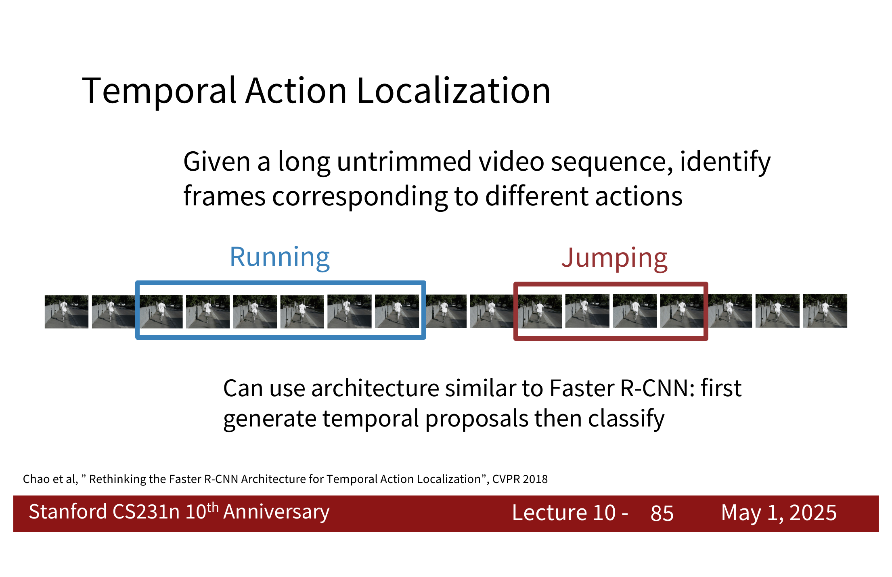

它有点像一维时间轴上的 detection。

可以借鉴 Faster R-CNN 的思想：

1. 先生成 temporal proposals。
2. 再对每个 proposal 分类和回归边界。

## 10.2 Spatio-Temporal Detection

Spatio-Temporal Detection 更进一步：不仅要知道动作发生在哪段时间，还要知道人在每一帧中的空间位置。

也就是同时检测：

1. 时间范围。
2. 空间 bounding box。
3. 动作类别。

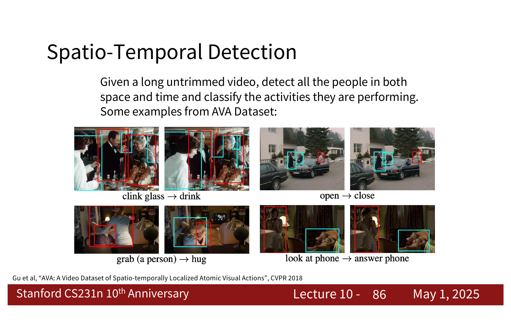

!!! explanation "Temporal Localization 和 Spatio-Temporal Detection 的区别"
    Temporal Localization 只在时间轴上画区间。
    
    Spatio-Temporal Detection 要在每一帧里画框，并且这些框沿时间形成 tube。
    
    所以前者更像 1D detection，后者更像 video version 的 object detection。
