# 前言：多 GPU 训练到底在切什么

一个 Transformer 模型可以粗略看成：

1. 有 $L$ 层。
2. 每一层都在处理形状为 $(\text{Batch}, \text{Sequence}, \text{Dim})$ 的 tensor。

这里三个维度分别表示：

1. **Batch**：一次训练同时喂给模型的样本数量。
2. **Sequence**：每个样本里的 token 数量，也就是序列长度。
3. **Dim**：每个 token 的向量维度，也叫 hidden dimension 或 embedding dimension。

例如：

$$
(\text{Batch}, \text{Sequence}, \text{Dim})
=
(32,1024,4096)
$$

表示一次处理 32 条样本，每条样本有 1024 个 token，每个 token 用一个 4096 维向量表示。

因此，如果一个模型大到单张 GPU 放不下，或者训练太慢，我们可以沿着不同维度把它拆开：

1. **Data Parallelism (DP)**：沿着 Batch 维度切。
2. **Context Parallelism (CP)**：沿着 Sequence 维度切。
3. **Pipeline Parallelism (PP)**：沿着 Layer 维度切。
4. **Tensor Parallelism (TP)**：沿着 Dim 维度切。

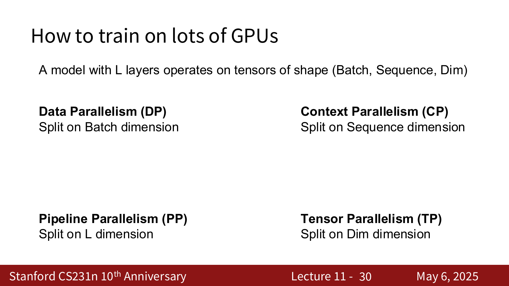

---

# 1. Data Parallelism (DP)

Data Parallelism：**沿着 Batch 维度切。**

DP 就是把一个大 batch 拆给多张 GPU。每张 GPU 都有一份模型副本，但是每张 GPU 看到的数据不同。

## 1.1 普通 Data Parallelism

假设有 $M$ 张 GPU，每张 GPU 处理 $N$ 个样本，那么总 batch size 是：

$$
MN
$$

总 loss 是所有样本 loss 的平均：

$$
L
=
\frac{1}{MN}
\sum_{i=1}^{M}
\sum_{j=1}^{N}
\ell(x_{i,j}, W)
$$

由于求导是线性的，所以：

$$
\frac{\partial L}{\partial W}
=
\frac{1}{M}
\sum_{i=1}^{M}
\left(
\frac{1}{N}
\sum_{j=1}^{N}
\frac{\partial}{\partial W}
\ell(x_{i,j}, W)
\right)
$$

也就是说，每张 GPU 可以先在自己的 $N$ 个样本上算梯度，然后所有 GPU 对梯度求平均。

普通 DP 的流程：

1. 每张 GPU 保存完整 model + optimizer
2. 每张 GPU 读取自己的 mini-batch
3. 每张 GPU forward 得到自己的 loss
4. 每张 GPU backward 得到自己的 gradient
5. 所有 GPU 平均 gradient
6. 每张 GPU 更新自己的 weights

!!! note "为什么 DP 容易并行"
    每个样本的 loss 彼此独立。只要最后对梯度求平均，就等价于在一个大 batch 上训练。
    
    所以 DP 本质上是在扩大 batch size。

## 1.2 普通 DP 的问题

普通 DP 的瓶颈是：**每张 GPU 都要存完整模型和完整 optimizer state。**

如果使用 Adam，一个参数通常不只对应一个数字，而是至少有：

1. 参数本身 $W$。
2. 梯度 $\nabla W$。
3. Adam 的一阶动量 $\beta_1$。
4. Adam 的二阶动量 $\beta_2$。

如果每个数字用 2 bytes，那么 1B 参数大约需要：

$$
1B \times 4 \times 2\text{ bytes}
=
8\text{ GB}
$$

所以 10B 参数就大约是 $80\text{ GB}$，已经能把一张 H100 的显存塞满。

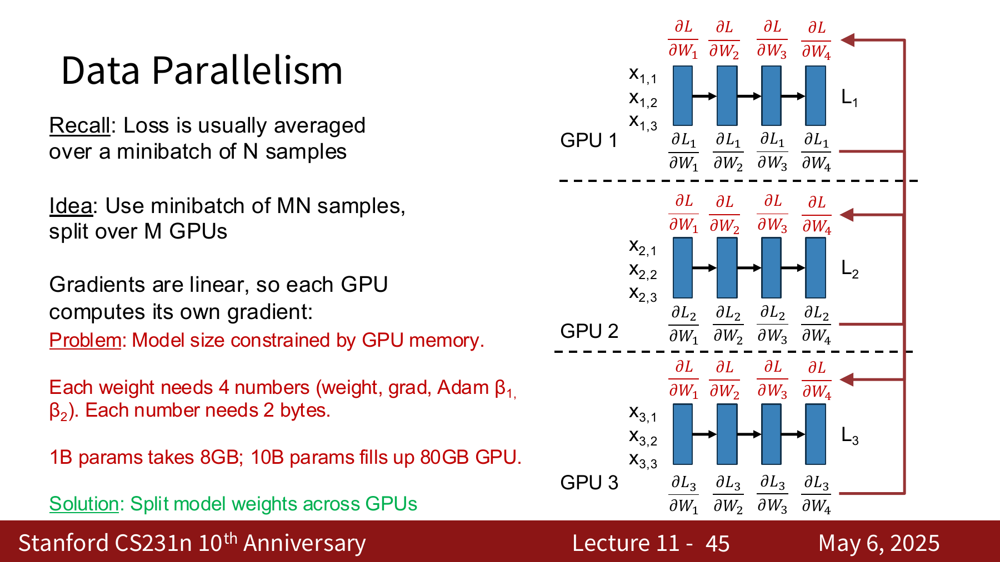

!!! warning "普通 DP 不能解决模型太大的问题"
    普通 DP 可以让训练吞吐变高，但不能让单张 GPU 放下更大的模型。
    
    因为每张 GPU 都有完整参数副本，所以模型大小仍然受单张 GPU 显存限制。

## 1.3 Fully Sharded Data Parallelism

Fully Sharded Data Parallelism（FSDP）的想法是：**仍然沿 batch 做数据并行，但不再让每张 GPU 保存完整模型。**

它把模型参数、梯度和 optimizer states 分片放到不同 GPU 上。

假设模型参数分成：

$$
W_1, W_2, \dots, W_L
$$

在 FSDP 中，每个 $W_i$ 只由某一张 GPU 拥有，这张 GPU 同时保存它的参数、梯度和 optimizer states。

Forward 时：

1. 在第 $i$ 层 forward 之前，拥有 $W_i$ 的 GPU 把 $W_i$ broadcast 给所有 GPU。
2. 所有 GPU 用 $W_i$ 在自己的 batch 上计算第 $i$ 层 forward。
3. forward 结束后，非 owner GPU 删除本地临时的 $W_i$。

Backward 时：

1. 在第 $i$ 层 backward 前，owner GPU 再把 $W_i$ broadcast 给所有 GPU。
2. 所有 GPU 根据自己的数据计算局部梯度 $\frac{\partial L_k}{\partial W_i}$。
3. 所有 GPU 把局部梯度发回 owner GPU。
4. owner GPU 对这些梯度求和或平均，并更新 $W_i$。
5. 非 owner GPU 删除临时参数和临时梯度。

所以 FSDP 的本质是：

1. 需要某层参数时临时拿来用
2. 用完就删
3. 真正长期保存的只有自己负责的 shard

!!! explanation "为什么可以边算边传"
    当 GPU 正在用 $W_i$ 做 forward 时，可以提前 fetch 下一层的 $W_{i+1}$。
    
    这样通信和计算可以重叠，减少 GPU 等待时间。

## 1.4 FSDP 的好处

假设一个模型有 100B 参数，Adam 下每个参数需要 4 个数字，每个数字 2 bytes：

$$
100B \times 4 \times 2\text{ bytes}
=
800\text{ GB}
$$

如果把它切到 80 张 GPU 上，那么每张 GPU 只需要保存大约：

$$
\frac{800\text{ GB}}{80}
=
10\text{ GB}
$$

这就让原本单卡完全放不下的模型变得可以训练。

!!! note "FSDP 解决的是参数显存"
    FSDP 主要解决 model weights、gradients 和 optimizer states 的显存问题。
    
    但是训练时还有另一个大头：activation memory。

## 1.5 Hybrid Sharded Data Parallel

Hybrid Sharded Data Parallel（HSDP）是在 FSDP 外面再套一层 DP。

假设总共有：

$$
N=M\times K
$$

张 GPU，可以把它们分成 $M$ 组，每组 $K$ 张 GPU：

1. 每一组内部做 FSDP，把模型参数切到 $K$ 张 GPU 上。
2. 不同组之间做 DP，处理不同 batch 的数据。

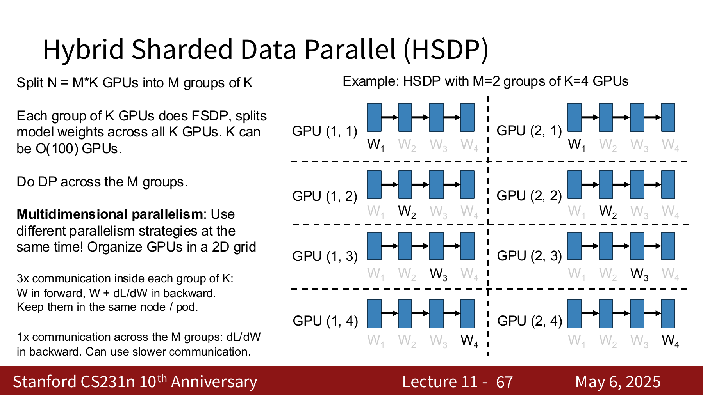

这样做的好处是可以配合硬件拓扑：

1. 组内 FSDP 通信多，最好放在同一个 node 或 pod 里，用更快的互联。
2. 组间 DP 主要同步梯度，通信相对少，可以放在更慢的跨 node 网络上。

!!! explanation "为什么 HSDP 是二维并行"
    普通 DP 只有 batch 这个维度。
    
    HSDP 同时用了两个维度：组内沿参数切，组间沿 batch 切。所以它已经是 multi-dimensional parallelism 的一个简单例子。

## 1.6 Activation Checkpointing

就算参数被 FSDP 切开了，activation 仍然可能占满显存。

以 Llama3-405B 为例，它有 126 层，hidden dimension 为：

$$
D=16384
$$

sequence length 为：

$$
S=4096
$$

只看 FFN hidden activations，就需要大约：

$$
2 \times 126 \times (4 \times 16384) \times 4096\text{ bytes}
=
63\text{ GB}
$$

这还没算其他 activation。

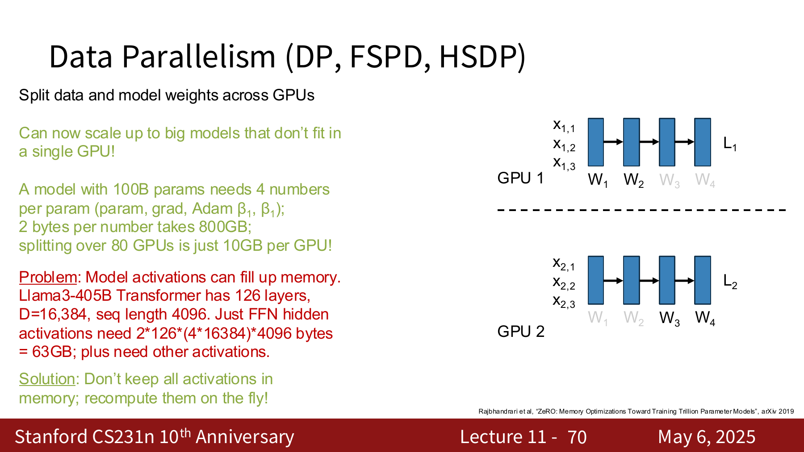

每一层可以看成两个函数：

Forward：

$$
A_{i+1}=F_i^{\rightarrow}(A_i)
$$

Backward：

$$
G_i=F_i^{\leftarrow}(A_i, G_{i+1})
$$

算 backward 时通常需要 forward 过程中的 activation。如果 forward 时把所有 activation 都存下来：

$$
\text{compute}=O(N),
\qquad
\text{memory}=O(N)
$$

最极端的省显存做法是 full recomputation：forward 时不存 activation，backward 需要某层 activation 时，就从头重新算到那一层。

这样显存可以降到：

$$
O(1)
$$

但是计算量会变成：

$$
O(N^2)
$$

Activation Checkpointing 的折中办法是：**不要存所有 activation，只每隔一段存一个 checkpoint。**

假设保存 $C$ 个 checkpoint，那么：

$$
\text{compute}=O\left(\frac{N^2}{C}\right),
\qquad
\text{memory}=O(C)
$$

如果取：

$$
C=\sqrt{N}
$$

则：

$$
\text{compute}=O(N\sqrt{N}),
\qquad
\text{memory}=O(\sqrt{N})
$$

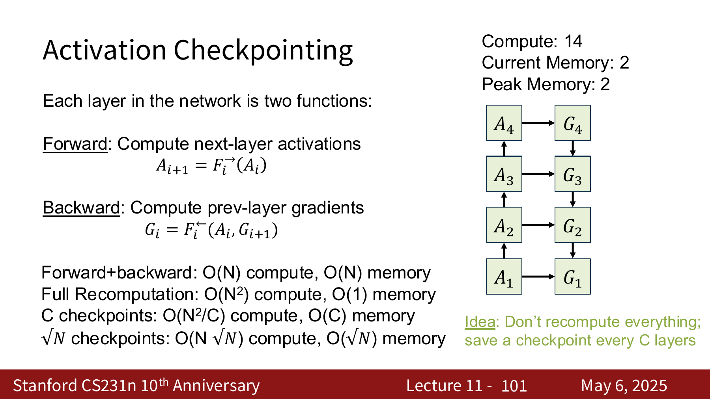

!!! note "Activation Checkpointing 的本质"
    它是在用额外计算换显存。
    
    forward 时少存一些 activation，backward 时再把需要的中间结果重新算出来。

## 1.7 MFU

HSDP 加上 activation checkpointing 已经可以走很远，但真实系统里还有很多旋钮：

1. 每张 GPU batch size 设多大。
2. FSDP 切几张 GPU。
3. HSDP 分几组。
4. 是否加 CP、PP、TP。
5. activation checkpoint 间隔设多大。

所以我们需要一个指标来衡量训练配置好不好，这就是 **Model FLOPs Utilization (MFU)**。

MFU 问的是：**GPU 理论峰值算力中，有多少比例真的用在模型的有用计算上？**

计算步骤：

1. 估计一次 forward + backward 的理论模型 FLOPs，记为 $\text{FLOP}_{\text{theoretical}}$。
2. 查硬件理论峰值吞吐，记为 $\text{FLOP/sec}_{\text{theoretical}}$。
3. 得到理想情况下需要的时间：

$$
t_{\text{theoretical}}
=
\frac{
\text{FLOP}_{\text{theoretical}}
}{
\text{FLOP/sec}_{\text{theoretical}}
}
$$

4. 实测一次完整 iteration 的时间：

$$
t_{\text{actual}}
$$

5. 计算：

$$
\text{MFU}
=
\frac{
t_{\text{theoretical}}
}{
t_{\text{actual}}
}
$$

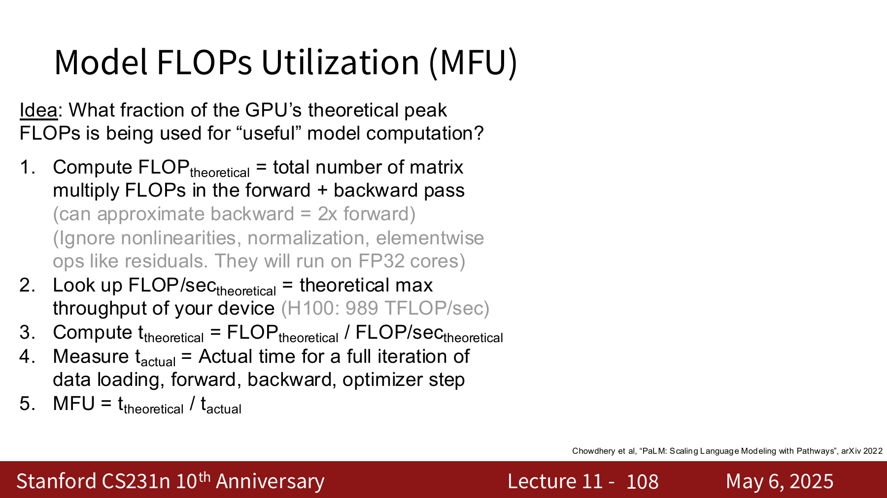

---

# 2. Context Parallelism (CP)

Context Parallelism：**沿着 Sequence 维度切。**

CP 通常用于 Transformer，尤其是长上下文训练或微调。

输入 tensor 可以写成：

$$
X\in\mathbb{R}^{B\times S\times D}
$$

如果有 $M$ 张 GPU，就把一个很长的 sequence 拆成 $M$ 段：

$$
S
\rightarrow
\frac{S}{M}
+ \frac{S}{M}
+ \cdots
+ \frac{S}{M}
$$

也就是说，多张 GPU 一起处理同一个长序列。

## 2.1 哪些部分容易并行

对 Transformer 来说：

1. **Normalization 和 residual connection**：没有参数，逐 token 操作，沿 sequence 切很自然。
2. **MLP**：每个 token 独立经过 MLP，所以计算也容易沿 sequence 切；但 MLP 有权重，因此还需要像 DP 一样同步梯度。
3. **QKV projection**：本质上也是 linear layer，可以沿 sequence 切，然后同步权重梯度。

真正麻烦的是 attention。

## 2.2 Attention 为什么难切

Self-Attention 中，每个 token 的 query 理论上都要看所有 token 的 key 和 value：

$$
\operatorname{Attention}(Q,K,V)
=
\operatorname{softmax}
\left(
\frac{QK^T}{\sqrt{D}}
\right)V
$$

如果 sequence 被切到不同 GPU 上，那么某张 GPU 上的 query 仍然需要其他 GPU 上的 key 和 value。

这就会产生大量通信。

!!! explanation "CP 的难点"
    MLP 是 token-wise 的，所以 token 之间不需要交换信息。
    
    Attention 是 token-mixing 的，所以切开 sequence 后，GPU 之间必须想办法交换跨片段的信息。

## 2.3 Ring Attention

Ring Attention 的想法是：

1. 把 query、key、value 分成 blocks。
2. 每张 GPU 保存一部分 sequence block。
3. GPU 之间以 ring 的方式传递 key/value blocks。
4. 每张 GPU 对自己的 query block 逐步累积 attention 结果。

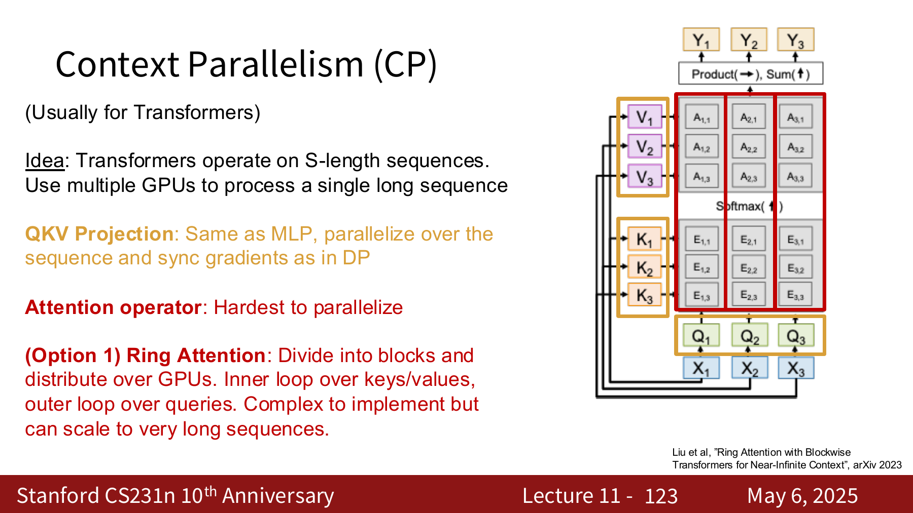

它比较复杂，但可以扩展到非常长的上下文。

## 2.4 Ulysses

Ulysses 不直接分布式保存巨大的 attention matrix，而是利用 multi-head attention，把不同 head 分到不同 GPU 上。

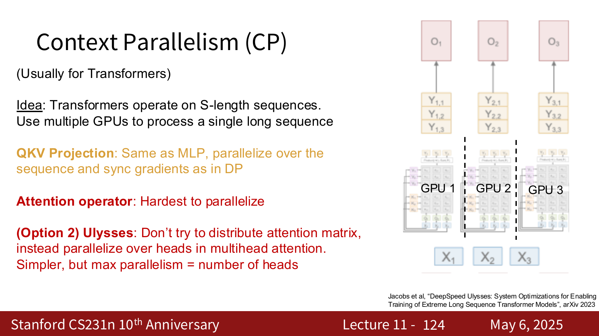

它更简单，但是最大并行度会受到 head 数量限制：

$$
\text{parallelism} \leq \text{number of heads}
$$

## 2.5 Llama3-405B 的例子

Llama3-405B 训练中：

1. Stage 1：sequence length 为 $8192$，不使用 context parallelism。
2. Stage 2：sequence length 为 $131072$，使用 16-way context parallelism。

也就是每张 GPU 仍然大约处理：

$$
\frac{131072}{16}
=
8192
$$

个 token。

!!! note "CP 常用于长上下文"
    当 sequence length 很长时，单卡显存和 attention 计算都会爆炸。
    
    CP 的目标就是让一个超长上下文可以被多张 GPU 合作处理。

---

# 3. Pipeline Parallelism (PP)

Pipeline Parallelism：**沿着 Layer 维度切。**

如果模型有很多层：

$$
F_1,F_2,\dots,F_L
$$

可以把前几层放在 GPU 1，中间几层放在 GPU 2，后面几层放在 GPU 3，以此类推。

Forward 时 activation 会从前一张 GPU 传给后一张 GPU；backward 时 gradient 再反向传回来。

## 3.1 PP 的问题：pipeline bubble

PP 的问题是层之间有顺序依赖。

GPU 2 必须等 GPU 1 算完前面的层，才能开始算；GPU 3 又要等 GPU 2。于是很多 GPU 会在某些时间段空闲。

如果只跑一个 batch，$N$-way PP 的最大 MFU 只有：

$$
\frac{1}{N}
$$

比如 4-way PP，最坏就只有：

$$
\frac{1}{4}
=
25\%
$$

## 3.2 Microbatch

解决办法是把一个大 batch 切成多个 microbatch，让多个 microbatch 同时在 pipeline 里流动。

```text
microbatch 1 在 GPU 2 上计算时
microbatch 2 可以在 GPU 1 上计算
microbatch 1 继续到 GPU 3 后
microbatch 2 进入 GPU 2
```

这样可以填掉一部分 pipeline bubble。

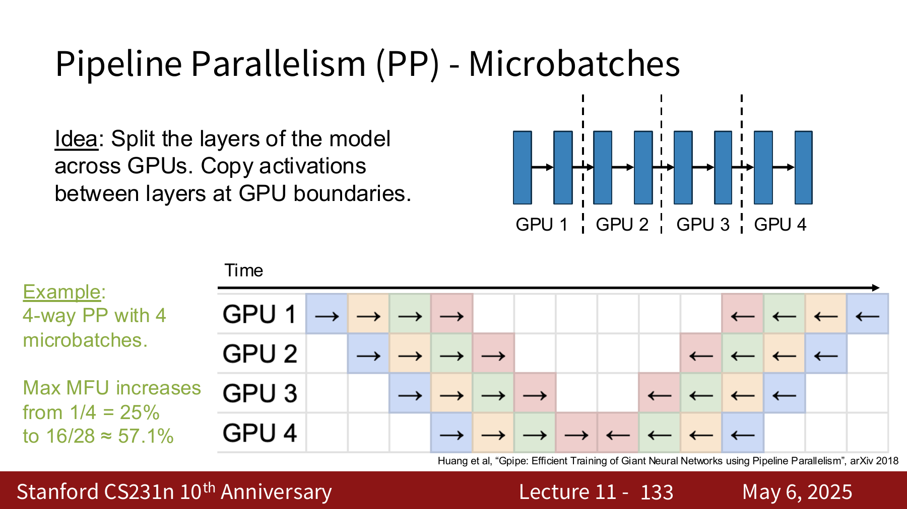

例子：

1. 4-way PP。
2. 4 个 microbatches。
3. 最大 MFU 从 $25\%$ 提升到大约 $57.1\%$。

!!! warning "PP 省显存但会引入等待"
    PP 可以让每张 GPU 只保存一部分 layers，从而放下更深的模型。
    
    但因为层之间有先后顺序，所以要用 microbatch 尽量减少 GPU 空等。

---

# 4. Tensor Parallelism (TP)

Tensor Parallelism：**沿着 Dim 维度切。**

TP 通常会把 linear layer 或 attention/MLP 里的矩阵乘法切开。

最典型的场景是：

$$
XW=Y
$$

其中：

$$
X\in\mathbb{R}^{N\times D},
\qquad
W\in\mathbb{R}^{D\times D},
\qquad
Y\in\mathbb{R}^{N\times D}
$$

## 4.1 切一个 linear layer

4-way TP 可以把 $W$ 按列切成：

$$
W=
\begin{bmatrix}
W_1 & W_2 & W_3 & W_4
\end{bmatrix}
$$

那么：

$$
Y
=
XW
=
\begin{bmatrix}
XW_1 & XW_2 & XW_3 & XW_4
\end{bmatrix}
$$

也就是第 $i$ 张 GPU 只需要计算：

$$
Y_i=XW_i
$$

这样单张 GPU 上的矩阵乘法规模变小，权重也被切开了。

## 4.2 单层 TP 的通信问题

如果下一层需要完整的 $Y$，那么所有 GPU 还要把：

$$
Y_1,Y_2,Y_3,Y_4
$$

gather 到一起。

问题是这个 gather 发生在下一层计算之前，很难和计算重叠，所以会成为瓶颈。

## 4.3 两层连续 TP 的技巧

如果有连续两层：

$$
XW=Y
$$

$$
YU=Z
$$

第一层把 $W$ 按列切：

$$
W=
\begin{bmatrix}
W_1 & W_2 & W_3 & W_4
\end{bmatrix}
$$

得到：

$$
Y=
\begin{bmatrix}
Y_1 & Y_2 & Y_3 & Y_4
\end{bmatrix}
$$

第二层把 $U$ 按行切：

$$
U=
\begin{bmatrix}
U_1 \\
U_2 \\
U_3 \\
U_4
\end{bmatrix}
$$

则：

$$
Z
=
YU
=
Y_1U_1+Y_2U_2+Y_3U_3+Y_4U_4
$$

每张 GPU 可以先计算自己的：

$$
Z_i=Y_iU_i
$$

最后只需要把这些 partial results 相加并广播：

$$
Z=Z_1+Z_2+Z_3+Z_4
$$

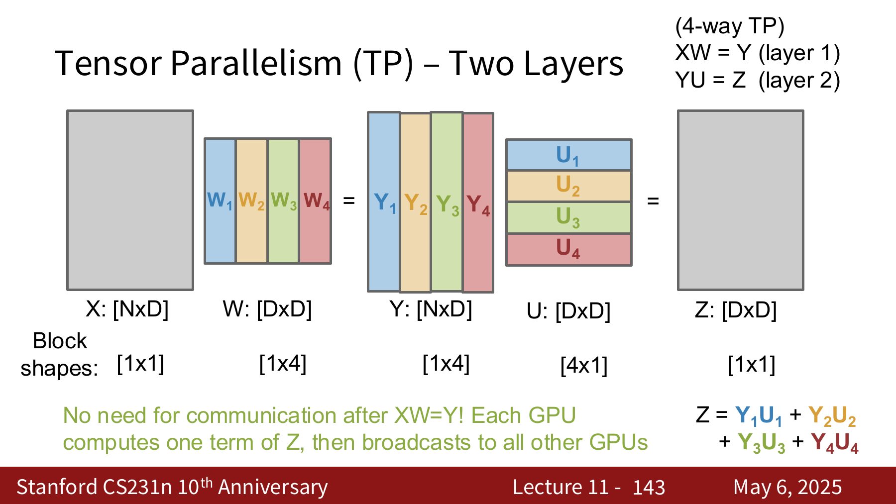

!!! explanation "为什么两层一起看更好"
    如果只看第一层，算完 $Y_i$ 后就要 gather 完整 $Y$。
    
    但如果第二层正好按另一个方向切，那么每张 GPU 可以直接拿自己的 $Y_i$ 继续算 $Y_iU_i$，中间不用马上通信。

---
# 5. Summary 

对于最大模型，通常四种都用

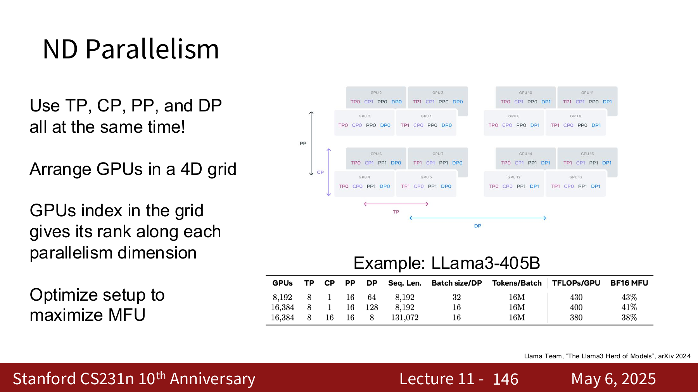

可以把 GPU 排成一个高维网格。每张 GPU 在这个网格中都有几个 rank：

1. DP rank：它属于哪个 data parallel 组。
2. CP rank：它负责 sequence 的哪一段。
3. PP rank：它负责哪些 layers。
4. TP rank：它负责 hidden dimension 的哪一片。

训练系统需要根据模型大小、sequence length、GPU 数量和网络拓扑，寻找一个让 MFU 尽可能高的配置。

因此，大规模分布式训练的核心不是某一个并行算法，而是把 batch、sequence、layers、hidden dimension 这些维度和硬件拓扑对齐，让显存够用，同时让 MFU 尽量高。
