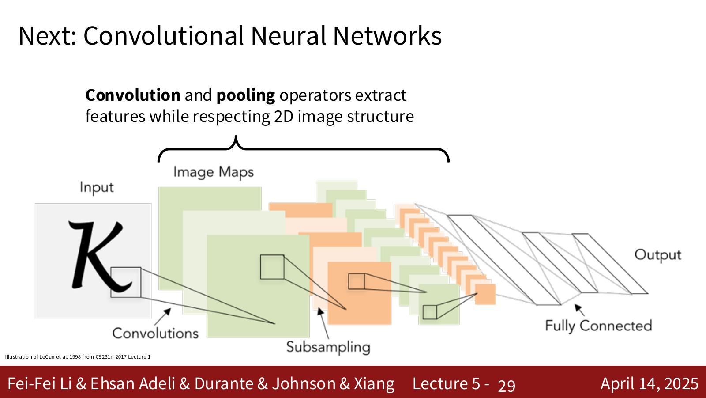
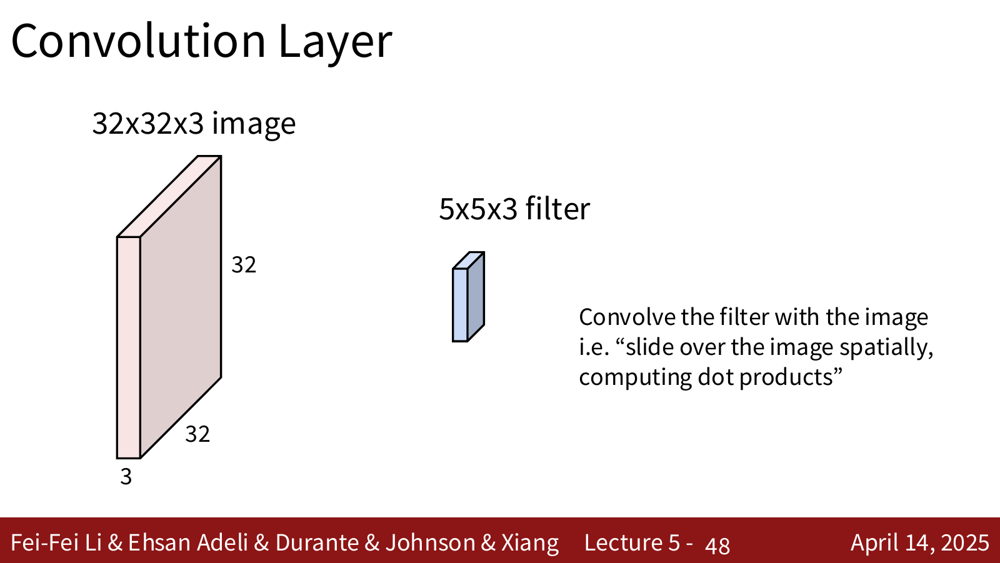
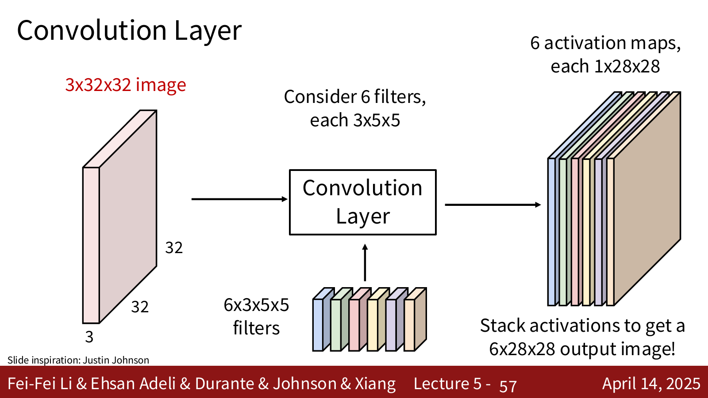
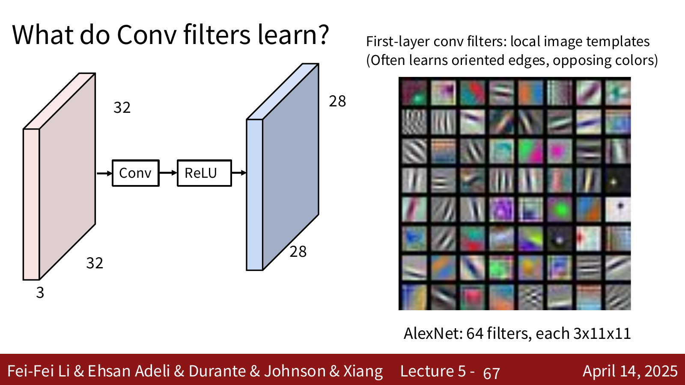
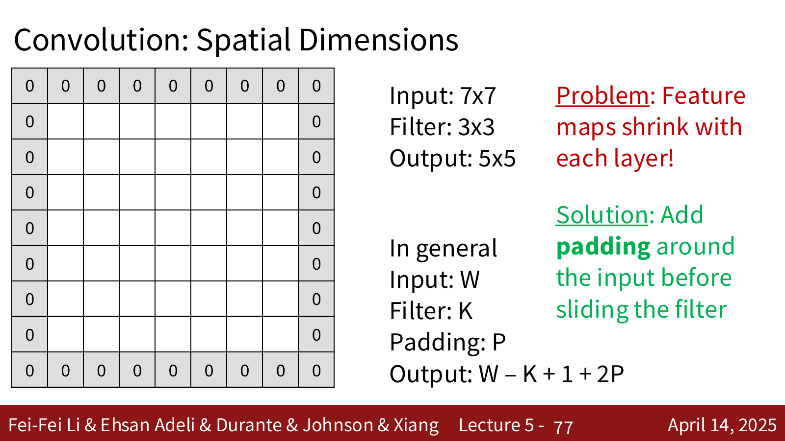
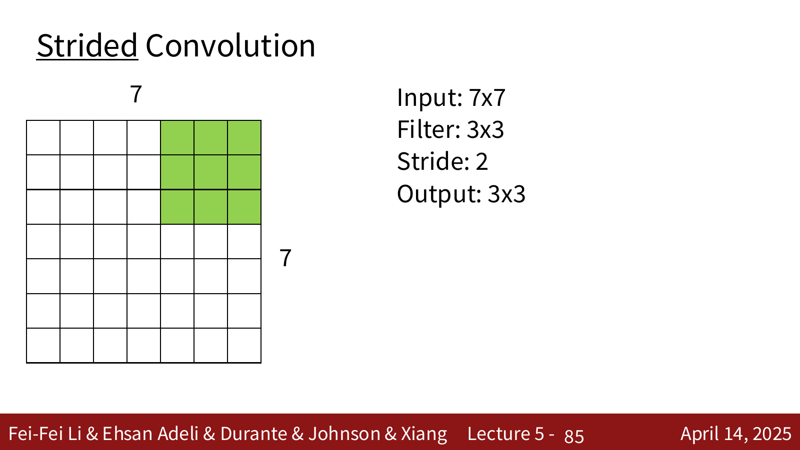
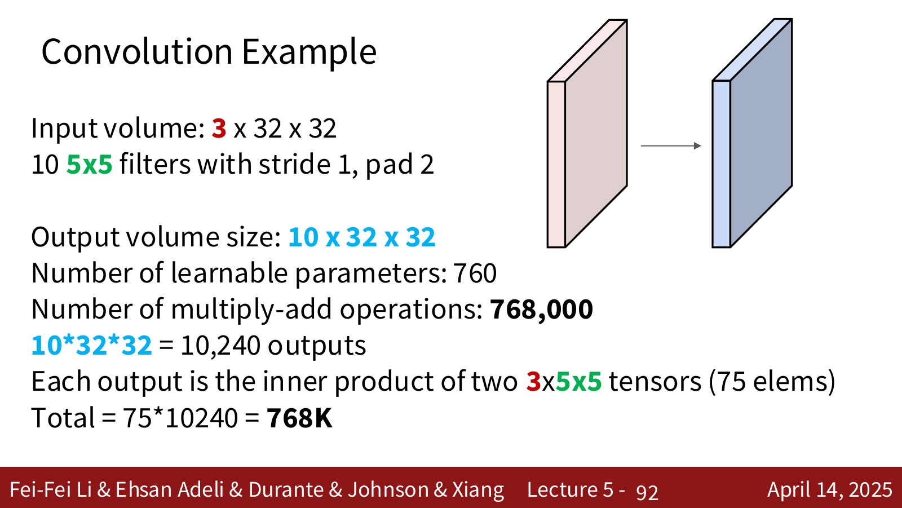
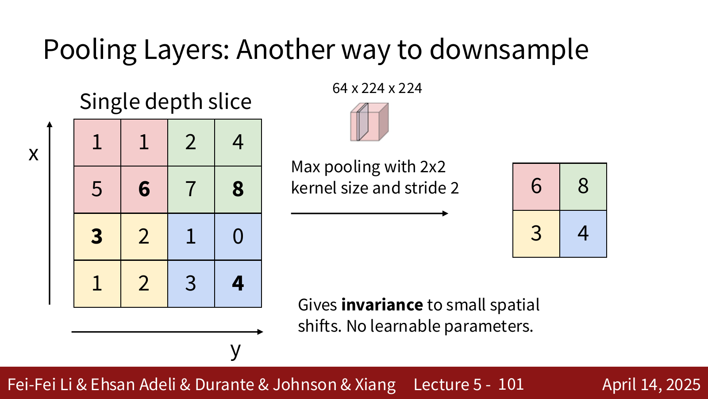
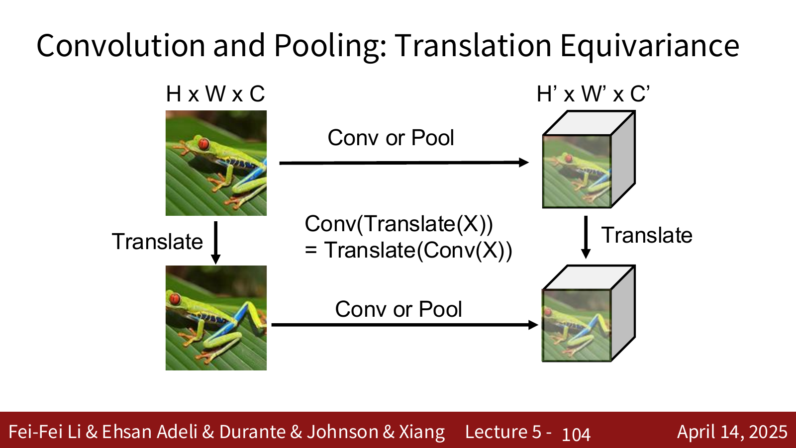

# 1. 为什么图像需要 Convolutional Neural Networks

## 1.1 Fully Connected Network 的问题

Lecture 4 中的两层神经网络会先把一张 $32\times32\times3$ 的 CIFAR-10 图片拉平成一个 $3072$ 维向量，再进行矩阵乘法：

$$
x\in\mathbb{R}^{3072},\qquad h=\operatorname{ReLU}(W_1x+b_1)
$$

这样做虽然可以训练，但是有两个明显的问题。

1. **图像的空间结构被破坏了**。原来相邻的像素在向量中不一定还能以直观的二维关系存在，网络不知道哪些像素在上、下、左、右。
2. **参数数量增长得太快**。一张 $200\times200\times3$ 的图片有 $120000$ 个输入值，一个全连接神经元就需要 $120000$ 个权重。如果隐藏层有很多神经元，参数量会立刻变得非常大。

图像和普通向量不同。图像中有很强的局部结构：一条边缘只由附近的一小块像素决定，一只眼睛也通常由相邻的局部纹理组成。因此没有必要让最前面的每个神经元一开始就看到整张图片。

!!! explanation "卷积神经网络的核心想法"
    卷积神经网络不再把图片马上拉平，而是保留图片的高度、宽度和通道三个维度。
    
    每个卷积核只观察一小块局部区域，但是同一个卷积核会在整张图片上反复使用。这样既保留了空间结构，又大幅减少了参数量。

## 1.2 手工特征与 ConvNet 学习特征

在传统的图像识别方法中，通常先由人设计特征，例如：

1. **Color Histogram**：统计各种颜色出现的频率。
2. **Histogram of Oriented Gradients（HoG）**：把图片分成很多小区域，统计每个区域中边缘的方向。

然后再把这些人工提取的特征交给线性分类器。

ConvNet 的区别是：==特征提取器和分类器一起从数据中学习==。卷积层负责学习图像特征，最后的全连接层负责根据这些特征输出类别分数。整个网络仍然是一个可微函数，所以可以使用 Lecture 4 的反向传播，再使用 Lecture 3 的优化算法端到端训练。

$$
\text{pixels}\longrightarrow\text{learned features}\longrightarrow\text{class scores}
$$

---

# 2. Convolutional Neural Network 的整体结构

一个经典的卷积神经网络会交替使用下面几类层：

1. **Convolution Layer（卷积层）**：在局部区域上提取特征。
2. **Activation Function（激活函数）**：例如 ReLU，为网络加入非线性。
3. **Pooling Layer（池化层）**：缩小特征图的空间尺寸。
4. **Fully Connected Layer（全连接层）**：在网络末尾把提取出的特征变成类别分数。



例如，一个简单的网络可以写成：

```text
INPUT -> CONV -> RELU -> POOL -> FC
```

对于 CIFAR-10，可以有如下 shape 变化：

```text
32x32x3 -> 32x32x12 -> 32x32x12 -> 16x16x12 -> 10 scores
   INPUT       CONV         RELU          POOL          FC
```

其中 CONV 和 FC 层含有可学习的权重和偏置；ReLU 和 POOL 通常只是固定运算，没有可学习参数。

!!! note "本讲的 shape 记号"
    课件和 PyTorch 常用：
    
    $$
    C\times H\times W
    $$
    
    其中 $C$ 是通道数，$H$ 是高度，$W$ 是宽度。加入 batch 后为：
    
    $$
    N\times C\times H\times W
    $$
    
    有些网页或框架也会写成 $H\times W\times C$。两者描述的是同一个张量，只是维度顺序不同。做题时必须先确认使用的是哪一种约定。

---

# 3. Convolution Layer（卷积层）

## 3.1 一个卷积核到底做了什么

假设输入图片为：

$$
x\in\mathbb{R}^{3\times32\times32}
$$

!!! explanation "张量"
    **tensor（张量）** 可以理解为有任意多个维度的数组。
    
    1. 一个数字，例如 $5$，是 **0 维张量**，也叫标量。
    2. 一列数字，例如 $[1,2,3]$，是 **1 维张量**，也叫向量。
    3. 一个二维数字方格是 **2 维张量**，也就是平时说的矩阵。
    4. 好几张相同大小的矩阵叠在一起，就得到 **3 维张量**。
    5. 好几个 3 维张量放在一起，还可以得到 4 维张量。
    
    一张 RGB 图片包含红、绿、蓝三个颜色通道。每个通道都可以单独写成一张 $32\times32$ 的矩阵：
    
    ```text
    Red channel:    32 × 32 矩阵
    Green channel:  32 × 32 矩阵
    Blue channel:   32 × 32 矩阵
    ```
    
    把这三张矩阵叠起来，就得到：
    
    $$
    3\times32\times32
    $$
    
    的三维张量。可以把它想成一本只有三页的书，每一页都是一张 $32\times32$ 的矩阵。
    
    这里三个维度的含义是：
    
    $$
    \underbrace{3}_{\text{颜色通道数}}
    \times
    \underbrace{32}_{\text{图片高度}}
    \times
    \underbrace{32}_{\text{图片宽度}}
    $$

!!! explanation "两个张量怎么相乘？"
    ==卷积运算中的相乘不是线性代数中的矩阵乘法==。
    
    这里真正进行的是两个步骤：
    
    1. 两个形状相同的张量在**对应位置逐个相乘**。
    2. 把产生的所有乘积全部加起来，最终得到一个数字。
    
    给定两张 $2\times2$ 的矩阵（即两个二维张量）假设图片局部区域为：
    
    $$
    X=
    \begin{bmatrix}
    1 & 2\\
    3 & 4
    \end{bmatrix}
    $$
    
    卷积核为：
    
    $$
    W=
    \begin{bmatrix}
    5 & 6\\
    7 & 8
    \end{bmatrix}
    $$
    
    它们不是按照“第一行乘第一列”的矩阵乘法规则计算，而是让相同位置的数配对：
    
    ```text
    左上角：1 和 5 配对
    右上角：2 和 6 配对
    左下角：3 和 7 配对
    右下角：4 和 8 配对
    ```
    
    对应位置逐个相乘以后得到：
    
    $$
    X\odot W=
    \begin{bmatrix}
    1\times5 & 2\times6\\
    3\times7 & 4\times8
    \end{bmatrix}
    =
    \begin{bmatrix}
    5 & 12\\
    21 & 32
    \end{bmatrix}
    $$
    
    这里的 $\odot$ 表示 **element-wise multiplication（逐元素乘法）**。现在再把这四个结果全部加起来：
    
    $$
    5+12+21+32=70
    $$
    
    因此，这个 $2\times2$ 图片区域和 $2\times2$ 卷积核做完卷积以后，只产生一个输出数字 $70$。如果还有偏置 $b=2$，最终输出就是：
    
    $$
    70+2=72
    $$
    
    上面的完整过程也可以直接写成：
    
    $$
    1\times5+2\times6+3\times7+4\times8+b
    $$
    
    ### 扩展到两个三维张量
    
    现在假设图片不是一个通道，而是两个通道。为了让数字简单一些，每个通道仍然只有 $2\times2$。图片局部区域是一个 $2\times2\times2$ 张量：
    
    ```text
    图片的第 1 个通道：       图片的第 2 个通道：
    1  2                     2  0
    3  4                     1  3
    ```
    
    卷积核也必须是相同的 $2\times2\times2$ 张量：
    
    ```text
    卷积核的第 1 个通道：     卷积核的第 2 个通道：
    5  6                     1  2
    7  8                     3  4
    ```
    
    首先计算第一个通道对应位置的乘积之和：
    
    $$
    1\times5+2\times6+3\times7+4\times8=70
    $$
    
    再计算第二个通道对应位置的乘积之和：
    
    $$
    2\times1+0\times2+1\times3+3\times4=17
    $$
    
    最后，不仅要把每张矩阵内部的结果加起来，还要把不同通道的结果继续加起来：
    
    $$
    70+17=87
    $$
    
    如果偏置 $b=2$，最终得到：
    
    $$
    87+2=89
    $$
    
    因此，两个三维张量做这里所说的“相乘”，可以理解为：
    
    1. 第一个通道和第一个通道逐元素相乘。
    2. 第二个通道和第二个通道逐元素相乘。
    3. 如果还有第三个通道，就让第三个通道也逐元素相乘。
    4. 最后把所有通道、所有位置产生的乘积全部加起来。
    5. 加上偏置以后，得到一个输出数字。
    
    ### 回到 $3\times5\times5$ 卷积核
    
    一个 $3\times5\times5$ 的卷积核也可以想成三张 $5\times5$ 的矩阵：
    
    ```text
    Red filter:    5 × 5
    Green filter:  5 × 5
    Blue filter:   5 × 5
    ```
    
    三张矩阵叠起来以后，就是一个 $3\times5\times5$ 的卷积核，一共有：
    
    $$
    3\times5\times5=75
    $$
    
    个权重。
    
    卷积核第一次放在图片左上角时，会从输入图片中取出一个同样大小的 $3\times5\times5$ 局部区域。接着进行下面的操作：
    
    1. 红色通道的 $5\times5$ 图片区域与卷积核的红色通道逐元素相乘。
    2. 绿色通道也逐元素相乘。
    3. 蓝色通道也逐元素相乘。
    4. 把三个通道得到的全部 $75$ 个乘积加起来。
    5. 最后再加上一个偏置 $b$，得到一个输出数字。
    
    这个过程可以写成：
    
    $$
    y_{i,j}=\sum_{c=1}^{C_{in}}\sum_{u=1}^{K_H}\sum_{v=1}^{K_W}
    W_{c,u,v}x_{c,i+u,j+v}+b
    $$
    
    如果暂时看不懂求和符号，也可以把图片的局部区域和卷积核都拉平成长度为 $75$ 的向量：
    
    $$
    x_{patch}=[x_1,x_2,\ldots,x_{75}]
    $$
    
    $$
    w=[w_1,w_2,\ldots,w_{75}]
    $$
    
    然后做一次普通向量点积：
    
    $$
    y_{i,j}=x_{patch}\cdot w+b
    =x_1w_1+x_2w_2+\cdots+x_{75}w_{75}+b
    $$
    
    所以卷积层在一个位置做的事情，本质上仍然是 **dot product（点积）**，不是两个二维矩阵之间的普通矩阵乘法。
    
    **最直白的记法：**把两个形状相同的张量对齐叠在一起，每个数只和它正对着的那个数相乘，最后把所有乘积全部加起来。
    
    $$
    \boxed{\text{对应位置相乘}\;\longrightarrow\;\text{所有结果求和}\;\longrightarrow\;\text{得到一个数字}}
    $$

!!! explanation "我的疑惑1"
    ### 我的疑惑：
    一个卷积核是 $3 \times 5 \times 5$ 的，那它不应该只对应输入图片的其中一部分的特征吗？为什么要将它在整个图像上面移动，这样子的话不就是让一个卷积核去把整个图像上的特征都给学一遍吗？
    
    ### 解答：
    一个卷积核负责寻找某一种局部特征，而不是负责图片中的某一个固定位置。
    
    例如，假设某个卷积核学会了检测竖直边缘。那么它代表的是“竖直边缘检测器”，而不是“左上角竖直边缘检测器”。
    
    当它覆盖图片左上角时，会检查左上角有没有竖直边缘；移动到图片中央后，会使用完全相同的判断方式检查图片中央；移动到右下角后，也会继续寻找相同的竖直边缘。
    
    因此要区分：
    
    1. 卷积核的大小 $3\times5\times5$ 决定它一次观察多大的局部区域。
    2. 卷积核中的权重决定它想寻找什么特征。
    3. 卷积核当前所在的位置决定它正在什么地方寻找这种特征。

    同一种特征可能出现在图片的任何位置。竖直边缘可能出现在左边，也可能出现在中间或右边。
    
    如果“竖直边缘检测器”只检查左上角，那么物体稍微移动一下，它就检测不到原来的特征了。让同一个卷积核在整张图片上移动，可以让它在所有位置寻找同一种特征。
    
    卷积核每移动到一个位置，就输出一个数字：
    
    1. 输出值很大，表示这个位置与卷积核寻找的特征很匹配。
    2. 输出值很小或为负，表示这个位置与该特征不匹配。
    
    把所有位置的输出按照空间顺序排列起来，就得到一张 **activation map（激活图）**。这张图表示：这种特征在输入图片的哪些位置出现，以及每个位置的响应有多强。
    
    所以移动卷积核不是为了让它学习各种不同特征，而是为了得到：
    
    $$
    \text{同一种特征在整张图片上的检测结果地图}
    $$
    
    在一次 forward pass（前向传播）中，卷积核的 $75$ 个权重是固定的。它移动到不同位置时，始终使用完全相同的一组权重：
    
    ```text
    位置 1：使用卷积核 W
    位置 2：仍然使用卷积核 W
    位置 3：还是使用卷积核 W
    ...
    ```
    
    卷积核真正的学习发生在不同训练步骤之间：
    
    1. 前向传播时，用当前卷积核扫描训练图片。
    2. 网络得到类别分数，并通过 loss function 计算预测有多差。
    3. 反向传播计算卷积核中的每个权重应该怎样改变。
    4. 优化器更新卷积核。
    5. 下一次前向传播再使用更新后的卷积核扫描图片。
    
    因此：
    
    - **在图片上移动**：同一组权重被应用到不同空间位置。
    - **通过训练学习**：反向传播和优化器在训练步骤之间更新这组权重。
    
    一个卷积核会在整张图片的所有位置使用，但它通常只倾向于检测某一种模式。例如，第一层可能学习出：
    
    1. 卷积核 1：寻找横向边缘。
    2. 卷积核 2：寻找竖直边缘。
    3. 卷积核 3：寻找斜向边缘。
    4. 卷积核 4：寻找红绿色对比。
    5. 卷积核 5：寻找蓝黄色对比。
    6. 卷积核 6：寻找某种局部纹理。
    
    上面的“卷积核 1 学横向边缘、卷积核 2 学竖直边缘”只是训练完成后可能出现的结果。我们在训练开始前并不知道每个卷积核最终会学习什么，也不会手动规定“你必须学习横向边缘”。网络只知道最终目标是降低分类的 loss。


!!! explanation "我的疑问2"
    ### 我的疑问：
    这么多个卷积核，你怎么知道它学的是哪一个特征，你该怎么初始化它，我总感觉可能会出现两个一模一样的卷积核。
    
    ## 解析：
    
    ### 1. 卷积核应该怎样初始化？
    
    一个 $3\times5\times5$ 卷积核不是只初始化一个值，而是要初始化其中全部：
    
    $$
    3\times5\times5=75
    $$
    
    个权重。假设这一层有 $6$ 个卷积核，就要分别初始化 $6$ 组不同的 $75$ 个权重。
    
    最重要的原则是：==不同卷积核要使用彼此独立的随机初始值，不能把它们全部初始化成完全相同的数==。
    
    可以把两个卷积核的初始状态想成：
    
    ```text
    卷积核 1：[0.012, -0.034, 0.008, ..., 0.021]
    卷积核 2：[-0.017, 0.006, 0.029, ..., -0.011]
    ```
    
    这些数在训练刚开始时并不表示横向边缘或竖直边缘，只是两组彼此不同的小随机数。之后，反向传播会不断调整每一个卷积核来实现最小的loss。
    
    ### 2. 如果两个卷积核初始化得一模一样会发生什么？
    
    假设两个卷积核分别是 $W_1$ 和 $W_2$，并且把它们初始化为：
    
    $$
    W_1=W_2
    $$
    
    它们观察同一个输入、执行相同的计算，因此前向传播会产生相同的 activation map。如果后续网络对这两个输出通道的处理也完全相同，那么反向传播时它们会收到相同的梯度：
    
    $$
    \frac{\partial L}{\partial W_1}
    =
    \frac{\partial L}{\partial W_2}
    $$
    
    更新以后仍然有：
    
    $$
    W_1'=W_2'
    $$
    
    下一轮训练中二者依然相同。这样两个卷积核就会一直做同一件事，相当于浪费了一个卷积核。这叫 **symmetry problem（对称性问题）**。
    
    随机初始化的作用就是打破这种对称性。不同卷积核一开始只有非常小的随机差异，但这些差异会让它们产生稍微不同的输出和梯度。训练很多步以后，它们就可能逐渐走向不同的方向，分别对不同特征产生较强响应。
    
    ### 3. 怎么知道训练后的卷积核学到了什么？
    
    训练算法不会给卷积核贴上“横向边缘”或“红绿色对比”的文字标签。我们通常在训练完成后，通过观察它的行为来解释它：
    
    1. **直接可视化卷积核权重**：第一层卷积核只有 $3\times K\times K$，可以把它转换成小图片。某些卷积核看起来会像不同方向的边缘或颜色对比。
    2. **观察 activation map**：把很多图片输入网络，看看某个卷积核在什么位置会产生很大的响应。
    3. **寻找最大激活样本**：从数据集中找出最能激活某个卷积核的图片区域。如果它总是对车轮产生强响应，就可以推测它学到了与车轮有关的特征。
    
    所以“某个卷积核学会了竖直边缘”通常是训练结束后根据权重和激活结果作出的解释，不是训练前给它安排好的任务。
    
    ### 4. 训练后还可能出现两个很像的卷积核吗？
    
    可能。独立随机初始化让两个卷积核**精确相同**的概率几乎为零，但不能保证它们最终一定学习完全不同的特征。
    
    如果某种特征对降低 loss 非常有用，多个卷积核可能都对它产生响应，甚至学习出比较相似的模式。这种冗余不一定会让网络出错，只是说明模型的一部分容量被用于表达相近的特征。
    
    因此更准确的结论是：
    
    1. 如果所有卷积核从完全相同的值开始，它们很可能永远保持相同，这是必须避免的。
    2. 独立随机初始化会打破对称性，为不同卷积核学习不同特征创造条件。
    3. 随机初始化不能强制每个卷积核学习完全不同的东西，训练后仍然可能出现相似或冗余的卷积核。
    
    每个卷积核都会扫描整张图片。经过独立随机初始化和训练以后，它们通常会对不同类型的特征产生响应，但也允许存在相似或冗余的卷积核。每个卷积核产生一张 activation map，多个卷积核就会产生多张 activation map。
    
    最重要的区别是：
    
    - **卷积核学什么？** 某一种特征。
    - **卷积核去哪里寻找？** 整张图片的所有位置。

现在回到完整的卷积运算。一个 $3\times5\times5$ 的卷积核先覆盖输入图片左上角的一小块区域，将两个 $3\times5\times5$ 张量的对应元素相乘，再把结果全部加起来，最后加上一个偏置：

$$
y_{i,j}=\sum_{c=1}^{C_{in}}\sum_{u=1}^{K_H}\sum_{v=1}^{K_W}
W_{c,u,v}x_{c,i+u,j+v}+b
$$

卷积层在每个位置做的仍然是 Lecture 2 和 Lecture 4 中见过的 **dot product（点积）**。区别只是：

1. 全连接层的一个神经元与整个输入做点积。
2. 卷积层的一个输出只与输入的一小块局部区域做点积。
3. 同一个卷积核还会滑到其他位置，重复做同样的运算。

一个 $3\times5\times5$ 的局部区域共有：

$$
3\times5\times5=75
$$

个数，所以每一个输出值都是一次 $75$ 维点积再加偏置。

!!! note "这一节最重要的一句话"
    ==一个卷积核负责寻找一种特征，而不是负责一个固定位置；移动卷积核，是为了在整张图片中寻找这种特征。==

## 3.2 卷积核为什么必须贯穿输入的全部通道

卷积核在高度和宽度上很小，但是它的深度必须等于输入的通道数。



例如，输入是一张 RGB 图片，输入通道数为 $3$，那么一个 $5\times5$ 卷积核的真实 shape 是：

$$
3\times5\times5
$$

如果上一层输出了 $6$ 个通道，那么下一层的每个卷积核就必须是：

$$
6\times K_H\times K_W
$$

!!! warning "容易混淆的两个深度"
    **输入深度**是输入张量的通道数 $C_{in}$，一个卷积核必须贯穿全部 $C_{in}$ 个通道。
    
    **输出深度**是卷积核的数量 $C_{out}$。每个卷积核产生一张 feature map，所以有多少个卷积核，输出就有多少个通道。
    
    这里的 depth 都是张量的通道维度，不是“神经网络一共有多少层”的网络深度。

## 3.3 Activation Map（激活图）

一个卷积核从左到右、从上到下滑过整张输入，在每一个位置产生一个数字。把这些数字按照原来的空间位置排列起来，就得到一张二维 **activation map（激活图）**，也叫 **feature map（特征图）**。

对于 $3\times32\times32$ 的输入，如果使用一个 $3\times5\times5$ 卷积核，并且步幅为 $1$、不做 padding，那么卷积核在每个方向上可以放置：

$$
32-5+1=28
$$

次，因此一个卷积核产生一张 $28\times28$ 的激活图。

如果有 $6$ 个不同的卷积核，每个卷积核都会产生一张自己的激活图。将它们沿通道维度叠在一起，就得到：

$$
6\times28\times28
$$

的输出。



!!! explanation "一个空间位置为什么会得到一个 6 维向量？"
    六个卷积核会观察输入中的同一个局部区域，但是它们拥有不同的权重。
    
    假设这六个卷积核分别擅长识别横向边缘、纵向边缘、红绿色对比等特征，那么同一个位置经过六个卷积核之后，就会得到六个不同的响应值。
    
    因此输出中的每个空间位置 $(i,j)$ 都对应一个 $6$ 维特征向量。

## 3.4 Local Connectivity（局部连接）

全连接层中，每个输出神经元都连接上一层的所有输入。卷积层中，每个输出值只连接上一层的一小块空间区域，这叫 **local connectivity（局部连接）**。

假设输入为 $16\times16\times20$，卷积核的空间大小为 $3\times3$，那么一个输出值只和：

$$
3\times3\times20=180
$$

个输入相连，而不是与整张 $16\times16\times20$ 的输入相连。

局部连接利用了图像的特点：底层视觉特征通常由相邻像素组成。要判断某个位置是否有一条边缘，只需要观察它附近的像素，没有必要一开始就观察图片另一端。

## 3.5 Parameter Sharing（参数共享）

同一个卷积核滑过图片的不同位置时，使用的始终是同一组权重和同一个偏置。这叫 **parameter sharing（参数共享）**。

假设某个卷积核学会了检测横向边缘。如果横向边缘出现在图片左上角时有用，那么它出现在右下角时通常也有用。没有必要为每一个位置分别学习一个新的“横向边缘检测器”。

!!! explanation "局部连接和参数共享不是一回事"
    
    1. **局部连接**回答的是：一个输出值看输入的多大范围？答案是一小块局部区域。
    2. **参数共享**回答的是：移动到新的位置后要不要换一套权重？答案是不换，继续使用同一个卷积核。
    
    局部连接减少了每个输出值需要观察的输入；参数共享则使不同位置共用同一套参数。二者共同让卷积层比全连接层更加适合图像。

## 3.6 卷积核会学到什么

卷积核不是人手工写好的，而是通过反向传播和梯度下降从训练数据中学习出来的。

1. 第一层卷积核直接观察像素，通常会学习不同方向的边缘、明暗变化和颜色对比。
2. 更深的卷积层会把前面的简单特征继续组合，逐渐学习眼睛、字母、纹理、车轮等更复杂的结构。
3. 再往后的层可以把这些局部结构组合成更完整、更抽象的物体特征。



这就是神经网络的 **hierarchical representation（层次化表示）**：

$$
\text{pixels}\rightarrow\text{edges}\rightarrow\text{textures/parts}\rightarrow\text{objects}
$$

---

# 4. 卷积层的输出尺寸

## 4.1 Kernel Size、Stride 与 Padding

决定卷积层空间输出大小的三个主要超参数是：

1. **Kernel Size（卷积核大小）**：$K_H\times K_W$。
2. **Stride（步幅）**：$S$，卷积核每次移动多少个像素。
3. **Padding（填充）**：$P$，在输入边缘补多少圈像素，最常见的是补 $0$。

假设输入大小为 $C_{in}\times H\times W$，一共有 $C_{out}$ 个卷积核，卷积核空间大小为 $K_H\times K_W$，步幅为 $S$，四周填充为 $P$，那么输出大小为：

$$
C_{out}\times H'\times W'
$$

其中：

$$
H'=\frac{H-K_H+2P}{S}+1
$$

$$
W'=\frac{W-K_W+2P}{S}+1
$$

如果卷积核是正方形，即 $K_H=K_W=K$，公式就可以简写为：

$$
H'=\frac{H-K+2P}{S}+1,\qquad
W'=\frac{W-K+2P}{S}+1
$$

输出通道数不由上面这个空间公式决定，而是直接等于卷积核数量：

$$
C' = C_{out}
$$

## 4.2 为什么公式中最后要加 $1$

先看最简单的一维情况。长度为 $W$ 的输入中放入长度为 $K$ 的卷积核，不做 padding，步幅为 $1$。

卷积核左端可以放在位置：

$$
0,1,2,\ldots,W-K
$$

从 $0$ 到 $W-K$ 一共有：

$$
(W-K)-0+1=W-K+1
$$

个位置，所以输出公式最后必须加 $1$。

## 4.3 Zero Padding 为什么有用

如果步幅为 $1$ 且不做 padding，那么每经过一次卷积，特征图都会缩小：

$$
W'=W-K+1
$$

例如，$7\times7$ 的输入经过 $3\times3$ 卷积后会变成 $5\times5$。网络堆叠很多卷积层以后，空间尺寸会迅速消失，而且边缘像素参与卷积的次数会比中心像素少。

解决办法是在输入四周补零：



当 $S=1$ 且卷积核边长 $K$ 是奇数时，通常取：

$$
P=\frac{K-1}{2}
$$

代入输出公式：

$$
W'=W-K+2\cdot\frac{K-1}{2}+1=W
$$

于是输出空间尺寸与输入相同，这通常叫做 **same padding**。

常见设置为：

1. $K=3, P=1, S=1$。
2. $K=5, P=2, S=1$。
3. $K=1, P=0, S=1$。

!!! warning "Padding 不会增加可学习参数"
    Padding 只是在输入边缘补固定的数值，通常补 $0$。这些补出来的数不是权重，不会被训练，因此 padding 的大小不会改变卷积层的参数数量。

## 4.4 Stride（步幅）

步幅 $S$ 表示卷积核每次移动多少格。

1. $S=1$：每次移动一个像素，输出较大。
2. $S=2$：每次跳过一个像素，输出的高度和宽度通常约缩小一半。
3. 更大的 stride 会更激进地降低空间分辨率，因此并不常见。



例如，输入为 $7\times7$，卷积核为 $3\times3$，$P=0,S=2$，则：

$$
H'=W'=\frac{7-3}{2}+1=3
$$

所以输出为 $3\times3$。

## 4.5 为什么输出尺寸必须是整数

公式：

$$
\frac{W-K+2P}{S}+1
$$

必须得到整数，否则说明卷积核按照给定 stride 滑动时无法刚好放到输入的末端。

例如，$W=10,K=3,P=0,S=2$：

$$
W'=\frac{10-3}{2}+1=4.5
$$

这不是一个合法的输出尺寸。不同框架可能报错，也可能通过额外 padding 或取整来处理，但是做理论计算时应该先确保：

$$
W-K+2P
$$

能够被 $S$ 整除。

!!! warning "最常见的 shape 错误"
    
    1. 忘记 padding 在左右两侧都会添加，所以公式中是 $2P$，不是 $P$。
    2. 忘记最后的 $+1$。
    3. 把卷积核数量 $C_{out}$ 和卷积核深度 $C_{in}$ 混在一起。
    4. 只计算 $H'$ 和 $W'$，忘记输出还具有 $C_{out}$ 个通道。

---

# 5. 卷积层的参数量与计算量

## 5.1 参数量

假设卷积层有 $C_{out}$ 个卷积核，每个卷积核大小为：

$$
C_{in}\times K_H\times K_W
$$

一个卷积核有：

$$
C_{in}K_HK_W
$$

个权重和一个偏置。因此整个卷积层的参数量为：

$$
\boxed{C_{out}(C_{in}K_HK_W+1)}
$$

其中最后的 $1$ 表示每个卷积核自己的 bias。

!!! explanation "参数量为什么和图片大小无关？"
    同一个卷积核会在所有空间位置共享参数。输入图片变大时，卷积核需要滑动更多次，计算量会增加，但是卷积核本身并没有增加新的权重。
    
    因此卷积层的参数量由输入通道数、卷积核大小和卷积核数量决定，不由输入图片的高度和宽度决定。

## 5.2 完整例子

已知：

1. 输入 volume：$3\times32\times32$。
2. 卷积核数量：$10$。
3. 每个卷积核：$3\times5\times5$。
4. Stride：$S=1$。
5. Padding：$P=2$。

### 5.2.1 计算输出 shape

$$
H'=W'=\frac{32-5+2\times2}{1}+1=32
$$

输出通道数等于卷积核数量，所以：

$$
\boxed{\text{output shape}=10\times32\times32}
$$

### 5.2.2 计算参数量

每个卷积核有：

$$
3\times5\times5+1=76
$$

个参数。共有 $10$ 个卷积核，因此：

$$
\boxed{10\times76=760}
$$

个可学习参数。

### 5.2.3 计算乘加运算次数

输出一共有：

$$
10\times32\times32=10240
$$

个数。每一个输出值要与一个 $3\times5\times5$ 的局部区域做点积，所以需要 $75$ 次乘加。总计算量约为：

$$
75\times10240=768000
$$

次 multiply-add operations。



!!! note "参数量和计算量要分开"
    这个例子只有 $760$ 个可学习参数，但是同一套参数要在大量空间位置反复使用，所以仍然需要 $768000$ 次乘加运算。
    
    **参数量小不代表计算量一定小**。参数共享减少的是需要存储和学习的独立权重，而卷积核在每个位置仍然要进行实际计算。

## 5.3 Batch 输入

实际训练时通常一次输入 $N$ 张图片：

$$
X\in\mathbb{R}^{N\times C_{in}\times H\times W}
$$

卷积层的权重 shape 为：

$$
W\in\mathbb{R}^{C_{out}\times C_{in}\times K_H\times K_W}
$$

偏置 shape 为：

$$
b\in\mathbb{R}^{C_{out}}
$$

输出为：

$$
Y\in\mathbb{R}^{N\times C_{out}\times H'\times W'}
$$

注意，batch size $N$ 不会改变卷积层的权重 shape，也不会改变参数量。所有图片都使用同一组卷积核。

## 5.4 PyTorch 中的卷积层

上面的例子可以写成：

```python
import torch
import torch.nn as nn

conv = nn.Conv2d(
    in_channels=3,
    out_channels=10,
    kernel_size=5,
    stride=1,
    padding=2,
)

x = torch.randn(8, 3, 32, 32)
y = conv(x)

print(y.shape)  # torch.Size([8, 10, 32, 32])
```

其中 `8` 是 batch size，`3` 是输入通道数，`10` 是卷积核数量，也就是输出通道数。

---

# 6. Receptive Field（感受野）

## 6.1 感受野是什么

某个神经元的 **receptive field（感受野）** 是：上一层或原始输入中，能够影响这个神经元的那一块区域。

对于一层 $K\times K$ 卷积，输出中的一个值直接观察上一层的 $K\times K$ 区域。因此相对于上一层，它的感受野就是 $K\times K$。

!!! warning "感受野相对于哪一层？"
    “相对于上一层的感受野”和“相对于原始输入图片的感受野”不是一回事。
    
    一个深层神经元可能只直接读取上一层的 $3\times3$ 区域，但是上一层的每个值已经包含了更早层的局部信息。因此这个深层神经元相对于原始图片的感受野会大得多。

## 6.2 堆叠卷积层后感受野如何增长

如果连续使用 $L$ 层 $K\times K$ 卷积，并且每层 stride 都是 $1$，那么相对于原始输入的感受野边长为：

$$
R_L=1+L(K-1)
$$


例如，连续堆叠三层 $3\times3$ 卷积：

1. 第一层感受野：$3\times3$。
2. 第二层感受野：$5\times5$。
3. 第三层感受野：$7\times7$。

因此：

$$
3\times3\rightarrow5\times5\rightarrow7\times7
$$

!!! explanation "为什么多层小卷积核比一层大卷积核更有用？"
    三层 $3\times3$ 卷积与一层 $7\times7$ 卷积都能获得 $7\times7$ 的感受野，但是三层小卷积之间可以插入三次非线性激活，因此表达能力更强。
    
    假设输入和输出都有 $C$ 个通道，忽略偏置：
    
    1. 一层 $7\times7$ 卷积需要 $49C^2$ 个参数。
    2. 三层 $3\times3$ 卷积需要 $3\times9C^2=27C^2$ 个参数。
    
    所以多层小卷积通常既能加入更多非线性，又能使用更少的参数。

## 6.3 为什么需要下采样

对于很大的图片，如果所有卷积层都保持 stride 为 $1$，感受野增长得比较慢。需要很多层以后，某个输出才能“看到”整张图片。

下采样会降低特征图的空间尺寸，使后续神经元更快地聚合大范围信息。常见的下采样方法有：

1. stride 大于 $1$ 的卷积。
2. Pooling layer。

---

# 7. 其他形式的卷积

## 7.1 $1\times1$ Convolution

$1\times1$ 卷积看起来好像只把一个数乘以一个数，但不要忘记：卷积核必须贯穿输入的全部通道。

如果输入为：

$$
C_{in}\times H\times W
$$

那么一个 $1\times1$ 卷积核的真实 shape 是：

$$
C_{in}\times1\times1
$$

它会在每个空间位置，对该位置的 $C_{in}$ 维通道向量做一次点积。使用 $C_{out}$ 个这样的卷积核，就能把每个位置的通道数从 $C_{in}$ 变成 $C_{out}$：

$$
C_{in}\times H\times W
\longrightarrow
C_{out}\times H\times W
$$

!!! explanation "$1\times1$ 卷积的本质"
    $1\times1$ 卷积不会混合相邻的空间位置，但是会混合同一个位置上的不同通道。
    
    因此它可以用来升高或降低通道数，也可以看成在每一个像素位置上共享同一个小型全连接层。

## 7.2 1D、2D 与 3D Convolution

卷积不只用于二维图片。

1. **1D Convolution**：沿一个空间或时间维度滑动，常用于序列、音频等数据。
2. **2D Convolution**：沿高度和宽度滑动，是普通图像 CNN 最常见的卷积。
3. **3D Convolution**：沿高度、宽度和第三个空间/时间维度滑动，可用于视频或三维医学影像。

无论是哪一种卷积，核心思想都不变：在局部区域中做点积，并在不同位置共享同一组权重。

---

# 8. Pooling Layer（池化层）

## 8.1 Pooling 是干什么的

Pooling layer 会分别处理每一个通道，在高度和宽度方向进行下采样，但是保持通道数不变。

$$
C\times H\times W
\longrightarrow
C\times H'\times W'
$$

它的主要作用是：

1. 缩小特征图，减少后续层的计算量和内存开销。
2. 扩大后续神经元相对于原始输入的有效感受野。
3. 让特征对很小的空间移动不那么敏感。

## 8.2 Max Pooling

最常见的是 **max pooling（最大池化）**。它在每个局部窗口中只保留最大值。



例如，对下面的 $4\times4$ 输入使用 $2\times2$ kernel 和 stride $2$：

```text
1  1  2  4          6  8
5  6  7  8    ->    3  4
3  2  1  0
1  2  3  4
```

左上角的 $2\times2$ 区域为：

```text
1  1
5  6
```

最大值为 $6$，所以输出左上角是 $6$。其他区域同理。

!!! explanation "Pooling 为什么逐通道进行？"
    假设输入有 $64$ 个通道，每个通道表示一种不同的视觉特征。Pooling 只在每一张特征图内部寻找局部最大值，不会把不同特征混在一起。
    
    因此输入通道数是 $64$，输出通道数仍然是 $64$。

## 8.3 Pooling 的输出尺寸

如果 pooling kernel 大小为 $K$，stride 为 $S$，通常不使用 padding，那么：

$$
H'=\frac{H-K}{S}+1
$$

$$
W'=\frac{W-K}{S}+1
$$

最常见的设置是：

$$
K=2,\qquad S=2
$$

它会让高度和宽度都缩小一半。例如：

$$
64\times224\times224
\longrightarrow
64\times112\times112
$$

空间位置数量从 $224^2$ 变成 $112^2$，也就是只保留原来的四分之一。

## 8.4 Pooling 有可学习参数吗

Max pooling 只是取最大值，average pooling 只是取平均值，它们都没有需要通过梯度下降学习的权重。因此：

$$
\boxed{\text{pooling layer 的参数量}=0}
$$

但是 pooling 仍然参与反向传播。

对于 max pooling，反向传播时只有前向传播中取得最大值的那个输入会收到梯度，其他输入的梯度为 $0$。这和 Lecture 4 中的 Max Gate 完全一样。

!!! example "Max Pooling 的反向传播"
    假设一个 pooling 区域为：
    
    ```text
    1  5
    3  2
    ```
    
    前向传播输出 $5$。如果上游梯度为 $7$，那么梯度只传给最大值 $5$ 所在的位置：
    
    ```text
    0  7
    0  0
    ```
    
    实现时通常会在前向传播中记住最大值的位置，反向传播时再把梯度路由回去。

## 8.5 Pooling 和 Strided Convolution

Pooling 不是唯一的下采样方法。也可以使用 stride 为 $2$ 的卷积来同时完成特征提取和下采样。

二者的区别是：

1. Pooling 使用固定函数，没有可学习参数。
2. Strided convolution 有可学习卷积核，可以自己学习如何下采样。
3. 现代网络中常用 strided convolution 代替部分甚至全部 pooling，但 max pooling 仍然是理解经典 CNN 的重要组成部分。

---

# 9. Translation Equivariance 与 Invariance

## 9.1 Translation Equivariance（平移等变性）

卷积层在所有位置使用同一个卷积核。因此，如果输入中的物体向右移动，卷积得到的特征图通常也会跟着向右移动。

$$
\operatorname{Conv}(\operatorname{Translate}(X))
=
\operatorname{Translate}(\operatorname{Conv}(X))
$$

这叫 **translation equivariance（平移等变性）**。



它表达的是：==输入怎么移动，输出也以对应方式移动==。

## 9.2 Translation Invariance（平移不变性）

平移不变性表示：输入移动以后，最终输出保持完全不变。

$$
f(\operatorname{Translate}(X))=f(X)
$$

例如，无论猫出现在图片左边还是右边，最终分类结果都应该是 `cat`。这是分类器最终希望具有的性质。

!!! warning "Equivariance 不等于 Invariance"
    
    1. **Equivariance**：输入移动，特征也跟着移动。
    2. **Invariance**：输入移动，输出保持不变。
    
    卷积本身主要带来平移等变性。Pooling、下采样以及网络末端把空间信息汇总起来之后，可以让最终类别分数对小范围平移更加不敏感，但不能简单地说一次卷积就实现了完全的平移不变性。

## 9.3 为什么参数共享与平移有关

同一个特征可能出现在图片的任何位置。参数共享让同一个卷积核可以在所有位置检测它，因此网络不需要分别学习：

1. 左上角的横向边缘检测器。
2. 中间的横向边缘检测器。
3. 右下角的横向边缘检测器。

它只需要学习一个横向边缘卷积核，然后把它应用到整张特征图上。

需要注意的是，参数共享只是一种非常适合普通图片的假设。对于位置具有固定含义的数据，例如所有人脸都严格对齐，某些位置可能总是眼睛，另一些位置可能总是头发，此时完全共享参数不一定总是最优。

---

# 10. 把各层连成一个完整 ConvNet

一个常见的经典 CNN 模式是：

```text
INPUT -> [[CONV -> RELU] x N -> POOL] x M -> FC -> class scores
```

其中：

1. CONV 保留并变换空间结构，学习局部特征。
2. ReLU 加入非线性，但不改变 shape。
3. POOL 或 strided convolution 逐渐缩小 $H,W$。
4. 随着网络加深，通道数通常逐渐增加，使网络能够表示更多类型的特征。
5. 最后的 FC 层或其他汇总方式把高层特征变成类别分数。

整个网络依然可以写成一个从图片到类别分数的函数：

$$
s=f(x;W)
$$

然后接上 SVM loss 或 Softmax loss：

$$
L=L_{data}(s,y)+\lambda R(W)
$$

再通过反向传播计算所有卷积核和全连接层参数的梯度，使用 SGD、Momentum、RMSProp 或 Adam 更新参数。

!!! explanation "CNN 并没有推翻前四讲"
    CNN 只是把更适合图像的局部连接和参数共享加入神经网络。此前的知识仍然全部适用：
    
    1. 用 score function 输出类别分数。
    2. 用 loss function 衡量预测有多差。
    3. 用 regularization 防止过拟合。
    4. 用 backpropagation 计算梯度。
    5. 用 optimization algorithm 更新参数。

---

# 11. 总结

1. 全连接网络会破坏图像的二维空间结构，而且在大图像上参数量很大。
2. 卷积层通过 **local connectivity** 只观察局部区域，通过 **parameter sharing** 在不同位置重复使用同一个卷积核。
3. 每个卷积核产生一张 activation map；卷积核数量等于输出通道数。
4. 卷积核的空间范围可以很小，但是深度必须覆盖输入的全部通道。
5. 卷积层输出尺寸为：

$$
H'=\frac{H-K_H+2P}{S}+1,\qquad
W'=\frac{W-K_W+2P}{S}+1
$$

6. 卷积层参数量为：

$$
C_{out}(C_{in}K_HK_W+1)
$$

7. 感受野会随着卷积层堆叠而增大；下采样能让后续层更快看到大范围信息。
8. Pooling 对每个通道独立下采样，不改变通道数，也没有可学习参数。
9. 卷积具有平移等变性；最终分类任务希望经过空间汇总后获得一定的平移不变性。
10. CNN 仍然是一个端到端可微的神经网络，可以继续使用 loss、backpropagation 和 gradient descent 训练。

!!! note "做卷积 shape 题的固定顺序"
    
    1. 先确认输入采用 $C\times H\times W$ 还是 $H\times W\times C$。
    2. 用 $H,W,K,S,P$ 计算输出的 $H',W'$。
    3. 把输出通道写成卷积核数量 $C_{out}$。
    4. 用 $C_{out}(C_{in}K_HK_W+1)$ 计算参数量。
    5. 最后检查输出尺寸是否为整数，以及每个卷积核的深度是否等于 $C_{in}$。
