# 1. How to build CNNS
## 1.1 Layers in CNNs


一个CNN中大致有下面这些组件：


1. **Convolution Layer**：提取局部空间特征。
2. **Pooling Layer**：下采样，降低空间尺寸。
3. **Fully-Connected Layer**：通常在最后输出 class scores。
4. **Normalization Layer**：稳定每层输入的数值分布。
5. **Dropout**：通过随机丢掉神经元做正则化。
6. **Activation Function**：加入非线性，例如 ReLU、GELU。

---

## 1.2 Normalization Layer

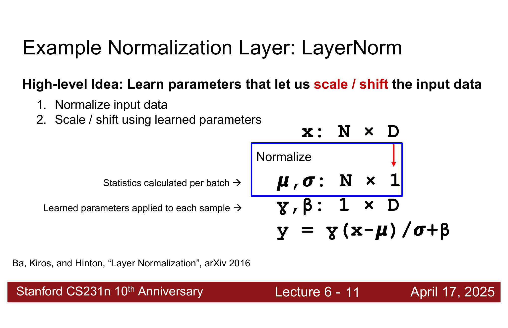

### 1.2.1 为什么需要 Normalization

神经网络每一层都会接收上一层的输出。如果前面层的输出分布变化很大，就会导致后面层出现不稳定的数据分布，训练会变得更难。

Normalization 的基本想法是：

1. 先把输入标准化，让它的均值和方差变得比较稳定。
2. 再用可学习参数把它缩放和平移回一个合适的范围。

所以 normalization 不是简单地把数据永远固定成均值 $0$、方差 $1$，而是给网络一个更稳定的起点，同时保留可学习的调整能力。

Normalization的有以下几种方式：


### 1.2.2 LayerNorm 的公式

假设输入是：

$$
x\in\mathbb{R}^{N\times D}
$$

其中 $N$ 是 batch size，$D$ 是每个样本的特征维度。LayerNorm 会对每个输入数据（即每个样本）单独计算均值和标准差：

$$
\mu_i=\frac{1}{D}\sum_{j=1}^{D}x_{i,j}
$$

$$
\sigma_i=\sqrt{\frac{1}{D}\sum_{j=1}^{D}(x_{i,j}-\mu_i)^2+\epsilon}
$$

然后标准化，也就是把输入数据归一化为**均值为0，标准差为1的数据：**

$$
\hat{x}_{i,j}=\frac{x_{i,j}-\mu_i}{\sigma_i}
$$

最后用可学习参数 $\gamma,\beta$ 做 scale 和 shift：

$$
y_{i,j}=\gamma_j\hat{x}_{i,j}+\beta_j
$$

其中：

1. $\gamma$ 控制缩放。
2. $\beta$ 控制平移。
3. $\epsilon$ 是一个很小的数，用来避免除以 $0$。

!!! explanation "LayerNorm 的直觉"
    对每一个样本来说，LayerNorm 会先问：
    
    > 这个样本自己的特征整体是偏大还是偏小？
    
    然后把它拉回一个比较标准的范围。这样后面的层不用一直适应忽大忽小的输入。
    
    但是如果网络觉得“完全标准化”不是最优的，它还可以通过 $\gamma$ 和 $\beta$ 学回合适的尺度。

---

## 1.3 Dropout

### 1.3.1 Dropout 做了什么

Dropout的基本思想是在训练时引入随机性，到测试时再去掉。目的是让模型更难拟合数据，从而泛化的更好。所以 ==Dropout 是一种正则化方法==。

具体做法：每一次 forward pass 都随机把一部分神经元的输出或者激活值设为0

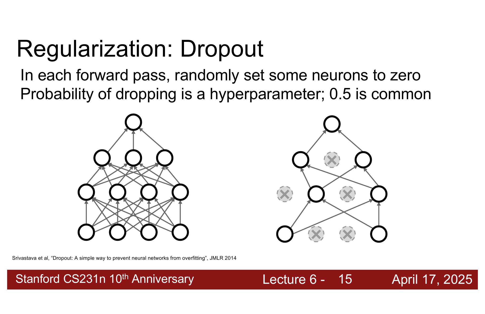

!!! explanation "我的疑惑"
    ### 疑惑：
    为什么把一些神经元置零了之后就相当于把它们剔除了，直接跟上一层和下一层都不相连了
    
    ### 解答：
    假设一个CNN如下：
    ```
    输入层        隐藏层          输出层

	x1 ───┐
	       ├──→  神经元A ───┐
	x2 ───┘                ├──→ y
	                      │
	x1 ───┐                │
	       ├──→  神经元B ───┘
	x2 ───┘
    ```
    
    输入：

	$$x= \begin{bmatrix} 1\\ 2 \end{bmatrix}，即x_1=1,\ x_2=2$$
	
	隐藏层有两个神经元：
	
	$$W_1= \begin{bmatrix} 1&1\\ 2&3 \end{bmatrix}$$
    
	则应神经元 A 为 $[1,1]$ 神经元B为 $[2,3]$
	
	$$h=W_1x=\begin{bmatrix} 3\\ 8 \end{bmatrix}$$
    
    假设输出层：

	$$W_2=[10, 100]$$

    则：
    
    $$y=10h_A+100h_B=830$$​
	现在使用 Dropout 把神经元 B 关闭。即：
	
    $$h_B=0,\ h= \begin{bmatrix} 3\\ 0 \end{bmatrix}$$
    
    $$y=W_2h=10h_A+0h_B=10h_A$$
    
    因此这个输出跟神经元B已经没关系了，所以神经元B跟下一层直接断开了。
    
    反向传播求梯度的时候:
    
    $$\frac{​∂_L}{∂_{h_B}}​=0$$
    
    所以B不更新，因为 $\frac{​∂_L}{∂_{h_B}}​=0$ ，所以从B点接着往回进行反向传播，后面的梯度也都是0。
    
    因此B点前向不任何信息，反向不接受梯度，相当于直接跟这个CNN断开了。

### 1.3.2 Dropout层为什么有用

至于 Dropout 层的设置为什么会起到作用，这更多的是经验总结，但是理论上还有待研究。

其实靠直觉理解一下也是不难的。在Lecture 2中就已经讲到正则化的作用了，Dropout就是一种正则化的方式，所以这么做也是为了不让数据过拟合，迫使网络不要太依赖某一个特征。

例如判断一张图是不是猫时，网络可能学到很多特征：

1. 有耳朵。
2. 有尾巴。
3. 毛茸茸。
4. 有爪子。

如果训练时某些特征被随机丢掉，网络就不能只依赖有耳朵这一个特征，而是要学会使用多个冗余线索。这样可以减少特征之间的 co-adaptation。

!!! explanation "co-adaptation 是什么"
    co-adaptation 可以理解为：某些神经元过度配合彼此，形成了很脆弱的判断方式。
    
    比如神经元 A 只在神经元 B 存在时才有意义，那么模型就很依赖这组固定搭配。Dropout 会随机拆掉这些搭配，逼网络学到更稳健的表示。

### 1.3.3 测试时为什么要 scale

训练时，Dropout层的部分神经元会被丢掉；测试时，所有神经元都在。如果不做任何处理，测试时的输出期望会比训练时更大。

因此需要保证：

$$
\text{test time output}=\text{expected train time output}
$$

一种方法是：训练时直接丢掉，测试时把这一层输出给下一层的 activation 乘上保留概率。

假设某个神经元原本输出为 $a$，dropout probability 为 $p$，也就是丢掉概率为 $p$，保留概率为：

$$
q=1-p
$$

训练时，这个神经元的输出会变成随机变量：

$$
\tilde{a}=
\begin{cases}
a, & \text{probability }q\\
0, & \text{probability }p
\end{cases}
$$

所以训练时它的期望输出是：

$$
\mathbb{E}[\tilde{a}]=qa+(1-q)\cdot0=qa
$$

但是测试时 dropout 关闭，所有神经元都保留。如果直接输出 $a$，就比训练时的期望 $qa$ 更大。因此这种做法会在测试时把 activation 从 $a$ 缩放成：

$$
a_{\text{test}}=qa
$$

这就是“测试时乘上保留概率”的意思。

另一种更常见的实现叫 **inverted dropout**：

1. 训练时把保留下来的 activation 除以保留概率。
2. 测试时不做额外缩放。

---

## 1.4 Activation Functions

前面讲的Convolution Layers，Fully-Connected Layers这些本质上都还是线性运算。Activation function 的作用是给CNN加入非线性。

### 1.4.1 Sigmoid

Sigmoid 的公式为：

$$
\sigma(x)=\frac{1}{1+e^{-x}}
$$

它会把输入压到 $[0,1]$ 之间：

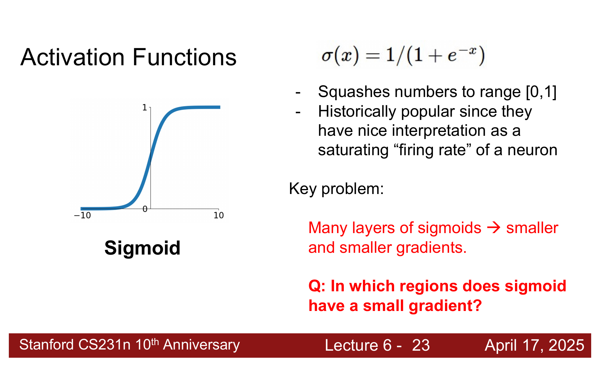

sigmoid 曾经是非常常用的激活函数。但是经验上发现：经过很多层 sigmoid 之后，反向传播的梯度会越来越小。因此现在已经没什么人用了。

对于多层网络来说，如果每一层都让梯度变小一点，那么很多层之后，前面层几乎收不到有效梯度，这就是 **vanishing gradients（梯度消失）**。

其实我们看这个图像也是一目了然，当输入很大或者很小时，梯度会非常小。


### 1.4.2 ReLU

ReLU 的公式为：

$$
f(x)=\max(0,x)
$$

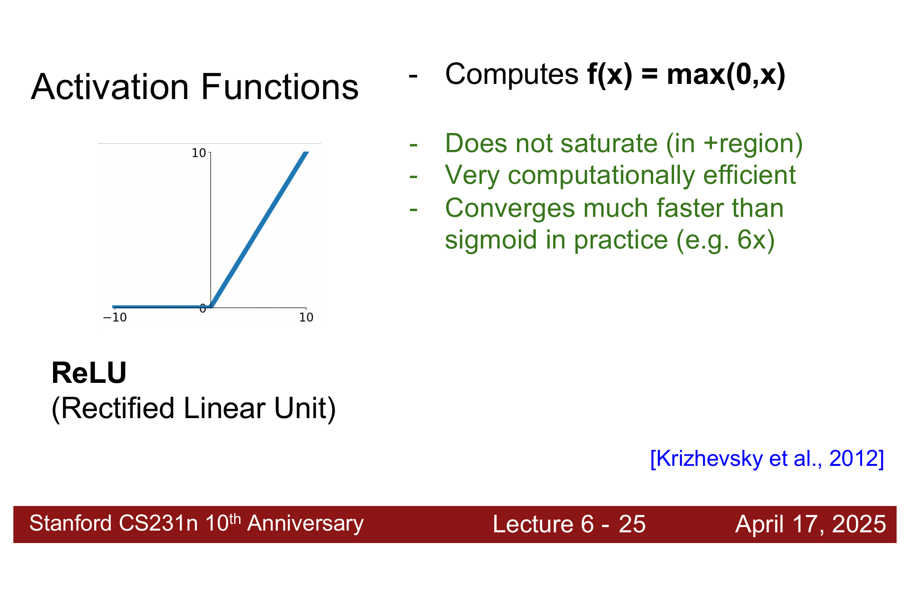

它的优点很直接：

1. 正半轴不饱和，梯度不会像 sigmoid 那样快速变小。
2. 计算非常便宜，只需要和 $0$ 比较。
3. 实践中通常比 sigmoid 收敛更快。

但是 ReLU 也有问题：当输入小于 $0$ 时，输出为 $0$，梯度也为 $0$。如果一个 ReLU 神经元长期处在负区间，它就可能再也更新不回来，这叫 **Dead ReLU**。

!!! warning "Dead ReLU"
    Dead ReLU 指的是某个神经元对几乎所有输入都输出 $0$，并且反向传播时梯度也一直是 $0$。
    
    这种神经元没法贡献有效特征。

### 1.4.3 GELU

GELU 的形式是：

$$
f(x)=x\Phi(x)
$$

!!! explanation "$\Phi(x)$"

    $\Phi(x)$ 是标准正态分布的累积分布函数:
    
    $$Φ(x)=\int_{-\infty}^{x} \frac{1}{\sqrt{2\pi}}e^{-t^2/2}\,dt$$
    
    表示一个标准正态分布的的随机数 $x$，落在 $x$ 左边的概率是多少
    
    比如 $Φ(0)=0.5$，$Φ(1)≈0.84$，$Φ(−1)≈0.16$

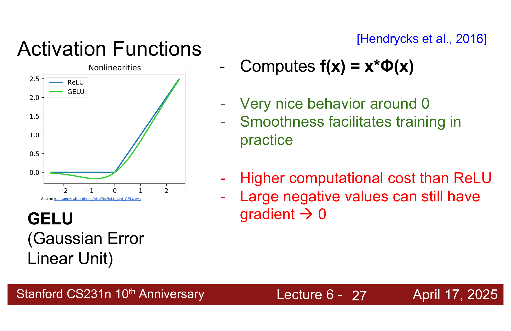

GELU 的特点是：

1. 在 $0$ 附近更平滑。
2. 负数区域不是像 ReLU 那样直接一刀切成 $0$。
3. 平滑性通常有利于训练。
4. 计算量比 ReLU 更高。

GELU 是现在非常常用的一个激活函数。
### 1.4.4 激活函数应该放在哪

激活函数一般放在线性层之后，比如全连接层，卷积层这些后面。

---

## 1.5 CNN Architectures

### 1.5.1 VGGNet

VGGNet 的思想是：不用很大的卷积核，而是大量使用小的 $3\times3$ 卷积核。

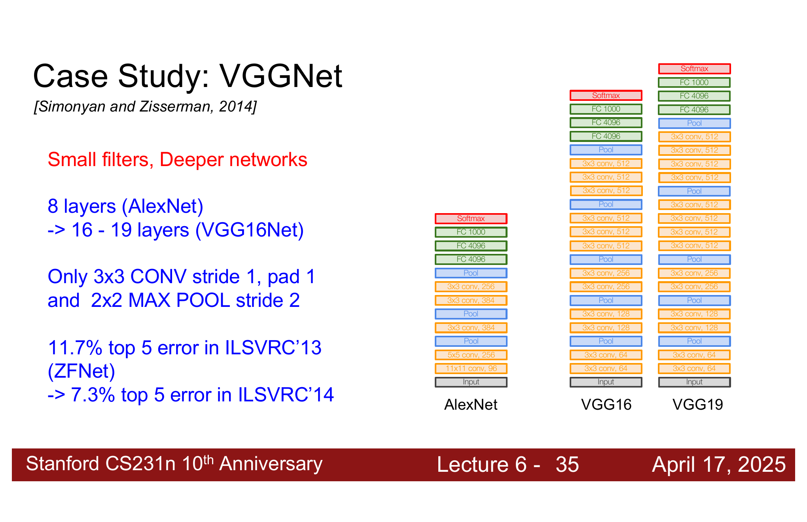
#### 1.5.1.1 为什么用小卷积核

假设连续堆叠三层 $3\times3$ 卷积，并且 stride 都是 $1$。那么感受野会这样增长：

$$
3\times3\rightarrow5\times5\rightarrow7\times7
$$

所以三层 $3\times3$ 卷积和一层 $7\times7$ 卷积有相同的 effective receptive field。

但是三层小卷积更好，因为：

1. 中间可以插入更多非线性激活函数，表达能力更强。
2. 参数量更少。

假设输入输出通道数都是 $C$，忽略 bias：

因为输出通道数为 $C$，所以这一层一共有 $C$ 个卷积核。又因为输入通道为 $C$，所以一个卷积核的规格为 $C\times 7\times 7$。

一层 $7\times7$ 卷积参数量为：

$$
C \times (C\times7\times7)=49C^2
$$


三层 $3\times3$ 卷积参数量为：

$$
3\times3\times(3\times C^2)=27C^2
$$

所以三层 $3\times3$ 的卷积层不仅比一层 $7\times7$ 的卷积层参数更少，而且是一个更加非线性的模型（每一层之间都可以引入一个非线性层）。因此参数更少却构建了更复杂的模型

!!! note "VGG 的一句话总结"
    VGG 用统一的 $3\times3$ 卷积核把网络做深，结构非常规整，容易理解，也成为后来很多视觉网络设计的基础参照。


## 1.5.2 ResNet

#### 1.5.2.1 Plain deep network 的问题

按理来说，一个CNN的层数越多，效果应该越好。因为深层网络可以把前面若干层学成浅层网络的样子，然后让额外层学成 identity mapping。

但实际中，直接堆叠很多层的 plain CNN 会出现一个问题：更深的网络不仅测试误差更高，训练误差也更高。比如下图的一个例子，一个56层的CNN反而不如一个20层的CNN：


这说明问题不是过拟合。因为如果是过拟合，训练误差应该更低，测试误差更高。这里56层的CNN的训练误差也比20层的高，所以不是过拟合的问题。而是因为==更深的 plain network 很难优化。==

#### 1.5.2.2 Residual Mapping

为了解决上面那个问题，我们引入了ResNet

ResNet 的解决方法是：不要让网络直接学习目标映射 $H(x)$，而是学习 residual mapping。

普通神经网络本来想学的是 $H(x)$，即输入 $x$ 经过这一层后直接学出最终结果 $H(x)$。而ResNet换了一个想法，它不是学最终的输出结果 $H(x)$，而是学**和最终输出结果相比，输入 $x$ 需要修改多少**，即：


$$
F(x)=H(x)-x
$$

这里的 $F(x)$ 就叫**Residual Mapping**

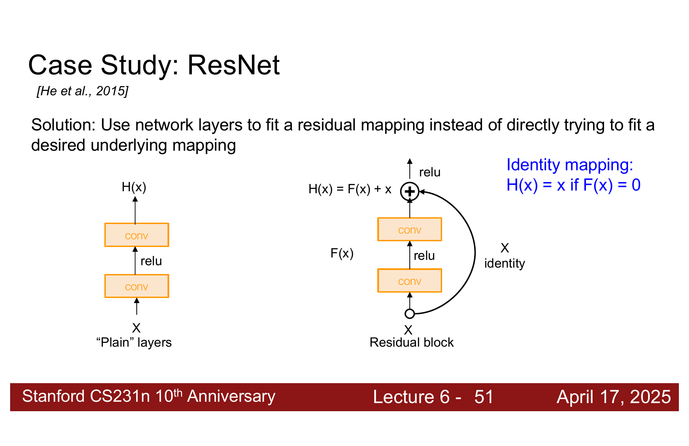

如果最优情况只需要 identity mapping，那么 residual block 只要让：

$$
F(x)=0
$$

就可以得到：

$$
H(x)=x
$$

这比让几层卷积学出 identity mapping 容易很多


更准确地说：

普通网络想直接学习 $H(x)$。但如果这个某几层其实不需要改变输入，理想情况就是 $H(x)=x$，这个时候，普通网络必须让这几层卷积**自己学会原样复制 x**，这件事理论上能做到，但实际优化并不容易。ResNet只需要让 $F(x)=0$ 就能做到 $H(x)=x$。


### 1.5.3 ResNet 的整体结构

!!! explanation "我的疑问"
    ### 我的疑问：
    ResNet的意思就是这一整个CNN都用ResNet的方式连接吗？
    ### 解答：
    ResNet本身就是一种CNN架构。它不是一个和CNN并列的东西，也不是在一个CNN外面再套一个模块。
    
    普通 CNN 可能是这样：

    $$\text{Conv}\rightarrow\text{Conv}\rightarrow\text{Conv}\rightarrow\text{Conv}$$

    ResNet 仍然使用卷积层，只是把若干个卷积层组成一个 **Residual Block（残差块）**：

    $$x\rightarrow \boxed{\text{Conv}\rightarrow\text{Conv}}\rightarrow F(x)$$
    
    不是每一个单独的卷积层都各自加一条 shortcut。通常是**两层或三层卷积组成一个残差块**因此更准确地说：

    > ResNet 的主体由许多个 Residual Block 堆叠而成，但开头、结尾以及某些改变尺寸的位置，不一定都是最简单的 $F(x)+x$。

一般来说，我们要测试一组不同层数的CNN的好坏，比如给定了这几个层数的CNN：18、34、50、101、152 层。我们会先训练层数最少的模型，在这里也就是先训练18层的CNN，训练完之后看看效果。然后再训练34层的模型，看看效果会不会比34层的更好，以此类推。

层数肯定不是越多越好，层数太多的话，学习能力太大了也没必要。而且还要考虑GPU显存限制，模型越大，硬件要求越高。

!!! note "ResNet 的一句话总结"
    ResNet 不是简单地把网络做深，而是通过 skip connection 让很深的网络仍然容易优化。

### 1.5.4 VGG 和 ResNet 的区别

**VGG 的思路：**

1. 用很多 $3\times3$ 小卷积。
2. 网络更深，非线性更多。
3. 结构规整，但是深到一定程度后会难训练。

**ResNet 的思路：**

1. 继续把网络做得更深。
2. 用 residual connection 解决深层网络难优化问题。
3. 让每个 block 学 residual，而不是直接学完整映射。


## 1.6 Weight Initialization

### 1.6.1 初始化太小会怎样

如果权重初始化太小，前向传播时每一层输出都会越来越接近 $0$。网络越深，这个问题越明显。

结果是：

1. activation 逐层趋近于 $0$。
2. 反向传播时梯度也可能变得很小。
3. 前面层几乎学不动。


### 1.6.2 初始化太大会怎样

如果权重初始化太大，activation 会在前向传播中快速爆炸，越往后层数值越大。

这会导致：

1. loss 不稳定。
2. 梯度也可能爆炸。
3. 训练很容易发散。
4. 均值和标准差都大的要死。

所以初始化不是随便给一堆随机数就行。随机数的尺度要和 layer 的输入维度匹配。


### 1.6.3 Kaiming / MSRA Initialization

对于 ReLU 网络，常用 **Kaiming Initialization**，也叫 **MSRA Initialization**。

它的标准差通常取：

$$
\operatorname{std}=\sqrt{\frac{2}{D_{in}}}
$$

其中 $D_{in}$ 是这一层的输入维度，也叫 fan-in。

这是何凯明教授的团队创造出来的，关于他们是如何推导、并在ReLU激活下证明这一点的，老师也没有展开细讲，知道一下就好了。他确实实现了均值和标准差不变的理想效果，如下图所示：

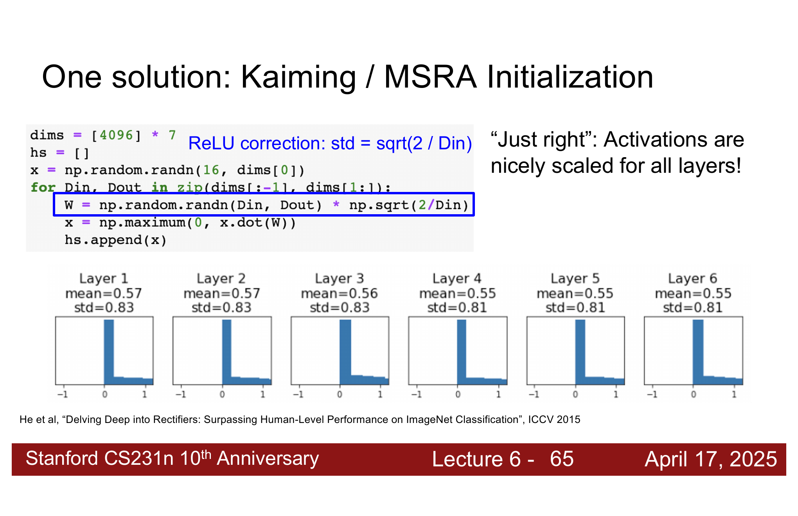

---

# 2. How to train CNNs

## 2.1 Data Preprocessing

数据预处理：一个图像集在输入网络之前需要进行预处理，标准做法是算出每个像素的平均值和标准差。然后用每个像素减去平均值之后再除以标准差，也就是normalization。

对于 RGB 图片，会分别计算三个通道的均值和标准差，然后对每个像素做：

$$
x'_{c,h,w}=\frac{x_{c,h,w}-\mu_c}{\sigma_c}
$$

其中 $c$ 表示通道。

## 2.2 Data Augmentation（数据增强）

### 2.2.1 Regularization 的共同模式

Training 和 Testing 的一些经验：

1. Training: Add some kind of randomness
    - 在训练的时候，故意加入一些随机干扰
2. Testing: Average out randomness
    - 真正使用网络预测试，不希望答案也随机，所以要消除或平均这些随机
 
以 Dropout 为例：

1. 训练时随机丢 activation。
2. 测试时使用全部 activation，并调整期望。

Data augmentation 也是这样：

1. 训练时随机改变输入图片。
    - 比如给输入图像翻转一下，调节一下亮度，将图像给裁剪了
2. 测试时使用固定图像，或者平均多个 crop 的结果。

### 2.2.2 Data Augmentation 的基本流程

训练时不是直接把原图送入 CNN，而是先随机变换图片：

这些随机变换不应该改变图片类别。例如：

1. 一只猫水平翻转后仍然是猫。
2. 随机裁剪后，如果主体还在，类别也不变。
3. 轻微改变亮度和对比度后，物体类别不变。
4. Cutout：在训练时，将图像中的某个区域设置为0，类别也不变。

!!! explanation "Cutout"
    Cutout 会在训练时随机把图像中的某个区域设为 $0$。
    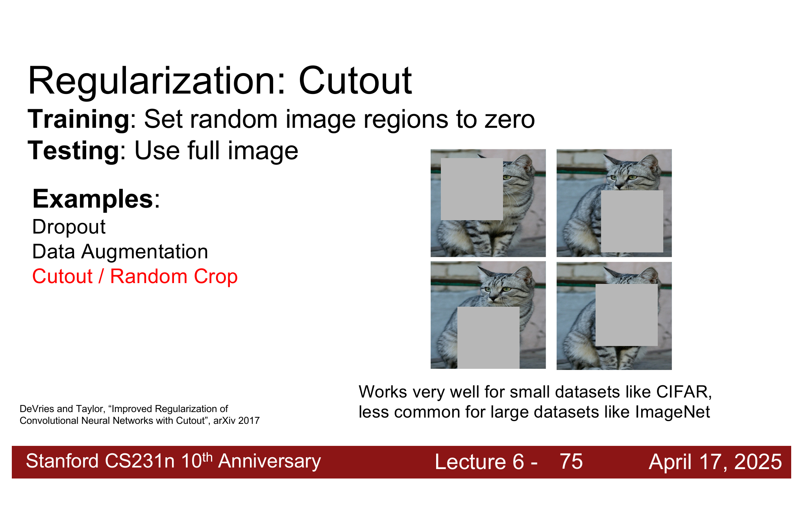

    它的目的和 dropout 有点像：不要让模型只盯着某个最明显的局部区域。它们都在训练时加入随机性，迫使模型学习更冗余、更稳健的表示。

    例如模型如果总是靠猫脸判断猫，那么 cutout 有时遮住猫脸后，模型就被迫学习身体、毛色、姿态等其他线索。
    
    ### Dropout和Cutout的区别：

    - Dropout 是在 feature 或 neuron 层面随机丢信息。
    
    - Cutout 是在输入图像层面随机丢一块区域。
    

---

## 2.3 Transfer Learning

## 2.3.1 为什么需要迁移学习

如果自己的数据集很小，从零训练一个大 CNN 通常很困难：

1. 数据太少，容易过拟合。
2. 大模型参数很多，需要大量样本。
3. 从随机初始化开始训练成本高。

迁移学习的思路是：先在一个大数据集上训练模型，例如 ImageNet；再把这个模型迁移到自己的任务上。

### 2.3.2 CNN 的前面层和后面层学到什么

CNN 的不同层通常有不同的特征抽象程度：

1. 前面层更 generic，学习边缘、颜色、纹理等通用特征。
2. 后面层更 specific，学习和原任务类别更相关的高层语义。

因此，如果新任务和 ImageNet 类似，很多前面层特征可以直接复用。
### 2.3.3 小数据集怎么做

如果新数据集很小，并且和预训练数据集很相似，可以：

1. 保留预训练 CNN 的卷积层。
2. 冻结这些层的参数。
3. 替换最后的分类层。
4. 只训练新的分类层。

例如原来 ImageNet 有 $1000$ 类，最后一层是：

$$
\text{FC-1000}
$$

如果自己的任务有 $C$ 类，就把它换成：

$$
\text{FC-C}
$$

然后只训练这一层。


## 2.3.4 数据更多时怎么做

如果新数据集比较大，可以 fine-tune 更多层，甚至 fine-tune 整个模型。

常见做法：

1. 用迁移过来的权重作为初始化模型。
2. 替换最后面的分类层。
3. 用较小学习率训练整个网络。

因为数据更多，所以模型可以安全地调整更多参数，不容易因为样本太少而过拟合。而数据少的时候就只重新调整FC-C中的参数。


### 2.3.5 根据数据量和相似度选择策略

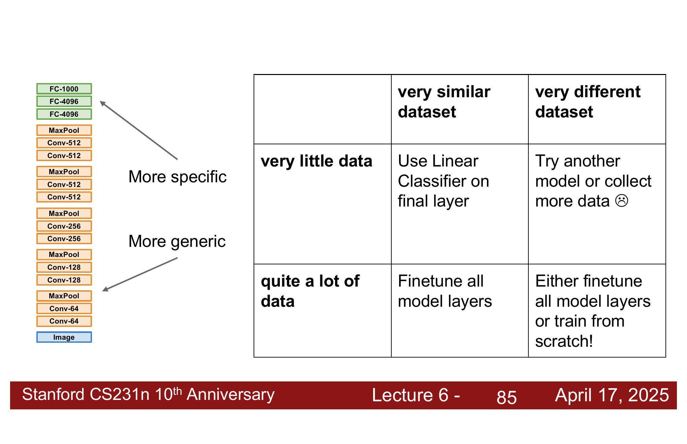

可以按两个维度判断：

##### 1. **数据集很相似，数据很少：**

只训练最后的线性分类器。

##### 2. **数据集很相似，数据较多：**

fine-tune 整个模型。

##### 3. **数据集很不同，数据很少：**

这个最麻烦。可以尝试找更接近的预训练模型，或者收集更多数据。

##### 4. **数据集很不同，数据较多：**

可以 fine-tune 整个模型，也可以考虑从零训练。

!!! note "项目中的实用结论"
    如果你有一个自己的视觉数据集，但数量少于大约一百万张图片，通常不要从零开始训练大模型。
    
    更实际的路线是：找一个在大规模相似数据上预训练过的模型，然后迁移到自己的数据集。

## 2.3.6 Model Zoo

现代深度学习框架通常提供 **Model Zoo**，也就是很多已经训练好的模型。这样我们不需要自己从头训练 ImageNet 级别的大模型。

常见来源：

1. PyTorch torchvision。
2. HuggingFace / timm。
3. 各种官方论文仓库。

---

## 2.4 Hyperparameter Selection

### 2.4.1 选择超参数的整体流程

一个非常实用的 checklist：

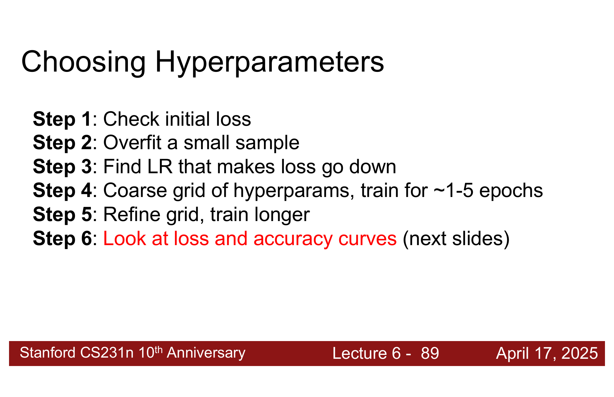

完整流程如下：

**Step 1: Check initial loss**

先检查随机初始化时的 loss 是否合理。例如 $C$ 分类 softmax，如果初始时每一类分数差不多，那么 loss 应该接近：

$$
\log C
$$

如果 CIFAR-10 有 10 类，那么初始 loss 大概是：

$$
\log 10\approx2.302
$$

如果初始 loss 离这个值特别远，可能是 loss 实现、label、正则化或数据预处理有问题。

**Step 2: Overfit a small sample**

拿很小的一部分数据，例如几十张图片，尝试把训练准确率做到接近 $100\%$。

如果连一个小样本都过拟合不了，说明模型、loss、反向传播或优化流程可能有 bug。

**Step 3: Find LR that makes loss go down**

使用全部训练数据，打开小的 weight decay，尝试不同学习率，找到能让 loss 在前约 100 次迭代内明显下降的学习率。

常见候选：

```text
1e-1, 1e-2, 1e-3, 1e-4, 1e-5
```

**Step 4: Coarse grid of hyperparams**

粗略搜索超参数，训练大约 1 到 5 个 epoch，先找大致范围。

**Step 5: Refine grid, train longer**

在粗搜索得到的好范围附近精细搜索，并训练更久。

**Step 6: Look at loss and accuracy curves**

观察训练集和验证集曲线，判断模型正在发生什么。

**Step 7: GOTO step 5**

根据曲线继续调整，循环迭代。

### 2.4.2 怎么看 accuracy 曲线

#### 2.4.2.1 训练还不够久

如果 train accuracy 和 val accuracy 都还在上升，说明模型可能还没训练够。

此时可以继续训练更久，或者调整 learning rate schedule。


#### 2.4.2.2 过拟合

如果 train accuracy 很高，但 val accuracy 明显低很多，中间有很大的 gap，说明过拟合。

处理方法：

1. 增加 regularization，例如 weight decay、dropout、data augmentation。
2. 收集更多数据。
3. 适当减小模型容量。
4. 更早停止训练。


#### 2.4.2.3 欠拟合

如果 train accuracy 和 val accuracy 都不高，而且二者之间几乎没有 gap，说明模型连训练集都学不好，可能是欠拟合。

处理方法：

1. 训练更久。
2. 使用更大的模型。
3. 减小过强的 regularization。
4. 检查学习率是否太小或优化是否有问题。

### 2.4.3 Random Search vs Grid Search

##### 1. Grid Search：

> 先给每个超参数规定几个固定取值，然后把所有组合都试一遍。

比如学习率只试：

$$0.001,\ 0.01,\ 0.1$$

weight decay 只试：

$$0,\ 0.001,\ 0.01$$

那么这样子就会出现9种组合，我们得把这9种组合都试一遍。

##### 2. Random Search

根据字面意思理解，就是在一定范围里随机抽一些组合。

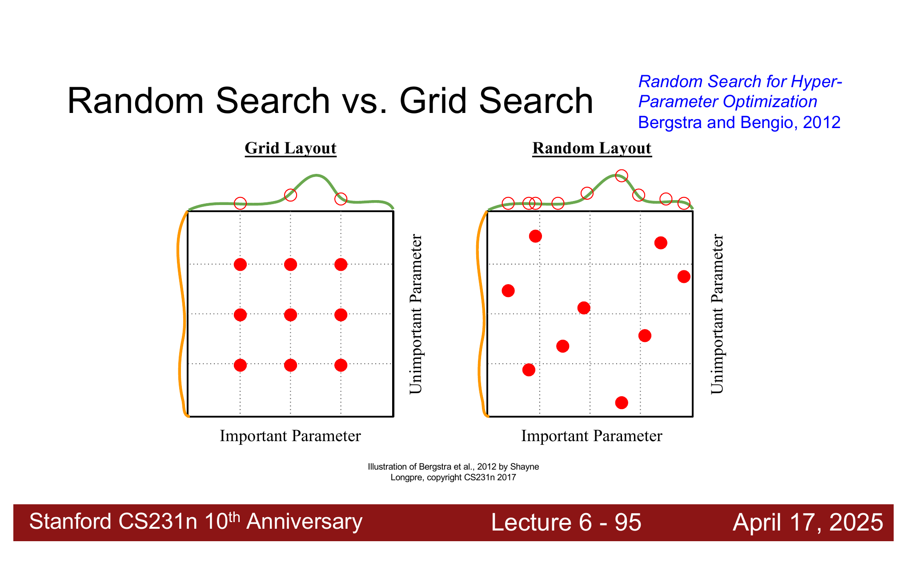

如果有两个超参数，其中一个很重要，另一个不太重要，grid search 可能会浪费很多实验在不重要的维度上。

Random search 的优点是：它能在每个维度上尝试更多不同取值，尤其当只有少数超参数真正重要时，random search 往往更高效。

!!! explanation "为什么 Random Search 常常更好"
    假设学习率很重要，weight decay 暂时没那么重要。
    
    Grid search 可能只试了 3 个学习率，但在每个学习率下搭配很多 weight decay。
    
    Random search 则可能试到更多不同学习率。因为学习率才是真正敏感的参数，所以 random search 更容易找到好区域。

---

# 3. 总结


## 3.1 CNN 组件

CNN 中不仅有 conv、pool、fc，还经常有 normalization、dropout 和 activation function。

Normalization 稳定每层数值分布，dropout 做正则化，activation function 加入非线性。

## 3.2 激活函数

Sigmoid 容易饱和并导致梯度消失；ReLU 简单高效，但可能出现 dead ReLU；GELU 更平滑，在现代网络中很常见。

## 3.3 CNN 架构

VGG 用很多小的 $3\times3$ 卷积堆深网络。ResNet 用 residual connection 让非常深的网络更容易优化。

## 3.4 权重初始化

初始化太小会让 activation 消失，初始化太大会让 activation 爆炸。对于 ReLU 网络，Kaiming initialization 使用：

$$
\operatorname{std}=\sqrt{\frac{2}{D_{in}}}
$$

来保持各层 activation 的尺度稳定。

## 3.5 图像预处理

现代模型通常对每个 channel 减均值、除标准差：

$$
x'_{c,h,w}=\frac{x_{c,h,w}-\mu_c}{\sigma_c}
$$

## 3.6 数据增强

训练时加入随机变换，例如 horizontal flip、random crop、color jitter、cutout。测试时使用固定输入，或者使用 test time augmentation 平均多个预测。

## 3.7 迁移学习

数据不够时，优先使用在大规模数据集上预训练好的模型。数据越少、任务越相似，就越应该冻结大部分层，只训练最后分类器；数据越多，就越可以 fine-tune 更多层。

## 3.8 超参数选择

固定流程：

1. 检查 initial loss。
2. 在小样本上过拟合。
3. 找到能让 loss 下降的 learning rate。
4. 粗搜索超参数。
5. 精细搜索并训练更久。
6. 看 train / val 曲线判断过拟合或欠拟合。
7. 使用 random search 往往比 grid search 更有效。

!!! note "Lecture 6 最重要的主线"
    这节课不是在介绍一个单独的新公式，而是在回答一个更工程化的问题：
    
    > 已经知道卷积层怎么工作以后，怎样把 CNN 真正搭起来、训起来、调起来？
    
    VGG 和 ResNet 解决的是“怎么搭”；初始化、预处理、增强、迁移学习和超参数搜索解决的是“怎么训”。
