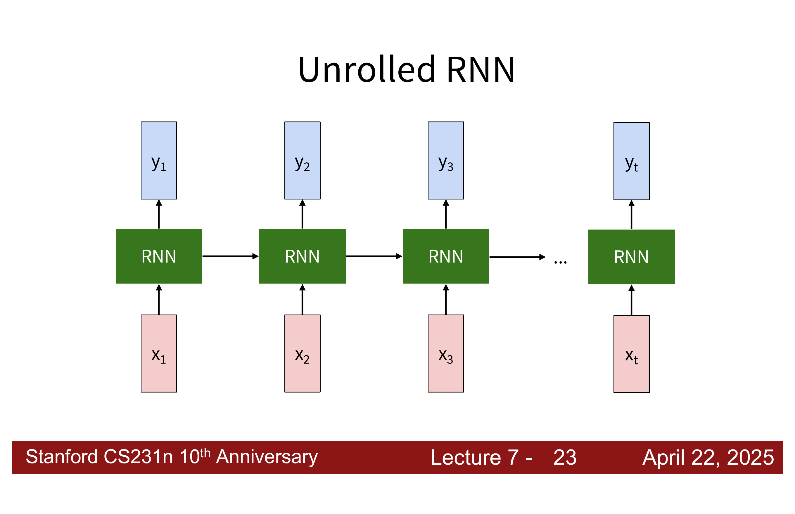
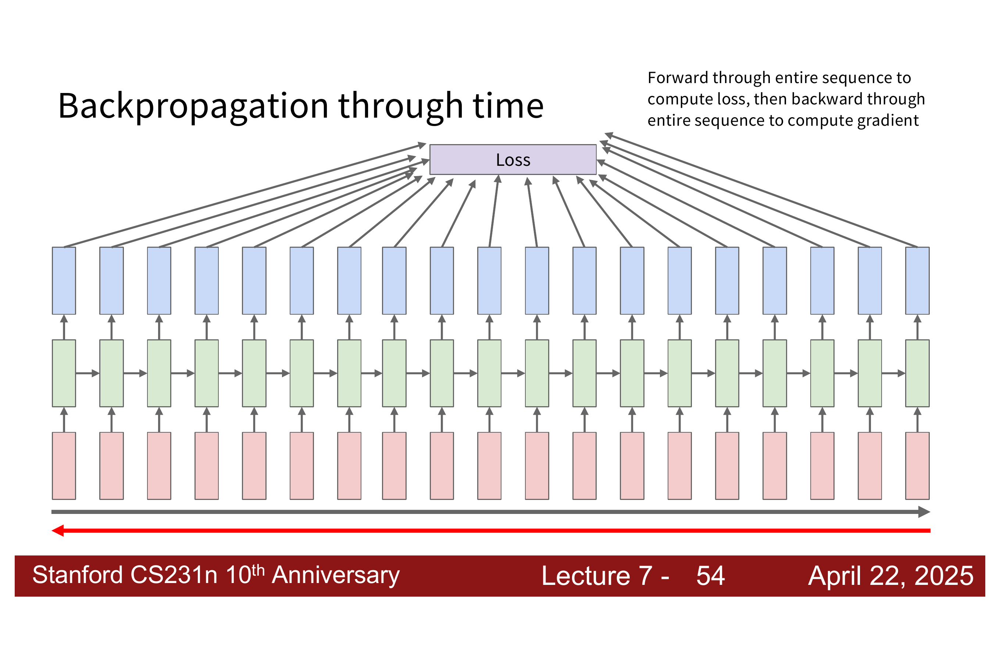
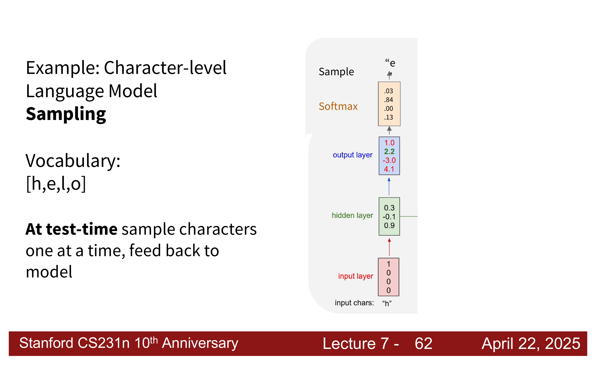
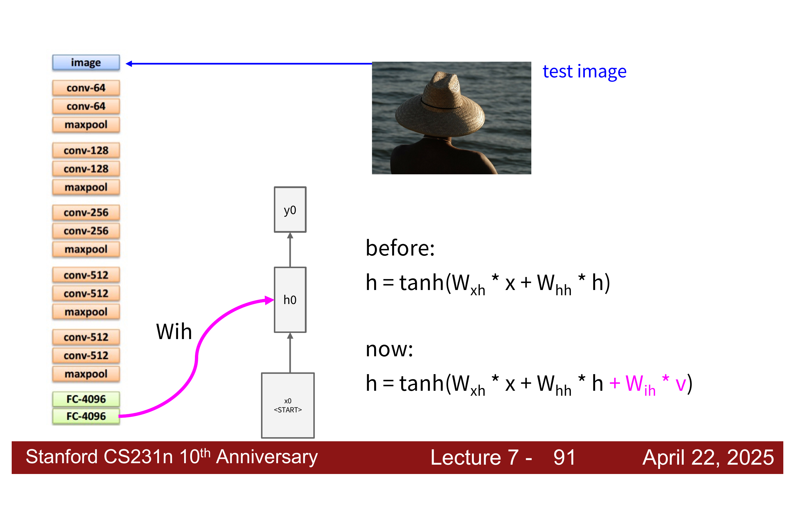
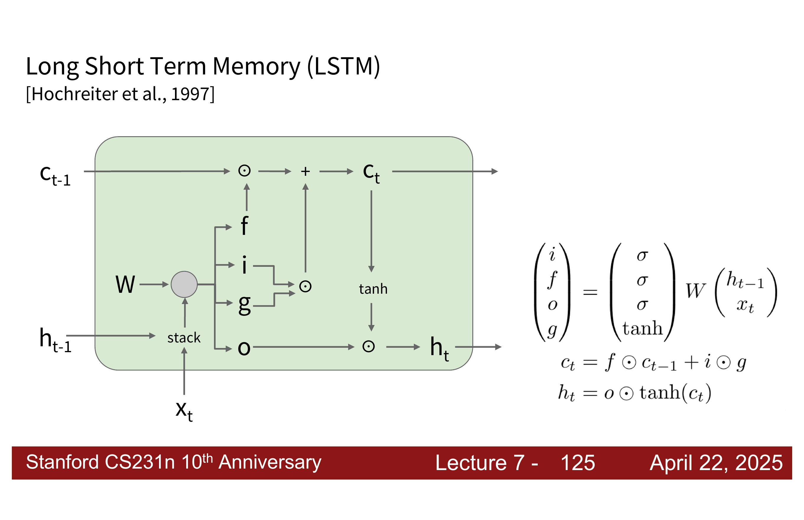
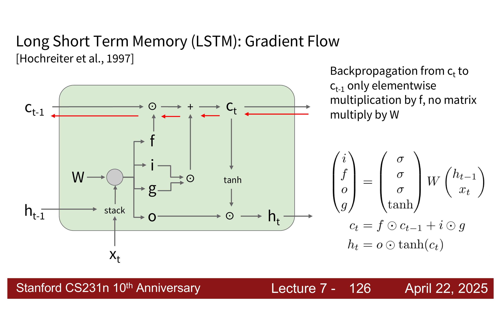

# 1. 为什么需要 Recurrent Neural Networks

前面几讲主要处理的是固定长度输入。例如一张图片经过 CNN 后，最后得到一个固定维度的 feature vector，再接一个分类器输出类别分数。

但是现实中有很多任务不是一个输入对应一个固定输出这么简单，而是和**序列**有关。

1. **Image Captioning**：输入一张图片，输出一句话。
2. **Action Prediction**：输入一段视频帧序列，输出动作类别。
3. **Video Captioning**：输入一段视频，输出一句描述。
4. **Frame-level Video Classification**：输入视频序列，对每一帧都输出一个标签。
5. **Language Model**：输入前面的字符或单词，预测下一个字符或单词。

这些任务的共同点是：输入或输出不是一个孤立的数据点，而是一串按照时间或者顺序排列的数据。

!!! explanation "序列模型的核心问题"
    对于序列任务来说，模型不能只看当前输入。
    
    比如一句话中看到当前词是 `bank`，它到底是银行还是河岸，通常要看前后文。视频中某一帧看起来像人在抬腿，但到底是走路、跑步还是踢球，也要看前后几帧。
    
    所以模型需要一种机制，把之前看到的信息保存下来，再用来理解当前时刻。

RNN 的关键想法就是：==让网络带有一个会随时间更新的 hidden state。==

这个 hidden state 可以理解为模型的记忆。模型每读入一个新的输入，就把旧记忆和新输入结合起来，得到新的记忆。说白了这就是信号与系统里面学的那个记忆系统。

---

# 2. RNN 的基本结构

## 2.1 RNN 的 internal state

普通神经网络通常可以写成：

$$
y=f(x;W)
$$

它只关心当前输入 $x$。

而 RNN 在处理第 $t$ 个输入 $x_t$ 时，还会接收上一时刻的 hidden state $h_{t-1}$，然后更新出新的 hidden state $h_t$：

$$
h_t=f_W(h_{t-1},x_t)
$$

如果还需要在每个时间步输出一个结果，则再用另一个函数从 $h_t$ 生成输出：

$$
y_t=g_W(h_t)
$$



## 2.2 展开后的 RNN

虽然 RNN 看起来像一个循环结构，但是为了理解训练过程，我们通常把它沿着时间展开：


展开之后，它就像一个很深的神经网络，只不过这个深度取决于时间步数。

最重要的一点是：==每个时间步使用的是同一套参数。==

假设 vanilla RNN 使用如下形式：

$$
h_t=\tanh(W_{hh}h_{t-1}+W_{xh}x_t+b_h)
$$

输出层可以写成：

$$
y_t=W_{hy}h_t+b_y
$$

其中：

1. $W_{xh}$ 负责把当前输入 $x_t$ 变成 hidden state 的一部分。
2. $W_{hh}$ 负责把旧 hidden state $h_{t-1}$ 传到新 hidden state $h_t$。
3. $W_{hy}$ 负责把 hidden state 映射成输出。

---

# 3. 一个手工设计 RNN 的例子

给定一个由 $0$ 和 $1$ 组成的序列，希望模型在当前位置和前一个位置都是 $1$ 时输出 $1$，否则输出 $0$。

例如：

```text
输入 X: 0 1 0 1 1 0 1 1
输出 Y: 0 0 0 0 1 0 0 1
```

这个任务的关键在于：判断当前输出时，不仅要知道当前输入 $x_t$，还要知道上一个输入 $x_{t-1}$。

因此 hidden state 至少要保存两个信息：

1. 当前输入是不是 $1$。
2. 上一个输入是不是 $1$。

我们可以这样定义hidden state：

$$h_t = \begin{bmatrix} current\ value\\ previous\ value\\1 \end{bmatrix}$$

也就是：

1. 第一维保存当前输入 $x_t$。
2. 第二维保存上一时刻 hidden state 的第一维，也就是上一时刻的 current value。因为上一时刻的 current value 正好等于 $x_{t-1}$，所以它也可以理解为 previous input。
3. 第三维永远保存常数 $1$，后面输出时拿它当 bias 用。

RNN 更新公式可以用 $ReLU$：

$$
h_t=\operatorname{ReLU}(W_{hh}h_{t-1}+W_{xh}x_t)
$$

输出为：

$$
y_t=\operatorname{ReLU}(W_{hy}h_t)
$$

```python
import numpy as np

def relu(x):
    return np.maximum(x, 0)

w_xh = np.array([[1],
                 [0],
                 [0]])

w_hh = np.array([[0, 0, 0],
                 [1, 0, 0],
                 [0, 0, 1]])

w_yh = np.array([1, 1, -1])

x_seq = [0, 1, 0, 1, 1, 1, 0, 1, 1]
h_t_prev = np.array([[0],
                     [0],
                     [1]])

for t, x in enumerate(x_seq):
    h_t = relu(w_hh @ h_t_prev + w_xh * x)
    y_t = relu(w_yh @ h_t)
    h_t_prev = h_t
```

!!! explanation "为什么 $W_{xh}$ 要这样设""

	因为 $x_t$ 是一个标量，所以：
	
	$$W_{xh}x_t=
	\begin{bmatrix}
	1\\
	0\\
	0
	\end{bmatrix}
	x_t
	=
	\begin{bmatrix}
	x_t\\
	0\\
	0
	\end{bmatrix}$$
	
	当 $x_t=0$：
	
	
	$$W_{xh} x_t = 	\begin{bmatrix}
	1\\
	0\\
	0
	\end{bmatrix}$$
	
	
	当 $x_t=1$：
	
	$$W_xh x_t = 	\begin{bmatrix}
	1\\
	0\\
	0
	\end{bmatrix}$$
	
	所以第一维会变成 current value。

!!! explanation "为什么 $W_{hh}$ 要这样设"

	$$
	W_{hh}=
	\begin{bmatrix}
	0 & 0 & 0\\
	1 & 0 & 0\\
	0 & 0 & 1
	\end{bmatrix}
	$$
	
	假设上一时刻：
	
	$$
	h_{t-1}=
	\begin{bmatrix}
	\text{old current}\\
	\text{old previous}\\
	1
	\end{bmatrix}
	$$
	
	那么矩阵乘法得到：
	
	$$
	W_{hh}h_{t-1}
	=
	\begin{bmatrix}
	0\\
	\text{old current}\\
	1
	\end{bmatrix}
	$$
	


!!! explanation "为什么 $W_{hy}$ 要这样设"
	
	$$
	W_{hy}=
	\begin{bmatrix}
	1 & 1 & -1
	\end{bmatrix}
	$$
	
	代入：
	
	$$
	W_{hy}h_t
	=
	\begin{bmatrix}
	1 & 1 & -1
	\end{bmatrix}
	\begin{bmatrix}
	\text{current}\\
	\text{previous}\\
	1
	\end{bmatrix}
	=
	\text{current}+\text{previous}-1
	$$
	
	再经过 ReLU：
	
	$$
	y_t=\max(\text{current}+\text{previous}-1,0)
	$$
	
	如果 current 和 previous 都是 $1$，结果就是 $1$；否则就是 $0$。
	
	具体看四种情况：
	
	```text
	current previous   current + previous - 1   ReLU 后输出
	0       0          -1                       0
	1       0           0                       0
	0       1           0                       0
	1       1           1                       1
	```
	
	所以 $W_{hy}$ 的作用就是把**连续两个1**的逻辑判断写出来。


---

# 4. RNN 的计算图类型

## 4.1 Many to Many

Many to Many 指的是每个时间步都有输入，也有输出：


典型例子：

1. 对视频中的每一帧做分类。
2. 对句子中的每个单词做词性标注。
3. 对序列中每个位置预测一个标签。

总 loss 通常会把每个时间步的 loss 加起来：

$$
L=\sum_{t=1}^{T}L_t
$$

## 4.2 Many to One

Many to One 指的是输入是一整个序列，但是只在最后输出一个结果：


典型例子：

1. 输入一段视频，判断整个视频里的动作类别。
2. 输入一句评论，判断情感是正面还是负面。
3. 输入一段传感器序列，判断某个事件是否发生。


不过这幅图我个人感觉有一点点小问题，因为因为 RNN 的递推是：

$$ h_t=f_W(h_{t-1},x_t) $$

所以一路展开就是：

$$\begin{align*} h_1 &= f_W(h_0, x_1) \\ h_2 &= f_W(h_1, x_2) \\ h_3 &= f_W(h_2, x_3) \end{align*}$$
一直到：

$$ h_T=f_W(h_{T-1},x_T)$$ 
因此 $h_T$ 理论上已经是看过 $x_1,x_2,\dots,x_T$ 之后得到的最终记忆状态。它不是只包含 $x_T$，而是把前面的信息一步步压缩进来了。

这时候通常只取最后一个 hidden state $h_T$ 来做分类：

$$
y=W_{hy}h_T+b_y
$$

但是这幅图却把所有的 $h_i$ 都画了箭头指向 $y$，我感觉它想表达的意思应该是 $y$ 跟所有的 $h_i$ 都有关，但是真正求 $y$ 的时候我们只需要带入 $h_T$ 就行了。
## 4.3 One to Many

One to Many 指的是只有一个输入，但是要生成一串输出：


典型例子就是 image captioning：输入一张图片，输出一句描述。

一种做法是把图片特征作为第一个输入，之后每一步把上一步生成的词再喂回模型。

```text
image feature -> "a" -> "cat" -> "sitting" -> ...
```

---

# 5. Backpropagation Through Time

## 5.1 BPTT 的基本想法

RNN 沿时间展开后，本质上就是一个很深的计算图。因此训练 RNN 时，也可以先 forward 走完整个序列，算出 loss，然后再 backward 回去。

这个过程叫 **Backpropagation Through Time（BPTT）**。



1. 从 $t=1$ 到 $t=T$，一步步更新 hidden state。
2. 根据输出算 loss。
3. 从最后的 loss 开始，沿着时间反向传播梯度。
4. 因为所有时间步共享参数，所以每个时间步产生的参数梯度都会累加到同一套参数上。

!!! explanation "为什么叫 through time"
    普通反向传播是沿着层往回传。
    
    RNN 展开后，时间步也变成了计算图上的层。所以梯度不仅要穿过网络层，还要穿过时间。

## 5.2 Truncated BPTT

如果序列很长，完整 BPTT 会有两个问题：

1. 计算图太长，显存和时间开销很大。
2. 梯度要穿过太多时间步，容易消失或者爆炸。

所以实践中经常使用 **Truncated BPTT**。

它的做法是：hidden state 可以一直往前传，但是反向传播只回传固定长度的一小段。


也就是说，模型在前向传播时仍然记得很久以前的信息，但在训练时不会让梯度无限远地传回去。

!!! warning "Truncated BPTT 的代价"
    Truncated BPTT 更省计算，也更稳定。
    
    但是它会限制模型直接从很远的 loss 学到早期时间步的参数影响。长距离依赖仍然需要依靠 hidden state 自己学会保存信息。

---

# 6. Character-level Language Model

## 6.1 语言模型在做什么

语言模型的目标是根据前面的内容预测下一个 token。

假设词表为：

```text
[h, e, l, o]
```

训练序列是：

```text
hello
```

那么模型要学习的是：

```text
h -> e
e -> l
l -> l
l -> o
```

也就是在每个时间步输入当前字符，输出下一个字符的概率分布。

## 6.2 one-hot、embedding 和输出概率

在语言模型里，字符或者单词本身不能直接丢进神经网络。神经网络只能处理数字，所以第一步要把 token 变成向量。

这里有两个常见概念：**one-hot** 和 **embedding**。

!!! explanation "one-hot 是什么"
    one-hot 可以理解为“用位置表示 token”。
    
    如果词表里一共有 $V$ 个 token，那么每个 token 都可以表示成一个长度为 $V$ 的向量。
    
    这个向量只有一个位置是 $1$，其他位置全是 $0$。哪个位置是 $1$，就表示它是词表里的第几个 token。
	
	例如词表为 `[h,e,l,o]`，字符 `h` 可以写成：
	
	$$
	x_h=
	\begin{bmatrix}
	1\\
	0\\
	0\\
	0
	\end{bmatrix}
	$$
	
	同理：
	
	```text
	h = [1, 0, 0, 0]
	e = [0, 1, 0, 0]
	l = [0, 0, 1, 0]
	o = [0, 0, 0, 1]
	```
	
	one-hot 的好处是简单，坏处也很明显：它只表示编号，没有任何语义。
	
	比如在 one-hot 空间里，`h`、`e`、`l`、`o` 只是四个不同位置。模型一开始并不知道哪些字符经常一起出现，也不知道哪些 token 在含义上接近。
	
	所以我们通常会再加一个 **embedding layer**。

!!! explanation "embedding 是什么"
    embedding 可以理解为：给每个 token 学一个更短、更稠密的向量表示。
    
    one-hot 是固定的 0/1 编号，embedding 是训练过程中学出来的参数。
    
    例如模型可能把字符映射成 3 维向量：
    
    ```text
    h -> [ 0.2, -1.3,  0.7]
    e -> [ 1.1,  0.4, -0.2]
    l -> [-0.5,  0.9,  1.6]
    o -> [ 0.8, -0.1,  0.3]
    ```
    
    这些数字不是人工规定的，而是和 RNN 其他参数一起训练出来的。
	
	如果 embedding matrix 是 $E$，它的每一列对应一个 token 的 embedding：
	
	$$
	E=
	\begin{bmatrix}
	| & | & | & |\\
	e_h & e_e & e_l & e_o\\
	| & | & | & |
	\end{bmatrix}
	$$
	
	那么 one-hot vector 乘上 embedding matrix，本质上就是从矩阵中取出对应的一列。
	
	例如：
	
	$$
	E
	\begin{bmatrix}
	1\\
	0\\
	0\\
	0
	\end{bmatrix}
	=e_h
	$$
	
	所以 embedding layer 本质上很像一个查表操作：
	
	```text
	token -> one-hot -> 查 embedding table -> dense vector
	```

!!! explanation "Embedding layer 的直觉"
    one-hot vector 本身没有语义相似性。
    
    `h` 和 `e` 在 one-hot 空间里只是两个完全不同的位置。
    
    embedding layer 的作用是给每个 token 学一个稠密向量，让模型用更适合训练的连续表示来处理字符或单词。

RNN 得到 hidden state 后，会通过输出层得到每个字符的 score，再经过 softmax 变成概率：

$$
p(y_t\mid x_{\le t})=\operatorname{softmax}(W_{hy}h_t+b_y)
$$



## 6.3 Test time sampling

训练时，模型知道正确答案，所以可以用真实的下一个字符计算 loss。

测试时，模型不知道下一个字符，只能自己生成：

1. 输入起始字符。
2. 模型输出下一个字符的概率分布。
3. 从这个分布中采样一个字符。
4. 把采样出来的字符再作为下一步输入。
5. 重复直到生成结束。

这就是语言模型生成文本的基本过程。

!!! note "采样不是每次都取最大概率"
    如果每一步都取概率最大的 token，生成结果可能会比较单调。
    
    从概率分布中 sampling 可以保留随机性，让模型生成更多样的结果。

---

# 7. RNN 的优缺点

## 7.1 RNN 的优点

RNN 的优点主要来自它的递归结构。

1. **可以处理任意长度的输入**。序列长一点或者短一点，都可以按时间步一个个处理。
2. **参数量不会随序列长度增加**。因为每个时间步共享同一套参数。
3. **理论上可以利用很久以前的信息**。只要 hidden state 里保存了相关信息，后面时间步就能用到。
4. **对每个时间步使用同样的规则**。这让模型天然适合处理时间上重复出现的模式。

## 7.2 RNN 的缺点

1. **训练和推理慢**。第 $t$ 步必须等第 $t-1$ 步算完，时间维度上很难完全并行。
2. **长距离依赖难学**。虽然理论上 hidden state 可以保存很久以前的信息，但实践中梯度很容易消失或爆炸。
3. **hidden state 容量有限**。所有历史信息都被压缩进一个向量，长序列里很容易丢信息。

---

# 8. Image Captioning

## 8.1 CNN + RNN 的组合

Image Captioning 的任务是：输入一张图片，输出一句自然语言描述。

一个经典做法是把 CNN 和 RNN 组合起来：

1. CNN 先把图片编码成一个 feature vector。
2. RNN 把这个 image feature 当作条件，逐词生成 caption。
3. 每一步输出一个词，并把这个词作为下一步输入。
4. 遇到 `<END>` token 时停止生成。



如果原本的 RNN 更新公式是：

$$
h_t=\tanh(W_{xh}x_t+W_{hh}h_{t-1})
$$

加入图片特征 $v$ 之后，可以写成：

$$
h_t=\tanh(W_{xh}x_t+W_{hh}h_{t-1}+W_{ih}v)
$$

这里 $v$ 就是 CNN 提取出来的视觉特征。

!!! explanation "图片特征在这里起什么作用"
    图片特征 $v$ 相当于告诉 RNN：
    
    > 你接下来生成的每个词，都要围绕这张图来写。
    
    如果没有 $v$，RNN 就只是一个普通语言模型；加入 $v$ 后，它才变成“看图说话”的模型。

## 8.2 生成过程

图像字幕生成通常从一个特殊 token 开始：

```text
<START>
```

然后模型一步步生成：

```text
<START> -> straw -> hat -> <END>
```

每一步都会做：

1. 用当前输入词和图片特征更新 hidden state。
2. 输出下一个词的概率分布。
3. 从概率分布中选择或采样一个词。
4. 把这个词喂回下一步。

直到生成 `<END>`。

---

# 9. Multilayer RNNs


单层 RNN 只有时间方向上的展开。Multilayer RNN 则在每个时间步再堆叠多层 RNN。

可以把它看成两个方向：

1. **time**：序列从 $1$ 到 $T$ 展开。
2. **depth**：每个时间步内部有多层表示。

例如两层 RNN 可以写成：

$$
h_t^{(1)}=f^{(1)}(h_{t-1}^{(1)},x_t)
$$

$$
h_t^{(2)}=f^{(2)}(h_{t-1}^{(2)},h_t^{(1)})
$$

第一层处理原始输入，第二层处理第一层的 hidden state。

!!! note "depth 和 time 不要混"
    RNN 展开后看起来已经很深了，但那是时间方向的深。
    
    Multilayer RNN 的 depth 是指每一个时间步里还堆了多层网络。
    
    所以它同时有时间长度和网络深度。

---

# 10. Vanilla RNN 的梯度问题


## 10.1 梯度为什么会消失或爆炸

Vanilla RNN 的 hidden state 更新为：

$$
h_t=\tanh(W_{hh}h_{t-1}+W_{xh}x_t)
$$

则：

$$\frac{\partial h_t}{\partial h_{t-1}}=\tanh'(W_{hh}h_{t-1}+W_{xh}x_t)W_{hh}$$

现在我们要算反向传播：

$$\frac{\partial L}{\partial W}=\sum_{t=1}^T\frac{\partial L_t}{\partial W}$$

单独分析最后一个时间步的 $loss\ L_T$ 如何影响很早以前的 $W$：

$$\frac{\partial L_T}{\partial W}=\frac{\partial L_T}{\partial h_T}\frac{\partial h_T}{h_{T-1}}\frac{\partial h_{T-1}}{\partial h_{T-2}}...\frac{\partial h_2}{\partial h1}\frac{\partial h1}{\partial W}$$

由于刚才已经推出了 $\frac{\partial h_t}{\partial h_{t-1}}=\tanh'(W_{hh}h_{t-1}+W_{xh}x_t)W_{hh}$，代入到上式中可得：

$$\frac{\partial L_T}{\partial W} = \frac{\partial L_T}{\partial h_T} \left( \prod_{t=2}^{T} \tanh'\left(W_{hh}h_{t-1} + W_{xh}x_t\right) \right) W_{hh}^{T-1} \frac{\partial h_1}{\partial W}$$

因为 **$tanh'(x)$ 当且仅当 $x=0$ 时取到最大值 1**，所以 $\tanh'\left(W_{hh}h_{t-1} + W_{xh}x_t\right)$ 几乎全是小于1的数，$T-1$ 个小于 $1$ 的数相乘降回事一个很小很小的数，所以当T很大时就会产生梯度消失。

我们可能会想，既然 $tanh(x)$ 会出现这种问题，那么我们把这个非线性去掉（不再引入$tanh$，而是直接令 $h_t=W_{hh}h_{t-1}+W_{xh}x_t$）不就好了。

事实并非如此，从线性代数角度看，如果忽略非线性，最大奇异值依然可以帮助判断这个趋势：

1. 最大奇异值 $>1$ 时，容易梯度爆炸。
2. 最大奇异值 $<1$ 时，容易梯度消失。

哪怕我们换了一个激活函数 $f(x)$，$\frac{\partial L_T}{\partial W}$ 中还是会有这一项： $\prod_{t=2}^{T}f'\left(W_{hh}h_{t-1} + W_{xh}x_t\right)$ 因为有这个连乘在这边，就是很容易出现梯度消失和梯度爆炸。


这和深层网络中的梯度问题很像。

1. 如果反复相乘后数值越来越小，就会出现 **vanishing gradients**。
2. 如果反复相乘后数值越来越大，就会出现 **exploding gradients**。

## 10.2 exploding gradients 怎么处理

梯度爆炸通常可以用 **gradient clipping** 处理。

做法是：如果梯度的 norm 太大，就把它缩放回一个阈值以内。

假设梯度为 $g$，阈值为 $c$。如果：

$$
\lVert g\rVert>c
$$

则把梯度改成：

$$
g\leftarrow \frac{c}{\lVert g\rVert}g
$$

这样方向不变，只是长度被压小。

!!! note "gradient clipping 解决了什么"
    gradient clipping 主要控制的是梯度爆炸。
    
    它不能真正解决梯度消失。梯度消失通常需要改网络结构，比如使用 LSTM、GRU 或其他更适合长距离信息传递的结构。

---

# 11. Long Short Term Memory

## 11.1 LSTM 为什么出现

Vanilla RNN 的问题是：信息必须通过 hidden state 一步步传递，而 hidden state 每一步都会经过矩阵乘法和非线性。

这让长距离信息很容易被覆盖、压缩或者在反向传播中消失。

LSTM 的目标是：==给 RNN 增加一条更容易保存长期信息的路径==。

它引入了两个 state：

1. **hidden state** $h_t$：对外输出的状态。
2. **cell state** $c_t$：更像长期记忆的状态。



## 11.2 LSTM 的四个 gate

LSTM 中有四个主要量：

1. **input gate** $i$：决定要不要把新信息写入 cell。
2. **forget gate** $f$：决定要不要忘掉旧 cell 信息。
3. **output gate** $o$：决定 cell 中的信息有多少暴露给 hidden state。
4. **gate gate** $g$：候选写入内容，也就是准备写进 cell 的新信息。

它们通常由同一个矩阵一次性算出来：

$$
\begin{bmatrix}
i\\
f\\
o\\
g
\end{bmatrix}
=
\begin{bmatrix}
\sigma\\
\sigma\\
\sigma\\
\tanh
\end{bmatrix}
W
\begin{bmatrix}
h_{t-1}\\
x_t
\end{bmatrix}
$$

然后更新 cell state：

$$
c_t=f\odot c_{t-1}+i\odot g
$$

最后得到 hidden state：

$$
h_t=o\odot\tanh(c_t)
$$

其中 $\odot$ 表示 element-wise multiplication。

!!! explanation "LSTM 的门控直觉"
    可以把 LSTM 想成一个会写日记的人。
    
    forget gate 决定旧日记哪些要擦掉；input gate 决定今天的新内容要不要写进去；gate gate 给出今天真正要写的内容；output gate 决定对外展示多少日记内容。
    
    这样模型不必每一步都把所有记忆彻底重写，而是可以选择性保留和更新。

## 11.3 LSTM 为什么缓解梯度消失

Vanilla RNN 中，信息从 $h_{t-1}$ 到 $h_t$ 要经过矩阵乘法和非线性。

LSTM 中，cell state 的更新有一条更直接的路径：

$$
c_t=f\odot c_{t-1}+i\odot g
$$

如果某个维度上：

$$
f=1,\qquad i=0
$$

那么：

$$
c_t=c_{t-1}
$$

也就是说，这个信息可以几乎原封不动地传到下一步。



反向传播时，从 $c_t$ 到 $c_{t-1}$ 主要是 element-wise multiplication by $f$，而不是反复乘一个完整的 recurrent weight matrix。

这让 LSTM 更容易保存长距离信息。

!!! warning "LSTM 不是万能药"
    LSTM 让模型更容易学习长期依赖，但不保证完全没有梯度消失或梯度爆炸。
    
    它只是提供了一条更好的信息通道，让模型可以学会“什么时候记住，什么时候忘掉”。

---

# 12. Modern RNNs 和 State Space Models

现代一些 RNN-like 模型有时也会被称为 **state space models**，例如 Mamba 一类模型。

它们仍然保留某种 hidden state，并且有两个优势：

1. **context length 理论上不固定**。只要 state 能继续更新，就可以继续处理更长序列。
2. **计算量随序列长度线性增长**。不像标准 self-attention 那样有 $O(T^2)$ 的注意力矩阵。

但是这类模型的核心问题仍然类似：怎么让 state 有选择地保存有用信息，并且不要在长序列中丢掉关键依赖。

!!! note "和 Transformer 的关系"
    Transformer 用 attention 直接让 token 之间相互看见。
    
    RNN / state space model 更像是把历史压缩进一个不断更新的 state。
    
    前者更容易并行，后者在长序列计算量上更有优势。因此现在很多研究都在探索两者之间的折中。

---

# 13. 总结

RNN 是为序列数据设计的神经网络。它的核心是 hidden state：每一步把当前输入和旧状态结合起来，得到新状态。

本讲最重要的点可以概括为：

1. RNN 通过 hidden state 处理序列，可以支持 many-to-many、many-to-one、one-to-many 等多种结构。
2. RNN 沿时间展开后，可以使用 BPTT 训练；长序列中常用 Truncated BPTT。
3. Character-level language model 会逐字符预测下一个字符，测试时把采样结果喂回模型继续生成。
4. Image Captioning 可以用 CNN 提取图片特征，再用 RNN 条件生成文字描述。
5. Vanilla RNN 的主要问题是长距离依赖难学，因为梯度容易消失或爆炸。
6. Gradient clipping 可以控制梯度爆炸，但不能真正解决梯度消失。
7. LSTM 通过 cell state 和 gate 机制，让模型更容易选择性地保存长期信息。
8. 现代 RNN-like / state space models 仍然围绕“如何高效处理长序列”这个问题发展。

!!! summary "一句话理解本讲"
    RNN 的本质是：把序列历史压缩进一个不断更新的 hidden state；LSTM 的本质是：给这个 state 加上门控和更顺畅的长期记忆通道。
