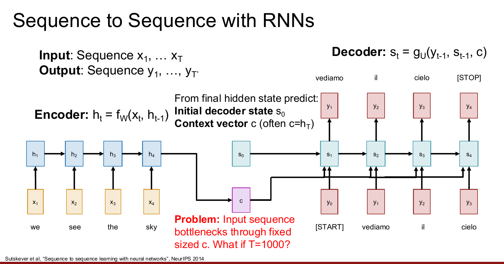
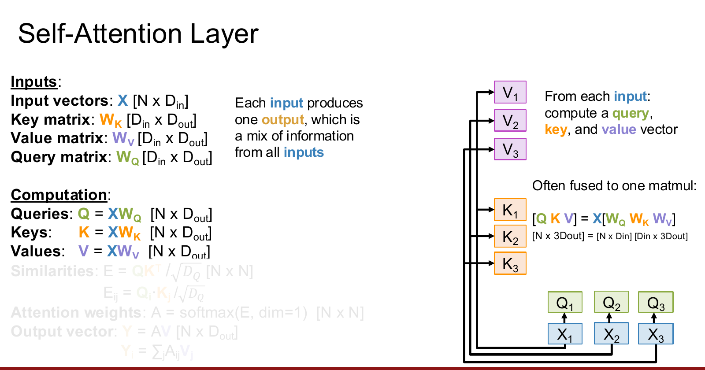
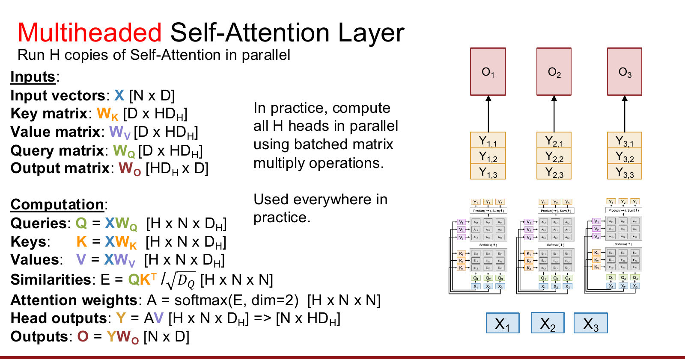
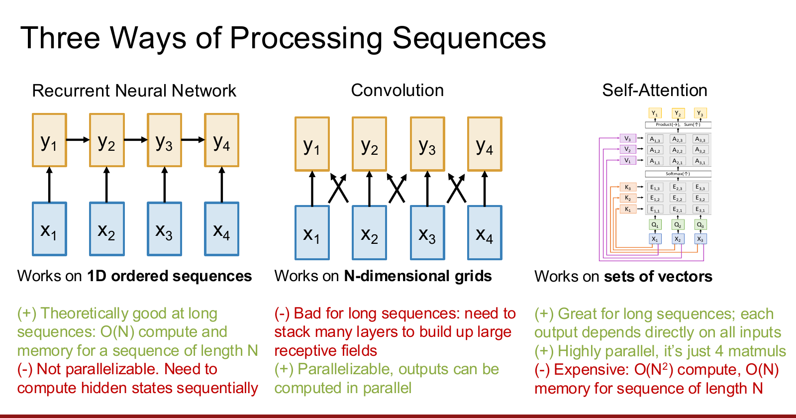
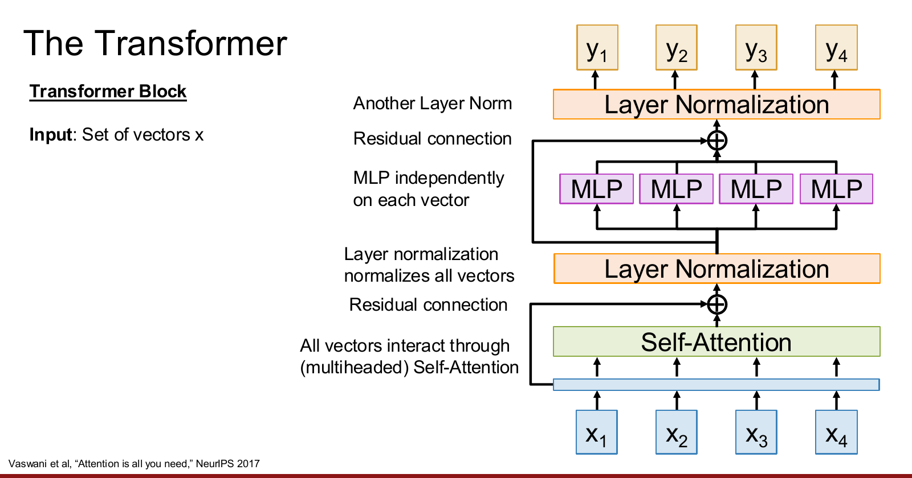
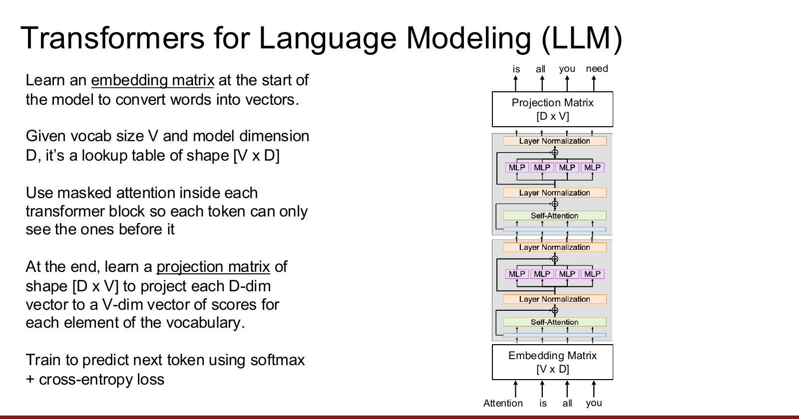

# 1. 从 RNN 的瓶颈到 Attention

RNN 会把前面读过的信息不断压缩进 hidden state。对于输入和输出都是序列的任务，可以使用 **Encoder-Decoder** 结构。

以英译意为例：

```text
输入：we see the sky
输出：vediamo il cielo
```

Encoder 逐个读取输入 token：

$$
h_t=f_W(x_t,h_{t-1})
$$

读完整个输入序列后，再用最终 hidden state $h_T$ 初始化 Decoder。传统做法还会把 $h_T$ 当作固定的 context vector：

$$
c=h_T
$$

Decoder 在第 $t$ 步根据上一个输出、上一个 decoder state 和同一个 $c$ 生成新状态：

$$
s_t=g_U(y_{t-1},s_{t-1},c)
$$



## 1.1 固定 context vector 的问题

这种结构要求 Encoder 把整个输入序列都压缩进一个固定维度的向量 $c$。

如果输入只有几个词，也许还能保留足够的信息。但如果：

$$
T=1000
$$

那么开头、中间和结尾的所有信息都要挤进同一个向量。Decoder 不管正在生成哪个词，看到的也始终是同一个 $c$。

这会产生两个问题：

1. **信息瓶颈**：长输入中的细节容易在压缩过程中丢失。
2. **缺少针对性**：生成不同输出 token 时，Decoder 不能主动选择当前最相关的输入部分。

## 1.2 Attention 思想

解决办法是：**不要只保留最后一个 hidden state，而是让 Decoder 在每一个输出时间步都回头查看所有 Encoder hidden states。**

Encoder 产生：

$$
h_1,h_2,\dots,h_T
$$

Decoder 在生成第 $t$ 个输出时，使用当前的 query（查询向量） 去判断每个 $h_i$ 有多重要，然后把它们按重要程度加权求和，得到当前时间步自己的 context vector：

$$
c_t=\sum_{i=1}^{T}a_{t,i}h_i
$$

所以 Decoder 不再一直使用同一个 $c$，而是每一步都有不同的：

$$
c_1,c_2,\dots,c_{T'}
$$


例如生成意大利语 `vediamo` 时，它对应英语中的 `we see`，所以注意力可能是：

$$
a_{1,1}=0.45,\qquad a_{1,2}=0.45,\qquad
a_{1,3}=a_{1,4}=0.05
$$

生成 `il` 时，它对应英语中的 `the`，因此新的注意力可能变成：

$$
a_{2,1}=a_{2,2}=0.05,\qquad
a_{2,3}=0.8,\qquad a_{2,4}=0.1
$$

---

# 2. RNN 中的 Attention 怎么计算

假设 Decoder 要生成第 $t$ 个 token。上一时刻的 decoder state $s_{t-1}$ 即为 query ，Encoder 的 hidden states $h_i$ 表示输入序列中可以查找的信息。

## 2.1 Alignment score

首先计算 $s_{t-1}$ 和每个 $h_i$ 的匹配程度：

$$
e_{t,i}=f_{\text{att}}(s_{t-1},h_i)
$$

其中 $e_{t,i}$ 是一个标量，叫做 **alignment score**。

分数越大，表示在生成第 $t$ 个输出时，第 $i$ 个输入位置越值得关注。

## 2.2 Attention weight

对 alignment scores 做 softmax：

$$
a_{t,i}
=
\frac{\exp(e_{t,i})}
{\sum_{j=1}^{T}\exp(e_{t,j})}
$$

得到：

$$
0<a_{t,i}<1,\qquad
\sum_{i=1}^{T}a_{t,i}=1
$$

$a_{t,i}$ 就叫做 **attention weight**。

## 2.3 Context vector

最后用 attention weights 对所有 Encoder hidden states 做加权求和：

$$
c_t=\sum_{i=1}^{T}a_{t,i}h_i
$$

再把当前 context vector 交给 Decoder：

$$
s_t=g_U(y_{t-1},s_{t-1},c_t)
$$

整个过程可以概括为：

```text
匹配程度 e -> softmax -> 注意力权重 a -> 对 hidden states 加权求和 -> c
```

!!! note "Attention weight 不需要人工标签"
    训练数据只需要提供正确的翻译结果，并不需要额外告诉模型生成这个词时应该看输入的哪个位置。
    
    alignment score、softmax、加权求和和 Decoder 都是可微的，因此可以从最终 translation loss 一路反向传播，自动学出 attention weights。

## 2.4 Attention map

把所有 $a_{t,i}$ 排成矩阵，就能画出 attention map。

1. 横轴可以表示输入 token。
2. 纵轴可以表示输出 token。


如果两种语言的词序接近，较大的权重通常会靠近对角线。如果词序不同，注意力也可以自动学出非对角的对应关系。

!!! warning "Attention weight 的含义"
    Attention weight 表示模型在这次加权求和中给某个位置多大的权重。
    
    它可以帮助我们观察模型的信息流向，但不能在所有情况下都直接等同于严格的因果解释。

---

# 3. General Attention Layer

在 RNN Attention中：

$$
\begin{aligned}
\text{query} &= s_{t-1} \\
\text{data vectors} &= h_1,h_2,\dots,h_N \\
\text{output} &= c_t
\end{aligned}
$$


- decoder 上一时刻状态 $s_{t-1}$ 是 query
- encoder 的所有 hidden states $h_i$ 是 data
- 最终得到的 context vector $c_t$ 是 output

> 给定一组 query vectors 和一组 data vectors，每个 query 都从全部 data vectors 中取出和自己相关的信息，得到一个 output vector。


现在我们把 Attention 这个概念单独拿出来，去掉 RNNs。Attention 本身对于神经网络来说就是一个非常有用的操作。
## 3.1 单个 query 的基本形式

先假设只有一个 query：

$$
q\in\mathbb{R}^{D_Q}
$$

有 $N_X$ 个 data vectors：

$$
X=
\begin{bmatrix}
X_1\\
X_2\\
\vdots\\
X_{N_X}
\end{bmatrix}
\in\mathbb{R}^{N_X\times D_X}
$$

最一般的 attention 可以写成三步。

第一步，计算 query 和每个 data vector 的相似度：

$$
e_i=f_{\text{att}}(q,X_i)
$$

第二步，用 softmax 得到 attention weights：

$$
a=\operatorname{softmax}(e)
$$

第三步，对 data vectors 做加权求和：

$$
y=\sum_{i=1}^{N_X}a_iX_i
$$


## 3.2 Scaled Dot-Product Attention

为了让相似度计算更容易并行，可以直接使用点积：

$$
e_i=q\cdot X_i
$$

但是向量维度越大，点积的绝对值通常也越大。过大的 scores 会让 softmax 进入饱和区域，输出非常接近 $0$ 或 $1$，梯度会变得很小。

因此使用 **scaled dot-product**：

$$
e_i=\frac{q\cdot X_i}{\sqrt{D_Q}}
$$

!!! explanation "为什么除以 $\sqrt{D_Q}$"
    假设 query 和 key 的每个分量都相互独立、均值为 $0$、方差为 $1$。
    
    点积是 $D_Q$ 个乘积的和，所以它的方差会随 $D_Q$ 增长到大约 $D_Q$，标准差则增长到大约 $\sqrt{D_Q}$。（$var(X)=E(X^2)-E(X)^2$ 公式推出来）
    
    除以 $\sqrt{D_Q}$ 后，scores 的尺度不会因为维度增大而失控，softmax 和梯度会更稳定。

## 3.3 多个 query 的矩阵形式

把 $N_Q$ 个 query 堆成矩阵：

$$
Q\in\mathbb{R}^{N_Q\times D_Q}
$$

如果 query 和 data vectors 的维度相同，那么所有相似度可以一次矩阵乘法算出：

$$
E=\frac{QX^T}{\sqrt{D_Q}}
\in\mathbb{R}^{N_Q\times N_X}
$$

其中：

$$
E_{i,j}=\frac{Q_i\cdot X_j}{\sqrt{D_Q}}
$$

对 $E$ 的每一行做 softmax：

$$
A=\operatorname{softmax}(E,\operatorname{dim}=1)
\in\mathbb{R}^{N_Q\times N_X}
$$

这里每一行对应一个 query 对所有 data vectors 的概率分布，因此：

$$
\sum_{j=1}^{N_X}A_{i,j}=1
$$

最后，可以计算出所有的context vector：

$$
C=AX
\in\mathbb{R}^{N_Q\times D_X}
$$

第 $i$ 个输出为：

$$
C_i=\sum_{j=1}^{N_X}A_{i,j}X_j
$$

!!! warning "Softmax 到底沿哪个方向做"
    对于：
    
    $$
    E\in\mathbb{R}^{N_Q\times N_X}
    $$
    
    第 $i$ 行表示第 $i$ 个 query 对全部 $N_X$ 个 data vectors 的分数，所以 softmax 必须让这一行的权重和为 $1$。
    
    不同代码可能把 token 放在行或列，因此不要死记 `dim=1` 或 `dim=-1`。真正要记的是：==对 key/data 所在的那个维度做 softmax。==

---

# 4. Query、Key 和 Value

直接拿 $Q$ 和 $X$ 做点积有一个限制：用来判断“匹不匹配”的信息，和最后真正被取出的信息是同一个向量。以我们刚刚做的推导为例，计算 $E$ 和 $C$ 时用到的 $X$ 一模一样：

$$\begin{aligned}
& E=\frac{QX^T}{\sqrt{D}} \\
& C=AX​
\end{aligned}$$

Attention 会把这两个角色拆开：

1. **Key**：用来和 query 比较，决定应该关注谁。
2. **Value**：真正被加权汇总到输出中的内容。

给定：

$$
X\in\mathbb{R}^{N_X\times D_X}
$$

学习两个投影矩阵：

$$
W_K\in\mathbb{R}^{D_X\times D_Q},
\qquad
W_V\in\mathbb{R}^{D_X\times D_V}
$$

得到：

$$
K=XW_K\in\mathbb{R}^{N_X\times D_Q}
$$

$$
V=XW_V\in\mathbb{R}^{N_X\times D_V}
$$

完整计算为：

$$
E=\frac{QK^T}{\sqrt{D_Q}}
\in\mathbb{R}^{N_Q\times N_X}
$$

$$
A=\operatorname{softmax}(E)
\in\mathbb{R}^{N_Q\times N_X}
$$

$$
C=AV
\in\mathbb{R}^{N_Q\times D_V}
$$

!!! explanation "为什么 Key 和 Value 要分开"
    可以把它类比成搜索引擎：
    
    - Key 像网页标题和关键词，负责让 query 判断这条结果是否相关。
    - Value 像网页的真正内容，是匹配之后要取出的信息。
    
    用来检索的信息和最终返回的信息不一定相同，因此分别学习 $W_K$ 和 $W_V$ 会更灵活。


下图的 $Y$ 并不是**最终的的输出 $Y$**，而是 $Context\ vector$

## 4.1 Cross-Attention

如果 query 和 data vectors 来自两个不同的集合，这就是 **Cross-Attention**。

在前面的 RNN 翻译例子中：

1. Decoder states 产生 queries。
2. Encoder states 产生 keys 和 values。
3. 每个 Decoder query 从整个 Encoder 序列中读取信息。

所以 RNN Attention 本质上就是一种 Cross-Attention。

---

# 5. Self-Attention

如果 query、key 和 value 都来自同一组输入 $X$，就得到 **Self-Attention**。

输入：

$$
X\in\mathbb{R}^{N\times D_{\text{in}}}
$$

学习三个投影矩阵：

$$
W_Q,W_K,W_V
\in\mathbb{R}^{D_{\text{in}}\times D_{\text{out}}}
$$

然后：

$$
Q=XW_Q,\qquad K=XW_K,\qquad V=XW_V
$$

其中：

$$
Q,K,V\in\mathbb{R}^{N\times D_{\text{out}}}
$$

接着计算：

$$
E=\frac{QK^T}{\sqrt{D_{\text{out}}}}
\in\mathbb{R}^{N\times N}
$$

$$
A=\operatorname{softmax}(E)
\in\mathbb{R}^{N\times N}
$$

$$
Y=AV
\in\mathbb{R}^{N\times D_{\text{out}}}
$$



## 5.1 一个输入为什么要同时产生 Q、K、V

对于输入中的第 $i$ 个 token：

1. $Q_i$ 表示：当前位置想从其他位置找什么。
2. $K_i$ 表示：当前位置有什么特征可以用来被别人匹配。
3. $V_i$ 表示：如果别人关注当前位置，真正应该把什么内容传过去。

同一个输入向量经过三个不同的线性投影，就可以同时扮演这三个角色。

实践中经常把三个投影合并成一次矩阵乘法：

$$
[Q\ K\ V]
=
X[W_Q\ W_K\ W_V]
$$

如果三个输出维度都是 $D_{\text{out}}$，那么：

$$
[W_Q\ W_K\ W_V]
\in
\mathbb{R}^{D_{\text{in}}\times3D_{\text{out}}}
$$

## 5.2 每个输出都混合了全部输入

Self-Attention 的第 $i$ 个输出是：

$$
Y_i=\sum_{j=1}^{N}A_{i,j}V_j
$$

所以每个输出位置都可以直接读取所有输入位置的信息。

!!! explanation "Self-Attention 对比 RNNs 的优势"

    在 RNN 中，位置 $1$ 的信息要到达位置 $N$，必须沿 hidden state 经过很多步；在 Self-Attention 中，这两个位置只经过一次 attention 就能直接交互。
    
    ## 举个具体例子

	假设句子是：
	
> 	The cat that I saw yesterday was black.
	
	模型在处理 “was” 时，需要知道前面的主语是 “cat”。
	
	在 RNN 中，“cat” 的信息需要不断传：
	
    $$h_{\text{cat}} \rightarrow h_{\text{that}} \rightarrow h_{\text{I}} \rightarrow h_{\text{saw}} \rightarrow h_{\text{yesterday}} \rightarrow h_{\text{was}}$$​
	中间每一步都要把之前的信息保留下来。

	在 self-attention 中，每个位置都可以直接查看其他所有位置。
	
	对于位置 $N$，它会计算：
	
	$$q_N\cdot k_1,\quad q_N\cdot k_2,\quad \dots,\quad q_N\cdot k_N$$​
	然后得到 attention weights：
	
	$$A_{N,1},A_{N,2},\dots,A_{N,N}$$
	
	最后位置 $N$ 的输出为：
	
	$$y_N = \sum_{j=1}^{N}A_{N,j}v_j$$
	
	其中直接包含：
	
	$$A_{N,1}v_1$$​
	
	这意味着位置 $N$ 可以直接从位置 $1$ 读取信息。
	
	不需要经过：
	
	$$1\rightarrow2\rightarrow3\rightarrow\cdots\rightarrow N$$
	

## 5.3 一个小例子

假设某个 query 对三个 keys 算出的 scaled scores 为：

$$
e=[2,\ 1,\ 0]
$$

softmax 后大约得到：

$$
a=[0.665,\ 0.245,\ 0.090]
$$

如果：

$$
V_1=
\begin{bmatrix}
1\\0
\end{bmatrix},
\qquad
V_2=
\begin{bmatrix}
0\\2
\end{bmatrix},
\qquad
V_3=
\begin{bmatrix}
1\\1
\end{bmatrix}
$$

那么输出为：

$$
\begin{aligned}
y
&=0.665V_1+0.245V_2+0.090V_3\\
&=
\begin{bmatrix}
0.755\\
0.580
\end{bmatrix}
\end{aligned}
$$

这个输出不是简单复制某一个 value，而是按照 attention weights 混合多个 values。

---

# 6. Self-Attention 与顺序

## 6.1 Permutation Equivariance

如果把输入向量的顺序打乱，$Q,K,V$ 也只会按照同样方式被打乱。

相似度矩阵、attention weights 和最终输出都会发生对应的行列置换，但每个输入和对应输出之间的关系不变。

因此 Self-Attention 具有 **permutation equivariance（置换等变性）**：

$$
F(\sigma(X))=\sigma(F(X))
$$

其中 $\sigma$ 表示对输入顺序做同一个置换。

!!! explanation "置换等变是什么意思"
    假设输入顺序原来是：
    
    ```text
    X1, X2, X3
    ```
    
    输出是：
    
    ```text
    Y1, Y2, Y3
    ```
    
    如果把输入改成：
    
    ```text
    X3, X1, X2
    ```
    
    输出也只会跟着变成：
    
    ```text
    Y3, Y1, Y2
    ```
    
    这说明原始 Self-Attention 处理的是一组 vectors，本身不知道哪个是第一个、第二个或第三个。

## 6.2 Positional Encoding

对于集合来说，不知道顺序没有问题；但对于语言和图像，位置非常重要。

```text
dog bites man
```

和：

```text
man bites dog
```

使用的是同一组词，但意思完全不同。

解决办法是给每个输入加入 **positional encoding**：

$$
\tilde{X}_i=X_i+P_i
$$

其中 $P_i$ 只由位置 $i$ 决定。这样 Self-Attention 看到的不再只是 token 内容，还能知道 token 在什么位置。

Positional encoding 可以是固定函数，也可以是训练得到的 embedding。无论采用哪一种，核心目的都是：

$$
\text{content information}+\text{position information}
$$

!!! warning "Self-Attention 和 Transformer 不会自动知道顺序"
    Self-Attention 的连接是“所有位置看所有位置”，不会像 RNN 那样通过计算顺序自然获得位置信息。
    
    如果任务需要顺序，就必须用 positional encoding 或其他位置机制显式告诉模型。

---

# 7. Masked Self-Attention

普通 Self-Attention 允许每个位置查看所有位置。但是语言模型要预测下一个 token，训练时不能偷看未来答案。

例如输入：

```text
Attention is very
```

要让模型分别预测：

```text
is very cool
```

在处理 `Attention` 时，只能看 `Attention`；处理 `is` 时，只能看 `Attention is`；不能提前看到后面的 `very` 或 `cool`。

## 7.1 Causal Mask

先计算：

$$
E=\frac{QK^T}{\sqrt{D}}
$$

然后把所有未来位置的 similarity score 改成：

$$
-\infty
$$

三词序列的 masked scores 形状如下：

$$
E_{\text{masked}}
=
\begin{bmatrix}
E_{1,1} & -\infty & -\infty\\
E_{2,1} & E_{2,2} & -\infty\\
E_{3,1} & E_{3,2} & E_{3,3}
\end{bmatrix}
$$

因为：

$$
\exp(-\infty)=0
$$

所以 softmax 后，被 mask 的位置权重会变成 $0$：

$$
A=
\begin{bmatrix}
1 & 0 & 0\\
A_{2,1} & A_{2,2} & 0\\
A_{3,1} & A_{3,2} & A_{3,3}
\end{bmatrix}
$$


!!! explanation "Mask 改变了什么"
    Mask 没有删除 Q、K、V，也没有改变网络参数。
    
    它只是在人为规定的位置把 attention score 设为 $-\infty$，从而让 softmax 后的注意力权重严格为 $0$。
    
    因此 mask 控制的是：每个 query 被允许查看哪些 keys。

## 7.2 为什么训练时仍然可以并行

虽然第 $t$ 个位置只能看前 $t$ 个 token，但所有位置的 Q、K、V 和 masked attention matrix 仍然可以一次矩阵运算同时算出。

所以 Transformer 训练语言模型时可以并行处理整段序列；RNN 则必须先算完 $h_{t-1}$ 才能继续计算 $h_t$。

!!! warning "训练并行不等于生成并行"
    训练时整句话已经存在，只要用 causal mask 遮住未来 token，就可以同时计算所有位置。
    
    生成时下一个 token 还不存在，模型必须生成一个，再把它加入输入继续生成下一个。因此自回归生成在 token 维度上仍然是逐步进行的。

---

# 8. Multi-Head Self-Attention

单个 Self-Attention 只会产生一套 attention pattern。不同任务中，一个 token 可能同时需要关注多种关系：

1. 某个 head 关注相邻词。
2. 某个 head 关注主语和谓语。
3. 某个 head 关注远距离指代。
4. 在图像中，不同 head 可以关注不同区域或视觉关系。

因此可以并行运行 $H$ 组独立的 Self-Attention，这就是 **Multi-Head Self-Attention**。

## 8.1 每个 head 的计算

设输入：

$$
X\in\mathbb{R}^{N\times D}
$$

有 $H$ 个 heads，每个 head 的维度为：

$$
D_H=\frac{D}{H}
$$

每个 head 都有自己的 $W_Q^{(h)},W_K^{(h)},W_V^{(h)}$，并计算：

$$
\operatorname{head}_h
=
\operatorname{softmax}
\left(
\frac{Q_hK_h^T}{\sqrt{D_H}}
\right)V_h
$$

其中：

$$
Q_h,K_h,V_h\in\mathbb{R}^{N\times D_H}
$$

把所有 heads 拼接：

$$
Y_{\text{cat}}
=
\operatorname{Concat}
(\operatorname{head}_1,\dots,\operatorname{head}_H)
\in\mathbb{R}^{N\times HD_H}
$$

当 $D_H=D/H$ 时：

$$
HD_H=D
$$

最后再用输出投影融合各个 head：

$$
O=Y_{\text{cat}}W_O
\in\mathbb{R}^{N\times D}
$$



!!! explanation "为什么最后还需要 $W_O$"
    拼接只是在特征维度上把不同 heads 的结果排在一起，它们还没有真正交流。
    
    $W_O$ 会对拼接结果做一次线性变换，让网络学习如何组合不同 heads 提取出的信息，并把输出维度重新变回 $D$。

## 8.2 实际实现

实践中不会真的写 $H$ 个独立循环，而是一次计算所有 heads 的 Q、K、V：

$$
[Q\ K\ V]
=
XW_{QKV}
$$

再 reshape 成：

$$
Q,K,V\in\mathbb{R}^{H\times N\times D_H}
$$

这样所有 heads 都可以通过 batched matrix multiplication 并行计算。


## 8.3 Self-Attention 的四次矩阵乘法

把 Q、K、V 投影融合后，Multi-Head Self-Attention 的计算实际上就是四次矩阵乘法。

### 第一步：QKV Projection

为每个词生成 $Q,K, V$

$$
[N\times D][D\times3HD_H]
\longrightarrow
[N\times3HD_H]
$$

然后 split 和 reshape，得到：

$$
Q,K,V\in\mathbb{R}^{H\times N\times D_H}
$$

!!! explanation "解析"
    对于一个 head，本来应该分别计算：

	$$\begin{aligned}
	&Q^{(h)}=XW_Q^{(h)}\\
	&K^{(h)}=XW_K^{(h)}\\
	&V^{(h)}=XW_V^{(h)}
	\end{aligned}$$​
	
	其中：
	
	$$Q^{(h)},K^{(h)},V^{(h)} \in\mathbb{R}^{N\times D_H}$$
	
	有 $H$ 个 head，就意味着要得到 $H$ 组这样的结果。
	
	实践中把所有 head 的所有权重拼成一个大矩阵：
	
	$$W_{QKV}\in\mathbb{R}^{D\times 3HD_H}$$
	
	然后一次计算：
	
	$$XW_{QKV}$$​
	
	维度为：
	
	$$[N\times D][D\times3HD_H] \longrightarrow [N\times3HD_H]$$
	
	这里结果的最后一维实际上包含：
	
    $$\underbrace{HD_H}_{Q} + \underbrace{HD_H}_{K} + \underbrace{HD_H}_{V}​​​$$
	
	所以把结果先切成三块：
	
	$$Q,K,V\in\mathbb{R}^{N\times HD_H}$$
	
	再把每一块中的 $HD_H$ 拆成：
	
	$$H\times D_H$$
	
	因此每一个 $head$ 的形状如下：
	
	$$Q^{(h)},K^{(h)},V^{(h)}\in\mathbb{R}^{ N\times D_H}​$$

!!! warning "一共有 $H$ 个 head"
    假设：
    
	$$H=4$$
	
	那么会有：
	
	$$Q^{(1)},Q^{(2)},Q^{(3)},Q^{(4)}$$
	
	并且每一个都是：
	
	$$N\times D_H$$​
	
	把这 $H$ 个矩阵放在一起，就得到：
	
	$$Q\in\mathbb{R}^{H\times N\times D_H}$$
	
	也就是：
	
	$$Q= \begin{bmatrix} Q^{(1)}\\ Q^{(2)}\\ \vdots\\ Q^{(H)} \end{bmatrix}$$
	
	所以：
	
	Q(h)∈RN×DH\boxed{ Q^{(h)}\in\mathbb{R}^{N\times D_H} }Q(h)∈RN×DH​​
	
	表示单个 head。
	
	而：
	
	Q∈RH×N×DH\boxed{ Q\in\mathbb{R}^{H\times N\times D_H} }Q∈RH×N×DH​​
	
	表示所有 heads。
	
### 第二步 QK Similarity

在每一个 head 里，每个 query 都去和每个 key 做点积，再除以$\sqrt{D_H}$ 得到 $E$：

$$
E=\frac{QK^T}{\sqrt{D_H}}
$$

维度变化为：

$$
[H\times N\times D_H]
[H\times D_H\times N]
\longrightarrow
[H\times N\times N]
$$

然后再对 $E$ 做 softmax 得到每个 head 的 attention scores，所以第二步的完成流程是：

$$QK^T \rightarrow \frac{QK^T}{\sqrt{D_H}}\rightarrow softmax$$

得到的attention weight：

$$A \in R^{H\times N\times N}$$
 
!!! explanation "解析"
    假设某个 head 里有 $N$ 个 query 和 $N$ 个 key：
	
	$$\begin{aligned}
	&q_1,q_2,\dots,q_N\\
	&k_1,k_2,\dots,k_N
	\end{aligned}$$
	
	那么要计算所有组合：
	
	$$E= \begin{bmatrix} q_1\cdot k_1 & q_1\cdot k_2 & \cdots & q_1\cdot k_N\\ q_2\cdot k_1 & q_2\cdot k_2 & \cdots & q_2\cdot k_N\\ \vdots & \vdots & \ddots & \vdots\\ q_N\cdot k_1 & q_N\cdot k_2 & \cdots & q_N\cdot k_N \end{bmatrix}$$
	
	其中：
	
	$$E_{i,j}=q_i\cdot k_j$$
	
	含义是：
	
	在这个 head 中，第 $i$ 个 query 和第 $j$ 个 key 的相似度。
	
	即：
	
	- 第 $i$ 行：第 $i$ 个 query 对所有 key 的相似度；
	- 第 $j$ 列：所有 query 对第 $j$ 个 key 的相似度。
	
	然后对每一行做 softmax，得到：
	
	$$A_{i,j}$$​
	
	表示第 $i$ 个 query 应该从第 $j$ 个位置取多少信息。
	
	而在 multi-head attention 中，每个 head 都各自做一遍：
	
	$$E^{(h)}=Q^{(h)}(K^{(h)})^T$$
	
	因此最终形状是：
	
	$$H\times N\times N$$
	
	也就是：
	
    $H$ 个 head，每个 head 都有一个 $N\times N$ 的 query-key 相似度矩阵。

### 第三步 Value Weighting

首先，计算每一个 head 的 Context vector

$$
[H\times N\times N]
[H\times N\times D_H]
\longrightarrow
[H\times N\times D_H]
$$

接着，把每一个 token 中所有 heads 产生的 Context vectors拼接起来，整个过程分成一下几个小步骤：

先取出一个 token 的所有 heads 的 attention weight，其维度为：

$$[H\times 1 \times N]$$

然后将它与所有的 $value$ 进行矩阵相乘，即跟 $V$ 向量进行矩阵相乘，维度变化如下：

$$[H\times 1\times N]
[H\times N\times D_H]
\longrightarrow
[H\times 1\times D_H]$$

相当于是 $H$ 个 $1\times D_H$ 的矩阵按行堆叠，因此本质就是一个 $H\times D_H$ 的矩阵，得到这个 $H\times D_H$ 的矩阵之后，再将这 $H$ 行按照顺序排列成一行，就变成了一个 $1\times HD_H$ 的矩阵，即：

$$[HD_H]$$

在此基础上把所有 token 的结果按行拼接起来，得到如下维度：

$$
[N\times HD_H]
$$

!!! explanation "Context vector 解析"
    ### 我的疑问
    $A^{(h)}$ 中的一行表示这个 head 中，某个 query 跟所有 key 的相似度。但是 $A^{(h)} V^{(h)}$ 是用 $A^{(h)}$ 的每一行跟 $V^{(h)}$ 的每一列做点积，$V^{(h)}$ 的一列表示的不是所有的 value 的第一维吗，而是不一个 value 啊
    
    ### 解答：
    
    $$A^{(h)}= \begin{bmatrix} A_{11} & A_{12} & \cdots & A_{1N}\\ A_{21} & A_{22} & \cdots & A_{2N}
    \\ \vdots & \vdots & \ddots & \vdots\\ A_{N1} & A_{N2} & \cdots & A_{NN} \end{bmatrix} \ \ \ \ \ \ \ \ \ \ \ \ V^{(h)}= \begin{bmatrix} V_{11} & V_{12} & \cdots & V_{1D_H}\\ V_{21} & V_{22} & \cdots & V_{2D_H}
    \\ \vdots & \vdots & \ddots & \vdots\\ V_{N1} & V_{N2} & \cdots & V_{ND_H} \end{bmatrix} \ \ \ \ \ \ \ \ \ \ \ \ $$
    
    将 $V^{(h)}$ 视作：
    
    $$V^{(h)}=\begin{bmatrix}
    V_1\\ V_2 \\ \vdots \\ V_N
    \end{bmatrix}$$
    
    可以看出， A^{(h)} 跟 V^{(h)} 做点积，就是 $A^{(h)}$ 中的每一行都跟 $V^{(h)}$ 做点积：
    
    $$\begin{bmatrix}A_{i1}&A_{i2} &\cdots &A_{iN}\end{bmatrix} \begin{bmatrix} V_{1} \\V_{2} \\ \vdots \\ V_N \end{bmatrix}$$
    
    得到：
    
    $$C_i=A_{i1}V_1+A_{i2}V_2 + \cdots + A_{iN}V_N=\sum_{j=1}^{N}A_{ij}V_j$$
    
    因此，我的疑问中“$A^{(h)} V^{(h)}$ 是用 $A^{(h)}$ 的每一行跟 $V^{(h)}$ 的每一列做点积”这一点没错，我们正是需要通过这种方式来进行求解。

!!! explanation "把所有 heads 拼接起来解析"
    
	对于一个 token $i$，不同 head 得到：
	
	$$C_i^{(1)},C_i^{(2)},\dots,C_i^{(H)}$$​
	
	每一个 token 都有 $H$ 个 Context Vectors，每个 Context vector 都是 $D_H$ 维的，把它们首位拼接起来，得到：
	
	$$C_i = \operatorname{Concat} \left( C_i^{(1)}, C_i^{(2)}, \dots, C_i^{(H)} \right)$$
	
	于是：
	
	$$C_i\in\mathbb{R}^{HD_H}$$
	
	所有 $N$ 个 token 放在一起：
	
	$$C\in\mathbb{R}^{N\times HD_H}$$
	
	例如两个 head 分别输出：
	
	$$\begin{aligned}& C_i^{(1)}=[a,b]\\
	& C_i^{(2)}=[c,d]
	\end{aligned}$$
	
	拼接之后得到：
	
	$$C_i=[a,b,c,d]$$
### 第四步 Output Projection

我们在第三步中已经把所有 heads 算出来的 context vectors 都拼接起来了。接着需要再做一次线性变换，得到最终的输出。

现在每个 token 的向量只是把不同 head 的结果机械地排在一起：

$$C_i= [ C_i^{(1)}, C_i^{(2)}, \dots, C_i^{(H)} ]$$

各个 head 的信息还没有真正互相混合。

所以再乘一个可学习的输出矩阵。因为Self-attention中，输入和输出的维度是一样的，所以：

$$W_O\in\mathbb{R}^{HD_H\times D}$$

得到：

$$Y=CW_O$$

维度变化如下：

$$
[N\times HD_H][HD_H\times D]
\longrightarrow
[N\times D]
$$

## 8.4 时间和空间复杂度


设 Self-Attention 的输入为：

$$  
X\in\mathbb{R}^{N\times D}  
$$

### 1. QKV Projection

首先，根据输入 $X$ 计算所有 heads 的 query、key 和 value：

$$  
[Q\ K\ V]=XW_{QKV}  
$$

矩阵维度为：

$$  
[N\times D][D\times 3HD_H]  
\longrightarrow  
[N\times 3HD_H]  
$$

因此，这一步的时间复杂度为：

$$  
O(N\cdot D\cdot 3HD_H)  
$$

忽略常数 $3$：

$$  
O(NDHD_H)  
$$

由于：

$$  
HD_H=D  
$$

所以：

$$  
\boxed{O(ND^2)}  
$$


### 2. QK Similarity

对于第 $h$ 个 head：

$$  
Q^{(h)}\in\mathbb{R}^{N\times D_H}  
$$

$$  
K^{(h)}\in\mathbb{R}^{N\times D_H}  
$$

计算 query 和 key 的相似度：

$$  
E^{(h)}

Q^{(h)}\left(K^{(h)}\right)^T  
$$

矩阵维度为：

$$  
[N\times D_H][D_H\times N]  
\longrightarrow  
[N\times N]  
$$

所以单个 head 的时间复杂度为：

$$  
O(N\cdot D_H\cdot N)

O(N^2D_H)  
$$

一共有 $H$ 个 heads，因此总复杂度为：

$$  
O(HN^2D_H)  
$$

由于：

$$  
HD_H=D  
$$

所以：

$$  
\boxed{O(N^2D)}  
$$

### 3. Softmax

QK Similarity 得到的 attention scores 形状为：

$$  
E\in\mathbb{R}^{H\times N\times N}  
$$

其中共有：

$$  
HN^2  
$$

个元素。

对每一个 query 对应的一行做 softmax，因此时间复杂度为：

$$  
\boxed{O(HN^2)}  
$$

### 4. Value Weighting

经过 softmax 后得到 attention weights：

$$  
A^{(h)}\in\mathbb{R}^{N\times N}  
$$

第 $h$ 个 head 的 value 矩阵为：

$$  
V^{(h)}\in\mathbb{R}^{N\times D_H}  
$$

计算该 head 中所有 query 对应的 Context vectors：

$$  
C^{(h)}=A^{(h)}V^{(h)}  
$$

矩阵维度为：

$$  
[N\times N][N\times D_H]  
\longrightarrow  
[N\times D_H]  
$$

所以单个 head 的时间复杂度为：

$$  
O(N\cdot N\cdot D_H)

O(N^2D_H)  
$$

一共有 $H$ 个 heads，因此：

$$  
O(HN^2D_H)  
$$

由于：

$$  
HD_H=D  
$$

所以：

$$  
\boxed{O(N^2D)}  
$$

这一步的实际作用是：对于每个 query，根据 attention weights 对所有 value vectors 进行加权求和。

具体来说：

$$  
C_i^{(h)}

\sum_{j=1}^{N}  
A_{i,j}^{(h)}V_j^{(h)}  
$$

### 5. 拼接所有 Heads

每一个 head 都会产生：

$$  
C^{(h)}\in\mathbb{R}^{N\times D_H}  
$$

对于同一个 token，把它在所有 heads 中得到的 Context vectors 拼接起来：

$$  
C_i

\operatorname{Concat}  
\left(  
C_i^{(1)},  
C_i^{(2)},  
\dots,  
C_i^{(H)}  
\right)  
$$

因此：

$$  
C_i\in\mathbb{R}^{HD_H}  
$$

所有 token 的结果按行堆叠后：

$$  
C\in\mathbb{R}^{N\times HD_H}  
$$

拼接通常只是 reshape、transpose 或数据重新排列，不涉及主要的矩阵乘法。

如果只考虑 reshape，可以近似认为没有额外计算复杂度；如果考虑数据移动，则复杂度约为：

$$  
O(NHD_H)=O(ND)  
$$


### 6. Output Projection

拼接所有 heads 后：

$$  
C\in\mathbb{R}^{N\times HD_H}  
$$

然后乘以输出投影矩阵：

$$  
W_O\in\mathbb{R}^{HD_H\times D}  
$$

计算：

$$  
Y=CW_O  
$$

矩阵维度为：

$$  
[N\times HD_H][HD_H\times D]  
\longrightarrow  
[N\times D]  
$$

因此时间复杂度为：

$$  
O(N\cdot HD_H\cdot D)  
$$

由于：

$$  
HD_H=D  
$$

所以：

$$  
\boxed{O(ND^2)}  
$$

这一步的作用是把所有 heads 提取的信息重新混合，并将每个 token 的表示恢复为 $D$ 维。


### 总时间复杂度


把前面六步全部相加，忽略常数后，完整的 Multi-Head Self-Attention 时间复杂度为：

$$  
\boxed{  
O(ND^2+N^2D)  
}  
$$

因为正常情况下 $N >> D$，所以时间复杂度可以表示为：

$$O(N^2)$$

若 $N=100000,H=64$，attention weights 会大到普通 GPU 根本放不下。

## 8.5 FlashAttention

FlashAttention 会分块计算 $QK^T$、softmax 和 $AV$，避免把完整的 $N\times N$ attention matrix 全部写入显存。

它仍然计算精确 attention，并没有把 Attention 改成近似算法。

1. 计算复杂度仍然主要是 $O(N^2)$。
2. 额外显存可以从显式 attention matrix 的二次规模显著降低。
3. 减少 GPU 高带宽内存读写后，实际运行速度也会提高。

!!! warning "FlashAttention 没有消除二次计算量"
    FlashAttention 主要解决的是中间 attention matrix 的显存占用和内存访问效率。
    
    它没有把所有 query-key 配对从 $N^2$ 个变成 $N$ 个，所以标准精确 attention 的计算量仍然随 $N^2$ 增长。

---

# 9. 三种处理序列的方法



## 9.1 Recurrent Neural Network

RNN 适合一维有序序列。

优点：

1. 参数在所有时间步共享。
2. 计算量和内存可以随序列长度线性增长。
3. hidden state 可以持续更新，理论上能处理很长的序列。

缺点：

1. 第 $t$ 步依赖第 $t-1$ 步，很难沿时间完全并行。
2. 远距离信息必须经过很多次状态更新。
3. 信息不断压缩进 hidden state，容易丢失细节。

## 9.2 Convolution

Convolution 天然适合规则网格，例如一维序列和二维图像。

优点：

1. 所有位置可以并行计算。
2. 局部连接和参数共享非常高效。

缺点：

1. 单层卷积只能看到局部 receptive field。
2. 要让相距很远的位置交换信息，必须堆很多层或进行下采样。

## 9.3 Self-Attention

Self-Attention 处理的是一组 vectors，再通过 positional encoding 加入顺序。

优点：

1. 每个输出可以直接依赖所有输入。
2. 不需要沿时间逐步计算，训练时高度并行。
3. 主要计算都是大型矩阵乘法，非常适合 GPU。

缺点：

1. 标准 attention 的计算量是 $O(N^2)$。
2. 如果没有高效实现，attention matrix 的显存开销也很大。
3. 必须额外加入位置信息。

!!! note "三种方法的核心差别"
    RNN 通过不断更新 state 传递信息；Convolution 通过堆叠局部 receptive fields 传递信息；Self-Attention 让所有位置一步直接相连。

---

# 10. Transformer Block

Transformer 是一个大量使用 Self-Attention 的神经网络架构。

一个 Transformer block 的输入和输出都是一组 $D$ 维向量：

$$
X\in\mathbb{R}^{N\times D}
\quad\longrightarrow\quad
Y\in\mathbb{R}^{N\times D}
$$

经典 Transformer block 包含：

1. Multi-Head Self-Attention。
2. Residual connection。
3. Layer Normalization。
4. 对每个 token 独立应用的 MLP，也叫 FFN。
5. 第二组 residual connection 和 Layer Normalization。



## 10.1 Self-Attention 负责 token 之间的交互

Self-Attention 是 block 中唯一让不同位置相互交换信息的部分：

$$
\operatorname{MHA}(X)
$$

每个位置可以根据自己的 query，从所有位置的 values 中取出信息。

## 10.2 Residual Connection

Attention 输出会和原输入相加：

$$
X+\operatorname{MHA}(X)
$$

Residual connection 给信息和梯度提供一条更直接的通道，使深层网络更容易训练。

## 10.3 Layer Normalization

对每个 token 的 $D$ 个特征单独做归一化。

对于某个 token vector $x_i\in\mathbb{R}^D$：

$$
\mu_i=\frac{1}{D}\sum_{j=1}^{D}x_{i,j}
$$

$$
\sigma_i=
\sqrt{
\frac{1}{D}
\sum_{j=1}^{D}(x_{i,j}-\mu_i)^2+\epsilon
}
$$

$$
\operatorname{LayerNorm}(x_i)
=
\gamma\odot
\frac{x_i-\mu_i}{\sigma_i}
+\beta
$$

其中 $\gamma,\beta\in\mathbb{R}^D$ 是可学习参数。

## 10.4 Feed-Forward Network

MLP 会对每个 token vector 独立使用同一套参数。经典结构是：

$$
D\longrightarrow4D\longrightarrow D
$$

可以写成：

$$
\operatorname{MLP}(x)
=
\phi(xW_1+b_1)W_2+b_2
$$

其中：

$$
W_1\in\mathbb{R}^{D\times4D},
\qquad
W_2\in\mathbb{R}^{4D\times D}
$$

!!! explanation "为什么 Attention 后面还要 MLP"
    Attention 主要负责在不同 token 之间搬运和混合信息。
    
    MLP 则在每个 token 内部对特征做非线性变换。它不负责位置之间交流，但会进一步加工 Attention 收集到的信息。
    
    所以可以简单理解为：
    
    ```text
    Attention：token 之间交流
    MLP：每个 token 自己处理信息
    ```

## 10.5 原始 Post-Norm 结构

课件先展示的是原始 Transformer 的 Post-Norm 写法：

$$
U=\operatorname{LayerNorm}
\left(
X+\operatorname{MHA}(X)
\right)
$$

$$
Y=\operatorname{LayerNorm}
\left(
U+\operatorname{MLP}(U)
\right)
$$

一个 Transformer 就是把相同结构的 block 堆叠很多次。

!!! note "为什么 Transformer 适合扩大规模"
    Transformer block 的大部分计算都是矩阵乘法：
    
    1. Self-Attention 中有 QKV projection、QK similarity、value weighting 和 output projection。
    2. MLP 中有两次大的矩阵乘法。
    
    这些运算可以在大量 token 和 batch 上并行，因此非常适合 GPU/TPU。

---

# 11. Transformer Language Model

Transformer 可以用来完成和 Lecture 7 中 RNN language model 相同的任务：根据前面的 token 预测下一个 token。



## 11.1 Token Embedding

假设词表大小为 $V$，model dimension 为 $D$。

学习一个 embedding matrix：

$$
E\in\mathbb{R}^{V\times D}
$$

每个 token id 会查表得到一个 $D$ 维向量：

$$
\text{token id}\longrightarrow x_i\in\mathbb{R}^{D}
$$

再加入 positional encoding，得到 Transformer 的输入。

## 11.2 使用 Masked Self-Attention

Language Model 中的每个 Transformer block 都使用 causal mask，让第 $t$ 个 token 只能查看：

$$
x_1,x_2,\dots,x_t
$$

不能查看：

$$
x_{t+1},x_{t+2},\dots
$$

## 11.3 输出词表分数

最后一层输出：

$$
H\in\mathbb{R}^{N\times D}
$$

再学习一个 projection matrix：

$$
W_{\text{vocab}}\in\mathbb{R}^{D\times V}
$$

得到每个位置对整个词表的 scores：

$$
S=HW_{\text{vocab}}
\in\mathbb{R}^{N\times V}
$$

经过 softmax：

$$
p(y_t\mid x_{\le t})
=
\operatorname{softmax}(S_t)
$$

然后用正确的下一个 token 计算 cross-entropy loss。

例如：

```text
输入：Attention  is    all   you
目标：is         all   you   need
```

!!! explanation "训练数据为什么要错开一个位置"
    模型在位置 $t$ 只能看到当前位置及以前的 token，它的任务是预测位置 $t+1$ 的 token。
    
    所以输入序列和目标序列相差一个位置。通过 causal mask，一次 forward pass 就能同时得到所有位置的 next-token loss。

