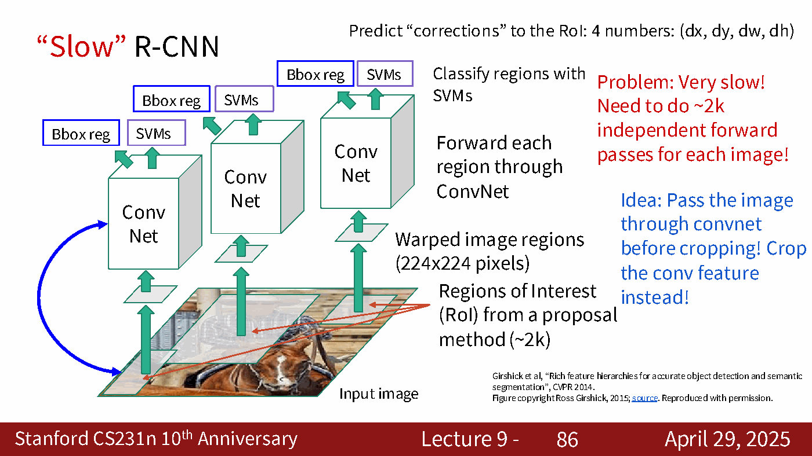
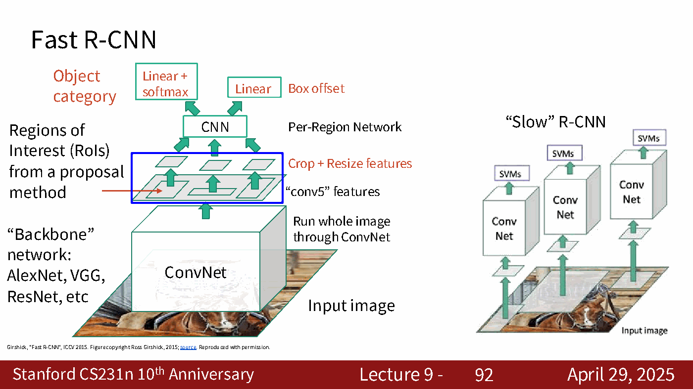
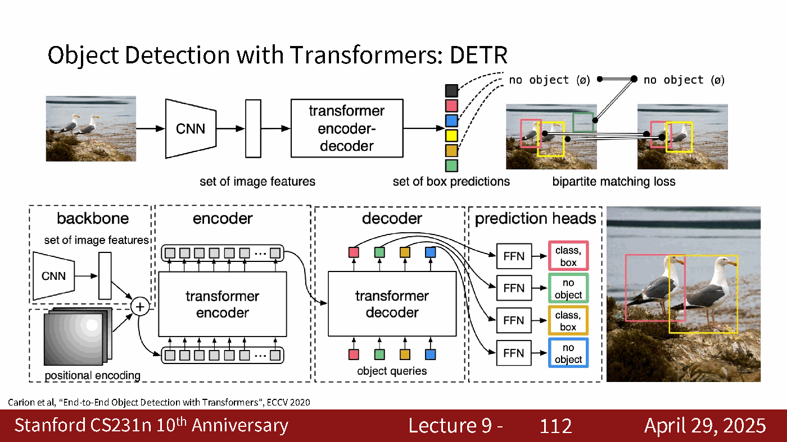
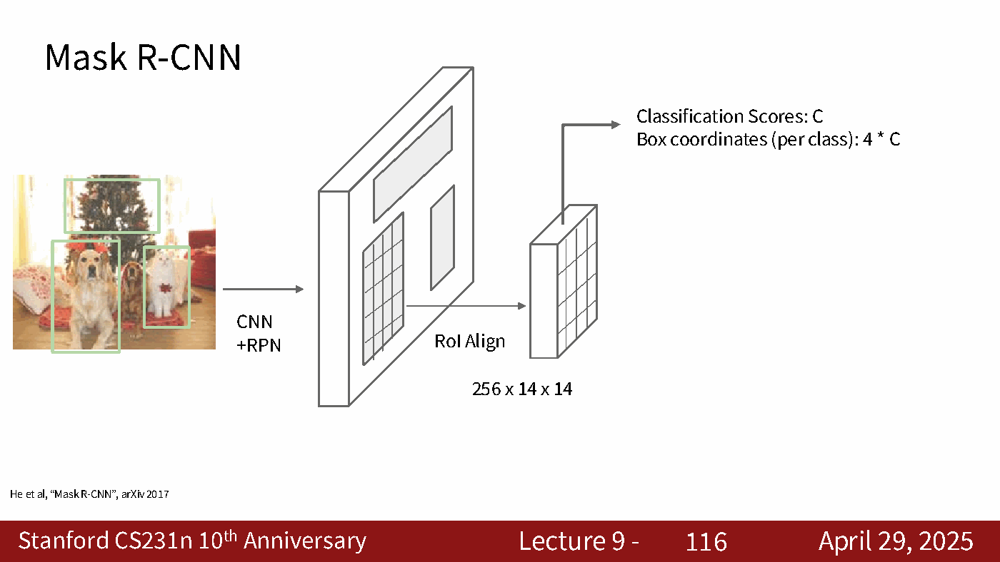
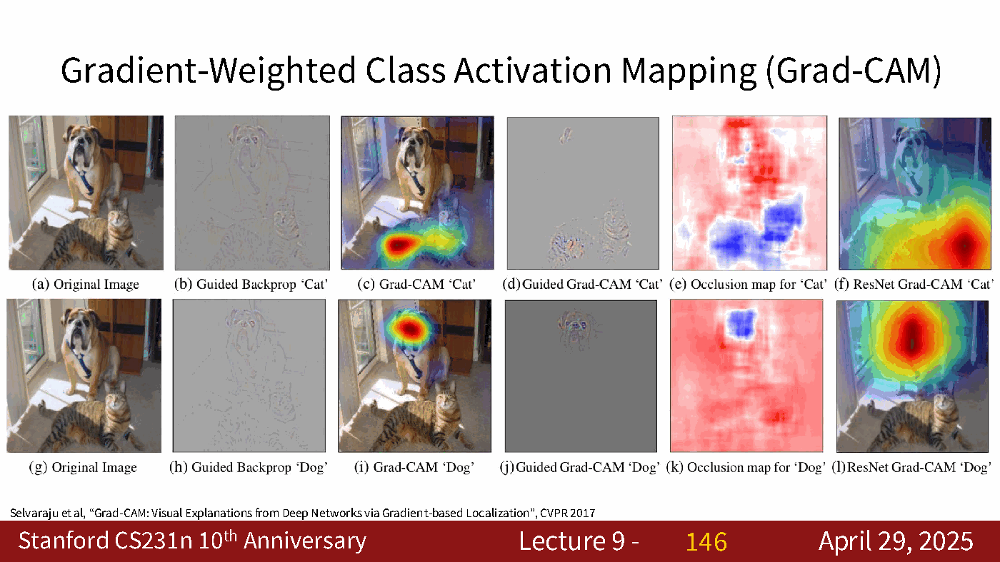

# 1. 现代 Transformer 的几个常见改动

**现在的 Transformer block 和最早论文里的写法有一些工程上的小改动。**

一个 Transformer block 分成这两步：

1. **Self-Attention**：让不同 token 之间交换信息。
2. **MLP**：每个 token 内部自己做一次非线性变换。

每一步外面都会加一个 **residual connection**：

$$
\text{new output}
=
\text{old input}
+
\text{change}
$$

如果输入是 $X$，Self-Attention 算出来的是 $\operatorname{MHA}(X)$，那么 residual connection 就是：

$$
X+\operatorname{MHA}(X)
$$


除了 residual，Transformer block 里还会做 normalization，即 $\hat{x} = \frac{x - \mu}{\sigma}$。

现在问题来了：**Normalization 应该放在 residual addition 前面，还是后面？**


## 1.1 Post-Norm

原始 Transformer 使用 **Post-Norm**，也就是先做 residual addition，再做 LayerNorm：

```text
输入 X
  -> Self-Attention
  -> 和原来的 X 相加
  -> LayerNorm
```

写成公式就是：

$$
U=\operatorname{LayerNorm}(X+\operatorname{MHA}(X))
$$

然后 MLP 部分也一样：

$$
Y=\operatorname{LayerNorm}(U+\operatorname{MLP}(U))
$$

## 1.2 Pre-Norm

现在很多模型更常用 **Pre-Norm**，也就是先对输入做归一化，再送进 Self-Attention 或 MLP；最后再和原输入相加。

Self-Attention 子层变成：

```text
输入 X
  -> LayerNorm
  -> Self-Attention
  -> 和原来的 X 相加
```

公式是：

$$
U=X+\operatorname{MHA}(\operatorname{Norm}(X))
$$

MLP 子层同理：

$$
Y=U+\operatorname{MLP}(\operatorname{Norm}(U))
$$

注意这里最外层是：

$$
X+\text{something}
$$

而不是：

$$
\operatorname{Norm}(X+\text{something})
$$


!!! explanation "为什么 Pre-Norm 更稳定"
    2019年有一篇论文说明了为什么 Pre-Norm 比 Post-Norm 更好，它推导了这两种方法的 gradient，其中 Post-Norm 的 gradient 存在连乘，而 Pre-Norm 是连加。连乘容易出现梯度爆炸和梯度消失，但是连加没那么容易出现。
    

## 1.3 RMSNorm

LayerNorm 会减均值再除以标准差。RMSNorm 简化了一点，只按 root mean square 缩放：

$$
\operatorname{RMS}(x)
=
\sqrt{
\epsilon+
\frac{1}{D}\sum_{i=1}^{D}x_i^2
}
$$

$$
y_i=\frac{x_i}{\operatorname{RMS}(x)}\gamma_i
$$

它仍然有可学习参数 $\gamma$，但不再显式减去均值。


## 1.4 SwiGLU MLP

经典 MLP 可以写成：

$$
Y=\sigma(XW_1)W_2
$$

其中：

$$
W_1\in\mathbb{R}^{D\times4D},
\qquad
W_2\in\mathbb{R}^{4D\times D}
$$

SwiGLU MLP 多了一条 gate：

$$
Y=(\sigma(XW_1)\odot XW_2)W_3
$$

其中 $W_1,W_2\in\mathbb{R}^{D\times H}$，$W_3\in\mathbb{R}^{H\times D}$。


!!! explanation "SwiGLU 的直觉"
    普通 MLP 是先把特征非线性变换，再投影回去。
    
    SwiGLU 可以理解为：一条分支产生候选内容，另一条分支产生门控信号，然后逐元素相乘。
    
    也就是让网络自己决定哪些中间特征应该被放大，哪些应该被压掉。

## 1.5 Mixture of Experts

Mixture of Experts（MoE）是在每个 block 里学习 $E$ 套不同的 MLP 参数，每套 MLP 叫一个 expert。

原来一套 MLP 参数是：

$$
W_1\in\mathbb{R}^{D\times4D},
\qquad
W_2\in\mathbb{R}^{4D\times D}
$$

MoE 变成：

$$
W_1\in\mathbb{R}^{E\times D\times4D},
\qquad
W_2\in\mathbb{R}^{E\times4D\times D}
$$

但是每个 token 不会用全部 experts，而是只路由到其中 $A<E$ 个 active experts。

所以它的效果是：

1. 参数量可以按 $E$ 倍增加。
2. 每个 token 实际计算量只按 $A$ 增加。


!!! note "MoE 的核心优势"
    MoE 不是让每个 token 都跑完整个大模型，而是让不同 token 选择不同专家。
    
    因此它特别适合把参数规模做得非常大，同时把单次 forward 的计算成本控制住。

---

# 2. Computer Vision Tasks 的层次

计算机视觉的一些任务：

1. **Image Classification**：整张图一个类别，没有空间范围。
2. **Semantic Segmentation**：每个 pixel 一个类别，但不区分同类的不同实例。
3. **Object Detection**：找出每个 object 的类别和 bounding box。
4. **Instance Segmentation**：既要找 object，又要给每个 object 单独预测 mask。


---

# 3. Semantic Segmentation
我们之前讲的都是图像分类（classification）。与classification不同，Semantic Segmentation（分割） 的目标是：**输入一张图片，输出每一个像素属于什么类别。**

训练数据中，每张图片的每个像素都有一个语义标签：

```text
grass, cat, tree, sky, ...
```

测试时，输入一张新图片，输出一张同样大小的 label map：

$$
\text{input}\in\mathbb{R}^{3\times H\times W}
\quad\longrightarrow\quad
\text{prediction}\in\{1,\dots,C\}^{H\times W}
$$

## 3.1 Sliding Window 的问题

最直接的想法是：对每个 pixel 周围取一个 patch，用 CNN 分类中心 pixel。

```text
取 patch -> CNN -> 判断中心 pixel 类别
```

这个方法的问题很明显：

1. 如果 patch 太小，缺少上下文，可能看不出中心 pixel 属于什么。
2. 如果 patch 很大，每个 pixel 都跑一次 CNN，重叠区域的计算会被重复很多次。


!!! warning "Sliding Window 很浪费"
    相邻 pixel 的 patch 大量重叠。如果每个 pixel 都独立跑 CNN，相当于同一片图像特征被反复计算。
    
    所以语义分割通常不应该用这种逐 pixel 独立分类的方式做。

## 3.2 Fully Convolutional Network

一次性把整张图喂给卷积网络，直接输出每个位置的类别分数：

$$
\text{scores}\in\mathbb{R}^{C\times H\times W}
$$

然后对每个 pixel 的 $C$ 个类别分数取 argmax：

$$
\hat{y}_{h,w}
=
\arg\max_c s_{c,h,w}
$$

问题是：在 Fully Convolutional Network 中，特征图一直保持原始大小 $H\times W$，那么**每一层卷积都要在所有像素位置上计算**，计算量和显存都会很大。因此我们引入了  Downsampling 和 Upsampling。


## 3.3 Downsampling 和 Upsampling

Downsampling 的作用是：

1. 降低空间尺寸，减少计算量。
2. 随着一层层的递进 引入Downsampling 能使 receptive field 以更快的速率增加。


Downsampling 很简单，通过 pooling、strider 等等，但是 Upsampling 还没有讨论过，Upsampling 的常见做法包括：

1. Nearest Neighbor upsampling。
    - 
2. Bed of Nails：把值放到稀疏位置，其余补 $0$。
    - 
3. Max Unpooling：记录 max pooling 时最大值的位置，再把值放回对应位置。
    - 
4. Transposed Convolution：可学习的上采样。

## 3.4 Transposed Convolution

3.3 中讲到的4中 Upsampling 的方法，只有 Transposed Convolution 用到了学习的方法

我们可以把 stride convolution 看成 learnable downsampling。

如果卷积 stride 为 $2$，那么 filter 在 input 上每移动 $2$ 个像素，output 只移动 $1$ 个像素，所以空间尺寸变小。


Transposed convolution 刚好反过来：input 上移动 $1$ 个像素，对应 output 上移动 $2$ 个像素。每个 input value 会作为权重，把 filter 的一份拷贝加到 output 上；如果多个 filter copy 覆盖到同一 output 位置，就把它们相加。


!!! example "看个例子"
    
## 3.5 U-Net


它分成两边：

1. 左边 downsampling path：逐步降低分辨率，扩大 field of view，提取语义信息。
2. 右边 upsampling path：逐步恢复分辨率，生成高分辨率预测。

关键是中间的 skip connection：因为执行 Downsampling 的过程，会丢失很多细节，这些细节无法通过 Upsampling 恢复。Skip connection 会保存 Encoder 中的 feature map，然后跟 Decoder 产生的 feature map 拼接在一起。

!!! example "举个例子"
    Encoder 产生的 feature map：
	
	$$256\times256\times64$$
	
	保存下来。
	
	Decoder 产生的feature map：
	
	$$256\times256\times128$$
	
	然后将它们拼接起来：
	
	$$256\times256\times(64+128)=256\times 256\times192$$
	


!!! warning "我的疑问" 
    ### 我的疑问
    encoder阶段的那些东西哪来的 feature map？
    ### 解答
    Encoder 本质上就是一个不断做「卷积提取特征 + 下采样压缩」的 CNN，所以每一次卷积都会产生 feature map。严格来说，输入图片本身也可以看作一种 feature map。
    
    因此，Encoder 每一个阶段的输出都会被当作 feature map 保存下来，等 Decoder 上采样恢复到相同空间尺寸时，把对应的保存下来的 feature map 与 decoder 的产物进行拼接。


---

# 4. Object Detection

Object Detection 要输出图像中每个物体的：

1. 类别。
2. bounding box。

一个 box 通常写成：

$$
(x,y,w,h)
$$

其中 $(x,y)$ 表示中心或左上角位置，$w,h$ 表示宽和高。具体参数化方式可以不同，但本质都是描述一个矩形框。

## 4.1 Single Object: Classification + Localization

如果图中只有一个 object，问题比较简单。网络可以有两个 head：

1. classification head：输出 $C$ 个类别分数。
2. box regression head：输出 $4$ 个坐标。

分类用 softmax loss：

$$
L_{\text{cls}}
=
-\log p(y)
$$

定位可以用 L2 loss 或 smooth L1 loss：

$$
L_{\text{box}}
=
\lVert b-\hat{b}\rVert^2
$$

总 loss 是一个 multitask loss：

$$
L=L_{\text{cls}}+\lambda L_{\text{box}}
$$


## 4.2 Multiple Objects 的困难

一张图里可能有不同数量的物体，比如一张图中可能有两只猫蹲、三只狗等等

最直接的做法是：对图像中很多不同位置、尺度、长宽比的 crop 都跑 CNN，判断每个 crop 是 object 还是 background。

但是这样子开销太大了：

1. 位置很多。
2. 尺度很多。
3. aspect ratio 很多。
4. 每个 crop 都独立 forward 一次，重复计算严重。


---

# 5. R-CNN 系列

## 5.1 Region Proposals

R-CNN的做法：先找出少量可能包含 object 的区域，叫 **region proposals**。

Selective Search 这类方法会找出看起来像物体的 blob 区域，通常一张图给大约 $2000$ 个 proposals。

在R- CNN 中

!!! warning "我的疑问"
    ### 我的疑问1
    一张图片中明明只有几个目标，我们为什么要生成2000个 region proposal？
    ### 解答
    并不是一个框框对应一个目标。而是产生的几百几千个框框，有好几个都能将我们要找到的目标给框住，比如下面三个不同的框框都能够将猫给框住：
    
    
    这些 proposals 都会被送到 CNN 中，CNN 会输出每个框框的得分，然后留下最高分。
    ### 我的疑问2
    既然这样的话，万一随机初始化的所有框框都没有将目标给框住怎么办？
    ### 解答
    如果 proposal 根本没有覆盖到真是目标的话，那确实寄了。但是我们并不是随机初始化这2000个框框的，Selective Search的操作机制如下图所示：
    
    
    ### 我的疑问3
    为什么不能像Single Object detection 那样，用 learning 的方法一步步优化这个框框，这样子的话，我们想要探测一张图中的几个目标，就只用初始化这么多个框框，然后每个框都使用 learning 的方法来优化不就好了。为什么要像这样初始化一堆框，最后也不用learning 的方法优化，只是筛选出得分高的初始化框？
    ### 解答
    倒也不是完全不用 learning，是会把初始化中得分较高的框框挑出来，然后进行 learning 的，但是这个问题并没有得到我想要的解答，留着以后弄明白吧。

## 5.2 R-CNN

R-CNN 的流程是：



1. 用 proposal method 得到约 $2000$ 个 RoI。
2. 把这2000个 $RoI$ 都 warp 成固定的大小，例如 $224\times224$（我个人感觉这样子不太好，有些图片会被缩放的很难看，比如把一个 $9\times 16$ 的自拍照缩放成 $16\times 16$ 会很丑）。
3. 每个 warped region 独立通过 ConvNet，生成 feature matrix。
    - feature matirx 可以是 $2000\times 4096$ 维的，其中2000代表2000个框框，4096代表每个框框都提取出4096个特征值。
4. 用 SVM 对 region 分类。
    - 如果 feature matrix 的维度为 $2000\times 4096$ 的话，那么 SVM weight matrix 的维度为 $4096\times N$，其中 $N$ 代表类别数量
5. 用 bbox regressor 预测 box correction：

$$
(d_x,d_y,d_w,d_h)
$$

一张图要生成 $2000$ 个 region，每个 region 都要跑 ConvNet，所以R- CNN的效率比较低。

## 5.3 Fast R-CNN

R- CNN的缺点：


Fast R-CNN 的改进是：==先对整张图跑一次 backbone，再在 feature map 上 crop RoI。==



流程变成：

# Fast R-CNN 执行过程

1. 用 proposal method 得到约 $2000$ 个 RoI。
2. 整张图片通过一次 ConvNet，生成 feature map。
    - 与 R-CNN 不同，Fast R-CNN 不会把每个 RoI 单独 resize 后输入 CNN。
    - 而是先对整张图片进行一次卷积操作：

$$
Image \rightarrow ConvNet \rightarrow Feature\ Map
$$

3. 对每个 RoI 使用 RoI Pooling 从 feature map 中提取固定大小的 feature。
    - 每个 RoI 根据自己的位置，在 feature map 中找到对应区域。
    - 然后通过 RoI Pooling 转换成固定大小
        - 注意，这里的顺序跟 R-CNN 不一样，R- CNN 是先将 ROI 缩放成固定大小之后再丢到 ConvNet 中。而 Fast R-CNN 先将整张图片通过 ConvNet 得到 feature map，然后将 RoI 映射到 feature map 上，再通过 RoI Pooling 将每个 RoI 转换成固定大小的 feature
4. 每个 RoI 的 feature 通过 Fully Connected Layer，生成 feature vector。
5. 使用 Softmax classifier 对 region 分类。
    - Fast R-CNN 不再使用 R-CNN 中单独训练的 SVM 分类器，而是将分类任务整合到网络内部，通过 Softmax layer 直接输出类别概率。
6. 使用 bbox regressor 预测 box correction：

$$
(d_x,d_y,d_w,d_h)
$$

    - 与分类分支同时进行。
    - 用预测出的 offset 对原来的 RoI 进行调整，得到更加准确的 bounding box。

这样大部分卷积计算在整张图上共享，只在后面的小 head 里按 RoI 分开处理。


---

# 6. Single-Stage Detectors: YOLO / SSD / RetinaNet

Faster R-CNN 是 two-stage（有两个阶段的）：先产生 proposals -> 再分类和修正 proposals

Single-stage detector 直接在密集网格上输出 boxes 和类别。

以 YOLO / SSD / RetinaNet 这一类方法为例，把图像分成 $S\times S$ 个 grid cells。每个 grid cell 负责若干个 base boxes。

对于每个 box 输出：

1. $P(\text{object})$：是否有物体。
2. box 坐标或 box correction。
3. class scores。

如果每个 grid cell 有 $B$ 个 boxes，类别数为 $C$，一种常见输出形状可以写成：

$$
S\times S\times(5B+C)
$$

这里 $5$ 通常表示：

$$
(d_x,d_y,d_w,d_h,\text{confidence})
$$

!!! explanation "每个 grid cell 有 B 个 boxes 是什么意思？"
    ### 我的疑问
    每个 grid cell 有 B 个 boxes 是什么意思？
    ### 解答
    

---

# 7. DETR: 用 Transformer 做 Detection

DETR 的目标是把 detection 做得更端到端一些。

它不再依赖 anchors，也不再预测 anchor 到 box 的 transforms，而是让 Transformer 直接输出一组 boxes。



核心流程可以理解为：

1. CNN backbone 提取图像特征。
2. 把二维 feature map 展平成一组 tokens，加 positional encoding。
3. Transformer encoder 处理图像 tokens。
4. Transformer decoder 使用一组 learned object queries。
5. 每个 object query 输出一个 class 和一个 box。

因为输出是一组 unordered boxes，所以训练时需要把 predicted boxes 和 ground-truth boxes 做匹配。

DETR 使用 bipartite matching：

```text
预测框集合 <-> 真实框集合
```

匹配之后，再对匹配到的 pair 计算分类 loss 和 box regression loss。

!!! explanation "为什么 DETR 需要 matching"
    Detection 的输出没有天然顺序。
    
    如果图里有 cat 和 dog，模型第 1 个 query 输出 cat、第 2 个 query 输出 dog，和反过来输出，本质上都应该算对。
    
    所以不能简单地要求“第 i 个预测框对应第 i 个真实框”。必须先找到一个最合理的一一匹配，再计算 loss。

---

# 8. Instance Segmentation 和 Mask R-CNN

Instance Segmentation 既要检测 object，又要给每个 object 预测像素级 mask。

和 semantic segmentation 的区别是：如果图中有两只同类 object，instance segmentation 要把它们分成两个不同实例。

```text
semantic segmentation: 这些像素都是 dog
instance segmentation: 这是 dog 1，那是 dog 2
```

Mask R-CNN 可以看成 Faster R-CNN 加了一个 mask head。



对于每个 RoI，Mask R-CNN 输出：

1. classification scores：$C$ 个类别分数。
2. box coordinates：每类 $4$ 个坐标，所以是 $4C$。
3. mask：每类一个 $28\times28$ binary mask，所以是：

$$
C\times28\times28
$$

mask head 是一个小的卷积网络，作用在 RoI Align 得到的 feature 上。

!!! note "为什么每类都预测一个 mask"
    Mask R-CNN 会给每个类别预测一张 mask，但最终只取分类 head 预测出来的那个类别对应的 mask。
    
    这样 mask branch 不需要在同一张 mask 里同时解决“这是哪个类别”和“这个类别的形状是什么”两个问题。

Mask R-CNN 的成功很大程度上也依赖 RoI Align。因为 mask 是像素级输出，RoI Pool 的 rounding / snapping 会造成空间错位，而 RoI Align 用 bilinear interpolation 保留了更精细的位置对应关系。

---

# 9. Visualization and Understanding

最后一部分讲的是怎么理解神经网络到底看了什么。

这类方法大致分成：

1. 直接看模型层的权重或特征。
2. 用 gradient 看输入中哪些像素影响某个 class score。
3. 用 CAM / Grad-CAM 看模型关注的空间区域。

## 9.1 Visualize Filters

第一层卷积核可以直接可视化，因为它们直接作用在 RGB 图像上。

例如 AlexNet 第一层 filter 形状是：

$$
64\times3\times11\times11
$$

每个 filter 都可以看作一个小图像 patch。通常会看到一些类似边缘、颜色对比、方向纹理的模式。

深层 filter 就不太能直接看了，因为它们的 channel 不再对应 RGB，而是抽象 feature。

## 9.2 Saliency Maps

Saliency map 想回答的问题是：

```text
哪些像素对某个类别分数最重要？
```

做法是：

1. Forward pass，计算某个类别的 unnormalized class score $S_c$。
2. 对输入图像 $I$ 求梯度：

$$
\frac{\partial S_c}{\partial I}
$$

3. 对 RGB channel 取绝对值并求最大：

$$
M_{h,w}
=
\max_{r,g,b}
\left|
\frac{\partial S_c}{\partial I_{h,w,:}}
\right|
$$

如果某个像素的梯度绝对值大，说明这个像素轻微变化会明显影响类别分数。

!!! warning "Saliency map 不是严格因果解释"
    Saliency map 只是局部梯度敏感性。
    
    它告诉我们在当前输入附近，哪些像素会影响 score，但不等于模型真的“以人类方式理解”了这些区域。

## 9.3 Class Activation Mapping

CAM 适用于最后一层卷积特征后面接 global average pooling 和 linear classifier 的结构。

设最后一层 CNN feature 为：

$$
f\in\mathbb{R}^{H\times W\times K}
$$

Global Average Pooling 得到：

$$
F_k
=
\frac{1}{HW}
\sum_{h,w}f_{h,w,k}
$$

分类器权重为：

$$
W\in\mathbb{R}^{K\times C}
$$

类别 $c$ 的 score 为：

$$
S_c
=
\sum_k W_{k,c}F_k
$$

代入 $F_k$：

$$
\begin{aligned}
S_c
&=
\sum_k W_{k,c}
\left(
\frac{1}{HW}
\sum_{h,w}f_{h,w,k}
\right)\\
&=
\frac{1}{HW}
\sum_{h,w}
\sum_k W_{k,c}f_{h,w,k}
\end{aligned}
$$

因此可以定义类别 $c$ 的 activation map：

$$
M_{c,h,w}
=
\sum_k W_{k,c}f_{h,w,k}
$$

它表示空间位置 $(h,w)$ 对类别 $c$ 的贡献。

!!! explanation "CAM 为什么能定位"
    最后一层卷积 feature 仍然保留 $H\times W$ 的空间布局。
    
    线性分类器的权重 $W_{k,c}$ 告诉我们：第 $k$ 个 channel 对类别 $c$ 有多重要。
    
    所以把各个 channel 按 $W_{k,c}$ 加权相加，就能得到“哪些空间位置支持类别 $c$”。

CAM 的限制是：它只能直接用于特定结构，尤其依赖最后的 global average pooling + linear classifier。

## 9.4 Grad-CAM

Grad-CAM 是 CAM 的推广，可以用于任意选择的一层 activation。



选择某一层 activation：

$$
A\in\mathbb{R}^{H\times W\times K}
$$

先计算类别分数 $S_c$ 对 activation 的梯度：

$$
\frac{\partial S_c}{\partial A}
\in
\mathbb{R}^{H\times W\times K}
$$

对每个 channel 的梯度做 global average pooling，得到权重：

$$
\alpha_k^c
=
\frac{1}{HW}
\sum_{h,w}
\frac{\partial S_c}{\partial A_{h,w,k}}
$$

再用这些权重加权 activation：

$$
M_{h,w}^c
=
\operatorname{ReLU}
\left(
\sum_k
\alpha_k^c A_{h,w,k}
\right)
$$

这里的 ReLU 表示只保留对类别 $c$ 有正贡献的区域。

!!! note "CAM 和 Grad-CAM 的关系"
    CAM 用的是分类器最后线性层的权重。
    
    Grad-CAM 用的是类别分数对中间 feature 的梯度，梯度平均后扮演“这个 channel 对类别 c 有多重要”的权重。
    
    所以 Grad-CAM 更通用，可以在更多网络结构和更多中间层上使用。

## 9.5 Intermediate Features via Guided Backprop

还可以选择某个中间层 neuron 或 channel，计算它对输入像素的梯度。

如果只让正梯度通过 ReLU，得到的图通常更清晰，这叫 **guided backprop**。

这类方法能帮助观察某个中间 neuron 喜欢什么模式，例如边缘、纹理、局部部件等。

---

# 10. 总结

本讲从 Transformer 进入更完整的视觉理解任务。

最重要的线索可以概括为：

1. ViT 把图像切成 patch token，再用普通 Transformer 处理。
2. 现代 Transformer 常用 Pre-Norm、RMSNorm、SwiGLU 和 MoE。
3. Semantic Segmentation 是每个 pixel 分类，常用 FCN / U-Net 这类 encoder-decoder 结构。
4. Object Detection 要输出类别和 box，难点在于一张图有变长数量的 objects。
5. R-CNN 系列从 region proposal 出发，逐步解决重复卷积计算和 proposal 生成的问题。
6. Single-stage detectors 直接在 dense grid / anchors 上预测最终 boxes 和类别，速度更快。
7. DETR 用 Transformer 直接输出一组 boxes，并用 bipartite matching 解决输出无序问题。
8. Mask R-CNN 在 Faster R-CNN 上加 mask head，完成 instance segmentation。
9. Saliency、CAM 和 Grad-CAM 都是在尝试回答“模型到底看哪里”。