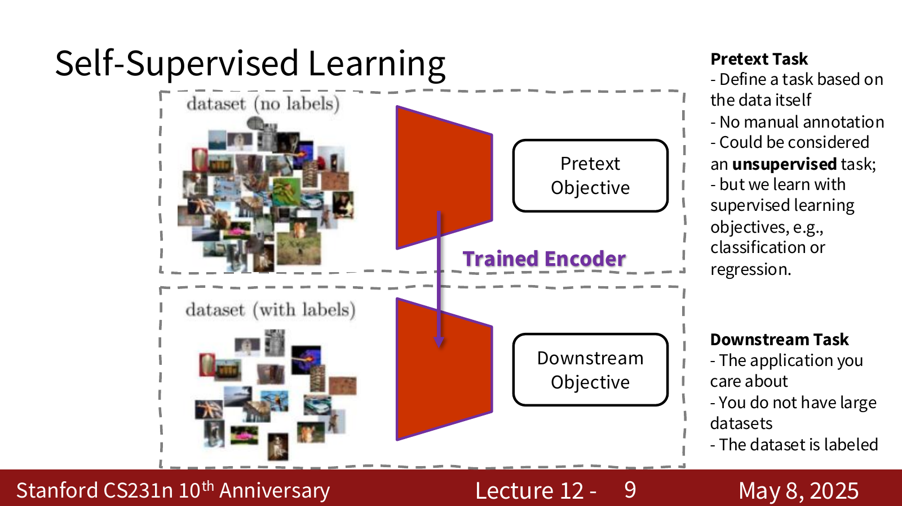
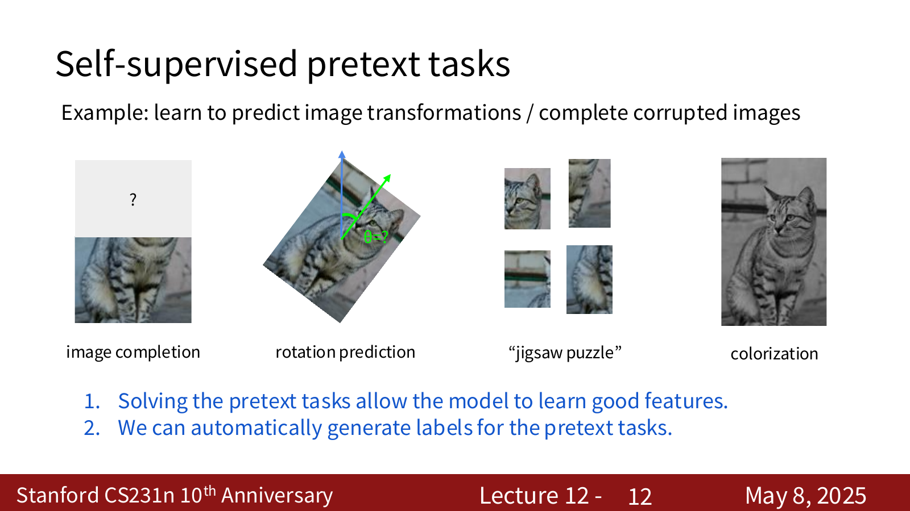
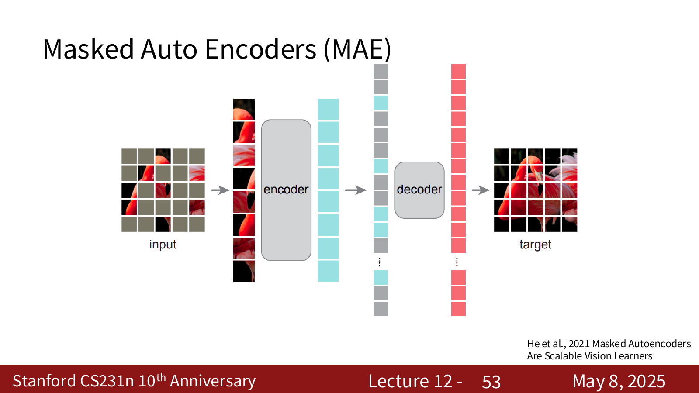
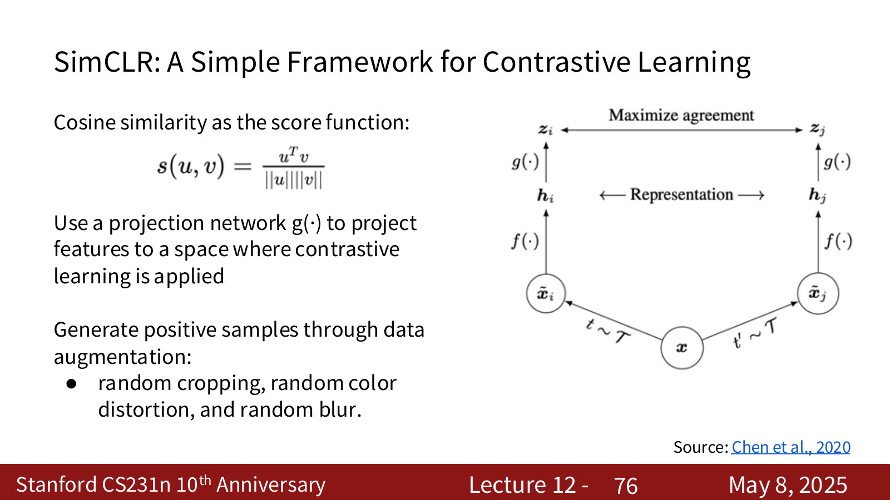
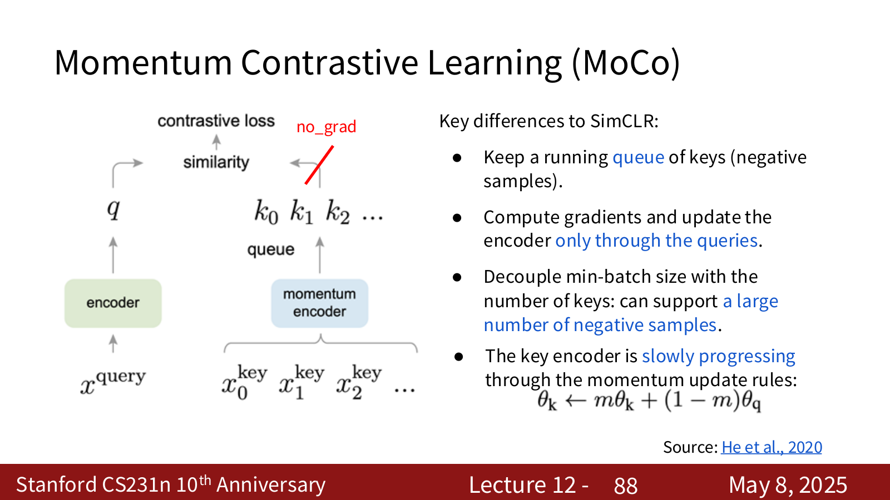

# 1. Self-Supervised Learning 的概念

前面的 lecture 中，我们训练图像分类模型时，通常需要大量人工标注数据：

问题是：大规模人工标注会耗费大量时间，因此 Self-Supervised Learning 的目标就是：**不依赖人工标签，而是从数据本身构造监督信号，让模型先学到一个有用的 representation。**

它一般分成两个阶段：

1. **Pretext Task**：先设计一个可以从原始数据自动生成标签的任务。
2. **Downstream Task**：再把学到的 encoder / representation 迁移到真正关心的任务上。



## 1.1 Pretext Task

Pretext task 是为了学习 representation 而构造出来的“借口任务”。

例如：

1. 把图片旋转 $0^\circ,90^\circ,180^\circ,270^\circ$，让模型预测旋转角度。
2. 挖掉图片中间一块，让模型补全缺失区域。
3. 打乱 patch，让模型恢复正确顺序。
4. 输入灰度图，让模型预测颜色。

这些任务的共同点是：**标签可以自动生成，不需要人工标注。**

!!! warning "我的疑问"
    ### 我的疑问1
    为什么这些数据不需要人工标注？像正常的图片旋转不也是要给它们标上旋转的度数的吗？像模型恢复正确顺序不是也要有正确的顺序才能学习吗？
    ### 解答 
    **这些任务当然还是需要标签**，但是**标签不是一个一个手工标出来的，而是我们从原始数据本身通过一个确定的规则自动构造出来。所以这里的 self-supervised 并不是没有标签，而是**标签来自数据自己。

    以旋转预测为例，原始图片是：
	
	$$x$$
	
	我们程序随机把它旋转成：
	
	$$0^∘, 90^∘, 180^∘, 270^∘$$
	
	比如程序自己执行了：
	
	```python
	image = rotate(image, 90)
	label = 90
	```
	
	那它当然知道自己刚才转了 $90^\circ$，所以训练数据自动就变成：(旋转后的图片,90∘)
	
	这里根本不需要我们自己手动一张一张旋转，电脑直接帮我们做好了。因此这种方式会比我们手动标注要快很多。

    ### 我的疑问2
    既然这样的话，自监督学习和普通的监督学习除了标签一个是自动生成的，一个是认为标注上去的，别的方面没有任何区别啊
    ### 解答
    
    




!!! note "为什么 pretext task 能学到有用特征"
    如果模型想判断图片是不是被旋转了，它不能只看局部纹理，而要知道物体通常应该怎么摆放。
    
    如果模型想补全缺失区域，它也需要理解周围上下文和物体结构。
    
    所以 pretext task 逼着模型学习一些视觉常识，这些常识之后可以迁移到分类、检测、分割等任务。

## 1.2 Downstream Task

1. **Pretext task 阶段**：为了让模型学特征，我们会临时加一个任务头，比如 rotation classifier、inpainting decoder、MAE decoder。
2. **Downstream task 阶段**：预训练结束后，把真正有用的 encoder 拿出来，接到分类、检测、分割这些真实任务上。

更准确地说，完整流程是：

1. **Self-supervised pretraining / pretext task**：用大量无标签数据训练 encoder。
2. **取出 encoder**：丢掉 pretext task 里临时使用的 classifier / decoder。
3. **Downstream task**：在真正任务的有标签数据上，接一个新的 classifier / detector / segmenter，或者微调整个模型。

!!! note "为什么通常只说迁移 encoder"
    自监督学习真正想要的是 encoder 学到的 feature。
    
    pretext task 后面的 classifier / decoder 只是并不是我们最终要用的decoder。比如 rotation classifier 只会预测旋转角度，MAE decoder 只会重建 patch，它们并不是我们最终要用来做真正的分类、检测、分割任务的decoder。
    
    所以 downstream task 通常会换一个新的 task head，但复用已经预训练好的 encoder。

## 1.3 如何评价自监督学习

常见评价方式：

1. **Pretext task performance**：模型在预训练任务上做得怎么样。
2. **Representation quality**：学到的 feature 好不好。
3. **Linear evaluation protocol**：冻结 encoder，只训练一个 linear classifier。
4. **Clustering / t-SNE**：看 representation 是否自然分开。
5. **Robustness and generalization**：换数据集、换扰动后还能不能泛化。
6. **Downstream task performance**：迁移到真正任务上的效果。

这节课最强调的是 downstream task performance 和 linear evaluation。

!!! note "Linear probing 和 Fine-tuning 的区别"
    **Linear probing**：冻结预训练好的 encoder，只在最后加一个线性分类器。
    
    **Fine-tuning**：encoder 也继续训练，让整个模型适应新任务。
    
    Linear probing 更像是在测 representation 本身有多线性可分；fine-tuning 更像是在测这个预训练模型的完整迁移潜力。

---

# 2. 基于图像变换的 Pretext Tasks

对图像做某种变换，然后让模型预测这个变换或恢复原图。

## 2.1 Rotation Prediction

1. 从图片 $x$ 生成旋转后的图片。
2. 旋转角度从四个类别里选：

$$
\theta\in\{0^\circ,90^\circ,180^\circ,270^\circ\}
$$

3. 让模型预测当前图片被旋转了多少度。

这就是一个 4-way classification：

$$
p(\theta\mid x)
$$


!!! example "Rotation prediction 学到的不是旋转本身"
    预测旋转只是表面任务。
    
    真正有价值的是 encoder 为了完成这个任务，被迫学习了 object shape、pose、part relation 等特征。

## 2.2 Relative Patch Location 和 Jigsaw Puzzle

另一类 pretext task 是让模型理解 patch 之间的相对位置。

### 2.2.1 Relative Patch Location

给定一张图片中的两个 patch：patch A 和 patch B。模型要预测 $B$ 相对于 $A$ 的位置。

如果模型要做对这个任务，它需要理解物体的局部结构。

### 2.2.2 Jigsaw Puzzle

Jigsaw puzzle 更进一步：

1. 把图片切成多个 patch。
2. 打乱 patch 顺序。
3. 让模型预测原来的排列。

这个任务要求模型同时理解：

1. 局部纹理是否连续。
2. 不同部件之间的语义关系。
3. 整体物体结构。
## 2.3 Inpainting

Inpainting 是把图片的一部分遮住，让模型预测缺失像素。它类似 autoencoder，但不是重建整张图，而是重点重建缺失区域。

设 mask 为 $M$：

$$
M=
\begin{cases}
0, & \text{not masked}\\
1, & \text{masked}
\end{cases}
$$

重建 loss 可以只在被 mask 的区域上计算：

$$
L_{\text{recon}}
=
\left\|
M\odot(\hat{x}-x)
\right\|^2
$$

Pathak et al. 的 Context Encoder 还会加入 adversarial loss，让补全出来的区域看起来更真实：

$$
L
=
L_{\text{recon}}
+
L_{\text{adv}}
$$

!!! explanation "$L_{\text{recon}}$ 和 $L_{\text{adv}}$ 分别在管什么"
    $L_{\text{recon}}$ 是 reconstruction loss，也就是**重建损失**。它直接比较模型补出来的缺失区域 $\hat{x}$ 和真实图片对应区域 $x$ 的像素差距。
    
    $L_{\text{adv}}$ 是 adversarial loss，也就是**对抗损失**。它不再逐像素比较，而是让一个 discriminator 判断补全后的图片像不像真实图片。
    
    所以总 loss：
    
    $$
    L=L_{\text{recon}}+L_{\text{adv}}
    $$
    
    可以理解成：
    
    总目标 = 像素上接近真实答案 + 视觉上像真实图片


!!! warning "只用 reconstruction loss 的问题"
    像素级 MSE 往往会产生模糊结果。
    
    因为缺失区域可能有多个合理答案，MSE 会倾向于平均这些可能性，所以结果会变糊。
    
    Adversarial loss 的作用是鼓励补全结果落在真实图像分布上。

## 2.4 Image Colorization

Colorization 说白了就是给黑白照片上色。

训练的时候，我们其实本来有一张彩色图片。为了构造自监督任务，我们先把它变成灰度图，只把灰度图交给模型，然后要求模型把颜色预测回来。

如果用 Lab color space 来表示一张图片，那么一张彩色图片可以拆成：

1. $L$：亮度信息，可以理解成黑白照片里哪里亮、哪里暗。
2. $a,b$：颜色信息，用两个方向来描述颜色。

!!! warning "这里颜色为什么要分成 $a$ 和 $b$？"
    ### 我的疑问
    为什么颜色要分成 $a$ 和 $b$
    ### 解析
	因为颜色不是一个一维数值就能描述清楚的东西。只用一个数，你最多只能表示颜色多一点还是少一点，但真实颜色至少需要两个方向：
	
	1. $a$ 轴：大致表示从绿色到红色的变化。
	2. $b$ 轴：大致表示从蓝色到黄色的变化。
	
	所以一个像素在 Lab 里可以理解成：
	
	- L：这个点有多亮
	- a：这个点偏绿还是偏红
	- b：这个点偏蓝还是偏黄

	
	这有点像在平面上用 $(x,y)$ 两个坐标定位一个点。颜色也需要 $(a,b)$ 两个坐标，才能表示往哪个颜色方向偏。
	
	所以 colorization 的训练任务可以写成：
	
	- 输入：L，也就是灰度图
	- 输出：a,b，也就是颜色


### 2.4.1 Split-Brain Autoencoder

Split-brain autoencoder 这个名字里的 split-brain 可以理解成把大脑分成左右两半。

对于一张图片，它不只包含亮度，也包含颜色。普通 colorization 只做一个方向：$亮度 L \rightarrow 预测颜色 a,b$


Split-brain autoencoder：既然图片有不同 channel，那就把 channel 分成两组，让两组互相预测:

- 第一半网络：看到 L，预测 a,b
- 第二半网络：看到 a,b，预测 L

这样第一半网络为了从灰度预测颜色，需要理解物体语义；第二半网络为了从颜色预测亮度，也需要理解图片结构。最后不用 decoder 的输出，而是把这两半网络中间学到的 features 拿出来拼在一起，作为之后分类、检测等任务的 representation。

!!! explanation "为什么叫 cross-channel prediction"
    channel 就是一张图片里的不同信息层，比如 RGB 里的 R/G/B，或者 Lab 里的 $L/a/b$。
    
    cross-channel prediction 的意思是：不给模型完整图片，而是只给它一部分 channel，让它预测另一部分 channel。
    
    所以它不是在背答案，而是在逼模型理解不同 channel 之间的关系。

## 2.5 Video Colorization

Video colorization 利用了视频中的 temporal coherence。

给定：

1. 一帧带颜色的 reference frame。
2. 后续若干灰度 target frames。

模型要把 reference frame 的颜色传播到后续帧。

由于同一个物体在相邻帧中移动后，颜色应该保持一致。因此模型需要学会：

1. 在 reference frame 中找到对应区域。
2. 在 target frame 中追踪同一个区域。
3. 把 reference color 复制过去。

!!! example "举个例子"
    给定第 0 帧和第 1 帧：
    
	- 第 0 帧：一个人穿着红衣服，在画面左边
	- 第 1 帧：同一个人移动到了画面中间，但这一帧是灰度图
	
	模型需要回到第 0 帧里找：第 1 帧中间这个区域，最像第 0 帧里的哪个区域
	
	如果模型发现第 1 帧中间的人，对应第 0 帧左边那个红衣服的人，那么它就可以把第 0 帧里那块区域的红色复制过来。
	
所以 video colorization 的核心不是单纯上色，而是**建立 target frame 和 reference frame 之间的位置对应关系**。

这个过程可以写成 attention（选择性的关注reference frame中的某些位置）：

$$
\hat{c}_{t}(i)
=
\sum_j a_{i,j}c_0(j)
$$

其中：

1. $i$：target frame 里现在要上色的位置。
2. $j$：reference frame 里的某个候选位置。
3. $c_0(j)$：reference frame 第 $j$ 个位置原本的颜色。
4. $a_{i,j}$：模型认为 target 的位置 $i$ 应该从 reference 的位置 $j$ 拿多少颜色。
5. $\hat{c}_{t}(i)$：模型最后给 target 位置 $i$ 预测出来的颜色。

如果 $a_{i,j}$ 很大，就表示：target frame 的位置 i 很可能对应 reference frame 的位置 j

---

# 3. Masked Autoencoder (MAE)

MAE 是更现代的 reconstruction-based self-supervised learning 方法，特别适合 Vision Transformer：

随机遮住图像中的大量 patch，只把少量可见 patch 输入 encoder，然后让 decoder 重建被遮住的 patch。



## 3.1 Masking Method

和 ViT 一样，MAE 先把图片切成不重叠 patch：

然后随机 mask 掉很大比例的 patch，常用比例是：

$$
75\%
$$

也就是说，encoder 只看到约 $25\%$ 的 patch。

!!! explanation "为什么 mask ratio 可以这么高"
    图像有很强的空间冗余。如果只 mask 一小部分，模型可能靠局部纹理就能轻松补出来，任务太简单。
    
    mask 掉 $75\%$ 后，模型必须依赖更全局的语义和结构信息，pretext task 才足够有意义。

## 3.2 MAE Encoder

MAE 的 encoder 只处理 unmasked patches。

流程：

1. 把可见 patch 做 linear projection。
2. 加 positional embeddings。
3. 输入 Transformer blocks。
## 3.3 MAE Decoder

由于原图被切成很多 patch，其中 75% 被 mask 掉，encoder 只看剩下 25% 可见 patch。所以 encoder 输出的时候，只输出了可见 patch 的表示。问题是，如果我们想让模型把整张图补回来，那么只知道这 $25\%$ 的 patch 还不够。模型还需要知道**哪些位置原来有 patch，但是现在被遮住了。这就是 decoder 要做的事情。**

### 3.3.1 Decoder 的输入

1. **Visible patch representations**：encoder 输出的 $25\%$ 可见 patch 的特征。
2. **Mask tokens**： $75\%$ 被遮住的位置放上的占位符。表示该位置的图像内容未知。
3. **positional embeddings**：告诉 decoder 所有的 patch 原来在图像里的位置（被 masked 和未被 masked 的都有）。

即：

$$[可见\ patch\ 的表示] + [被遮住位置的\ mask\ token] + [位置信息]$$

### 3.3.2 Decoder 的输出

decoder 输出的是像素层面的重建结果：

$$mask token -> decoder -> 预测这个 patch 的 RGB 像素$$


但是预训练结束后，我们需要删掉这个 decoder 留下 encoder，再执行downstream：

1. 保留 encoder
2. 丢掉 MAE decoder
3. 换上 classifier / detector / segmenter


!!! note "为什么叫 asymmetrical autoencoder"
    asymmetrical 的意思是 encoder 和 decoder 不对称。
    
    MAE 里 encoder 很重要，所以可以做得很大；decoder 只是预训练时重建 patch 用的，所以可以比较轻。
    
    预训练结束后，通常保留大的 encoder，丢掉轻量 decoder。

## 3.4 Reconstruction Loss

只在 masked patches 上计算：

$$
L
=
\frac{1}{|\Omega|}
\sum_{i\in\Omega}
\left\|
\hat{x}_i-x_i
\right\|_2^2
$$

其中 $\Omega$ 表示被 mask 的 patch 集合。

!!! warning "为什么 loss 只算 masked patches"
    如果 visible patches 也参与 loss，模型可能把大量精力放在复制已经看见的 patch 上。
    
    只在 masked patches 上计算 loss，才能强迫模型根据上下文补全缺失内容。

---

# 4. Contrastive Representation Learning

前面那些 pretext task 都需要人为设计具体任务，比如旋转、拼图、补全、上色。

问题是：

1. 设计任务很麻烦。
2. 学到的 representation 可能和某个任务绑得太死。

Contrastive representation learning 想构造一个更通用的 pretext task：**同一个东西的不同 view 应该靠近，不同东西应该远离。**

!!! warning "为什么能解决上面两个问题？"
    
	首先，我们不需要耗费功夫去设计什么图片旋转这些具体任务。我们只需要定义什么算同一个东西的不同 view。
	
	例如对于图片，可以这样构造：
	
	- 同一张图片做两次不同数据增强 -> positive pair
	- 不同图片 -> negative pair
	
	这样标签仍然可以自动生成：
	
	- 这两个 view 来自同一张原图 -> positive
	- 这两个 view 来自不同原图 -> negative
	
	所以 4.1 和 4.2 其实是在回答两个问题：
	
	1. **4.1**：怎么定义 positive sample 和 negative sample。
	2. **4.2**：怎么把这种关系写成一个可以训练神经网络的 loss。

## 4.1 Reference, Positive, Negative

我们先定义三种样本。

对一个 reference sample $x$：

1. $x^+$ 是 positive sample，表示和 $x$ 应该相似。
2. $x^-$ 是 negative sample，表示和 $x$ 应该不相似。

我们希望 encoder $f$ 满足：

$$
\text{score}(f(x),f(x^+))
\gg
\text{score}(f(x),f(x^-))
$$

这里 score 可以是 dot product、cosine similarity 或一个可学习函数。

## 4.2 InfoNCE Loss

有了 reference、positive、negative 后，接下来就需要一个 loss 来训练 encoder。

这个 loss 要做到两件事：

1. 让 $x$ 和 $x^+$ 的 score 变大。
2. 让 $x$ 和 $x^-$ 的 score 变小。

假设有 1 个 positive sample 和 $N-1$ 个 negative samples：

$$
x^+,x_1^-,x_2^-,\dots,x_{N-1}^-
$$

InfoNCE loss 可以写成：

$$
L
=
-
\log
\frac{
\exp(s(f(x),f(x^+)))
}{
\exp(s(f(x),f(x^+)))
+
\sum_{i=1}^{N-1}
\exp(s(f(x),f(x_i^-)))
}
$$

InfoNCE 也可以看作 mutual information 的 lower bound。负样本数量 $N$ 越大，这个 bound 通常越紧。

!!! explanation "mutual information、lower bound、bound 越紧是什么意思"
    **Mutual information** 叫互信息，意思是：知道一个东西之后，能帮我减少多少对另一个东西的不确定性。
    
    例如：
    
    - A = 今天是不是下雨
    - B = 地面是不是湿
    
    如果知道今天下雨，那么地面肯定是湿的，所以 $A$ 和 $B$ 的 mutual information 比较高。
    
    在对比学习里：
    
    - x  = 原图
    - x+ = 同一张图做数据增强后的版本
    
    如果知道 $x$ 是一只猫，那 $x^+$ 大概率还是猫。所以 $x$ 和 $x^+$ 共享了很多语义信息，这就是 mutual information 高。
    
    **Lower bound**：
    
    例如真实分数是 100，但我只知道真实分数 >= 80。那 80 就是真实分数的 lower bound。
    
    **Bound 越紧** 的意思是：这个下界离真实值越近。
    
    如果真实值是 100：
    
    - lower bound = 20  -> 很松
    - lower bound = 90  -> 很紧
    
    所以 InfoNCE 是 mutual information 的 lower bound 可以理解成：真实 mutual information 很难直接算，但 InfoNCE 给了一个保守估计。
    
    负样本数量 $N$ 越大，bound 越紧可以理解成：negative 越多，对比任务越难，InfoNCE 给出的这个保守估计通常越接近真实 mutual information。

!!! warning "负样本数量为什么重要"
    如果 negative 太少，任务太容易，模型不一定能学到细粒度表示。
    
    如果 negative 很多，模型必须学会更强的区分能力。但 negative 多也会带来更大的显存和计算开销。

---

## 4.3 SimCLR

SimCLR 是一个非常简洁的 instance-level contrastive learning 框架。

它的流程可以直接从一个 mini-batch 来理解。

假设 mini-batch 里原本有 $N$ 张图片：

$$x_1, x_2, ..., x_N$$

SimCLR 会把 mini-batch 中所有图片都拿出来，对每张图片随机做两次 data augmentation：

$$
\begin{aligned}
&x_1 \rightarrow x_{1,a},\, x_{1,b} \\
&x_2 \rightarrow x_{2,a},\, x_{2,b} \\
&\ \ \ \ \ \ \ \ \ \ \ \ \vdots \\
&x_N \rightarrow x_{N,a},\, x_{N,b}
\end{aligned}
$$


这样一个 mini-batch 就从 $N$ 张原图变成了 $2N$ 张增强后的图。

对于其中任意一张图，例如 $x1_a$：

1. $x1_b$ 是它的 positive sample，因为它们来自同一张原图 $x1$。
2. $x2_a,x2_b,\dots,xN_a,xN_b$ 都是它的 negative samples，因为它们来自其他原图。



### 4.3.2 Projection Head

SimCLR 不直接在 encoder 输出 $h$ 上做 contrastive loss，而是先过一个 projection head：

$$
\begin{aligned}
h=f(x)
\\z=g(h)
\end{aligned}
$$

contrastive loss 作用在 $z$ 上，而 downstream task 通常使用 $h$。

score function 通常用 cosine similarity：

$$
s(u,v)
=
\frac{u^Tv}{\|u\|\|v\|}
$$

!!! explanation "为什么要加 projection head"
    在计算 contrastive loss 的时候，我们希望 loss 尽可能小。为了做到这一点，模型会倾向于把同一张图的两个 augmented views 表示得非常像。
    
    这就会让模型忽略 data augmentation 造成的一些变化，比如裁剪、颜色扰动、模糊等。因为在 SimCLR 的训练目标里，这两张图本质上还是同一张图，所以这些变化应该被忽略。
    
    但是真正使用这个模型的时候，我们不是为了判断两张图是不是同一张图变换来的，而是要把它迁移到分类、检测、分割等 downstream task。
    
    在这些真正任务里，augmentation 中被忽略掉的一些信息可能反而是有用的。例如颜色、局部细节、纹理、位置变化，都可能帮助模型理解图像。
    
    所以 SimCLR 不直接在 encoder 输出的 $h$ 上计算 contrastive loss，而是先加一个 projection head（$h$）：
    
    这样 $z$ 专门去适应 contrastive loss，负责把同一张图的两个 augmented views 拉近；而 $h$ 可以少受一点这个目标的限制，保留更多对 downstream task 可能有用的认知。

### 4.3.3 Mini-batch Training

训练时会把每个 view 都轮流作为 reference，计算平均 loss。

例如：

$$\begin{aligned}
以\ x_{1,a} 为\ reference：x_{1,b}\ 是\ positive
\\以\ x_{1,b}\ 为\ reference：x_{1,a}\ 是\ positive
\\以\ x_{2,a}\ 为\ reference：x_{2,b}\ 是\ positive
\\ ...\ \ \ \ \ \ \ \ \ \ \ \ \ \ \ \ \ \ \ \ \ \ \ \ \ \ 
\end{aligned}$$


每次算 loss 时，除了 reference 自己和它的 positive 以外，batch 里的其他增强图都作为 negative。

!!! warning "SimCLR 的主要问题"
    SimCLR 很依赖 large batch size。
    
    因为 batch 越大，in-batch negatives 越多，contrastive task 越有效。
    
    但 large batch 会显著增加反向传播时的显存开销，所以原始 ImageNet 实验需要大规模分布式训练。


## 4.4 Momentum Contrastive Learning (MoCo)

在 SimCLR 里，negative samples 来自当前 mini-batch。所以 SimCLR 想要很多 negatives，就必须让 batch size 大，但 batch size 大会占很多显存。

MoCo 解决了这个问题，它的做法是：不要只从当前 batch 里找 negatives，而是额外维护一个 queue，当作**负样本仓库。**

这个 queue 里存的是过去很多 mini-batch 算出来的 image representations。

这样当前 batch 即使很小，也可以从 queue 里拿到很多 negative samples：

- 当前 batch：提供 query 和 positive
- 历史 queue：提供大量 negatives
    - 用历史 batch 留下来的 representations 当 negative samples，从而减少对 large batch size 的依赖。



### 4.4.1 Query Encoder 和 Key Encoder

MoCo 有两个 encoder：

1. query encoder $f_q$。
2. key encoder $f_k$。

先从一张原图 $x$ 出发，对它做两次 data augmentation，得到两张增强后的图片：

$$x -> x_q, x_k$$

然后把它们分别送进两个 encoder：

$$
\begin{aligned}
q=f_q(x_q)
\\k=f_k(x_k)
\end{aligned}
$$

### 4.4.2 Momentum Update

key encoder 通过 momentum update 缓慢跟随 query encoder：

$$
\theta_k
\leftarrow
m\theta_k
+
(1-m)\theta_q
$$

其中 $m$ 通常接近 1。

!!! explanation "$\theta_k$ 和 $k$ 不是同一个东西"
    可以把 encoder 想成一台机器：
    
    - query encoder = 一台机器
     -key encoder   = 另一台机器
    
    $\theta$ 表示机器里面的参数，也就是这台机器内部的设置。
    
    而 $q$ 和 $k$ 是图片输入机器后，机器输出的向量：
    
    $$\begin{aligned}
    &x_q -> query\ encoder\ -> q
    \\&x_k -> key\ encoder  \ -> k
    \end{aligned}$$
    
    所以公式
    
    $$
    \theta_k \leftarrow m\theta_k + (1-m)\theta_q
    $$
    
    更新的是 key encoder 这台机器的内部参数，不是在直接更新输出向量 $k$。

!!! explanation "为什么 key encoder 要慢慢更新"
    先注意：这里占比大的不是输出向量 $k$，而是 key encoder 的旧参数 $\theta_k$。
    
    $q$ 和 $k$ 确实都是图片经过 encoder 后得到的 feature vector，作用都是用来算相似度。但是 MoCo 里有一个特殊问题：queue 里存着很多**过去 batch 算出来的 keys**。
    
    如果 key encoder 每一步都像 query encoder 一样快速更新，那么会出现这种情况：
    
    ```text
    queue 里的旧 key：由很久以前的 key encoder 算出来
    当前 batch 的新 key：由刚刚大幅更新后的 key encoder 算出来
    ```
    
    这样旧 key 和新 key 虽然都叫 key，但它们其实来自变化很大的 encoder，向量空间可能不一致。此时再把它们混在同一个 queue 里当 negatives，比较就会变得不稳定。
    
    所以 MoCo 让 key encoder 不要剧烈变化，而是慢慢跟着 query encoder 走：
    
    $$
    \theta_k \leftarrow m\theta_k + (1-m)\theta_q
    $$
    
    当 $m$ 很接近 1 时，意思是：key encoder 大部分保留原来的参数，只吸收一点点 query encoder 的新参数
    
    这样 key encoder 变化很慢，queue 里新旧 keys 的表示空间就比较一致。
    
    所以 $m$ 大不是因为 $k$ 比 $q$ 更重要，而是为了让“生产 keys 的机器”变化得更平滑。
    
    如果把 query 和 key 的名字以及职责整体对调，本质上也可以：
    
    ```text
    原设计：
    query encoder 正常梯度更新
    key encoder momentum 更新，并负责生产 queue 里的 keys
    
    整体对调后：
    key encoder 正常梯度更新
    query encoder momentum 更新，并负责生产 queue 里的 queries
    ```
    
    只要整个算法所有地方都一起换名，数学上没有本质区别。
    
    但不能只在某一个公式或某一步里随便把 $q$ 和 $k$ 换掉。MoCo 真正重要的是有两边：
    
    1. 一边正常 gradient update。
    2. 一边 momentum update，并负责维护稳定的 queue。

### 4.4.3 Queue

MoCo 的 queue 可以理解成一个先进先出的队列，也就是 FIFO queue：

1. 当前 batch 的 keys 入队。
2. 最旧的 keys 出队。
3. 计算 InfoNCE 时，用 queue 里的大量 keys 作为 negative samples。

所以 queue 会不断更新：

```text
新 batch 的 representations 放进来
太旧的 representations 被挤出去
```

这样 negative sample size 不再由当前 batch size 决定，而是主要由 queue size 决定。


---

# 5. 本讲总结

Self-supervised learning 的主线：

1. 从无标签数据中自动构造监督信号。
2. 通过 pretext task 训练 encoder。
3. 把 encoder 学到的 representation 迁移到 downstream task。

早期方法依赖具体图像变换：

1. rotation prediction。
2. relative patch location。
3. jigsaw puzzle。
4. inpainting。
5. image / video colorization。
6. MAE。

Contrastive learning 提供了更通用的框架：

$$
\text{positive pair close},
\qquad
\text{negative pair far}
$$

核心 loss 是 InfoNCE：

$$
L
=
-
\log
\frac{
\exp(s(f(x),f(x^+)))
}{
\exp(s(f(x),f(x^+)))
+
\sum_{i=1}^{N-1}
\exp(s(f(x),f(x_i^-)))
}
$$

几个代表方法：

1. **SimCLR**：简单有效，用 data augmentation 生成 positive pair，但需要 large batch。
2. **MoCo**：用 momentum encoder + queue 解耦 batch size 和 negative sample size。
3. **CPC**：在序列中预测未来 representation。
4. **DINO**：不用 labels，也不显式使用 negatives，通过 student-teacher self-distillation 学 representation。

!!! note "这讲最重要的一句话"
    自监督学习真正想要的不是把 pretext task 做到完美，而是让模型在完成 pretext task 的过程中学到可以迁移的 representation。
