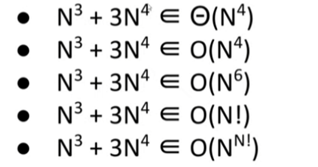
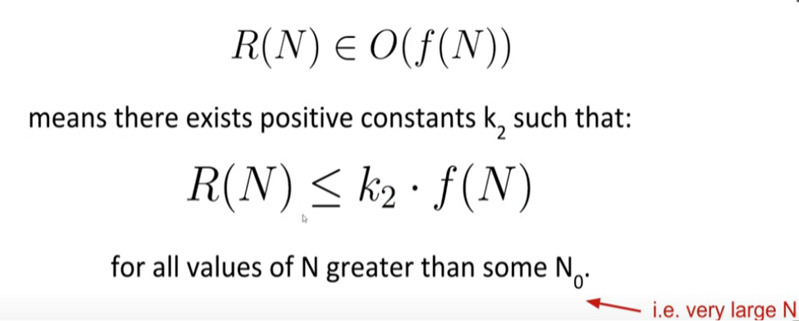
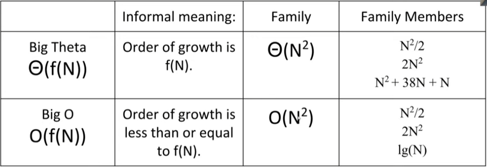
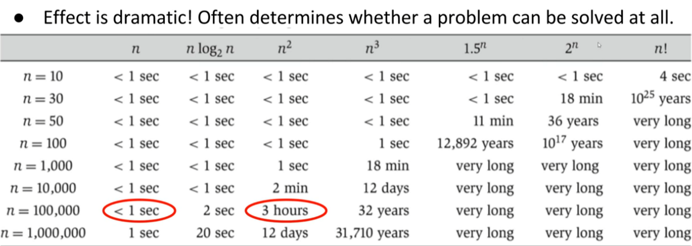

Consider the functions below.
- Informally, what is the "shape" of each function for every large N?
- In other words, what is the order of growth of each function

| function          | order of growth |
| ----------------- | --------------- |
| $N^3$+$3$$N^4$    | $N^4$           |
| $\frac{1}{N}+N^3$ | $N^3$           |
| $\frac{1}{N}+5$   | $1$             |
| $Ne^N+N$          | $Ne^N$          |
| $40sinN$+$4$$N^2$ | $N^2$           |

---

## Big O

O的意思是小于等于，Examples:

---

## Big Theta vs. Big O

