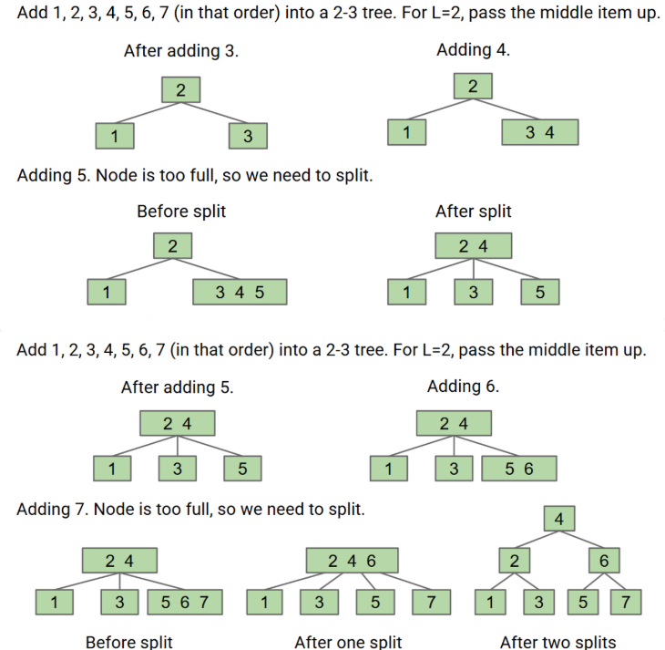

# Splitting Juicy Nodes

如果我们需要往树里面添加元素，有不能增加叶子的数量，那我们就在一片叶子里面塞好几个元素，如下图所示：

但是我们也不能过多地往一片叶子中塞太多的元素，就像右下角那片叶子那样，这样会导致在一片叶子中耗费很多时间寻找，因此我们人为给它设定一个限制，一片叶子中最多能放L个元素，最常见的就是L=2或3。如果一片叶子里的元素最大限制为L，那么当某个叶子里装了L+1个元素时，就会将这片叶子中的其中一个元素提到上面的叶子中。
移动规则如下：
- 若L+1为奇数，那就把中间的元素提到上一层。
- 若L+2为偶数，那就把中间偏左的元素提到上一层。

下面我们来看一个分裂过程：
此处的L=3，但是右下角的叶子已经有了4个元素

但是问题又来了，当17被提取到上面去之后，16就到了17的左侧，下面我们来解决这个问题：
我们把右下角那个叶子给分裂开，把16放到17的左边，18和19仍然放在同一片叶子中，最终结果如下图所示：

## 学习过程中我遇到的疑惑：
Q：如果一片叶子中不止多出了一个元素该怎么办？
A：不会一次性插入多个 key 到同一个节点里，也不会一次性往上提多个 key。B-Tree 插入是逐个进行的，每次只处理 一个 key 的插入，每次最多只会导致一次分裂，并最多提一个 key 到上层。

---

# Chain Reaction Splitting

插入了25和26之后导致第二层也满出来了，因此17被转移到了树根上。那么万一树根上的元素也超过了最大限制L那该怎么办？
以下为解决方案：将中间或者中间偏左(根据奇偶来定)的一个元素移出来变成新的树根，如下图所示，17成为了新的树根。

---

# B-Tree Terminology
我们观察到Splitting-trees 有非常好的平衡性。
- 如果我们分裂了树根，那么每一个节点都会被往下推一个层次。
- 如果我们分裂了一片叶子或者树内部的节点，那么高度不变。
我们马上就会证明，所有的操作都能够保证B-trees( Splitting Trees )时间复杂度为O(logN)。
- 如果L=3的话，那么这种B-trees同样被称为2-3-4 tree或者2-4 tree。2-3-4的意思是这棵树的每个节点都会有2-4个子节点（叶子除外)，L=2同理。下图分别展示了这两种树：

---

# Invariants（不变性）
## 下图为一个 L=2 的B-Trees的形成过程：

通过这副图我们可以得出以下结论：
1. 所有的叶子高度都是相同的。
2. 一个节点（不是叶子）如果含有k个元素的话，那么它一定有k+1个子节点。
3. 例子：下面这棵树是错误的：
 - 因为含有1的叶子和含有5，6，7的叶子高度并不同。
 - 含有2，3的节点应该有3个子节点，但它却只有1个子节点。

## Q and A:
Q：为什么所有叶子的高度必须一致？

A：因为使B-Trees变得更高的唯一办法使提升一个全新的根并将其他所有节点都推到下面一个位置。

---

# Worst Case Performance

上图的左侧和右侧分别为B-Trees的最好情况和最坏情况（其实右侧并非最好情况，**L=2时可以做到所有的节点(包括叶子)都只含有一个元素**），不难看出B-trees的最坏情况跟二叉搜索树的最好情况是一致的。并且从图中可以得出最好和最坏的情况的高度均为logN，因此B-Trees的时间复杂度为Θ(log N)，但还是写成O(logN)吧，毕竟这是自己的想法，具体的就等学了fds再说。

---

# Summary

- [Extra slides cover deletion.](https://docs.google.com/presentation/d/1mNAtzfc7Mna1rpVzoTcrn9p8ejWIh72QBuEqOJwQzbk/edit#slide=id.g1f5aad9eaf1_0_432) Not in scope for our class.

