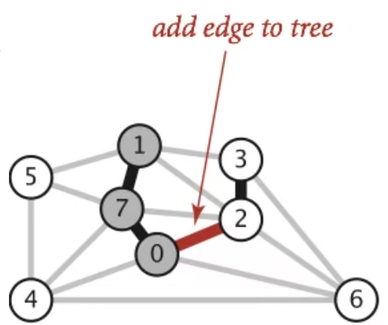

!!! abstract
    本章研究最小生成树（MST）问题。核心内容包括 Cut Property、Prim 算法和 Kruskal 算法，以及它们与最短路径算法的对比。

## 1. Warm-up Quesion：检测无向图中的环

**问题：** 给定一个无向图，判断它是否包含环。

### Approach 1：DFS

从任意顶点（比如 0）出发做 DFS：

- 标记访问过的顶点
- 如果遇到已标记的顶点，说明有环
- **注意：** 不要把自己来的那个父节点当成环（回溯边）
    - 就是说我们从3走到6的时候，不要再从6走回3，只从6走向4或者5。
    - 因为3已经被标记了，如果我们从6走回3，就是遇到了已经标记的点，这样会导致结果有环，是不对的。


**时间复杂度：** $O(V + E)$，更紧的界是 $O(V)$（因为一旦找到环就可以停止）。

### Approach 2：并查集（WeightedQuickUnionUF）

- 遍历每条边
- 检查两个端点是否 already connected
  - 如果没有连通：union 它们
  - 如果已经连通：说明有环

```python
uf = WeightedQuickUnionUF(G.V())
for each edge (v, w) in G:
    if uf.connected(v, w):
        return True  # 有环
    uf.union(v, w)
return False  # 无环
```

**时间复杂度：** $O(V + E \cdot log^{*}\ V)$。（后续会在Kruskal算法中证明）

---

## 2. 生成树（Spanning Tree）

### 2.1 定义

给定一个无向图 $G$， **生成树**  $T$ 是 $G$ 的一个子图，满足：

1. **连通**
2. **无环（Acyclic）**
3. **包含所有顶点**

前两个性质保证了它是树，第三个性质保证了它是生成的。

下面这幅图中的两个图，去掉灰色的edge留下黑色的edge就得到了spanning tree，这两个都是正确的。


**最小生成树（MST）：** 总权重最小的生成树。

### 2.2 MST vs SPT

- **Shortest Path Tree 依赖于源点：** 它告诉你从某个特定的 $s$ 出发到所有其他点的最短路径
- **Minimum Spanning Tree 没有源点：** 它关心的是整体权重最小

!!! example "例题1"
    
    
	- MST：选三条权重为 2 的边，总权重 = 6
    - SPT：源点不同，产生的Spanning Tree总权重可能不同，即不一定能生成Minimum Spanning Tree
    - 这道题中，当源点为 B 时，SPT 恰好等于 MST，其它源点产生的Spanning Tree都不是Minimum Spanning Tree。

    **结论：** MST 有时恰好是某个源点的 SPT，但两者解决的是完全不同的问题。
    


---

## 3. Cut Property（割性质）

### 3.1 定义

- **Cut（割）：** 将图的顶点分成两个 **非空集合**
- **Crossing Edge（横跨边）：** 连接两个集合中顶点的边

以下图为例：


- Set 1: {2, 3, 5, 6} 
- Set 2: {0, 1, 4, 7}
- Crossing edges: 0-2, 1-3, 1-5, 2-7, 4-5, 4-7, 6-0, 6-4

这个割是任意的，你可以随便选择每个顶点在哪个集合中

### 3.2 Cut Property 定理

> **给定任意一个割，权重最小的横跨边一定在 MST 中。**

（假设边权重互不相同）

!!! proof "Cut Property 证明（反证法）"
    假设权重最小的横跨边 $e$ **不在** MST 中。
    
    1. 把 $e$ 加到 MST 中，**一定会形成一个环**
    2. 这个环中一定还有另一条横跨边 $f$（因为环要从 Set 1 走到 Set 2 再走回来）
    3. 去掉 $f$、加上 $e$，得到一棵新的生成树，且总权重更小（因为 $w(e) < w(f)$）
    4. **矛盾！** 原来的树不是 MST
    
    所以 $e$ **必须在** MST 中。

---

## 4. MST 通用算法

基于 Cut Property，可以得到一个 **构造MST通用的算法思路** ，步骤如下：


1. **Start with no edges in the MST.**
    - 最开始，我们的最小生成树（MST）里什么都没有，是一张白纸。
2. **Find a cut that has no crossing edges in the MST.**    
    - 找到一种切分（就是随便画条线，把所有顶点分成两拨）。但有一个条件：**我们已经放进 MST 里的边，不能横跨这条线**。
3. **Add smallest crossing edge to the MST.**
    - 根据切分定理，在这个切分产生的所有横跨边里，挑出 **最短** 的那条，把它加进我们的 MST 里。
4. **Repeat until $V-1$ edges.**
    - 一直重复上面两步，直到我们的 MST 里收集满了 $V-1$ 条边（刚好把所有顶点连起来，大功告成）。
!!! example "用MST 通用算法来解下面这个图的MST"
    下图中已经给出了第一次的cut，我们基于这个cut来构建MST
    
    
	1. 第 1 步（题目给定的初始切分）
        - 当前切分形态：`{2, 3, 5, 6}` 与 `{0, 1, 4, 7}`
        - 候选横跨边评估：在所有横跨两阵营的边中，`0-2` 的权重最小（0.26）
        - 本步选定加入的边：`0-2` (0.26)
        - 已连通顶点集 (Vertex Set)：`{0, 2}`
        - 📂 当前 MST 边集状态：`[ 0-2 ]`
    2. 第 2 步
        - 当前切分形态：`{0, 2}` 与 `{1, 3, 4, 5, 6, 7}`
        - 候选横跨边评估：`0-7(0.16)`, `2-3(0.17)`, `2-7(0.34)`, `0-4(0.38)`, `6-2(0.40)`
        - 本步选定加入的边：`0-7` (0.16)
        - 已连通顶点集 (Vertex Set)：`{0, 2, 7}`
        - 📂 当前 MST 边集状态：`[ 0-2, 0-7 ]`
    3. 第3步
        - 当前切分形态：`{0, 2, 7}` 与 `{1, 3, 4, 5, 6}`
        - 候选横跨边评估：`2-3(0.17)`, `1-7(0.19)`, `5-7(0.28)`, `4-7(0.37)`, `0-4(0.38)`, `6-2(0.40)`（_注：2-7已变为内部边，剔除_）
        - 本步选定加入的边：`2-3` (0.17)
        - 已连通顶点集 (Vertex Set)：`{0, 2, 3, 7}`
        - 📂 当前 MST 边集状态：`[ 0-2, 0-7, 2-3 ]`
    4. 第 4 步
        - 当前切分形态：`{0, 2, 3, 7}` 与 `{1, 4, 5, 6}`
        - 候选横跨边评估：`1-7(0.19)`, `5-7(0.28)`, `1-3(0.29)`, `4-7(0.37)`, `0-4(0.38)`, `6-2(0.40)`, `3-6(0.52)`
        - 本步选定加入的边：`1-7` (0.19)
        - 已连通顶点集 (Vertex Set)：`{0, 1, 2, 3, 7}`
        - 📂 当前 MST 边集状态：`[ 0-2, 0-7, 2-3, 1-7 ]`
    5. 第 5 步
        - 当前切分形态：`{0, 1, 2, 3, 7}` 与 `{4, 5, 6}`
        - 候选横跨边评估：`5-7(0.28)`, `1-5(0.32)`, `4-7(0.37)`, `0-4(0.38)`, `6-2(0.40)`, `3-6(0.52)`（_注：1-3、1-2已变为内部边，剔除_）
        - 本步选定加入的边：`5-7` (0.28)
        - 已连通顶点集 (Vertex Set)：`{0, 1, 2, 3, 5, 7}`
        - 📂 当前 MST 边集状态：`[ 0-2, 0-7, 2-3, 1-7, 5-7 ]`
    6. 第 6 步
        - 当前切分形态：`{0, 1, 2, 3, 5, 7}` 与 `{4, 6}`   
        - 候选横跨边评估：`4-5(0.35)`, `4-7(0.37)`, `0-4(0.38)`, `6-2(0.40)`, `3-6(0.52)`（_注：1-5已变为内部边，剔除_）
        - 本步选定加入的边：`4-5` (0.35)
        - 已连通顶点集 (Vertex Set)：`{0, 1, 2, 3, 4, 5, 7}`
        - 📂 当前 MST 边集状态：`[ 0-2, 0-7, 2-3, 1-7, 5-7, 4-5 ]`
    7. 第 7 步
        - 当前切分形态：`{0, 1, 2, 3, 4, 5, 7}` 与 `{6}`
        - 候选横跨边评估：`6-2(0.40)`, `3-6(0.52)`, `6-0(0.58)`, `6-4(0.93)`（_注：4-7、0-4已变为内部边，剔除_）
        - 本步选定加入的边：`6-2` (0.40)
        - 已连通顶点集 (Vertex Set)：`{0, 1, 2, 3, 4, 5, 6, 7}`（全员集齐，算法结束）
        - 📂 最终 MST 边集状态：`[ 0-2, 0-7, 2-3, 1-7, 5-7, 4-5, 6-2 ]`


**问题：** 如何有效地找到这样的割？这就是 Prim 和 Kruskal 算法要解决的。

---

## 5. Prim 算法

### 5.1 算法描述

1. 从任意起始节点开始
2. 重复地选择 **一端在 MST 内、一端在 MST 外** 的权重最小的边，加入 MST
3. 重复直到有 $V-1$ 条边

这样子可能讲的不太清楚，可以看一下[这个实现过程](https://docs.google.com/presentation/d/1NFLbVeCuhhaZAM1z3s9zIYGGnhT4M4PWwAc-TLmCJjc/edit#slide=id.g9a60b2f52_0_0)。

### 5.2证明 Prim Algorithm有效

Prim Algorithm用的就是 **MST通用算法** 的思想。每次选择的割是：

- **Set 1：** 已经连到起始点的所有顶点
- **Set 2：** 其余顶点

所有 MST 内的边都在 Set 1 内部（没有横跨边），所以没有黑色边是横跨边。按权重递增考虑，最小横跨边一定属于 MST。

### 5.3 Prim vs Dijkstra（核心区别）

|                    | Dijkstra                    | Prim                     |
| ------------------ | --------------------------- | ------------------------ |
| **访问顺序**           | 按距离 **源点** 的距离从小到大          | 按距离 **当前 MST** 的距离从小到大   |
| **松弛标准**           | `distTo[p] + w < distTo[q]` | `e.weight() < distTo[w]` |
| **`distTo[w]` 含义** | 从源点到 $w$ 的最短距离              | 从 MST 到 $w$ 的最小边权重       |

!!! explanation "直观理解"
    - **Dijkstra** 想的是："我离 **起点** 有多近？"
    - **Prim** 想的是："我离 **这棵树** 有多近？"
    
    两者的代码结构几乎一样，唯一的区别在于 `distTo` 的更新方式。

### 5.4 Prim 算法实现

```java
public class PrimMST {
    private Edge[] edgeTo;       // 连接到 MST 的最优边
    private double[] distTo;     // 到 MST 的最小边权重
    private boolean[] marked;    // 是否已在 MST 中
    private SpecialPQ<Double> fringe;  // 按 distTo 排序的优先队列

    public PrimMST(EdgeWeightedGraph G) {
        edgeTo = new Edge[G.V()];
        distTo = new double[G.V()];
        marked = new boolean[G.V()];
        fringe = new SpecialPQ<>(G.V());

        distTo[s] = 0.0;
        // 其余 distTo 设为无穷大
        setDistancesToInfinityExceptS(s);
        insertAllVertices(fringe);

        while (!fringe.isEmpty()) {
            int v = fringe.delMin();  // 取出离树最近的顶点
            scan(G, v);
        }
    }

    private void scan(EdgeWeightedGraph G, int v) {
        marked[v] = true;
        for (Edge e : G.adj(v)) {
            int w = e.other(v);
            if (marked[w]) { continue; }  // 已在 MST 中，跳过
            if (e.weight() < distTo[w]) { // 找到更近的边
                distTo[w] = e.weight();
                edgeTo[w] = e;
                fringe.decreasePriority(w, distTo[w]);
            }
        }
    }
}
```

**关键不变量：** fringe（优先队列）始终按当前已知的 **到 MST 的最短距离** 排序。

### 5.5 时间复杂度

与 Dijkstra 完全相同，理解一下Dijkstra算法就很容易了：

| PQ 操作 | 次数 | 每次代价 | 总代价 |
|---------|------|----------|--------|
| `add` | $V$ | $O(\log V)$ | $O(V \log V)$ |
| `delMin` | $V$ | $O(\log V)$ | $O(V \log V)$ |
| `decreasePriority` | $E$ | $O(\log V)$ | $O(E \log V)$ |

**总时间复杂度：** $O(E \log V)$（假设 $E > V$）

---

## 6. Kruskal 算法

### 6.1 算法描述

1. 初始所有边为灰色（未选择）
2. 按权重 **从小到大** 考虑每条边
3. 如果加入这条边 **不会形成环** ，就把它加入 MST（标记为黑色）
4. 重复直到有 $V-1$ 条边

这样将过来比较晦涩难懂，可以看[**Conceptual Kruskal's Algorithm Demo**](https://docs.google.com/presentation/d/1RhRSYs9Jbc335P24p7vR-6PLXZUl-1EmeDtqieL9ad8/edit?usp=sharing)来理解它的思想。看懂了Kruskal算法的思想之后，[**Realistic Kruskal’s Algorithm Implementation Demo**](https://docs.google.com/presentation/d/1KpNiR7aLIEG9sm7HgX29nvf3yLD8_vdQEPa0ktQfuYc/edit?usp=sharing)完整刻画了Kruskal算法的实现过程。

与Dijsktra算法与Prim算法不同的是，Kruskal算法用到了Weight Quick Union(加权快速连接)，并且它的heap在一开始就将所有的edge都放了进去。

需要注意的是，Kruskal算法的构建过程中，所有节点并不是一直连接在一起的，就像上面那个例子中，一开始1、2、4三个节点连在一起，3、6两个节点连在一起。但是到了最后，一定会是连通的。

### 6.2 证明Kruskal Algorithm有效
Kruskal Algorithm也是通用算法的特例。

**前提场景：**

图里的状态是 Kruskal 算法跑到了中间某一步。

- **黑色的粗线**：Kruskal 之前 **已经选中** 并加入 MST 的边。
- **红色的线**：Kruskal **此时此刻正准备考察** 要不要加进去的边。
    

现在，我们逐行代入这四句话：

#### 1. "Suppose we add edge $e = v \to w$." (假设我们要加入边 $e$)

- **代入图中：** Kruskal 现在看中了红色的边 `0-2`，正准备加它。所以，对应的顶点 **$v$ 就是 `0`**，**$w$ 就是 `2`**。
    

#### 2. "Side 1 of cut is all vertices connected to $v$, side 2 is everything else." (切分的阵营1是所有已跟v连通的点，阵营2是其他人)

- **代入图中：** 我们现在以 $v$ (也就是 `0`) 为核心找“亲友团”。顺着已经建好的黑色公路找，`0` 连着 `7`，`7` 连着 `1`。
    
- 所以，**Side 1（阵营1）** 就是这个已经抱团的小集体：**`{0, 1, 7}`**。
    
- **Side 2（阵营2）** 就是外面的所有人：**`{2, 3, 4, 5, 6}`**。
    

> 💡 _此时，请你在脑子里用红笔把 `{0, 1, 7}` 圈起来。这就是我们在这一瞬间做出的“切分 (Cut)”！_

#### 3. "No crossing edge is black (since we don't allow cycles)." (没有任何跨界边是黑色的)

- **代入图中：** 你看刚才画的那个圈，有任何 **黑色的边** 跨越了圈的边界吗？没有。所有黑边都在圈里内部消化了（`1-7`, `7-0`）。
    
- **为什么？** 这是一句废话级的真理：因为如果有一条黑边连到了圈外，那圈外那个点就属于“和 0 连通”的，它早就被划进 Side 1 那个圈里了！所以，阵营1和阵营2之间，目前绝对是干干净净的，没有黑边相连。
    

#### 4. "No crossing edge has lower weight (consider in increasing order)." (没有任何跨界边比当前这条权重更低)

- **代入图中：** 这条红边 `0-2`，刚好跨越了圈的边界（一头在圈里的 0，一头在圈外的 2）。PPT 凭什么敢断定，它是所有跨界边里**最短**的？
    
- **为什么？** 因为 Kruskal 的死规矩是边长从小到大排好序，挨个看！
    
    如果从这个 `{0, 1, 7}` 的圈子，连向外部世界有一条比 `0-2` 更短的路，那 Kruskal 怎么可能今天才看到 `0-2`？它**早就**应该先看到那条更短的路，并且把它变成黑色的了！
    
    既然目前黑边都缩在圈里，说明在这之前根本没修通向外面的路。此刻轮到了合法的 `0-2`，那它绝对是我们遇到的第一条通向外面的路，也就是最短的跨界边。

### 6.3 Kruskal 算法实现

```java
public class KruskalMST {
    private List<Edge> mst = new ArrayList<>();

    public KruskalMST(EdgeWeightedGraph G) {
        MinPQ<Edge> pq = new MinPQ<>();
        for (Edge e : G.edges()) {
            pq.insert(e);  // 所有边加入优先队列
        }
        
        WeightedQuickUnionPC uf = new WeightedQuickUnionPC(G.V());
        
        while (!pq.isEmpty() && mst.size() < G.V() - 1) {
            Edge e = pq.delMin();
            int v = e.from();
            int w = e.to();
            if (!uf.connected(v, w)) {  // 不连通才加
                uf.union(v, w);
                mst.add(e);
            }
        }
    }
}
```

### 6.4 时间复杂度

| 操作            | 次数        | 每次代价          | 总代价             |
| ------------- | --------- | ------------- | --------------- |
| `insert`      | $E（正好E次）$ | $O(\log E)$   | $O(E \log E)$   |
| `delMin`      | $O(E)$    | $O(\log E)$   | $O(E \log E)$   |
| `union`       | $O(V)$    | $O(\log^* V)$ | $O(V \log^* V)$ |
| `isConnected` | $O(E)$    | $O(\log^* V)$ | $O(E \log^* V)$ |

**总时间复杂度：** $O(E \log E)$

!!! tip "预处理优化"
    如果这幅图已经将所有边的大小按顺序排列好了，那我们就不需要再用Heap了，那么就略去了Insert和Delete minimum这两个操作，总复杂度降到 $O(E \log^* V)$。

!!! tip "union和isConnected的时间复杂度" 
    由于用到了路径压缩和摊还，因此是$log^*V$
    
---

## 7. 算法对比总结

| 问题 | 算法 | 时间复杂度 | 备注 |
|------|------|-----------|------|
| 最短路径 | Dijkstra | $O(E \log V)$ | 不能处理负权边 |
| MST | Prim | $O(E \log V)$ | 类似 Dijkstra |
| MST | Kruskal | $O(E \log E)$ | 用并查集 |
| MST | Kruskal（预排序） | $O(E \log^* V)$ | 用并查集 |

### Prim vs Kruskal 直观对比

```
Prim: 从一个点开始"长"出一棵树，每次加离树最近的边
Kruskal: 从所有边里挑最小的，一段一段地拼接森林

Prim 的 MST 始终是一棵树
Kruskal 的中间结果是一个森林（多棵树），最后才合并成一棵
```

---

## 8. MST 算法前沿（拓展）

最优比较型 MST 算法的发展：

| 年份 | 最坏情况复杂度 | 发现者 |
|------|---------------|--------|
| 1975 | $E \log \log V$ | Yao |
| 1984 | $E \log^* V$ | Fredman-Tarjan |
| 1986 | $E \log (\log^* V)$ | Gabow-Galil-Spencer-Tarjan |
| 1997 | $E \alpha(V) \log \alpha(V)$ | Chazelle |
| 2000 | $E \alpha(V)$ | Chazelle |
| 2002 | 最优 | Pettie-Ramachandran |
