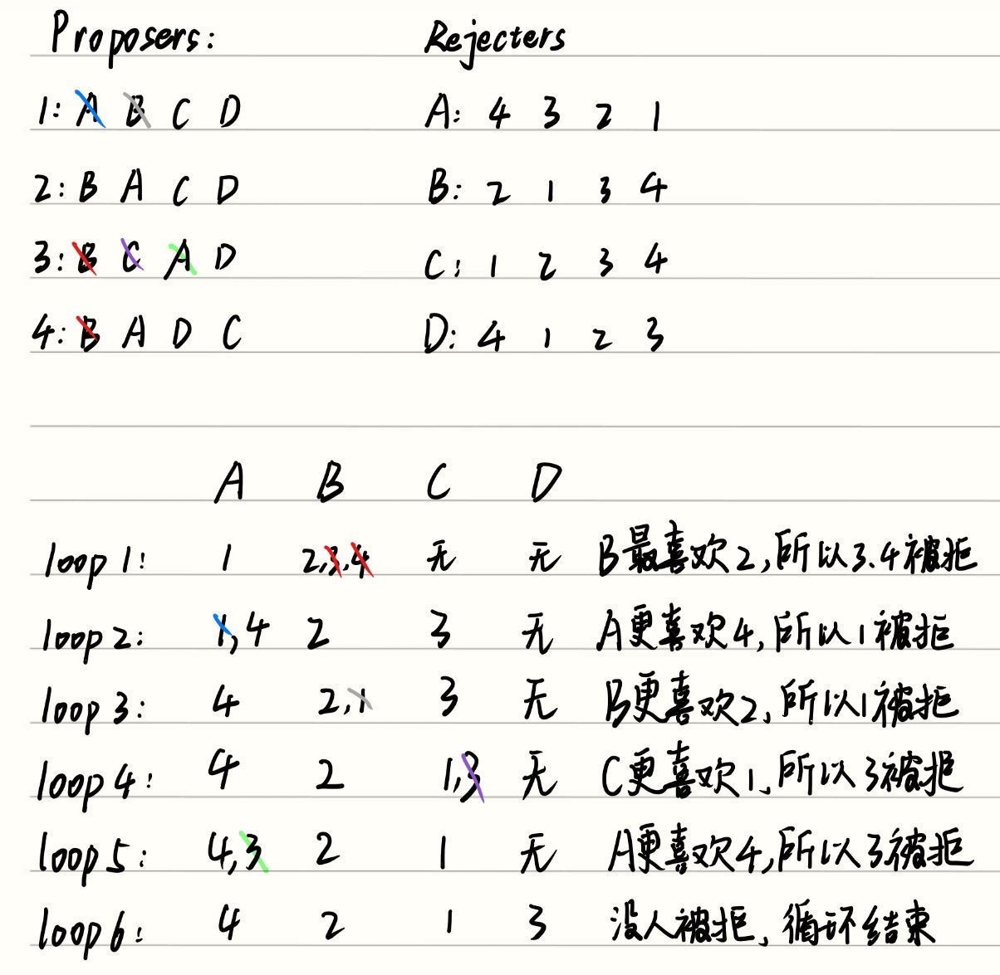

## 一、Propose-And-Reject Algorithm（又名Stable Matching Algorithm）
### 伪代码：
- do:
    - Each proposer proposes to its top choice.
    - Each rejecter rejects all but its top choice.
    - Each rejected proposer crosses that rejecter off its list.
- while (offers were rejected)
- All rejecters accept the offers they have in hand.

光看这个伪代码会很坐牢，我们引入一个例子来说明：
假设这里有八个人，分别是1，2，3，4和A，B，C，D，下面分别对他们的偏好进行排序：
```
    1: A, B, C, D      A: 4, 3, 2, 1
    2: B, A, C, D      B: 2, 1, 3, 4
    3: B, C, A, D      C: 1, 2, 3, 4
    4: B, A, D, C      D: 4, 1, 2, 3
```
用这8个人来演示一遍Propose and reject algorithm: 
假设Proposers是1，2，3，4；Rejecters是A，B，C，D。


---
## Q1: Does this algorithm terminate?
我们需要证明，对于所有包含n个proposers和n个rejecters的Input，Stable Matching Algorithm都会终止。

- 我们需要从这个算法的性质下手，while循环的条件是有人被拒绝了，所以只要还有人被拒绝，我们就会进入下一轮循环。
- 在进入下一轮循环前，被拒绝的人都要把这个拒绝他的人从他的选择中剔除，比如说刚刚例子中loop 4结束了3被C拒绝了，3就在他的选择中把C给剔除了。
- 但是每个人的选择是有限的，不可能无限的循环下去，哪怕所有proposers都把他的所有选择给剔除了，并且每次循环都只有一个人剔除一个选择，那也只进行了 $n^2$ 次就会结束，所以说这个算法不可能会无限循环。

---
## Improvement Lemma: 
If proposer $P$ makes offer to rejecter $R$ on $l^{th}$ loop, then every subsequent loop $R$ has an offer in hand it likes $\ge P$.

在证明Q2和Q3前，我们需要证明这个定理，用来辅助我们进行后续的证明。

这个定理本身很简单，它的意思就是每经历一次循环，rejecters能得到的人都会比之前的好或者是跟之前的一样好，proposers的选择只会越来越差。就拿刚刚的loop1和loop2来讲：

- loop1：2，3的最好选择原本都是B，但是他们被B拒绝了，所以最好的选择变差了。
- loop2：A原本在loop1中选择1，但是loop2给他送来了一个4，4比1更好。

所以这个定理理解起来很容易，但是我们需要用数学归纳法来严格证明对于每一个大于 $l$ 的循环 $k$ , $R$ 都能得到 $P$ 或者比 $P$ 更好的选择：

- Base case:  $k=l$，此时最好的选择就是 $P$ ，成立。
- Inductive Hypothesis: 假设 $k \ge l$ 的时候，这个命题都成立。
- Inductive Step: 考虑 $(k+1)^{th}$  $loop$。因为 $k^{th}$  $loop$ 中 $R$ 得到的选择 $P' \ge P$。下面分类讨论：
    - 情况1：经历了 $k^{th}$  $loop$ 之后，其中一个 $proposer$ $M$ 被拒绝了，并且被拒绝后他的下一个最好的选择就是 $R$，并且在 $R$ 眼中，$M$ 比 $P'$ 的优先级更高，那么 $(k+1)^{th}$  $loop$ 这一次循环就会让 $R$ 拿到 $M$。
    - 情况2：经历了 $k^{th}$  $loop$ 之后，并没有比 $P'$ 更有好的人来选择 $R$，而 $P'$ 目前优先级最高的选项又是 $R$，因此 $(k+1)^{th}$  $loop$ 这一次循环依然会让 $R$ 拿到 $P'$。
    - 综合这两种情况，可以得到 $M > P' \ge P$，因此这个定理得证。

---
## Q2: Does Stable Matching Algorithm always yields a matching?

首先，这个问题并没有很明显的蕴含关系，因此Direct Proof和Proof by contraposition在这里都不适用。在这里，我们用反证法来证明：

1. 假设在程序结束时，仍然有一个 $proposer\  P$ 没有被 $rejecters$ 选中，那就意味着他向所有的 $rejecters$ 都发出了申请并且被所有的 $rejecters$ 都拒绝了。
2. 根据刚刚推出的 **Improvement Lemma** 可得，所有的 $rejecters$ 选择的 $proprser$ 都优于$P$（因为他们都拒绝过$P$），也就是说每个 $rejecter$ 都已经有了自己的选择,并且他们的选择都不是 $P$。
3. 此时矛盾就来了，由于所有的 $rejecters$ 都已经匹配到 $proposers$ 了，而 $P$ 却没有匹配到 $rejecters$ ，说明一共有有 $n+1$ 个 $proposers$ 而只有 $n$ 个 $rejecters$。因此这个假设不成立。

!!! warning "我之前的错误理解"
    #### 我之前觉得这个证明没必要这么麻烦，我觉得我有一个更好的证明方法：
    因为Stable matching algorithm算法的循环结束的条件是不再有人被拒绝，而我们已经证明了这个算法并不会无限进行下去，一定会走到终点。所以说这个循环一定会随着某一次循环中所有人都不再被拒绝而结束。因此一定会有输出。
    #### Gemini说的错误原因：
    在稳定匹配问题中，一个合格的 Matching 必须满足：
    1. 没有任何一个人落单。
    2. $n$ 个 Proposer 必须和 $n$ 个 Rejecter 一一对应。
    Q2问的是：“这个算法能保证所有人都能找到对象吗”为什么你的证明依然无法通关？顺着你的思路，我们假设程序结束了。就像我上一个回答提到的，程序结束有两种可能：
    - 情况一：大家都找到了对象。
    - 情况而：有个 Proposer $P$ 被所有人拒绝了，实在没得选了，程序被迫停止。
    
    如果发生了第 2 种情况，程序确实停止了，也确实输出了一个结果，但这个结果里 $P$ 是单身的。一旦有人单身，这个输出结果就不叫 Perfect Matching，它就仅仅是个“残缺的分配”。这就意味着算法没有 yield a matching。


---
## Q3: Is that matching always stable?
1. 先不讲stable的定义，先来看个例子：
```
    1: A, B        A: 1, 2
    2: A, B        B: 1, 2
```
2. 我们将1、2与A、B进行配对只有两种配对方式：

    - 方式一：1与B配对，2与A配对
    - 方式二：1与A配对，2与B配对（Stable Matching Algorithm算出来的结果跟方式二一样）

3. 我们来分析一下这两种配对方式的好坏：

    - 方式一：1更喜欢A，A更喜欢1，但是1和A不是一对，这样子A也闹，1也闹，两对都会不开心。
    - 方式二：1喜欢A，A喜欢1，这一对开开心心。另一对互相不喜欢，让他们闹。
    - 对比下来，方式一中两对都会闹，方式二中只有一对会闹，所以方式二更好。

#### 3.1 Matching is unstable的定义：

**P和R构成了不稳定配对。**

不稳定配对的意思就是相比于当前的配对对象，P更喜欢R。反之，R也是一样，相比于当前的配对对象，R更喜欢P。

**用求职者和公司来举个例子：**

- 求职者A的视角： 相比于目前系统分配给A的公司，A 更喜欢公司X。
- 公司X的视角： 相比于目前系统分配给X的求职者，X也更喜欢求职者A。

#### 3.2 Stable matching的条件：

如果 $M$ 当前配对的对象是 $N$，$M^*$ 当前的配对对象是$N^*$。但相比于$N$，$M$ 更偏向于 $N^*$。那么稳定的条件只能是$N^*$ 更喜欢 $M^*$ 而非 $M$。

### 证明matching always stable
由 **3.2 Stable matching的条件** 可得，这是一个很明显的 **蕴含** 关系，用 **Direct Proofs** (假设条件p成立，然后验证能否推导出结论q) 来证明：

1. 假设的输出结果中：$P$ 和 $R$ 是一对、$P^*$ 和 $R^*$是一对，并且 $P$ 更喜欢 $R^*$ 而非$R$（其中 $P$ 和 $P^*$ 是 $proposers$）。
2. 由于 $proposers$ 是根据他喜欢的 $rejecters$ 的优先程度来选择$rejecters$ 的，由于 $P$ 更喜欢 $R^*$ ，但是 $P$ 却选择了他更不喜欢的 $R$，说明 $P$ 在先前的循环中已经被 $R^*$ 拒绝过了。
3. 根据 $Improvement \ Lemma$ 可知，$rejecters$ 每次循环之后都能找到原来的或是比原来更好的 $proposers$，由于 $P$ 已经被 $R^*$ 拒绝过了，说明 $R^*$ 一定找到了比 $P$ 更好的 $proposers$，因此 $P^*$ 在 $R^*$ 那里的优先程度绝对比 $P$ 高，得证。

---
## 二、Optimality
有些时候，稳定匹配不一定只有一种匹配方式，比如说下面这种情况，会出现两种稳定的匹配方式：

- Pairing 1对2有利，因为比起C，2更喜欢D。同理对3也有利
- Pariing 2对C有利，因为比起3，C跟喜欢2。同理对D也有利
- 因此Pairing 1对proposers有利，Pairing 2对rejecters有利

既然两边都有好有坏，那到底哪种pairing更好？下面有一个新的定义：
### Optimal rejecter for proposer P:
For proposer P, the optimal R is the highest ranked rejecter on P's list that P could ==be paired in a stable matching==.

### Stable Matching Algorithm always produces proposer-optimal matching：
首先，这个算法一开始就是让proposers们去选他们最喜欢的rejecters，而每一次rejecters拒绝别人的循环都是在让这个matching往stable靠近。然而当这个算法执行到第一个stable matching的情况时就会停止（自行脑补，只可意会不可言传），因此Stable Matching Algorithm always produces proposer-optimal matching. 也就是说，当Input为上面那个例子的时候，Stable Matching Algorithm会输出Pairing 1。如果把Proposers和Rejecters的位置换一下，那就会输出pairing 2.

下面这幅图的横线的中间区段的情况全都是stable matching的，但是这个算法是从右往左走的，因此走到最右边的情况发生的时候这个算法就停止了。
