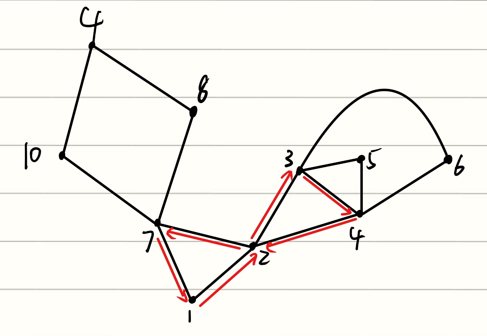
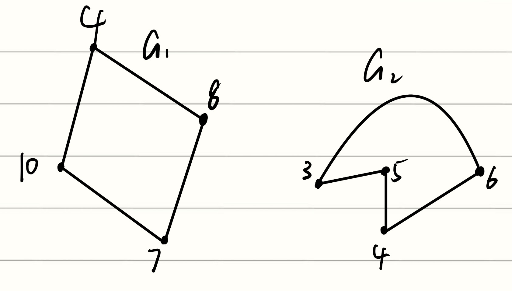
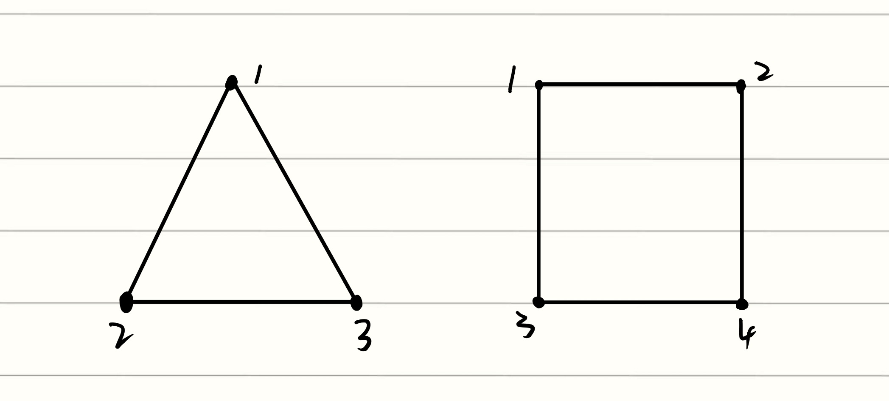

下面是六个岛屿，看看能不能找到一个岛屿，使得一个人走过了所有桥之后恰好回到原来这个岛屿。（这是一个欧拉回路问题）

-一群岛屿中，如果 一个岛屿如果连着奇数个桥的话，那么不可能存在一个岛屿能作为起点。
    - 因为走出去再走回来需要这座岛连着两个桥
    - 如果连着奇数个的话最后一次走出去之后就没法走回来了。
- 如果所有的岛屿都连着偶数个桥的话，那么每个岛屿一定能够当作出发点。

---

## 1. Graph的定义
Graph由岛屿和桥组成，$G=(V, E)$ ，其中：

- $G = (V, E)$ : 一个图 $G$ 是由顶点集合 $V$ (Vertices) 和边集合 $E$ (Edges) 组成的。
- 集合 $V$ : $vertex（顶点）$，表示各个岛屿。
- 集合 $E$ : $edge（边）$，表示各个桥。
- 邻居: 与某个岛屿相连的岛屿都是它的邻居
    - 邻居的严格数学定义：$neighborhood(u) = { v ∈ V s.t. {u,v} ∈ E }$
        - $s.t.$ 是$such \ \ that$ 的缩写。
        - ${u,v}∈ E$ 表示顶点 $u$ 和 $v$ 之间有一条边。
        - **翻译：** 顶点 $u$ 的邻居集合，就是所有满足与 $u$ 之间有桥相连的顶点 $v$ 的集合。
    - $deg(u) = |neigh(u)|$: 
        - 绝对值符号 $| |$ 在集合论里代表集合中元素的个数。
        - **翻译：** **在简单图中** ，顶点 $u$ 的度数，等于它邻居集合的大小。
- 度数: 与该岛屿相连的桥的数量（在简单图中，桥的数量就是邻居的数量）。


---

## 2. 路径的分类
**第一组：从 A 走到 B（不一定要回起点）**

- **`(simple) path` (简单路径):**  $(v_1, v_2)->\ \ (v_2, \ v_3)-> \ \ (v_3, \ v_4)->......(v_k, \ v_{k-1})$, $v_1, \ v_2, \ v_3, \ v_4, \ ......v_k, \ v_{k+1}$ all distinct.
    - 序列中所有的顶点必须是 **互不相同的 (distinct)** 。也就是说，简单路径一定是从一个岛屿走到另一个岛屿。
    - **我之前的错误理解**：我以为 $simple \ \ path$ 只是走过一座桥，也就是从一个岛屿走到它的邻居岛屿。但实际上，$simple\ \ path$ 是一条连贯的路线它 **不一定只经过一座桥** 。它可以经过1座桥、11个岛屿，只要满足一个铁律：
        
- **`walk`** : `walk` 和 `path` 的唯一区别就是：它不需要顶点互不相同。你可以随便反复横跳，重复踩同一个岛。

**第二组：从 A 出发回到 A（必须回起点）**

- **`cycle` :** path where $v_1 = v_k$。
    - **翻译：** 它是一种特殊的 `path`，但特殊之处在于起点和终点是同一个（首尾相连）。
- **`tour` :** 它跟cycle一样是一个起点等于终点的路线，但 **允许你重复经过同一个岛屿** 。

| **路线名称**      | **能不能重复踩同一个岛？** | **最终必须回到起点吗？** | **通俗比喻**                    |
| ------------- | --------------- | -------------- | --------------------------- |
| **Path (路径)** | ❌ **绝对不能**      | ❌ 不需要          | 一条道走到黑，处处是新风景。              |
| **Walk (游走)** | ✅ **可以**        | ❌ 不需要          | 随便瞎逛，同一个岛可以反复路过。            |
| **Cycle (圈)** | ❌ **绝对不能**      | ✅ **必须回到起点**   | 完美的呼啦圈。                     |
| **Tour (回路)** | ✅ **可以**        | ✅ **必须回到起点**   | 欧拉回路本尊：出门办一堆事，反复经过市中心，最后回家。 |

#### 连通性
**Connected graph: $∀\  v_1, \ v_2 \ ∈ V , \ \exists \ path \ v_1 \ ⇝ \ v_2$

对于这个图里的 **任意** 两个顶点 $v_1$ 和 $v_2$，都 **存在** 能从 $v_1$ 走到 $v_2$ 的路径。也就是说，从图中的任意一个顶点出发，都能走到其它所有的顶点。

---
## 3. Euleirian Tour（欧拉回路）
### 定义：
- **规则**：强制走过图中 **所有的边** ，每条边恰好一次，且最终必须 **回到起点** 。
- **通俗理解**：完美的一笔画，而且画完之后恰好首尾相连。

### Eulerian theorem（欧拉定理）：
对于一个无向图 $G(V, \ R)$，它存在欧拉回路的充要条件是：**if and only if G has even degree and is connected(up to isolated vertice)**（图的度数是偶数说明图中所有的顶点的度数都属偶数，并且这个图是连通的（除非未被连通的是孤立的顶点））。

- $\exists \ v \in V, \ s.t.deg(v) \ \ is \ \ odd \ \implies no \ \ Eulerian \ \ tour$，即，如果有一座岛屿它的度数为奇数（跟它相连的桥的数量为奇数），那么欧拉回路就不存在。
- 如果这个图不是connected，那也有可能存在G的度数是偶数但是不存在欧拉回路的情况，下图就是：

- 但是存在一种不连通的图也有欧拉回路，那些不连通的顶点必须是完全孤立的。如下图所示：


### 充分性证明（我直接用大白话）
1. **证明connected：** 如果这个图不是connected，那么一边的顶点是没法走到另一边的顶点的，那也就没法走过那些顶点的edge。所以必须是connected
2. **证明G is even：** 如果这个图不是even的，那么至少存在一个顶点的edge数量是奇数，因为我们要经过所有的edge，假设其中一个顶点的edge数量是3：
    - 若这个顶点是起点：那么它出发的时候用了第一个edge，第一次回来的时候用了第二个edge，回来之后再走出去用了第三个edge，这样子三个edge用完了，他回不来了。
    - 若这个顶点不是起点：那么第一次到达这个顶点的时候用了第一个edge，离开的时候用了第二个edge，第二次回到这个顶点用了第三个edge之后走不掉了，也就是说没法回到起点了。
    - PS：我们必须要把每一个edge都用掉，因为欧拉回路的要求就是走完所有的edge。
其它奇数跟3同理。因此这个图必须是even的

### 必要性证明
证明如果这个图是connected的并且G has even degree，那么G存在欧拉回路。

我们直接用一个算法来证明：

```
    Function Eular(G, s)
        T = FindTour(G, s)
        let G1,......Gk be connected components of the remaining graph
            when the edges in T are removed from G
        let s_i be the first vertex in T that intersects G_i
        Output Splice(T, Euler(G1, s1), ..., Euler(Gk, Sk))
    end Eular
    
    FindTour(G, s): (辅助函数)
        set u=s
        while(unused edge on u)
            choose edge(u, v)
            set u=v
        Output path token
```

!!! Explanation "FindTour"
    ### findTour的逻辑：
    **1. `start at s`**
        - 令 $s$ 为图G的起点。
    **2. `repeat step3 until get stuck` (重复执行步骤3，直到无路可走)**
        - **逻辑：** 这是一个循环指令。它要求你一直重复做里面规定的动作，直到你发现自己卡死了（也就是你所在的岛上，所有连着的桥都被走过了），循环才结束。
        **3. `choose any untraversed edge incident on current vertex & traverse it` 
            - `untraversed edge`：还没有走过的桥。
            - `incident on current vertex`：跟你现在脚下踩着的这座岛相连的。
            - `traverse it`：跨过去！
            - **通俗翻译：** **“闭着眼睛，随便挑一条连着当前岛屿、且没走过的桥，走过去。”** 到了下一个岛，继续闭着眼睛随便挑。不需要规划路线，不需要看地图，只要有没走过的桥，就随便选一条走。
        **4. `return the tour formed by traversed edges` 
            - **动作：** 当你最终卡死、停下脚步的时候，把你刚才走过的所有桥按顺序连起来，作为一个Tour交上去。
    #### 拿下面这幅图为例来讲解：
    - 我设定1为这幅图的起点，那么这个顶点有两条路可选，我选择右边那条路，走到顶点2。
    - 顶点2原本有4条路，但是刚刚从1走过了消耗了一条，现在只剩3条路可走了，我选择走到顶点3
    - 就这么一直随便选路，循环下去。直到被卡死的时候，我的路线是：$1->2->3->4->2->7->1$
    
    #### 结论：我们从s出发的话，我们只可能在s这个点被卡死
    
    就像我刚才执行的那个例子，我从1出发，最终被卡死在了1。
    
    因为所有顶点的度数都是偶数，也就是一进一出会消耗两条路，因此我们把一个非起点的路给消耗完的时候，一定是离开这个顶点而不是来到这个顶点。只有把起始点的路给消耗完的时候，才是回到这个起始点而非离开这个起始点。

    所以说我们从s出发的话，不可能被困在除了s之外的任何顶点上。

!!! Explanation "Function Euler"
    ### Euler函数的逻辑：
    1. 执行`Findtour`函数
    2. let $G_1...G_k$ be connected components
        - 刚刚执行完`FindTour`函数后，有很多条路都被走过了，把走过的路全都删掉，然后刚才的G会变成几个分散的图（这些分散的图都是connected的），延用刚刚在findTour函数中举的例子，现在的图如下所示：
    
    3. let $S_i$ be the first vertex in T that intersects $G_i$
        - 首先我们需要知道，G这幅图是connected的图，因此我们刚刚删除掉的那个图跟现在留下来的这些图一定都是有共同的顶点的，就比如说这个例子中，被删掉的图跟 $G_1$ 有共同顶点7，跟 $G_2$ 有共同顶点3和4。
        - 我们找到刚刚遍历那个被删掉的图的顺序，找到它第一次踩到 $G_1$ 中的那个岛，标记为$S_1$，在这个例子中 $S_1$ 是7，同理 $S_2$ 是3。
        - 我们刚刚已经证明了`FindTout(G, s)`最终会回到 $S$ ，那么我们再执行`Find(G1,S1)`、`FindTour(G2, S2)`......`FindTour(Gn, Sn)`，最终也会回到$S_1, \ S_2, \ ......S_n$
        - 所以我们需要把 $S_1, \ S_2, \ ......S_n$ 设为 $G_1, \ G_2, \ ......G_n$ 的起点。
    4. Output $Splice(T,\  Euler(G1, s1), \ ..., \ Euler(Gk, Sk))$
        - 巨牛逼的递归思想，让$G_1, \ G_2, \ ......G_n$ 接着执行 $Euler$ 函数，这样子这样子的话这些子图又会被拆分成更多的子图，一直递归下去。
            - 既然`Find(G1,S1)`、`FindTour(G2, S2)`......`FindTour(Gn, Sn)`能够做到最终回到$S_1, \ S_2, \ ......S_n$，那么我们就可以在执行那个被删除掉的图的时候，经过 $S_n$ 这个顶点的时候，先把 $G_n$ 给走完，然后再接着走那个被删掉的图。
        - 拿刚刚的例子来说明一下上一句话：我们在走$1->2->3->4->2->7->1$这条被删除的路时，第一次经过 $G_2$ 这个子图的时候所在的顶点为3，那么我们换一下顺序，走到3的时候先不接着走$3->4->2->7->1$，而是先把 $G_2$ 这个子图走完，反正走完了之后最后还会回到顶点3的，走完这个子图之后再走$3->4->2->7->1$，对于别的子图也是一样。
        - 于是我们把 $G$ 图中被删除的图 $T$ 跟所有的子图拼接起来，一定能走回原来的起点。把它们拼接而成的路线输出之后就是我们想要的欧拉回路。

#### 用强数学归纳法来证明：
**Theorem：** 对于任何连通且所有顶点度数均为偶数的图 $G$，$Euler(G,s)$ 都能输出一条从 s 出发并回到 s 的欧拉回路。

- **Base case：** 对于边数 $m=0$ 的图，只有一个孤立的顶点而没边，显然成立

- **Inductive Hypothesis：** 假设该定理对于任何边数 $≤m$ 的图都成立。

- **Inductive Step：** 若图 $G$ 有 $m+1$ 条边。
    - 从图 $G$ 中移除路线 $T = \text{FindTour}(G,s)$ 后，剩下图 $G'$。图 $G'$ 包含若干个连通分块 $G_1, \dots, G_k$，并且 **它们的度数都是偶数**。
        - 为什么说这些子图的度数都是偶数，是因为，这些子图中，跟T没有接触的顶点它们所连接的边数不变。而跟T有过接触的那些顶点，它们的边数是会减少的，但是绝对是减少偶数个边，因为一进一出小号偶数。
    - 由于$G_1, \dots, G_k$  这些分块都至少减少了两条边，所以它们的边长数不可能超过 $m-1$ 。
    - 根据 **强归纳假设** ，调用 $Euler(G_i, s_i)$ 能够成功在每一个分块 $G_i$ 中找到一条欧拉回路。

注意：这里的m条边代表的是所有包含m条边的图G，不是某个特定的图。有些人可能会觉得 $Inductive \ Step$ 要从 $m+2$ 开始，但这是错误的，因为图的度数是偶数并不代表边长数一定是偶数，就像下图所示，左边是边数为3的图，右边是边数为4的图，但是它们的度数都是偶数，因此 $Inductive \ Step$ 要从 $m+1$ 开始


#### 我的一点小收获
我原本以为，即使这个图的度数是偶数，也不一定能够做到从任意一点出发，都能够回到这个点。但是这个必要性的证明让我发现了，在这幅图满足欧拉回路的前提下，所有的点都能够当作起始点。


