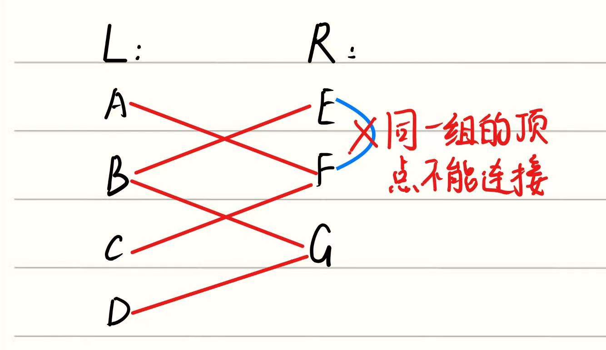
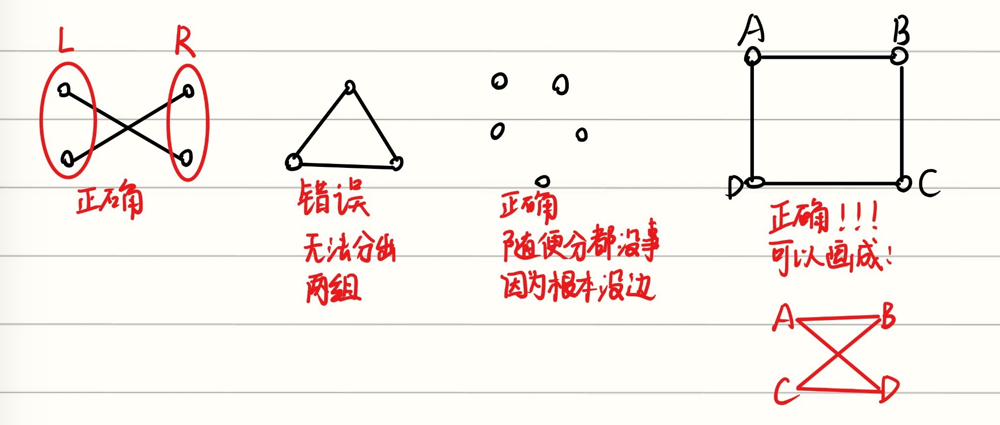

## 1. Planar Graphs
### 1.1定义
如果能在平面上画出没有交叉的edge的图，那么这个图就是Planar Graph。例如，下面的四个图就是Planar Graph。**第一个和第二个图是相同的** ，但绘制的方式不同。即使第二张图有交叉点，图形仍然被认为是平面的，因为它可以被画成不交叉的图。

下面的这几幅图不是Planar Graph

#### 第一幅图：
第一幅图是“Three houses-three well Graph”（三房三井问题图），也叫 $K_{3, 3}$。

是个经典问题：要求三个房子三口井，每个房子都要连到每一口井，但是不能有线交叉。转化成数学问题就是这里有两组顶点，每一组中都包含三个顶点，两组直接每个点都得互相连通，因此这是不可能做到的。

#### 第二幅图：
第二幅图是一个Complete Graph，因为有五个顶点，所以是 $K_5$

后续会证明它一定不是Planar Graph
#### 第三幅图：
第三幅图是一个四维的立方体。

上面三幅图是Non-planar graphs都可以引入下面讲的Bipartite Graph来证明

---
## 2. Bipartite Graph
### 2.1定义
Bipartite Graph的顶点被分成了两组，边与边只能在不同的组之间连接，不能在同一组内连接。

### 2.2形式化定义
More formally, we have $V=L∪R$ and $E⊆L×R$

- 顶点集合 $V=L∪R$
- 边只属于 $L×R$
    -  $L×L$ 以及  $R×R$ 都不行

下面给出几个例子：

---

## 3. Face and Euler's formula
当你把平面图画在纸上时，图的边会把平面分割成若干个区域，这些区域叫作面 (faces)，数量记为 $f$，其中包含一个无限大的外围面 。

例如，下图中的第一个图 $f=4$，第四个图 $f=6$

对于任何连通的平面图，图的顶点数 $v$、面数 $f$ 和边数 $e$ 之间有一个极其优美的关系：
$$v+f=e+2$$这就是欧拉公式 。它的证明思路是对边数 $e$ 使用数学归纳法：每次删去环上的一条边，面数和边数都会同时减 1，公式两边依然平衡 。

### 推论：**边数限制不等式** 
基于欧拉公式，讲义推导出了一个关键结论：平面图是“稀疏”的，边数不能太多 。 推导逻辑是：每个面至少由 3 条边围成，而每条边会被两侧的面各算一次，所以 $3f \le 2e$ 。把 $f$ 替换到欧拉公式里，就得到了：

$$e \le 3v-6$$

这个公式非常好用，比如你想验证 5个点的完全图 $K_5$ 是不是平面图：它有 $v=5$ 和 $e=10$。代入公式 $10 \le 3(5)-6 = 9$，显然不成立，直接证明了 $K_5$ 不是平面图 ！

---

### 4. Connectivity and Hypercubes
图论一个特别重要的应用是表示互联网（或其他网络）中路由器之间的互连关系 。为了将数据包从一个节点发送到另一个节点，我们需要在这个图中找到一条从源到目的地的路径 。因此，为了能够实现任意两节点之间的数据包发送，我们需要这个图是 **连通的 (connected)** 。

Tree是Minimally connected的图，它是我们可以用来连接任意一组顶点最高效的图，因为它的边数最少的图，连接速度快 。但是，如果Tree网络中的任何一条边（连接）发生故障，那么网络就会变得不连通，导致某些节点无法到达 。为了避免这种情况，我们希望网络的连通性具有一定的冗余度，或称鲁棒性 (robustness) 。

另一个极端是complete graph，它包含了每一对节点之间的连接 。这种网络的连通性极强。

然而，Complete Graph作为一种网络架构是完全不切实际的，因为它包含了太多的边：准确地说，是 $\frac{n(n-1)}{2} \sim O(n^{2})$ 条边 。而在实践中，并没有必要在每一对节点之间建立直接连接，只要 **最大的节点到节点距离** （也称为网络的“直径”）不是太大即可 。在本节中，我们将考察一类非常出色的图家族，称为 **hypercube graphs（超级立方图）** ，它结合了两者的优点：它们具有高度的连通鲁棒性，且直径较小，但又不会使用过多的边 。(若一个图中有n个顶点，则Tree的直径是n-1，Complete的直径是1)

### 4.1 定义：

$n$ 维超立方体 $G=(V,E)$ 的顶点集由 $V=\{0,1\}^{n}$ 给出。$\{0,1\}^{n}$ 表示所有 $n$ 位字符串的集合 。换句话说，每个顶点都由一个唯一的 $n$ 位字符串标记，例如二进制数 $001100100$。

边集 $E$ 定义如下：两个顶点 $x$ 和 $y$ 由边 $\{x,y\}$ 连接，当且仅当 $x$ 和 $y$ 在恰好一个比特位上不同。

例如，$x=0000$ 和 $y=1000$ 是邻居，但 $x=0000$ 和 $y=0011$ 不是 。更正式地说，$x=x_{1}x_{2}...x_{n}$ 和 $y=y_{1}y_{2}...y_{n}$ 是邻居，当且仅当存在一个 $i \in \{1,...,n\}$，使得对于所有 $j \ne i$ 都有 $x_{j}=y_{j}$，并且 $x_{i} \ne y_{i}$ 。下图描绘了1维、2维和3维的超立方体 。

还有一种通过递归来定义 $n$ 维超立方体的替代且有用的方法，我们现在来讨论一下 。将 **0-子立方体**（相应的，**1-子立方体**）定义为 $(n-1)$ 维超立方体，其顶点标记为 $0x$，其中 $x \in \{0,1\}^{n-1}$（相应的，顶点标记为 $1x$，其中 $x \in \{0,1\}^{n-1}$） 。然后，通过在 0-子立方体中的每个顶点 $0x$ 与 1-子立方体中的对应顶点 $1x$ 之间放置一条边，就可以获得 $n$ 维超立方体 。

通过上面三张图我们就可以得出，n维超立方体的顶点之间的最长距离（直径）即为n。且最长距离出现在n位数都不相同的情况（比如3维中000到111的距离是3，100到011的距离是3）
### 4.2 引理1：一个 $n$ 维超立方体中的总边数是 $n2^{n-1}$

- **证明 1.** 每个顶点的度数是 $n$，因为在任何 $x \in \{0,1\}^{n}$ 中都有 $n$ 个比特位可以被翻转 。每个顶点都连了 $n$ 条边。由于每条边被计算了两次，每个端点算一次，这就产生了一共 $\frac{n2^{n}}{2} = n2^{n-1}$ 条边 。
    
- **证明 2.** 根据超立方体的第二个（递归）定义，可以得出 $E(n) = 2E(n-1) + 2^{n-1}$，且 $E(1) = 1$，其中 $E(n)$ 表示 $n$ 维超立方体中的边数 。一个简单的数学归纳法就能表明 $E(n) = n2^{n-1}$ 。

### 4.3 引理2：
在 $n$ 维超立方体 $G=(V,E)$ 中，假设 $S \subseteq V$ 是一个顶点子集，并且满足 $|S| \le |V-S|$（也就是说，$S$ 包含的顶点数量不超过总节点数的一半，即 $|S| [cite_start]\le 2^{n-1}$）。让 $E_S$ 表示所有连接集合 $S$ 与集合 $V-S$（即不在 $S$ 中的其余顶点）的边组成的集合，定义为： $E_S := \{\{u,v\} \in E | u \in S \text{ 且 } v \in V-S\}$ 。 那么，必然得出结论：$|E_S| [cite_start]\ge |S|$ 。

大白话：在一个超立方体网络里，如果你圈出一部分电脑（集合 $S$），只要你圈出来的电脑数量 **不超过** 总数的一半： 那么，连接你圈出的这批电脑与外部剩余电脑的“跨界网线”的总数（$|E_S|$）**，绝对** 大于或等于 **你圈出来的** 电脑数量（$|S|$）**。

### 证明：
#### **1. Base case: $n = 1$**

1维超立方体就是一条线段，两端是节点 0 和 1。

你想孤立的节点集合 $S$ 不能超过总数的一半，也就是 $|S|$ 只能是 0 或者 1。

- 如果 $|S| = 0$（不想孤立任何节点），需要剪断 0 条线。结论 $0 \ge 0$ 成立。
    
- 如果 $|S| = 1$（想孤立节点 0），你得把中间那唯一的一条线剪断，需要剪断 1 条线。结论 $1 \ge 1$ 成立。
    

#### **2. Inductive hypothesis**

假设这个“至少需要剪断 $|S|$ 条线”的定律，在维度 $1$ 到 $k$ 维的所有超立方体中都是成立的。

#### **3. Inductive step: 证明 $n = k+1$ 维也成立**

现在面对的是一个 $k+1$ 维的超立方体，它包含了 $2^{k+1}$ 个节点。根据题目条件，你要孤立的节点群 $S$ 的总数不能超过一半，也就是 $|S| \le 2^k$。

我们可以把一个 $k+1$ 维的超立方体，看作是由 **左半边（0-子立方体）** 和 **右半边（1-子立方体）** 拼起来的。这两个半边本身各自都是一个 $k$ 维的超立方体。

你要孤立的集合 $S$，也自然被分成了两拨：

- 左边的一拨叫 $S_0$
    
- 右边的一拨叫 $S_1$
    
    为了方便讨论，我们假设左边的人数大于等于右边，即 $|S_0| \ge |S_1|$（反之亦然，对称的）。
    

接下来分两种情况讨论：

**情况 1：大家都很势单力薄 ($|S_0| \le 2^{k-1}$ 且 $|S_1| \le 2^{k-1}$)**

这意味着，不管是左半边还是右半边，你想孤立的节点数都没有超过各自半边总容量的一半。

- 既然符合“不超过一半”的条件，我们就可以直接套用前面的 **归纳假设**！
    
- 在左半边内部，要把 $S_0$ 切断，至少需要剪断 $|S_0|$ 条内部线。
    
- 在右半边内部，要把 $S_1$ 切断，至少需要剪断 $|S_1|$ 条内部线。
    
- 加起来，总共需要剪断的线至少是 $|S_0| + |S_1|$，这恰好就等于 $|S|$。这还没算左右两边跨界的线呢，所以总割边数绝对大于等于 $|S|$，情况 1 轻松得证！
    

**情况 2：有一边的节点数太多了 ($|S_0| > 2^{k-1}$)**

这是整个证明里 **最精妙、也最绕** 的一步。因为 $S_0$ 的数量超过了左半边总容量的一半，**归纳假设不能直接用了**！怎么办？

- **右半边依然适用：** 因为整体 $|S| \le 2^k$，既然左边的 $S_0$ 占了大头，右边的 $S_1$ 肯定只占小头（$|S_1| \le 2^{k-1}$）。所以右半边依然适用归纳假设，右半边内部的割边数至少是 **$|S_1|$**。
    
- **左半边“逆向思维”（这就是作者说的 little massaging）：** 既然想孤立的 $S_0$ 超过了一半，那说明在左半边里，**安全的、不想被孤立的节点**（记为 $V_0 - S_0$）反而成了少数派（少于一半）。
    
    对这些“少数派”应用归纳假设！要切断少数派和多数派之间的联系，需要剪断的内部线数量，至少等于少数派的数量。左半边总共有 $2^k$ 个点，少数派的数量就是 $2^k - |S_0|$。所以左半边内部贡献了至少 **$2^k - |S_0|$** 条割边。
    
- **计算两边之间的“跨界连线”：** 别忘了，左半边的每一个节点，在右半边都有一个镜像节点，它们之间有一根跨界线。
    
    在左半边，我们有 $|S_0|$ 个要孤立的节点。它们的对面，最多只有 $|S_1|$ 个要孤立的节点。
    
    这意味着什么？这意味着左边剩下的 $(|S_0| - |S_1|)$ 个节点，它们的对面 **全是安全的节点**！这些跨界的线也必须要被剪断，否则 $S_0$ 就能通过它们连上主网络。这贡献了至少 **$|S_0| - |S_1|$** 条跨界割边。
    
    感觉这样讲起来很难让人听懂，就拿三维的来举个例子。三维可以由两个二维拼接而成，也就是左边和右边分别有四个顶点，并且左边的四个顶点和右边的四个顶点恰好是两两配对的。假设左边要孤立出去3个，右边要孤立出去1个，如果右边那个要被孤立出去的节点跟左边这三个要被孤立出去的节点中的任何一个正好是互相配对的，那么连接他们俩的边就不用被剪断，因为这俩一起被孤立出去了，它们俩还是连着的，只是跟没被孤立的所有节点都不连通了，这种情况只用剪断2根线，也就是3-1=2。还有一种情况就是右边那个被孤立的节点根左边那三个被孤立的节点都不相连，那么就要剪断4根线。
    
- **最终大算账：**
    
    把上面三部分需要剪断的线加起来：
    
    右半边内部：$|S_1|$
    
    左半边内部：$2^k - |S_0|$
    
    跨界线：$|S_0| - |S_1|$
    
    总和 = $|S_1| + 2^k - |S_0| + |S_0| - |S_1|$ = **$2^k$**
    

因为题目的大前提就是整体的要孤立的节点数 $|S| \le 2^k$，所以我们算出来的必剪边数 $2^k$ 绝对大于等于 $|S|$。情况 2 也完美得证！