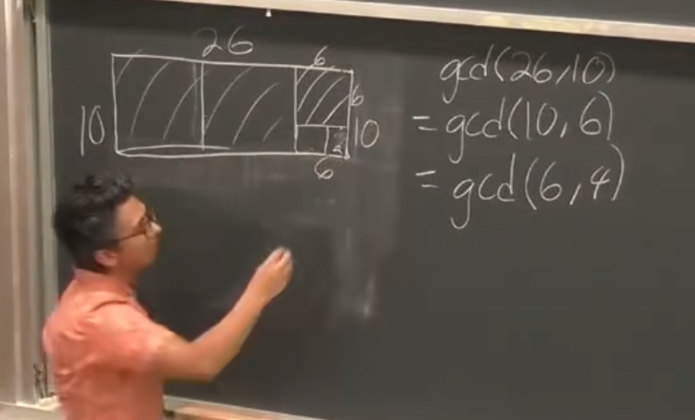
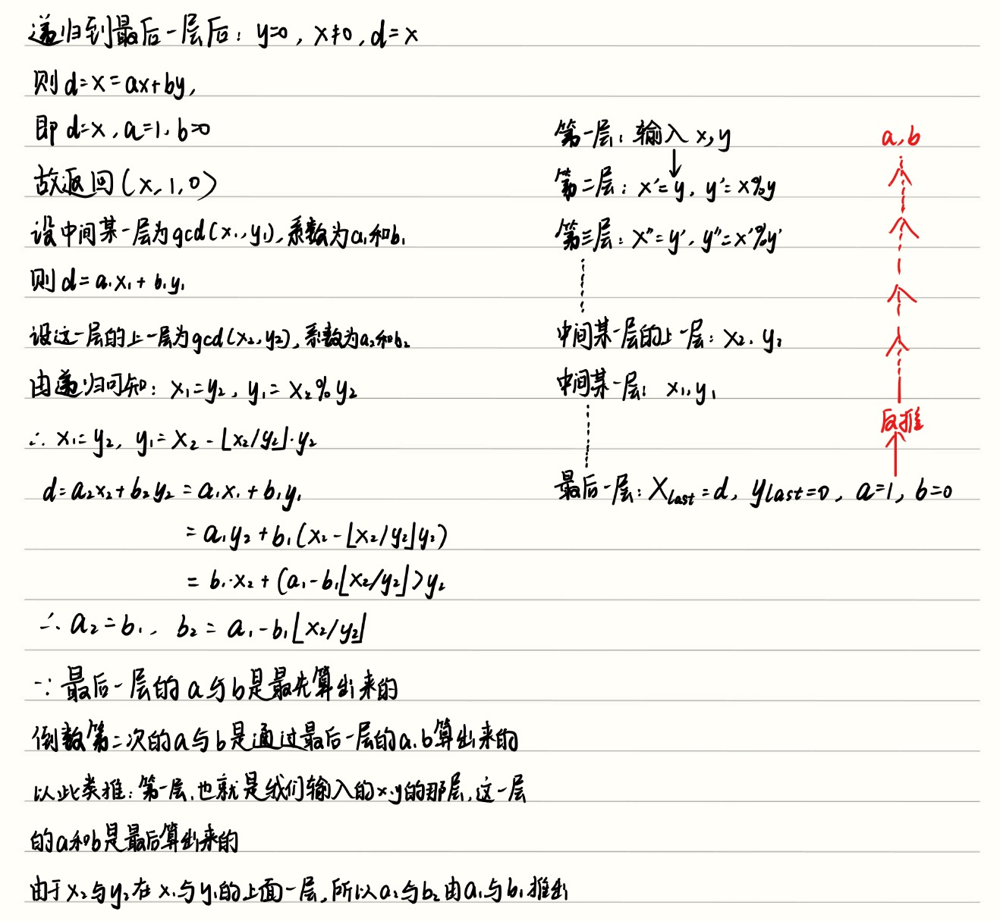

## 1. Euclid's Algorithm（欧几里得算法）

### 1.1 计算 gcd

**Theorem 6.3：** $\gcd(x, y) = \gcd(y, x \bmod y)$

#### 1.1.1 代数的证明方法证明：
$d$ 同时整除 $x$ 和 $y$ $\iff$ $d$ 同时整除 $y$ 和 $x \bmod y$。

因为 $x = qy + r$，其中 $r = x \bmod y$。如果 $d$ 整除 $x$ 和 $y$，则 $d$ 整除 $x - qy = r$。反之亦然。

#### 1.1.2几何的证明方法：
想象你手里拿着一个边长为 $d$ 的正方形地砖，准备去铺满一个长为 $a$、宽为 $b$ 的矩形房间。完美铺满的要求：在“长”的边缘，你必须正好放下整数块地砖（假设是 $m$ 块），不能有缝隙，也不能超出房间。在“宽”的边缘，也必须正好放下整数块地砖（假设是 $n$ 块）。代数翻译：这意味着 $a$ 必须等于 $m \times d$，且 $b$ 必须等于 $n \times d$。换句话说，$d$ 必须同时是 $a$ 和 $b$ 的约数（因数）。结论：任何能够完美铺满这个矩形的正方形，其边长 $d$ 必然是 $a$ 和 $b$ 的公约数。

##### Q1：为什么“切掉正方形”就能找到它？（几何上的辗转相减）

这是欧几里得算法最绝妙的地方。假设我们要找的那个能完美铺满一切的“终极地砖”边长就是 $d$。当我们从 $a \times b$ 的大矩形中，切掉一个边长为 $b$ 的正方形时：

- 这个被切掉的 $b \times b$ 正方形，一定能被“终极地砖 $d$”完美铺满（因为我们已经知道 $b$ 是 $d$ 的整数倍）。
- 既然“大矩形”能被 $d$ 铺满，“切掉的部分”也能被 $d$ 铺满，那么**剩下的那块矩形（长 $a-b$，宽 $b$）也绝对能被 $d$ 完美铺满**。

##### Q2：为什么已经被切掉的大正方形一定能被d铺满？

**我们虽然还不知道 $d$ 具体是多少，但这完全不妨碍我们利用 $d$ “必须满足的客观条件”来缩小寻找它的范围。

在欧几里得算法的几何证明中，逻辑是这样严密展开的：

###### 1. 明确我们要找的目标（定义）

我们现在的任务是寻找 $a$ 和 $b$ 的最大公约数，我们给这个“未知的答案”起个名字叫 $d$。

根据数学定义，只要 $d$ 是 $a$ 和 $b$ 的公约数，那么无论 $d$ 具体是几，它必定天然附带两个不可动摇的性质：

- 性质一：$a$ 肯定是 $d$ 的整数倍（$a = k_1 \cdot d$）。
- 性质二：$b$ 也肯定是 $d$ 的整数倍（$b = k_2 \cdot d$）。
###### 2. 为什么切下来的 $b \times b$ 必然能被铺满？

现在我们看看切下来的那个边长为 $b$ 的正方形。
- 它的边长是 $b$。
- 根据上面的“性质二”，我们已经知道 $b$ 是 $d$ 的整数倍。
- 因此，在逻辑上，一个边长为 $b$ 的正方形，里面一定可以完美塞进 $k_2 \times k_2$ 个边长为 $d$ 的小正方形。
- **结论**：不管真正的 $d$ 是 $2$、$5$ 还是 $100$，只要它是公约数，这个 $b \times b$ 的正方形就**绝对且必然**能被它完美铺满。这是由公约数的定义决定的，不依赖于我们是否已经求出了 $d$ 的具体数值。

### 1.2 算法

0能够整除任何整数，因此递归到0为止

```
algorithm gcd(x, y):
    if y == 0 then return(x)
    else return(gcd(y, x mod y))
```

示例：$\gcd(16, 10)$

```
gcd(16, 10) = gcd(10, 6) = gcd(6, 4) = gcd(4, 2) = gcd(2, 0) = 2
```

### 1.3 时间复杂度

**关键结论：** 每两次递归调用，第一个参数至少缩小一半。

欧几里得算法每次递归调用是 `gcd(x, y) → gcd(y, x mod y)`。我们要证明经过最多 2 次递归，第一个参数 $x$ 至少减半。分两种情况：

**情况 1：$y \le x/2$**

下一步递归是 `gcd(y, x mod y)`，第一个参数从 $x$ 变成了 $y$。因为 $y \le x/2$，**一步就已经减半了**。

**情况 2：$y > x/2$**

因为 $y$ 比 $x$ 的一半还大，$x$ 除以 $y$ 只能商 1，余数就是 $x - y$。即 $x \bmod y = x - y$。

由于 $y > x/2$，所以 $x - y < x - x/2 = x/2$。也就是 $x \bmod y < x/2$。

来看两次递归后的结果：
- 第 1 次：`gcd(x, y) → gcd(y, x mod y)`，第一个参数变成 $y$
- 第 2 次：`gcd(y, x mod y) → gcd(x mod y, ...)`，第一个参数变成 $x \bmod y$

而 $x \bmod y < x/2$，**两步内也减半了**。

**推论：**

$x$ 的二进制位数为 $n$，也就是说 $x < 2^n$。每次减半相当于丢掉一个二进制位，最多减 $n$ 次就减到 0 了。每次减半最多需要 2 步，所以总递归次数 $\le 2n = O(n)$。

**拿 $\gcd(16, 10)$ 验证：**

```
第 0 次: gcd(16, 10)   ← 第一个参数 = 16
第 1 次: gcd(10, 6)    ← 第一个参数 = 10（10 > 16/2 = 8，没减半）
第 2 次: gcd(6, 4)     ← 第一个参数 = 6 （6 < 16/2 = 8 ✓，两步内减半了！）
第 3 次: gcd(4, 2)     ← 第一个参数 = 4
第 4 次: gcd(2, 0)     ← 第一个参数 = 2 （2 < 6/2 = 3 ✓，又是两步内减半）
```

---

## 2. Extended Euclid's Algorithm（扩展欧几里得算法）


### 2.1 从 gcd 到逆元

对于任意一对数 $x, y$，如果我们不仅能算出 $\gcd(x, y)$，还能找到整数 $a, b$ 使得：

$$d = \gcd(x, y) = ax + by$$

!!! example "!#### 证明（数学归纳法）"

    **Base case：** $y = 0$。
    
    此时 $\gcd(x, 0) = x$，且 $x = 1 \cdot x + 0 \cdot 0$。取 $a = 1, b = 0$，成立。
    
    **Inductive Hypothesis：** 假设对于任意输入 $(y, x \bmod y)$（其中 $x \bmod y < y$），扩展欧几里得算法能找到整数 $a, b$ 使得：
    
    $$\gcd(y, x \bmod y) = a \cdot y + b \cdot (x \bmod y)$$
    
    **Inductive Step：** 考虑输入 $(x, y)$，其中 $y > 0$。
    
    根据 IH，递归调用 `extended-gcd(y, x mod y)` 返回了整数 $a, b$ 使得：
    
    $$d = \gcd(y, x \bmod y) = a \cdot y + b \cdot (x \bmod y)$$
    
    由 Theorem 6.3，$\gcd(x, y) = \gcd(y, x \bmod y) = d$。
    
    利用 $x \bmod y = x - \lfloor x/y \rfloor \cdot y$，代入：

    $$\begin{aligned}
    d &= a \cdot y + b \cdot (x \bmod y) \\
      &= a \cdot y + b \cdot (x - \lfloor x/y \rfloor \cdot y) \\
      &= a \cdot y + bx - b\lfloor x/y \rfloor \cdot y \\
      &= bx + (a - \lfloor x/y \rfloor \cdot b)y
    \end{aligned}$$

    令 $A = b$，$B = a - \lfloor x/y \rfloor \cdot b$（它们都是整数），则：

    $$d = A \cdot x + B \cdot y$$

    证毕。
    **关键洞察：** 这个证明直接就是扩展欧几里得算法的正确性证明。算法中系数更新公式 $return(d, b, a - \lfloor x/y \rfloor * b)$ 就是从上面的代数推导中自然生长出来的。这个后面会给出推导过程


（注意： **这不是一个模运算方程** ，而是一个普通的整数方程。$a$ 和 $b$ 可以是零，也可以是负数。）

**例：** $\gcd(35, 12) = 1$，且可以写成：

$$1 = (-1) \cdot 35 + 3 \cdot 12$$

这里 $a = -1, b = 3$ 就是一组可行的值。

#### 如何用这个来求逆元？

假设我们想找 $x$ 在 mod $m$ 下的逆元。

**第 1 步：** 找到整数 $a$ 和 $b$ 使得：

$$1 = \gcd(m, x) = am + bx$$

**第 2 步：** 从这个等式两边同时 mod $m$：


$$am + bx \equiv 1 \pmod m$$

因为 $am \equiv 0 \pmod m$，所以：

$$bx \equiv 1 \pmod m$$

这说明 **$b$ 就是 $x$ 在 mod $m$ 下的乘法逆元**。对 $b$ 再取一次 mod $m$，就能得到那个唯一的、在 $\{0, 1, ..., m-1\}$ 范围内的逆元。

#### 个人想法：
可能单纯用上面的式子会比较难难理解，其实不用弄得那么复杂，$bx \equiv 1\ (mod\  m)$，其实就是 $2*8\ \equiv 1\ (mod\ 15)$，所以在理解上面的内容时配合这个简单的例子会好理解一点。

#### 示例：求 12 在 mod 35 下的逆元

$$1 = \gcd(35, 12) = (-1) \cdot 35 + 3 \cdot 12$$

所以 $b = 3$，验证：$3 \cdot 12 = 36 \equiv 1 \pmod{35}$。**12 的逆元是 3。**

#### 关键意义

求逆元的问题被转化成了：找整数 $a, b$ 满足 $am + bx = \gcd(m, x)$。

而欧几里得算法（Euclid's algorithm）不仅能算 gcd，还能同时帮我们找到 $a$ 和 $b$。所以**求 $x$ 在 mod $m$ 下的逆元，本质上就是跑一遍欧几里得算法，输入 $x$ 和 $m$ 就行了。**

### 2.2 扩展欧几里得算法的具体实现形式：

```
algorithm extended-gcd(x, y):
    if y = 0 then return(x, 1, 0)
    else:
        (d, a, b) = extended-gcd(y, x mod y)
        return(d, b, a - (x div y) * b)
```

示例：$\text{egcd}(16, 10)$

递归下去的路径：
```
egcd(16, 10) → egcd(10, 6) → egcd(6, 4) → egcd(4, 2) → egcd(2, 0)
```

从底向上回溯：
```
egcd(2, 0): 返回 (2, 1, 0)       → 2 = 1·2 + 0·0 ✓
egcd(4, 2): 返回 (2, 0, 1)       → 2 = 0·4 + 1·2 ✓
egcd(6, 4): 返回 (2, 1, -1)      → 2 = 1·6 + (-1)·4 ✓
egcd(10, 6): 返回 (2, -1, 2)     → 2 = (-1)·10 + 2·6 ✓
egcd(16, 10): 返回 (2, 2, -3)    → 2 = 2·16 + (-3)·10 ✓
```

最终结果：$\gcd(16, 10) = 2$，且 $2 = 2 \times 16 + (-3) \times 10$。

### 2.3 为什么系数更新公式是 $(d, b,  (a - \lfloor x/y \rfloor \cdot b)y$？

递归调用返回了 $d = ay + b(x \bmod y)$。

我们观察这一层的上一层，利用 $x \bmod y = x - \lfloor x/y \rfloor \cdot y$，代入：

$$\begin{aligned}
d &= ay + b(x \bmod y) \\
  &= ay + b(x - \lfloor x/y \rfloor \cdot y) \\
  &= ay + bx - b\lfloor x/y \rfloor \cdot y \\
  &= bx + (a - \lfloor x/y \rfloor \cdot b)y
\end{aligned}$$

所以 $x$ 的新系数是 $b$，$y$ 的新系数是 $a - \lfloor x/y \rfloor \cdot b$。

个人感觉Note上面写的过于简略了，下面是我的推导过程：

### 2.4 求逆元示例

求 12 在 mod 35 下的逆元：

$\text{egcd}(35, 12)$ 返回 $(1, -1, 3)$，即 $1 = (-1) \cdot 35 + 3 \cdot 12$。

所以 $3 \cdot 12 = 36 \equiv 1 \pmod{35}$。**12 的逆元是 3。**

### 2.5 模运算中的除法

解方程 $8x \equiv 9 \pmod{15}$：

8 在 mod 15 下的逆元是 2（因为 $2 \times 8 = 16 \equiv 1 \pmod{15}$）。

两边同时乘以 2：$x \equiv 18 \equiv 3 \pmod{15}$。

解为 $x = 3$，且在 mod 15 下唯一。

我的疑问

---

## 3. Fundamental Theorem of Arithmetic（算术基本定理）

### 3.1 定理

每个大于 1 的正整数 $n$，都能 **唯一地** 写成若干个质数的乘积（因子的顺序不重要）。

例如：$12 = 2 \times 2 \times 3$，不可能用其他质数的组合来表示 12。

### 3.2 关键引理

**Claim：** 设 $x, y, z$ 为正整数，$\gcd(x, y) = 1$。如果 $x \mid yz$，则 $x \mid z$。

**证明：**

由扩展欧几里得，$\gcd(x, y) = 1$ 存在 $a, b$ 使得 $ax + by = 1$。

两边同时乘以 $z$：$axz + byz = z$。

- $x$ 整除 $axz$（显然）
- $x$ 整除 $byz$（因为 $x \mid yz$）
- 所以 $x$ 整除它们的和 $axz + byz = z$

### 3.3 唯一性证明

假设 $n$ 有两种质数分解：$n = p_1 p_2 \cdots p_k = q_1 q_2 \cdots q_l$。

考虑 $p_1$：因为 $p_1 \mid n$，所以 $p_1 \mid q_1 q_2 \cdots q_l$。

- 如果 $p_1$ 等于某个 $q_j$，配对成功。
- 如果 $p_1$ 不等于任何 $q_1, ..., q_{l-1}$，则 $p_1$ 与每个都互质（因为都是质数）。反复应用上面的引理，得到 $p_1 \mid q_l$，所以 $p_1 = q_l$。

因此 $p_1$ 一定等于某个 $q_j$。两边同时除以 $p_1$，对 $p_2, ..., p_k$ 重复这个过程。最终左边变成 1，右边必须也变成 1，所以 $k = l$，且每个 $p_i$ 对应一个 $q_j$。

---

## 4. Chinese Remainder Theorem（中国剩余定理）

设 $m_1, m_2, \dots, m_k$ 是 $k$ 个两两互质的正整数（即对于任意 $i \neq j$，有最大公约数 $\gcd(m_i, m_j) = 1$）。对于任意给定的整数 $a_1, a_2, \dots, a_k$，存在一个整数 $x$，使得 $x$ 满足以下一元线性同余方程组：$$\begin{cases}
x \equiv a_1 \pmod{m_1} \\
x \equiv a_2 \pmod{m_2} \\
\vdots \\
x \equiv a_k \pmod{m_k}
\end{cases}$$并且，在模 $M = m_1 m_2 \dots m_k$ 的意义下，该方程组的解是唯一的。也就是说，如果 $x_1$ 和 $x_2$ 都是方程组的解，那么必有 $x_1 \equiv x_2 \pmod{M}$。

### 4.1 最简单的情况（k = 2）

**Claim：** 设 $\gcd(n_1, n_2) = 1$，则对于任意 $a_1, a_2$，存在**唯一**的 $x \pmod{n_1 n_2}$ 满足：

$$x \equiv a_1 \pmod{n_1} \quad \text{且} \quad x \equiv a_2 \pmod{n_2}$$

#### 4.1.1证明存在性：

由扩展欧几里得，存在 $b_1, b_2$ 使得 $b_1 n_1 + b_2 n_2 = 1$。也就是找到 $n1\ (mod\ n2)$ 和 $n2\ (mod\ n1)$ 的逆元

令 $x = a_1 b_2 n_2 + a_2 b_1 n_1$。

验证 $x \equiv a_1 \pmod{n_1}$：

$$x = a_1 b_2 n_2 + a_2 b_1 n_1 = a_1(1 - b_1 n_1) + a_2 b_1 n_1 = a_1 + (a_2 - a_1)b_1 n_1$$

所以 $x \equiv a_1 \pmod{n_1}$。同理 $x \equiv a_2 \pmod{n_2}$。

### 4.1.2 证明唯一性（there is exactly one x (mod n1n2) that satisfies the equations）：

假设 $x$ 和 $y$ 都满足上述方程组。则 $x \equiv y \pmod{n_1}$ 且 $x \equiv y \pmod{n_2}$。

所以 $(x - y)$ 被 $n_1$ 和 $n_2$ 同时整除。因为 $\gcd(n_1, n_2) = 1$，所以 $(x - y)$ 被 $n_1 n_2$ 整除，即 $x \equiv y \pmod{n_1 n_2}$。

### 4.2 "基向量"视角

注意到 $b_1$ 是 $n_1$ 在 mod $n_2$ 下的逆元，$b_2$ 是 $n_2$ 在 mod $n_1$ 下的逆元。

令 $u_1 = b_2 n_2$，$u_2 = b_1 n_1$：

- $u_1 \equiv 1 \pmod{n_1}$，$u_1 \equiv 0 \pmod{n_2}$
- $u_2 \equiv 0 \pmod{n_1}$，$u_2 \equiv 1 \pmod{n_2}$

这就像坐标系中的基向量 $(1,0)$ 和 $(0,1)$。解 $x = a_1 u_1 + a_2 u_2$ 就是在这个"模坐标系"中的线性组合。

### 4.3 推广到 k 个方程

**Theorem：** 设 $n_1, n_2, ..., n_k$ 两两互质，$N = \prod_{i=1}^{k} n_i$。则对于任意 $a_1, ..., a_k$，存在唯一的 $x \pmod N$ 满足所有同余方程：

$$x \equiv a_i \pmod{n_i} \quad \forall i$$

#### 4.3.1 证明

证明分为两部分：“解的存在性”和“解的唯一性”。存在性的证明使用的是**构造法**，这种证明方式不仅在理论上严密，同时也直接构成了计算机算法中求解该类方程组的代码逻辑基础。

##### 1. 证明解的存在性（构造法）

我们需要构造出一个满足所有条件的 $x$。

首先，令所有模数的乘积为 $M$：

$$M = m_1 m_2 \dots m_k = \prod_{i=1}^k m_i$$

对于每一个 $i \in \{1, 2, \dots, k\}$，定义：

$$M_i = \frac{M}{m_i}$$

显然，$M_i$ 是除了 $m_i$ 之外所有其他模数的乘积。因为 $m_1, m_2, \dots, m_k$ 两两互质，所以 $M_i$ 与 $m_i$ 互质，即 $\gcd(M_i, m_i) = 1$。

既然 $\gcd(M_i, m_i) = 1$，就必然存在整数 $y_i$，使得：

$$M_i y_i \equiv 1 \pmod{m_i}$$

这里的 $y_i$ 就是 $M_i$ 在模 $m_i$ 下的乘法逆元（通常可通过扩展欧几里得算法求得）。

现在，我们构造出解 $x$ 的表达式：

$$x = a_1 M_1 y_1 + a_2 M_2 y_2 + \dots + a_k M_k y_k = \sum_{i=1}^k a_i M_i y_i$$

**验证这个 $x$ 是否满足原方程组：**

考虑 $x$ 模 $m_j$ 的情况（$1 \le j \le k$）。

在求和式 $\sum_{i=1}^k a_i M_i y_i$ 中，当 $i \neq j$ 时，$M_i$ 内部包含了因子 $m_j$，因此 $M_i \equiv 0 \pmod{m_j}$，这意味着除第 $j$ 项外的所有项在模 $m_j$ 时都等于 $0$。

而当 $i = j$ 时，由前面的定义已知 $M_j y_j \equiv 1 \pmod{m_j}$。

因此，对 $x$ 取模 $m_j$ 有：

$$x \equiv 0 + \dots + 0 + a_j(M_j y_j) + 0 + \dots + 0 \equiv a_j \times 1 \equiv a_j \pmod{m_j}$$

这就证明了我们构造出来的 $x$ 确实满足所有的同余方程，解是存在的。

##### 2. 证明解的唯一性

假设存在两个解 $x_1$ 和 $x_2$ 都满足原方程组。

对于所有的 $1 \le i \le k$，都有：

$$x_1 \equiv a_i \pmod{m_i}$$

$$x_2 \equiv a_i \pmod{m_i}$$

两式相减，得到：

$$x_1 - x_2 \equiv 0 \pmod{m_i}$$

这意味着差值 $(x_1 - x_2)$ 能被每一个 $m_i$ 整除。

因为 $m_1, m_2, \dots, m_k$ 两两互质，多个两两互质的整数共同整除一个数，说明它们的乘积也能整除这个数。因此 $(x_1 - x_2)$ 必定能被它们的乘积 $M$ 整除。

即：

$$x_1 - x_2 \equiv 0 \pmod{M}$$

等价于：

$$x_1 \equiv x_2 \pmod{M}$$

这就证明了在模 $M$ 的意义下，方程组的解是唯一的。
#### 4.3.2 核心思想：延续 k=2 的"基向量"构造

从 k=2 的情况我们知道，关键是构造一组"基向量" $u_i$，每个 $u_i$ 在自己对应的模下等于 1，在其他所有模下等于 0。

推广到 k 个模数，思路完全一样：我们需要构造 $u_1, u_2, ..., u_k$ 使得：

- $u_i \equiv 1 \pmod{n_i}$
- $u_i \equiv 0 \pmod{n_j}$（对所有 $j \ne i$）

一旦有了这些 $u_i$，解就是 $x = \sum_{i=1}^{k} a_i u_i \pmod N$。

**为什么这个解是对的？** 拿第 $i$ 个方程来验证，$x \pmod{n_i}$ 时：

- $a_i u_i \equiv a_i \cdot 1 = a_i \pmod{n_i}$（唯一贡献）
- 所有 $a_j u_j$（$j \ne i$）中，$u_j \equiv 0 \pmod{n_i}$，所以全部消失

结果：$x \equiv a_i \pmod{n_i}$。每个方程都满足。

#### 4.3.3 怎么构造 $u_i$？

对每个 $i$，令 $N_i = N / n_i = n_1 \cdot n_2 \cdots n_{i-1} \cdot n_{i+1} \cdots n_k$。

也就是说，$N_i$ 是**除了 $n_i$ 以外所有模数的乘积**。

**关键观察：** 因为所有 $n_j$ 两两互质，所以 $N_i$ 和 $n_i$ 也互质（$\gcd(N_i, n_i) = 1$）。

因此，**$N_i$ 在 mod $n_i$ 下一定有乘法逆元**（扩展欧几里得算法可以求出来）。

令：

$$u_i = N_i \cdot (N_i^{-1} \bmod n_i)$$

其中 $N_i^{-1} \bmod n_i$ 是 $N_i$ 在 mod $n_i$ 下的乘法逆元，即满足 $N_i \cdot N_i^{-1} \equiv 1 \pmod{n_i}$ 的那个数。

**验证 $u_i$ 的两个性质：**

**性质 1：$u_i \equiv 1 \pmod{n_i}$**

由定义，$u_i = N_i \cdot N_i^{-1}$，而 $N_i^{-1}$ 就是 $N_i$ 的逆元，所以 $N_i \cdot N_i^{-1} \equiv 1 \pmod{n_i}$。**直接得证。**

**性质 2：$u_i \equiv 0 \pmod{n_j}$（$j \ne i$）**

因为 $N_i$ 的定义包含了 $n_j$ 作为因子（$N_i = N / n_i$，而 $n_j$ 是 $N$ 的因子且 $j \ne i$），所以 $N_i \equiv 0 \pmod{n_j}$。进而 $u_i = N_i \cdot N_i^{-1} \equiv 0 \pmod{n_j}$。**也得证。**

#### 4.3.4 具体例子：k = 3

求满足以下条件的最小正整数 $x$：

$$\begin{cases} x \equiv 2 \pmod{3} \\ x \equiv 3 \pmod{5} \\ x \equiv 2 \pmod{7} \end{cases}$$

**Step 1：** 计算 $N = 3 \times 5 \times 7 = 105$

**Step 2：** 对每个模数计算 $N_i$：

- $N_1 = 105 / 3 = 35$
- $N_2 = 105 / 5 = 21$
- $N_3 = 105 / 7 = 15$

**Step 3：** 求每个 $N_i$ 在 mod $n_i$ 下的逆元：

- 求 $35^{-1} \pmod 3$：$35 \equiv 2 \pmod 3$，$2 \times 2 = 4 \equiv 1 \pmod 3$，所以逆元是 $2$
- 求 $21^{-1} \pmod 5$：$21 \equiv 1 \pmod 5$，$1 \times 1 = 1 \pmod 5$，所以逆元是 $1$
- 求 $15^{-1} \pmod 7$：$15 \equiv 1 \pmod 7$，逆元是 $1$

**Step 4：** 构造 $u_i$：

- $u_1 = 35 \times 2 = 70$
- $u_2 = 21 \times 1 = 21$
- $u_3 = 15 \times 1 = 15$

**验证性质：**
- $70 \equiv 1 \pmod 3$ ✓，$70 \equiv 0 \pmod 5$ ✓，$70 \equiv 0 \pmod 7$ ✓
- $21 \equiv 0 \pmod 3$ ✓，$21 \equiv 1 \pmod 5$ ✓，$21 \equiv 0 \pmod 7$ ✓
- $15 \equiv 0 \pmod 3$ ✓，$15 \equiv 0 \pmod 5$ ✓，$15 \equiv 1 \pmod 7$ ✓

**Step 5：** 最终解：

$$x = 2 \times 70 + 3 \times 21 + 2 \times 15 = 140 + 63 + 30 = 233 \equiv 23 \pmod{105}$$

**验证：**
- $23 \equiv 2 \pmod 3$ ✓（$23 = 7 \times 3 + 2$）
- $23 \equiv 3 \pmod 5$ ✓（$23 = 4 \times 5 + 3$）
- $23 \equiv 2 \pmod 7$ ✓（$23 = 3 \times 7 + 2$）

**答案：$x = 23$，在 mod 105 下唯一。

---

## 总结：模运算技能树

| 操作        | 方法                            | 关键条件             |
| --------- | ----------------------------- | ---------------- |
| **加法/减法** | 随时取模，防止水位                     | 无                |
| **乘法**    | 随时取模，避免水溢出                    | 无                |
| **幂运算**   | Repeated Squaring，$O(\log y)$ | 无                |
| **除法**    | 寻找乘法逆元                        | $\gcd(x, m) = 1$ |
| **求逆元**   | 扩展欧几里得算法                      | $\gcd(x, m) = 1$ |
| **同余方程组** | 中国剩余定理                        | 各模数两两互质          |

整个体系的基石是：**素性测试 + 扩展欧几里得算法**。从这两路推导出了费马小定理、逆元求解、和中国剩余定理。


---

## 5. Euler's Totient Function（欧拉函数）

在讲费马小定理之前，我们需要先解决一个问题：**在 mod $n$ 下，有多少个数与 $n$ 互质？**

这个数量被称为**欧拉函数**（Euler's totient function），记作 $\varphi(n)$。

### 5.1 定义

$\varphi(n)$ 表示 $\{1, 2, ..., n-1\}$ 中与 $n$ 互质（即 $\gcd(x, n) = 1$）的整数的个数。

互质意味着这个数在 mod $n$ 下有乘法逆元——这正是我们之前求逆元时的关键条件（$\gcd(x, m) = 1$）。

### 5.2 当 $n$ 是质数时

**如果 $p$ 是质数**，那么 $\varphi(p) = p - 1$。

**原因：** 质数的定义是只能被 1 和自身整除。所以对于任意 $x \in \{1, 2, ..., p-1\}$，$x$ 和 $p$ 的最大公约数只能是 1（因为 $p$ 没有其他因子）。也就是说，mod $p$ 下的所有非零元素都与 $p$ 互质。

**示例：** $p = 7$

- $\gcd(1, 7) = 1$ ✓
- $\gcd(2, 7) = 1$ ✓
- $\gcd(3, 7) = 1$ ✓
- $\gcd(4, 7) = 1$ ✓
- $\gcd(5, 7) = 1$ ✓
- $\gcd(6, 7) = 1$ ✓

所有 6 个非零元素都与 7 互质，所以 $\varphi(7) = 6 = 7 - 1$。

### 5.3 当 $n = p \cdot q$（$p, q$ 都是质数）时

**如果 $n = pq$，其中 $p, q$ 是不同的质数**，那么：

$$\varphi(pq) = (p-1)(q-1)$$

CS70 老师画了两个矩阵来证明这个结论：一个 **$p \times q$**，一个 **$q \times p$**。思路是用两个矩阵分别找出所有 $q$ 的倍数和 $p$ 的倍数，然后合并计算。

#### 矩阵 1：$p$ 行 $q$ 列 —— 找出所有 $q$ 的倍数

把 $1$ 到 $pq$ 按照 $p$ 行 $q$ 列排列：

$$
\begin{matrix}
1 & 2 & \cdots & q \\
q+1 & q+2 & \cdots & 2q \\
2q+1 & 2q+2 & \cdots & 3q \\
\vdots & \vdots & \ddots & \vdots \\
(p-1)q+1 & (p-1)q+2 & \cdots & pq
\end{matrix}
$$

**观察：只有最后一列的数能被 $q$ 整除。**

- 第 $j$ 列（$1 \le j \le q-1$）的数为 $j, j+q, j+2q, \dots, j+(p-1)q$，它们模 $q$ 的余数都是 $j \ne 0$，所以都不是 $q$ 的倍数。
- **只有最后一列**（$q, 2q, 3q, \dots, pq$）全是 $q$ 的倍数，共 $p$ 个。

这 $p$ 个数就是 $1$ 到 $pq$ 中所有与 $q$ 不互质的数。

#### 矩阵 2：$q$ 行 $p$ 列 —— 找出所有 $p$ 的倍数

把同样的 $1$ 到 $pq$ 按照 $q$ 行 $p$ 列排列：

$$
\begin{matrix}
1 & 2 & \cdots & p \\
p+1 & p+2 & \cdots & 2p \\
2p+1 & 2p+2 & \cdots & 3p \\
\vdots & \vdots & \ddots & \vdots \\
(q-1)p+1 & (q-1)p+2 & \cdots & qp
\end{matrix}
$$

**观察：只有最后一列的数能被 $p$ 整除。**

- 第 $j$ 列（$1 \le j \le p-1$）的数为 $j, j+p, j+2p, \dots, j+(q-1)p$，它们模 $p$ 的余数都是 $j \ne 0$，所以都不是 $p$ 的倍数。
- **只有最后一列**（$p, 2p, 3p, \dots, pq$）全是 $p$ 的倍数，共 $q$ 个。

这 $q$ 个数就是 $1$ 到 $pq$ 中所有与 $p$ 不互质的数。

#### 合并统计

与 $pq$ 不互质的数 = $p$ 的倍数 $\cup$ $q$ 的倍数。

- 矩阵 1 告诉我们：$q$ 的倍数有 $p$ 个（$q, 2q, \dots, pq$）
- 矩阵 2 告诉我们：$p$ 的倍数有 $q$ 个（$p, 2p, \dots, pq$）
- 这两个集合的**唯一交集是 $pq$**。

    **为什么交集只有 $pq$？**

    一个数要同时在两个集合中，意味着它必须**同时是 $p$ 的倍数和 $q$ 的倍数**。

    因为 $p$ 和 $q$ 是不同的质数，所以 $\gcd(p, q) = 1$。如果一个数同时被 $p$ 和 $q$ 整除，那么它必须被 $pq$ 整除。

    在 $1$ 到 $pq$ 的范围内，$pq$ 的倍数**只有 $pq$ 这一个数**（下一个倍数 $2pq$ 已经超出范围了）。

    所以交集只有一个元素：$\{pq\}$。

所以与 $pq$ 不互质的数共有 $p + q - 1$ 个。

$$\varphi(pq) = pq - (p + q - 1) = pq - p - q + 1 = (p-1)(q-1)$$

!!! example "示例：$n = 15 = 3 \times 5$"

    把 1 到 15 排列成 $3 \times 5$ 的矩阵：

    $$
    \begin{matrix}
    1 & 2 & 3 & 4 & \boxed{5} \\
    6 & 7 & 8 & 9 & \boxed{10} \\
    11 & 12 & 13 & 14 & \boxed{15}
    \end{matrix}
    $$

    - 最后一列（5, 10, 15）都能被 5 整除 → 3 个，排除。
    - 再把 1 到 15 按 $5 \times 3$ 排列，最后一列全是 3 的倍数（3, 6, 9, 12, 15）→ 5 个，排除。
    - 两个集合的交集只有 15。
    - 不互质的数：$3 + 5 - 1 = 7$ 个。
    - 互质的数：$15 - 7 = 8$ 个 → $\varphi(15) = 8 = 2 \times 4$ ✓
### 5.4 在 RSA 中的关键意义

RSA 中选择私钥 $d = e^{-1} \pmod{(p-1)(q-1)}$，这里的 $(p-1)(q-1)$ 正是 $\varphi(N)$ 当 $N = pq$ 时的值。也就是说，**RSA 的核心就是在 mod $N$ 下有乘法逆元的那 $\varphi(N)$ 个元素构成的群上运算**。

知道 $\varphi(N) = (p-1)(q-1)$ 是破解 RSA 的关键——如果你知道 $p$ 和 $q$，你就能算出 $\varphi(N)$，进而算出私钥 $d$。但反过来，只知道 $N$ 而不知道 $p, q$，计算 $\varphi(N)$ 就等同于分解 $N$——这正是 RSA 安全性的根基。

---

## 6. Fermat's Little Theorem（费马小定理）

### 6.1 定理

对于任意质数 $p$ 和任意 $a \in \{1, 2, ..., p-1\}$，有：

$$a^{p-1} \equiv 1 \pmod p$$

通俗理解：底数不是 $p$ 的倍数时，指数用 $p-1$，结果一定是 1。

### 6.2 证明

令 $A = \{1, 2, ..., p-1\}$ 为 mod $p$ 下有乘法逆元的集合。

考虑序列 $a, 2a, 3a, ..., (p-1)a \pmod p$。

因为 $p$ 是质数，$\gcd(p, a) = 1$。只要 $x \neq 0$，根据之前 Lecture 7 中的结论（Theorem 6.2 的充分性证明），$ax \pmod p$ 两两不同且都不为 0——它们恰好是 $A$ 中所有元素的一个**排列**。

将 $A$ 中所有元素取乘积 mod $p$：

$$1 \cdot 2 \cdot ... \cdot (p-1) = (p-1)! \pmod p \quad\quad (1)$$

将 $\{a, 2a, ..., (p-1)a\}$ 中所有元素取乘积 mod $p$：

$$a \cdot 2a \cdot ... \cdot (p-1)a = a^{p-1} \cdot (p-1)! \pmod p \quad\quad (2)$$

因为两个集合完全一样（只是顺序不同），所以 (1) 和 (2) 的乘积 mod $p$ 应该相等：

$$(p-1)! \equiv a^{p-1} \cdot (p-1)! \pmod p$$

因为 $p$ 是质数，每个非零元素都有乘法逆元，$(p-1)!$ 也有逆元。两边同时乘以 $(p-1)!$ 的逆元：

$$a^{p-1} \equiv 1 \pmod p$$

证毕。

### 6.3 推广到 $n = pq$（Euler 定理的特例）

视频中还进一步讨论了当模数不是质数而是 $n = pq$（$p, q$ 都是不同的质数）时的情况。

**定理：** 对于 $n = pq$，且 $a$ 与 $n$ 互质（即 $\gcd(a, pq) = 1$），有：

$$a^{(p-1)(q-1)} \equiv 1 \pmod{pq}$$

这里指数 $(p-1)(q-1)$ 正是我们前面刚证明过的 $\varphi(pq)$。所以这其实是 **Euler 定理** $a^{\varphi(n)} \equiv 1 \pmod n$ 在 $n = pq$ 时的特例。

**证明：**

我们要证 $a^{(p-1)(q-1)} \equiv 1 \pmod{pq}$，等价于同时证明：

1. $a^{(p-1)(q-1)} \equiv 1 \pmod p$
2. $a^{(p-1)(q-1)} \equiv 1 \pmod q$

然后由中国剩余定理（CRT）即可推出模 $pq$ 下也成立。

**证 (1)：** 因为 $\gcd(a, pq) = 1$，所以 $a \not\equiv 0 \pmod p$，即 $\gcd(a, p) = 1$。

由费马小定理：$a^{p-1} \equiv 1 \pmod p$。

注意到指数 $(p-1)(q-1) = (p-1) \times (q-1)$ 是 $p-1$ 的整数倍，所以：

$$a^{(p-1)(q-1)} = (a^{p-1})^{q-1} \equiv 1^{q-1} = 1 \pmod p$$

**证 (2)：** 同理，$\gcd(a, q) = 1$，由费马小定理 $a^{q-1} \equiv 1 \pmod q$，而 $(p-1)(q-1)$ 是 $q-1$ 的整数倍：

$$a^{(p-1)(q-1)} = (a^{q-1})^{p-1} \equiv 1^{p-1} = 1 \pmod q$$

由中国剩余定理，模 $p$ 和模 $q$ 下都等于 1，且 $\gcd(p, q) = 1$，所以在模 $pq$ 下也有**唯一解** 1：

$$a^{(p-1)(q-1)} \equiv 1 \pmod{pq}$$

证毕。

!!! warning "关键条件：$a$ 必须与 $pq$ 互质"

    当 $p$ 是质数时，费马小定理要求 $a \in \{1, 2, ..., p-1\}$，这在模 $p$ 下自动保证了 $\gcd(a, p) = 1$。

    但当模数是 $n = pq$ 时，$a$ 不能取遍 $1$ 到 $n-1$ 的所有数——如果 $a$ 是 $p$ 的倍数（或 $q$ 的倍数），那么 $\gcd(a, pq) \neq 1$，这个结论**不成立**。

    **反例：** $n = 15 = 3 \times 5$，取 $a = 3$（$a$ 是 $p$ 的倍数）。

    - $a^{(p-1)(q-1)} = 3^{2 \times 4} = 3^8 = 6561$
    - $6561 \bmod 15 = 6561 - 437 \times 15 = 6561 - 6555 = 6 \neq 1$

    所以必须要求 $\gcd(a, pq) = 1$。

### 6.4 经典例题

#### 已知 $x^7 \equiv 3 \pmod{11}$，求 $x$

##### **思路：** 利用费马小定理将指数"降维"。这道题的思想真的很重要

因为 11 是质数，由费马小定理：$x^{10} \equiv 1 \pmod{11}$。

这意味着指数在 mod 10 的意义下运算——即 $x^{a} \equiv x^{a \bmod 10} \pmod{11}$。

!!! tip "为什么会想到取 $k$ 次方？"
    类比普通代数：解 $x^7 = 3$，我们两边同时取 $\frac{1}{7}$ 次方，得到 $x = 3^{1/7}$。
    
    模运算里没有"开根号"这种操作，但费马小定理告诉我们：**指数在 mod $(p-1)$ 下运算** 。
    所以"取 $\frac{1}{7}$ 次方"在模运算中等价于——**找一个整数 $k$，使得 $7k \equiv 1 \pmod{10}$**。
    
    也就是说，$k$ 就是 $7$ 在 mod 10 下的**乘法逆元**，它在指数运算中扮演了"$1/7$"的角色。

我们需要从 $x^7 \equiv 3 \pmod{11}$ 中解出 $x$。两边同时取 $k$ 次方：

    $$(x^7)^k \equiv 3^k \pmod{11} \implies x^{7k} \equiv 3^k \pmod{11}$$

我们希望 $7k \equiv 1 \pmod{10}$，这样 $x^{7k} \equiv x^1 = x \pmod{11}$。

**解 $7k \equiv 1 \pmod{10}$：**

$7 \times 3 = 21 \equiv 1 \pmod{10}$，所以 $k = 3$。

两边同时取 3 次方：

$$x^{21} \equiv 3^3 = 27 \pmod{11}$$

而 $x^{21} = x^{20+1} = (x^{10})^2 \cdot x \equiv 1^2 \cdot x = x \pmod{11}$。

且 $27 \equiv 5 \pmod{11}$。

**答案：$x \equiv 5 \pmod{11}$。**

验证：$5^7 = 78125$，$78125 \bmod 11 = 3$ ✓


#### 老师的板书总结（一般化）

$$
\begin{aligned}
&\textbf{Given: }\quad x^e \pmod p,\; e,\; p \text{ prime} \\
&\textbf{Find: }\quad x \\
&\textbf{Easy: }\;\text{Find } d \;\text{s.t.}\; ed \equiv 1 \pmod{p-1}
\end{aligned}
$$

这是一道具体题目的**一般化抽象**：

- **已知**：$x^e \pmod p$ 的值、指数 $e$、以及质数 $p$
- **求**：$x$
- **方法**：找一个 $d$ 使得 $ed \equiv 1 \pmod{p-1}$，然后对已知值取 $d$ 次方即可

这本质上就是：在模 $p-1$ 下求 $e$ 的乘法逆元 $d$，然后用 $d$ 作为"指数上的逆操作"来还原 $x$。

这也正是 **RSA 解密的核心思想**——RSA 中求私钥 $d$ 满足 $ed \equiv 1 \pmod{(p-1)(q-1)}$，然后 $y^d \equiv (x^e)^d \equiv x \pmod N$。

#### 下面是我的一个疑问：
!!! warning "前提条件：我的疑问：万一$e$ 和 $p-1$ 不互质怎么办？"

    这个方法有个**关键前提**：$e$ 在 mod $(p-1)$ 下必须存在乘法逆元，即 $\gcd(e, p-1) = 1$。

    如果 $\gcd(e, p-1) \neq 1$，那么 $e$ 在 mod $(p-1)$ 下没有逆元，这个"取 $d$ 次方"的方法就**行不通了**。

    **为什么 RSA 不会遇到这个问题？**

    RSA 在选公钥 $e$ 的时候就**强制要求** $\gcd(e, (p-1)(q-1)) = 1$，所以逆元 $d$ 一定存在。但如果只是随便拿来一个 $e$，这个条件不一定满足。

    **如果 $e$ 和 $p-1$ 不互质怎么办？**

    这时候 $x^e \pmod p$ 就不是一个一一映射——不同的 $x$ 可能得到相同的 $x^e$，信息丢失了，无法唯一还原。

    **反例：** $p = 7$，$p-1 = 6$。取 $e = 2$，$\gcd(2, 6) = 2 \neq 1$。

    - $1^2 \equiv 1 \pmod 7$
    - $2^2 \equiv 4 \pmod 7$
    - $3^2 \equiv 2 \pmod 7$
    - $4^2 \equiv 2 \pmod 7$ ← 和 $3^2$ 一样！
    - $5^2 \equiv 4 \pmod 7$ ← 和 $2^2$ 一样！
    - $6^2 \equiv 1 \pmod 7$ ← 和 $1^2$ 一样！

    给定 $x^2 \equiv 2 \pmod 7$，$x$ 可能是 3 也可能是 4，**无法唯一确定**。这就是"炸了"的情况。

---
## 7. RSA 正确性证明（基于 FLT 和 CRT）

### 7.1 RSA 方案回顾

- 选两个大质数 $p, q$，令 $N = pq$
- 选 $e$ 使得 $\gcd(e, (p-1)(q-1)) = 1$
- 公钥：$(e, N)$，私钥：$d = e^{-1} \pmod{(p-1)(q-1)}$
- 加密：$E(x) = x^e \pmod N$
- 解密：$D(y) = y^d \pmod N$

### 7.2 Theorem 7.1：RSA 正确性

要证：$D(E(x)) = (x^e)^d \equiv x \pmod N$ 对所有 $x \in \{0, 1, ..., N-1\}$ 成立。

**证明思路：**

由 $d$ 的定义，$ed \equiv 1 \pmod{(p-1)(q-1)}$，即 $ed = 1 + k(p-1)(q-1)$。

要证 $x^{ed} \equiv x \pmod N$，即证 $x^{ed} - x \equiv 0 \pmod N$。

$$x^{ed} - x = x^{1+k(p-1)(q-1)} - x = x(x^{k(p-1)(q-1)} - 1)$$

**证明这个式子能被 $p$ 整除：**

- **Case 1：** $x$ 不是 $p$ 的倍数。则 $x \not\equiv 0 \pmod p$，由 FLT 得 $x^{p-1} \equiv 1 \pmod p$，所以 $x^{k(p-1)(q-1)} - 1 \equiv 0 \pmod p$。
- **Case 2：** $x$ 是 $p$ 的倍数。则式子中 $x$ 本身就有因子 $p$，显然能被 $p$ 整除。

**同理可证**这个式子也能被 $q$ 整除。

因为 $p$ 和 $q$ 都是质数，所以这个式子能被 $pq = N$ 整除。即 $x^{ed} \equiv x \pmod N$。证毕。

### 7.3 替代证明（用中国剩余定理）

先用 FLT：

$$x^{ed} = x^{k(p-1)(q-1)+1} = (x^{k(q-1)})^{p-1} \cdot x \equiv x \pmod p$$

（当 $x \not\equiv 0 \pmod p$ 时由 FLT 得证；当 $x \equiv 0 \pmod p$ 时显然成立。）

同理：$x^{ed} \equiv x \pmod q$。

由中国剩余定理（CRT），$x^{ed} \equiv x \pmod p$ 且 $x^{ed} \equiv x \pmod q$，且 $\gcd(p, q) = 1$，则在 mod $N$ 下有**唯一解**，这个解就是 $x$。所以 $x^{ed} \equiv x \pmod N$。

---

## 8. Prime Number Theorem（素数定理）

**Theorem：** 令 $\pi(n)$ 表示小于等于 $n$ 的质数个数。对于 $n \geq 17$：

$$\pi(n) \geq \frac{n}{\ln n}$$

更精确地，$\lim_{n \to \infty} \frac{\pi(n)}{n/\ln n} = 1$。

**在 RSA 中的意义：**

要找到两个 512 位的大质数 $p, q$，只需随机生成 512 位整数并做素性测试。素数定理告诉我们：512 位整数中大约每 355 个数就有一个是质数。所以平均只需要测试约 355 个数就能找到一个质数，效率很高。

---

## 9. RSA 安全性

RSA 的安全性基于以下假设：

> 给定 $N, e$ 和 $y = x^e \pmod N$，**没有高效的算法**能求出 $x$。

Eve 可以尝试的两种攻击方法：

1. **暴力枚举：** 尝试所有可能的 $x$，逐一检查 $x^e \equiv y \pmod N$。但 $x$ 的范围是 $N$（512 位 = $2^{512}$ 种可能），完全不现实。
2. **分解 $N$：** 把 $N$ 分解成 $p \times q$，然后算出 $d = e^{-1} \pmod{(p-1)(q-1)}$。但**大整数分解**被认为是极难的问题。

**注意：** RSA 的安全性**没有被严格证明**。它依赖于两个假设：
- 破解 RSA 本质上等价于分解 $N$
- 大整数分解是困难的
