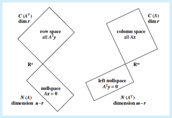

如图展示的是线代中的四个基本子空间。这一单元主要涉及**矩阵介绍**、**矩阵形式的线性公式 Ax=b 性质**以及**四个基本子空间**。

## 1. 矩阵

### 1.1 线性方程的矩阵表示（Matrix Picture of Linear Equations）

对于以下等式系统（system of equations）：

$\left\{ \begin{array}{cl} 2x-y&=&0 \\ -x+2y&=&3 \end{array} \right.$

我们可以写成三种形式：行图、列图、矩阵图。

#### 1.1.1 行图（Row Picture）

$2x-y=0$

$-x+2y=3$

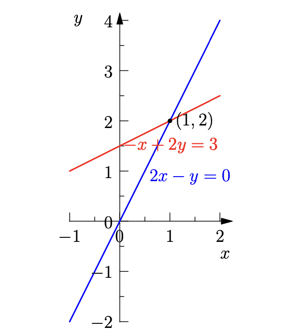

所以，x=1，y=2。

#### 1.1.2 列图（Column Picture）

$x\begin{bmatrix} 2  \\ -1 \end{bmatrix}+y\begin{bmatrix} -1  \\ 2 \end{bmatrix}=\begin{bmatrix} 0  \\ 3 \end{bmatrix}$

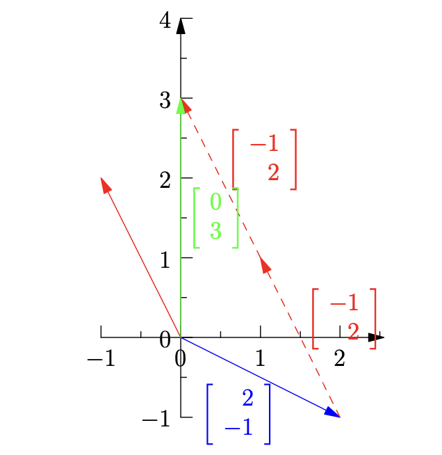

可知，x=1，y=2。

#### 1.1.3 矩阵图（Matrix Picture）

借助方程与向量，可以将其写作一个等式：

$\begin{bmatrix} 2 & -1 \\ -1 & 2 \end{bmatrix}\begin{bmatrix} x  \\ y \end{bmatrix}=\begin{bmatrix} 0  \\ 3 \end{bmatrix}$

即 $A\textbf{x}=\textbf{b}$。

#### 1.1.4 线性独立（Linearly Independent）与线性依赖（Linearly Dependent）

**定义：**如果一组向量 $x_1,x_2,...x_n$ 满足仅当$c_1,c_2,...c_n$ 全为 0 时， $c_1x_1+c_2x_2+...+c_nx_n=0$，则这组向量是线性独立。

对于得到的方程，$A\textbf{x}=\textbf{b}$。给定矩阵$A$， 如果对于任意的向量 $\textbf{b}$ 都存在解（对于 2 维向量来说，3 维及更高维向量情况参见 “求解 $Ax=b$” 的 $r<m$ 情况），即矩阵的列向量的线性组合可以填满 *x-y 平面*（向量 $b$ 是这个平面上的一点），则称 $A$ 的列向量是线性独立的。否则，$A$ 是**奇异矩阵（singular matrix）**，其列向量是线性依赖的。

例如，

$A=\begin{bmatrix} 1 & -2 \\ 1 & -2 \end{bmatrix}$，

$A$ 的第二列可由第一列乘以**-2**得到，因此 $A$ 是奇异矩阵。两个列向量可以通过线性组合得到一条线、一个点，却无法填满 *x-y 平面*。

### 1.2 Method of Elimination i.e. Gauss' Elimination Method

通过行变换将矩阵 $A$ 变化为上三角矩阵（upper triangular matrix） $U$，可以更轻松的计算 $Ax=b$ 的解（通过回代 *back-substitution*）。

#### 1.2.1 枢轴（Pivot）、秩（Rank）与自由变量（Free Variables）

在使用消除法时，需要从第一列到最后一列依次消除。消除时，一般在这一列中从上到下寻找第一个左边全为 0 的非 0 元素，然后将其行相乘一定的常数，再加到其之下的行。重复这两步，直到这一行之下全为 0 为止。

每列中用于消除其他行的这个元素叫做**枢轴（或译作 “主元”）**。

消除后的矩阵，每行第一个非 0 元素就是枢轴。

例如，在矩阵 $A$ 中，为了消除第一列，我们使用 (1, 1) 的元素 **1** 来做为枢轴。之后，第二列无法找到枢轴，因此第二个枢轴即为 (2, 3) 的元素 **2**。

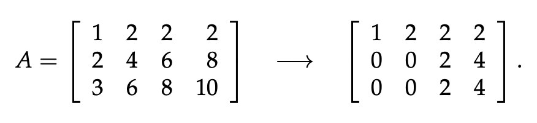

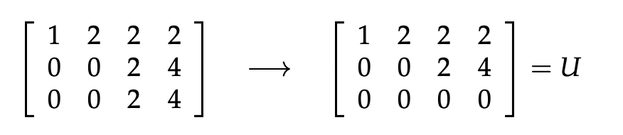

**自由变量（Free Variables）：** 第 2 列与第 4 列不存在枢轴，它们在线性方程组 $Ax$ 中分别属于 $x_2$ 与$x_4$ 的系数，因此这两个未知变量称作自由变量。因为它们无论赋什么值，$Ax=0$ 或者 $Ax=b$ 都可解。

**自由变量数：** 我们可以通过列数减去枢轴数得到自由变量数 $n-r$。

#### 1.2.2 Elimination Matrices

用来消除第 $m$ 行 $n$ 元素的消除矩阵记作 $E_{mn}$。

消除矩阵是由单位矩阵（Identity Matrix）$I$ 演变过来的。

例如：

 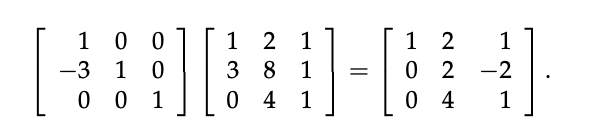

此时消除矩阵将矩阵 $A$ 的第二行第一列第元素 3 消除为 0，因此可以将此运算记作：$E_{21}A$。

而通过两步消除，可以将矩阵转为上三角矩阵，可以记作：$E_{32}E_{21}A=U$。另外，可以通过消除矩阵的逆矩阵将 $U$ 转为原始矩阵 $A$。

#### 1.2.3 Permutation Matrices

##### 1.2.3.1 定义

将一个单位矩阵乘一个同大小方阵。

$IA=B$

$\begin{bmatrix} 1 & 0 & 0 \\ 0 & 1 & 0 \\ 0 & 0 & 1 \end{bmatrix}\begin{bmatrix} 1 & 2 & 1 \\ 3 & 8 & 1 \\ 0 & 4 & 1 \end{bmatrix}=\begin{bmatrix} 1 & 2 & 1 \\ 3 & 8 & 1 \\ 0 & 4 & 1 \end{bmatrix}$

直观上来看：$B$ 的第一行由 $I$ 的第一行控制，$I$ 的第一行计算为 $1 \times A_{*1} + 0 \times A_{*2} + 0 \times A_{*3}$，因此 $B$ 的第一行与 $A$ 的第一行相同。（使用 * 代表所有行。）

因此，将单位矩阵行变换后，可以得到排序矩阵 $P$。

比如：

$\begin{bmatrix} 0 & 1 & 0 \\ 1 & 0 & 0 \\ 0 & 0 & 1 \end{bmatrix}\begin{bmatrix} 1 & 2 & 1 \\ 3 & 8 & 1 \\ 0 & 4 & 1 \end{bmatrix}=\begin{bmatrix} 3 & 8 & 1 \\ 1 & 2 & 1 \\ 0 & 4 & 1 \end{bmatrix}$

##### 1.2.3.2 排列矩阵的个数

排列矩阵的个数：$n!$ for a $n \times n$ matrix.

原因：对于第一行，我门有 $n$ 行可选；对于第二行，我门已放置第一行，因此还剩下 $n-1$ 行可选；相应的，可选行数依次递减，可得：$n(n-1)(n-2)...=n!$

##### 1.2.3.3 排列矩阵的性质

$P^{-1}=P^T$ i.e. that $P^TP=I$.

### 1.3 矩阵乘法

矩阵乘法可以从 4 种角度理解。

对于 $AB=C$

#### 1.3.1 标准：行乘列

$c_{ij}=\sum_{k=1}^{n}a_{ik}b_{kj}$

即通过左行右列的方式相乘并相加。

#### 1.3.2 列组合

将 $B$ 的第 $j$ 列提出作为向量与矩阵 $A$ 相乘，得到的向量即为矩阵 $C$ 的第 $j$ 列。

$B_{*j}=\begin{bmatrix} B_{1j} \\ B_{2j} \\ B_{3j} \end{bmatrix}$

$B_{1j}\begin{bmatrix} A_{11} \\ A_{21} \\ A_{31} \end{bmatrix}+B_{2j}\begin{bmatrix} A_{12} \\ A_{22} \\ A_{32} \end{bmatrix}+B_{3j}\begin{bmatrix} A_{13} \\ A_{23} \\ A_{33} \end{bmatrix}=C_{*j}$

所以，$C$ 的一列为 $A$ 的所有列的线性组合。

#### 1.3.3 行组合

将 $A$ 的第 $i$ 行提出作为向量与矩阵 $B$ 相乘，得到的向量即为矩阵 $C$ 的第 $i$ 行。

所以，$C$ 的一行为 $B$ 的所有行的排列组合。

#### 1.3.4 列乘行

设：A 是 $m\times n$ 矩阵，按列拆分：

$$A=\big[\boldsymbol a_1,\boldsymbol a_2,\dots,\boldsymbol a_n\big]（共 n 个列向量）$$
B 是 $n\times p$ 矩阵，按行拆分：
 

$$B=\begin{bmatrix}  b_1 \\ b_2 \\ b_3 \\\vdots\\\ b_n\end{bmatrix}（共 n 个行向量）$$
 
矩阵乘法公式：
 

$AB = \boldsymbol a_1\boldsymbol b_1 \;+\; \boldsymbol a_2\boldsymbol b_2 \;+\; \dots \;+\; \boldsymbol a_n\boldsymbol b_n$

将 $A$ 的一列与 $B$ 的一行提出。

通过一个例子来理解：

#### 1.3.5 分块

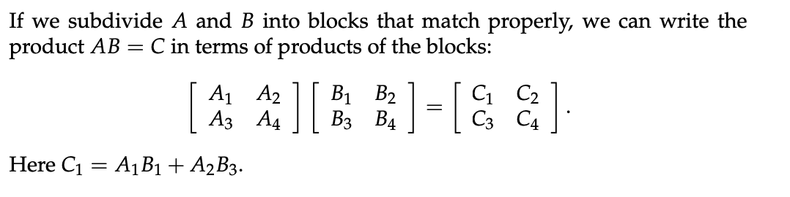

### 1.4 逆矩阵（Inverse）

#### 1.4.1 逆矩阵介绍

**定义：** 对于一个方阵A，如果A可逆，就有这样一个 $A^{-1}$，使得：

$$AA^{-1}=I=A^{-1}A$$
如果A不是方阵，左侧的 $A^{-1}$ 与右侧的 $A^{-1}$ 不可能相同，因为这时左右侧 $A^{-1}$ 形状一定不相同，那么就违背了唯一性。

再举一个没有逆矩阵的矩阵：$A=\begin{bmatrix} 1 & 3 \\ 2 & 6 \end{bmatrix}$，学过行列式就能一下子算出来它的行列式为0，因此矩阵不可逆。但是本课程并不是从行列式开始介绍的，那么我们换一种看法。我们看到这个矩阵中含两个列向量$\begin{bmatrix} 1 \\ 2  \end{bmatrix}$和$\begin{bmatrix} 3 \\ 6  \end{bmatrix}$，这两个向量，它们之间互相成倍数，他就是说这两个向量之一对其线性毫无贡献，那么这个A不可能有逆矩阵。换句话说：

$$若存在非零向量x，使得Ax=0，那么A就不可能有逆矩阵$$
为什么呢？假设A有逆矩阵，在 $Ax=0$ 这个等式两边同时乘上 $A^{-1}$，就有：

$$A^{-1}Ax=Ix=A^{-1}×0=零向量$$
而 $Ix$ 不可能是零向量，自相矛盾了，因此A不可能有逆矩阵。再看矩阵$\begin{bmatrix} 1 & 3 \\ 2 & 6 \end{bmatrix}$，由于两个列向量线性相关，一定存在一个，使得Ax=0，比如$\begin{bmatrix} 3 \\ -1  \end{bmatrix}$，所以矩阵不可逆。

#### 1.4.2 逆矩阵求解

#### 1.4.3 Gauss-Jordan Elimination

##### 证明：

构造一个增广矩阵 $[A | I]$，对这个增广矩阵应用完全相同的初等行变换，等价于在整个增广矩阵的左侧乘以矩阵 $P$。根据分块矩阵的乘法运算法则：

$$P [A | I] = [PA | PI]$$
将$P = A^{-1}$ 代入上式中，得：

$$[PA | PI] = [I | A^{-1}I] = [I | A^{-1}]$$

证明完毕，下面回到这个例题：

通过在方阵 $A$ 右侧增加同大小单位矩阵，在我们将原方阵消除后变为单位矩阵后，右侧将变为原矩阵的逆矩阵。

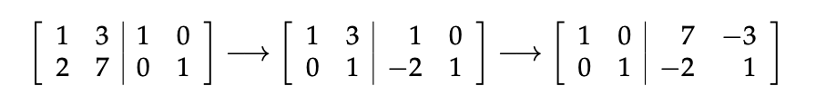

因此 $A^{-1}=\begin{bmatrix} 7 & -3 \\ -2 & 1 \end{bmatrix}$

### 1.5 转置（Transposes）

- 矩阵的转置即行列互换。

- 对于对称矩阵，转置后不变。
- $(AB)^T=B^TA^T$

- 给定矩阵 $R$ （可为非方阵），$R^TR$ 必为对称的，因为 $(R^TR)^T=R^T(R^T)^T=R^TR$。

---
## 2. $A=LU$

“L” 即 Lower Triangular Matrix；“U” 即 Upper Triangular Matrix。

### 2.1 分解矩阵 A

#### 2.1.1 分解为 L 与 U

通过高斯（Gauss）消除，我们可以得到：

$EA=U$

两边同时左乘 $E^{-1}$，可以得到

$A=E^{-1}U$，而 $E^{-1}$ 就是下三角矩阵，例如：

 $A=LU$

$\begin{bmatrix} 2 & 1 \\ 8 & 7 \end{bmatrix}=\begin{bmatrix} 1 & 0 \\ 4 & 1 \end{bmatrix}\begin{bmatrix} 2 & 1 \\ 0 & 3 \end{bmatrix}$

#### 2.1.2 分解为 L，D 与 U'

“D” 即 Diagonal Matrix。

我们可以将 $U$ 分解为 $DU'$。

$\begin{bmatrix} 1 & 0 \\ 0 & 1 \end{bmatrix}\begin{bmatrix} a & b \\ 0 & c \end{bmatrix}=\begin{bmatrix} a & 0 \\ 0 & c \end{bmatrix}\begin{bmatrix} 1 & b/a \\ 0 & 1 \end{bmatrix}$

例如：

$A=LDU'$

$\begin{bmatrix} 2 & 1 \\ 8 & 7 \end{bmatrix}=\begin{bmatrix} 1 & 0 \\ 4 & 1 \end{bmatrix}\begin{bmatrix} 2 & 0 \\ 0 & 3 \end{bmatrix}\begin{bmatrix} 1 & 1/2 \\ 0 & 1 \end{bmatrix}$

### 2.2 求 L 的技巧

假设 $E_{32}E_{21}A=U$，则 $A=E_{21}^{-1}E_{32}^{-1}U=LU$。

我们可以发现，在 $E=E_{32}E_{21}$，$E$ 的左下角多了元素10。

$\begin{bmatrix} 1 & 0 & 0 \\ 0 & 1 & 0 \\ 0 & -5 & 1 \end{bmatrix}\begin{bmatrix} 1 & 0 & 0 \\ -2 & 1 & 0 \\ 0 & 0 & 1 \end{bmatrix}=\begin{bmatrix} 1 & 0 & 0 \\ -2 & 1 & 0 \\ 10 & -5 & 1 \end{bmatrix}$

但在 $E_{21}^{-1}E_{32}^{-1}=L$ 中，这个问题不会出现。即消除矩阵的乘数直接复制到了 $L$ 中。

$\begin{bmatrix} 1 & 0 & 0 \\ 2 & 1 & 0 \\ 0 & 0 & 1 \end{bmatrix}\begin{bmatrix} 1 & 0 & 0 \\ 0 & 1 & 0 \\ 0 & 5 & 1 \end{bmatrix}=\begin{bmatrix} 1 & 0 & 0 \\ 2 & 1 & 0 \\ 0 & 5 & 1 \end{bmatrix}$

---
## 3. 秩与最简行阶梯式的化简

**行阶梯式（Row Echelon Form, REF）：** 通过消除法将矩阵变换为上三角矩阵后，我们称得到的 $U$ 为行阶梯式。

秩（Rank）：秩等于矩阵阶梯式的非零行数，同枢轴数。用 $r$ 表示。

**最简行阶梯式（Reduced Row Echelon Form, RREF）：** 对 $U$ 使用消除法，保证所有的枢轴等于 1 且枢轴之上与之下均为 0。使用 $R$ 表示。

### 3.1 RREF 的化简

给定矩阵 $A$：

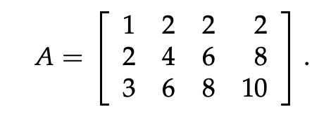

（注意：此矩阵的列不独立。）

化简为 $U$ 再化简为 $R$：

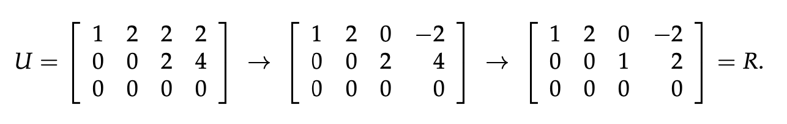

通过交换列，$R$ 可以写作以下形式：

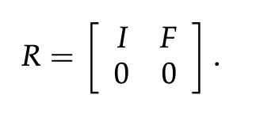

（在这里 $I$ 是 $r\times r$ 的单位矩阵。）

---

## 4. 向量空间（Vector Spaces）

如果一个向量合集在**线性组合（Linear Combination）** 下闭合，即此合集下任意数量向量相加以及与任意实数相乘都可以在此合集中找到对应的向量，则这个合集称作一个向量空间。

### 4.1 子空间（Subspaces）

向量空间 A 存在于向量空间 B 内，则称 A 为 B 的子空间。

**例子：** 在 $R^2$ 中任取一个非0向量 $\overrightarrow{v}$，则向量合集 $c\overrightarrow{v}$ （$c$ 是任意实数）形成 $R^2$ 的子空间。

注意，选取的向量必须经过原点，否则无法构成向量空间

**交集与并集：** 一个包含原点的平面 $P$ 与一个包含原点的直线 $L$ 都是 $R^3$ 的子空间。但是 $P \cup L$ 通常不是子空间，因为在 $P$ 中的一个向量与在 $L$ 中的一个向量的和也许不在 $P \cup L$ 中。而 $P \cap L$ 仍是子空间，因为 $P$ 与 $L$ 分别在线性组合下闭合，因此它们的交集也会在线性组合下闭合。

**注意：** 检查一个子集是否为其父集的子空间时，应先检查其是否符合向量空间的定义。例如，$M$ 是 $5\times 17$ 矩阵形成的向量空间，$M$ 的一个子集包含所有秩为 4 的矩阵。这个子集不是子空间。尽管它包含零矩阵，但是两个秩为 4 的矩阵的和也许秩不为 4，即不在线性组合下闭合。

 

#### 4.1.1 $R^2$ 的子空间

1. 全部的 $R^2$ 
2. 任何穿过原点的线
3. 零向量（$\overrightarrow{0}$）

#### 4.1.2 $R^3$ 的子空间

1. 全部的 $R^3$
2. 任何穿过原点的平面
3. 任何穿过原点的线
4. 零向量（$\overrightarrow{0}$）

### 4.2 填充一个空间（Spanning a Space）

当一个空间由向量 $v_1,v_2,...v_k$ 的所有线性组合组成，则称这些向量填充了这个空间。

如，矩阵的列向量填充了矩阵的列空间。

如果 $v_1,v_2,...v_k$ 填充了一个空间 $S$，则 $S$ 是包含这些向量的**最小空间**。

### 4.3 基（Basis）和维度（Dimension）

向量空间的维度是**基的向量数量**。给定一个空间，它的所有基都拥有同样数量的向量，即同样的维度。

例如：$R^3$

$R^3$ 的一个基是：$\{ \begin{bmatrix} 1 \\ 0 \\ 0 \end{bmatrix},\begin{bmatrix} 0 \\ 1 \\ 0 \end{bmatrix},\begin{bmatrix} 0 \\ 0 \\ 1 \end{bmatrix} \}$，其维度为 3。

我们可以知道，对于 $R^n$，它的每个基都有 n 个向量，即它的维度为 n。

对于一个向量空间的一个基，其有两个**属性**：

- $v_1,v_2,...v_d$ 是**线性独立**的。
- $v_1,v_2,...v_d$ **填充**（span）这个向量空间

### 4.4 矩阵的列空间（Column Space）

对于每一列都在 $R^3$ 的矩阵 $A$，矩阵的列和列的线性组合形成 $R^3$ 的子空间。我们称这些列向量组成的向量空间为列空间，使用 $C(A)$ 表示。

#### 4.4.1 $Ax = b$ 形式

注意，在 Ax = b 中，x 与 b 均为向量。因此，b 可以看作 A 的列根据 x 形成的线性组合。

即，只有当 $b$ 在 $C(A)$ 中，线性方程 $Ax=b$ 有解。

#### 4.4.2 列空间的维度 (Dimension)

对于矩阵

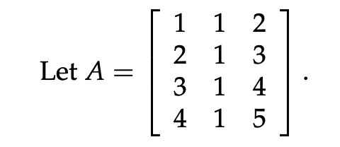

因为其第三列为前两列的线性组合，因此 $C(A)$ 是 $R^4$ 的**二维**子空间。

### 4.5 零空间（Nullspace）

若 $Ax=0$，则零空间是所有解向量的合集，使用 $N(A)$ 表示。

若 $Ax=b$，则解向量的合集不一定能构成一个子空间，因为 $x$ 可能无法为零向量，即不穿过原点。

### 4.6 由三维方阵构成的向量空间

所有的 $3 \times 3$ 矩阵可以形成的向量空间，用 $M$ 表示。如果我们忽略矩阵乘法规则，一个三维方阵可以看作一个 9 维的向量。

$M$ 的子空间包括：

- 所有的上三角矩阵（Upper Triangular Matrices），$U$
- 所有的对称矩阵 (Symmetric Matrices)，$S$
- 所有的对角线矩阵（Diagonal Matrices），$D$

#### 4.6.1 上三角矩阵与对阵矩阵的基

根据其特性，易得 $dim(U)=dim(S)=6$。

一个上三角矩阵的基：

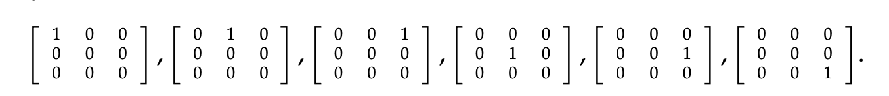

一个对称矩阵的基：

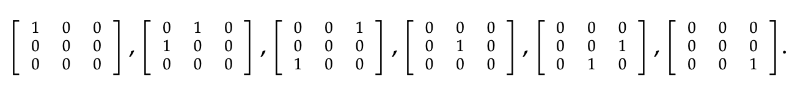

#### 4.6.2 对角线矩阵

我们可以发现，$D$ 是前两种子空间的交集。$D$ 是一个 3 维的子空间，一个可能的基为：

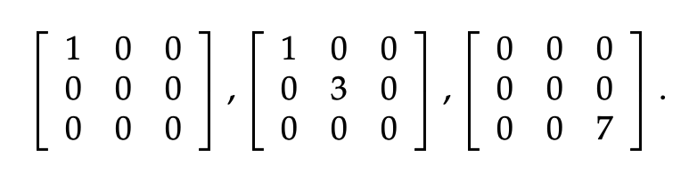

#### 4.6.3 关于 $S\cup U$ 与 $S+U$

注意，$S\cup U$ 是一个可能为对称矩阵也可能为上三角矩阵的 3 行 3 列矩阵，其不是 $M$ 的一个子空间，因为它不闭合。例如将一个任意上三角矩阵与一个任意对称矩阵相加，得到的矩阵大概率即不是对称矩阵也不是上三角矩阵。

但是，$S+U$ （对称矩阵与上三角矩阵的所有元素依次相加）是 $M$ 的一个子空间。实际上，$S+U=M$。

我们可以发现以下规律：

$dim(S)+dim(U)=dim(S\cup U)+dim(S\cap U)$

---

## 5. 计算零空间（即求解 $Ax = 0$）

为了简单地计算向量 $x$ 的取值，我们可以先将 $A$ 化简为行阶梯式（行变化不影响零空间，因为在此处矩阵实质上是线性方程组的系数表示；但是行变化会改变列空间），然后将行阶梯式回代入线性方程组以解得所有的未知变量。

### 5.1 特解（Particular Solution）

假设矩阵 $A$ 有 2 个自由变量，我们可以任意给定它们的值。若赋值为 $\begin{bmatrix} 1 \\ 0 \end{bmatrix}$， 我们可以得到一个方程的特解，且其与任意实数的乘积都是方程的解。再赋值为 $\begin{bmatrix} 0 \\ 1 \end{bmatrix}$ 就可以得到另外的一组解。

### 5.2 通解（Complete Solution）

通过两个自由变量，我们已经得到了两个特解。

已知 $A(c_1x_1+c_2x_2)=c_1Ax_1+c_2Ax_2=0$，因此我们可以得到通解：

$c_1\begin{bmatrix} 1 \\ 0 \\ a \end{bmatrix}+c_2\begin{bmatrix} 0 \\ 1 \\ b \end{bmatrix}$.

其中 $a$ 与 $b$ 是枢轴变量通过回代求出来的具体数值。

此即这个矩阵的零空间 $N(A)$。

可以发现，这两个特解向量**线性独立**，且能**填充（span）** 整个零空间，因此它们是这个零空间的一个**基**。

### 5.3 特解数

有几个自由变量，我们就可以得到几个特解。所以 **自由变量数=特解数=零空间维度**。

因为自由变量数为 $n-r$，因此特解数与零空间维度也等于 $n-r$。

**线性独立：** 如果 $A$ 的列向量是线性独立的，则所有列都是枢轴列（Pivot Columns），那么 $r=n$，则 $n-r=0$，因此不存在自由向量，零空间只能为零向量。

> **非零的零空间的矩阵一定是奇异矩阵**
>
> 由 $A$ 的列空间线性独立时零空间为零向量，则如果零空间为非零向量，矩阵 $A$ 一定是**奇异矩阵**（拥有全 0 行），从另一角度验证此结论：若 $A$ 可逆即为非奇异矩阵，$A^{-1}Ax=0\to x=0$。
>
> 对于矩阵 $A$ 中含有未知常量的情况下，我们可以根据此结论求解未知常量，即让 $\text{det}(A)=0$（行列式相关内容参见 Unit 2）。

### 5.4 引申——求解微分方程

我们可以讲微分方程：

$\frac{d^2y}{dx^2}+y=0$ 

的解看作一个零空间的元素。

已知部分特解为：

$y=cosx$   $y=sinx$   $y=e^{ix}$

二阶微分方程有两个实数特解。

因此根据求解零空间的方式，我们可以知道其通解为：

$y=c_1cosx+c_2sinx$

---

## 6. 求解 $Ax = b$

类似于求解 Ax = 0，我们需要先找到特解再组合为通解。

对于 $Ax=b$，其通解形式为：特解 + 零空间。

### 6.1 有解时 $b$ 的限制条件

在研究 Column Space 时，我们已经发现，$b$ 应在 $C(A)$ 中。

对于矩阵 $A$：

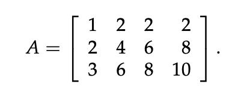

因为其每列的第三个元素都为前两个元素的和，因此 $b_3=b_1+b_2$，否则 $b$ 不属于 $C(A)$。

我们也可以通过对增广矩阵 $[A|b]$ 进行消除来发现 $b$ 的限制条件：

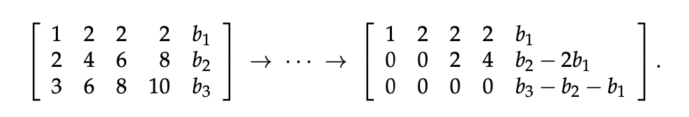

得到 REF 后可以发现，只有当 $b_3-b_2-b_1=0$ 成立时才能有解。因此我们可以取：

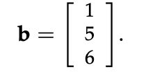

### 6.2 特解

对于 $Ax+b$，我们可以直接将所有的自由变量（Free Variables）为 0，然后回代求枢轴变量（Pivot Variables）的值。

对于上面提到的例子，我们通过 REF 可以知道第二列（$x_2$）与第四列（$x_4$）为自由变量，因此将他们设为 0，然后回代求解 $x_1$ 与 $x_3$：

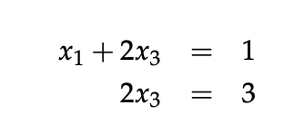

得到一个特解（使用 $x_p$ 表示）为：

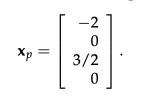

### 6.3 通解

得到一个特解后，我们可以求解其零空间（用 $x_n$ 表示零空间里的向量）。通过将特解与零空间相加，可以得到通解。

$x_\text{complete}=\begin{bmatrix} -2 \\ 0 \\ \frac{3}{2} \\ 0 \end{bmatrix}+c_1\begin{bmatrix} -2 \\ 1 \\ 0 \\ 0 \end{bmatrix}+c_2\begin{bmatrix} 2 \\ 0 \\ -2 \\ 1 \end{bmatrix}$

**我们可以发现：**$N(A)$ 是 $R^4$ 的 2 维子空间（因此构成一个平面），$x_\text{complete}$ 是一个这个零空间平面的平行面，且穿过 $x_p$。

### 6.4 解的数量与秩的关系

对于一个 $m$ 行 $n$ 列且秩为 $r$ 的矩阵 $A$，我们可以得到以下结论。

#### 6.4.1 列满秩（$r=n$）

当列满秩时，零空间维度=$n-r$=0，因此零空间只包含零向量，而且没有自由向量。

此时，要么**无解**要么只有一个**特解**。

**无解：**$b$ 不是 $A$ 的列的线性组合。

**特解：** 通过此特解，将 $A$ 的列线性组合得到 $b$。

#### 6.4.2 行满秩（$r=m$）

行满秩意味着每一行都有一个枢轴变量，因此 RREF 中没有**全 0 行**。同时，这意味着对 $b$ 没有任何限制条件。即不存在无解。

其 RREF 可能如下形式：

$\begin{bmatrix} 1 &  0&  0&  0& a \\ 0&  1&  0&  0& b \\ 0&  0&  1&  0& c \\ 0&  0&  0&  1& d \end{bmatrix}=\begin{bmatrix}I & F\end{bmatrix}$

其中 $a$， $b$， $c$ 和 $d$ 为任意常数。因此任何向量的 $b$ 都可以在 $A$ 的列空间中。

因为自由向量数为 $n-r=n-m$，只要列数大于行数，自由向量便存在，因此可以写出其通解，得到无穷多的解。

#### 6.4.3 行与列同时满秩（$r=m=n$）

这种情况属于前两种情况的交集，矩阵的 RREF 为单位矩阵。虽然不存在无解（理由同**行满秩**），但是只存在**一个特解**。

#### 6.4.4 总结

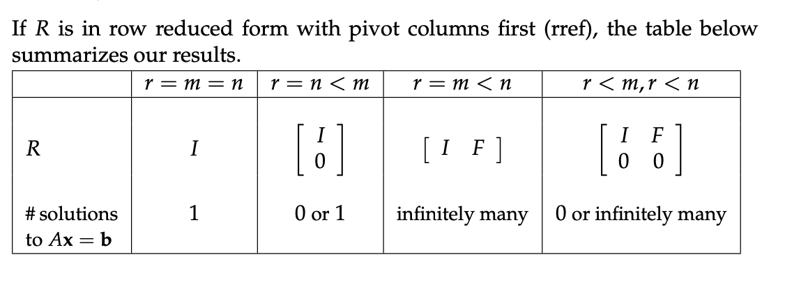

前两种情况，$r=n$，零空间为零向量，因此就算有解，也只有一个特解。

第二与第三种情况，$r<m$，RREF 存在**全 0 行**，因此 $b$ 需要满足特定条件才能有解。

## 7. 四个基本子空间

任意一个 $m$ 行 $n$ 列的矩阵 $A$ 拥有以下四个基本子空间：

- 列空间（Column space），$C(A)$：$C(A)$ 包含 $A$ 的列的所有线性组合，是 $R^m$ 的子空间。
- 零空间（Nullspace），$N(A)$：$N(A)$ 包含方程 $Ax=0$ 的所有解 $x$，是 $R^n$ 的子空间。
- 行空间（Row space），$C(A^T)$：$C(A^T)$ 包含 $A$ 的行的所有线性组合，等同于 $A^T$ 的列空间，是 $R^n$ 的子空间。
- 左零空间（Left nullspace），$N(A^T)$：$A^T$ 的零空间，是 $R^m$ 的子空间。

---
### 7.1 基本空间的基和维度

#### 7.1.1 列空间

**基：**$r$ 个枢轴列是列空间的一个基。

$dim(C(A))=r$

#### 7.1.2 零空间

**基：**$Ax=0$ 的特解向量是零空间的一个基。

$dim(N(A))=n-r$

#### 7.1.3 行空间

将矩阵 $A$ 变换为 RREF 形式后，我们会发现它们的行空间相同。即 $C(A^T)=C(R^T)$ 。如：

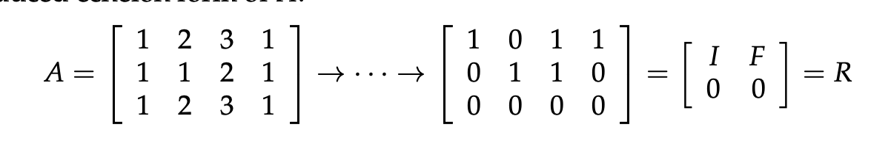

因为 RREF 是 $A$ 的行线性组合之后的结果。同时我们发现，$A^T$ 的秩与 $A$ 相同。

对于列空间，$C(A)\neq C(R)$。

**基：**$r$ 个枢轴行是行空间的一个基。

$dim(C(A^T))=r$

#### 7.1.4 左零空间

对于 $A^T$，

其零解方程可写为 $A^Ty=0$，

其等同于 $y^TA=0$。

此时，$y$ 与 $0$ 均为行向量，因为 $y^T$ 在 $A$ 的左边，因此我们说 “左零空间”。

已知 $A^T$ 的秩与 $A$ 的秩相同，因此：

$dim(N(A^T))=m-r$

为了寻找左零空间的一个基，我们可以通过消除法将 $A$ 变为 RREF 形式，并记录这一过程的消除矩阵 $E$。

即对 $A$ 的增广版本进行消除：

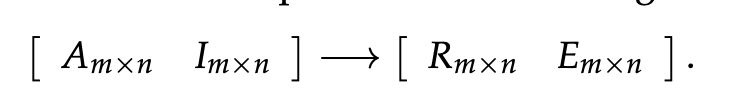

通过计算 $EA$ 可以得到 $R$：

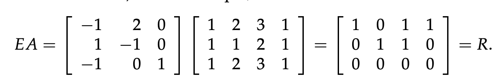

我们发现 $E$ 的最后一行乘以 $A$ 可以得到全零行（$R$ 的最后一行）。因此 $E$ 的最后一行（即 $E$ 的最后 $m-r$ 行）为左零空间的一个基（此处的左零空间的维度为 1，因此基的向量数量为 1）。

**基：**$A$ 变化为 $R$ 后，消除矩阵 $E$ 的最后 $m-r$ 行向量。

$dim(N(A^T))=m-r$

---
## 8. 秩为 1 的矩阵

秩为 1 的矩阵 $A$ 如：

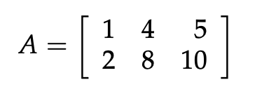

我们发现，可以将其写成列乘行的形式：

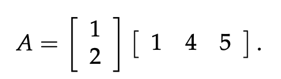

任何秩为 1 的矩阵都可以写成 $A=UV^T$，其中 $U$ 和 $V$ 是列向量（竖向表示）。

---
## 9. 图（Graphs）、网络（Networks）与邻接矩阵（Incidence Matrices）

此部分将探索线性代数与电路网络相关的应用。

### 9.1 图与网络（Graphs and Networks）

图（Graph）是节点（Nodes）与边（Edges）的合集。

这是一个无向图：

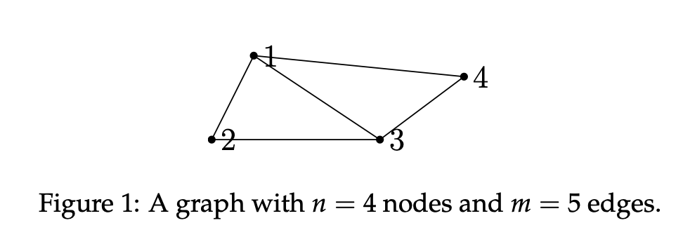

这是一个有向图：

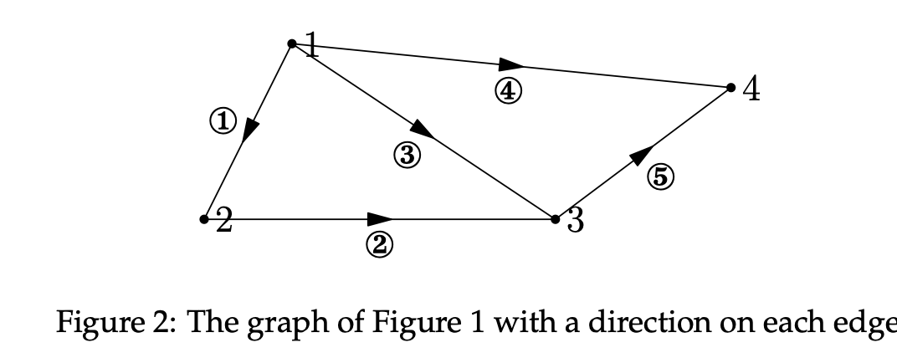

### 9.2 邻接矩阵（Incidence Matrices）

以 Figure 2 为例。

有向图的邻接矩阵的每一列代表图上的一个节点；每一行代表图上的一条边。

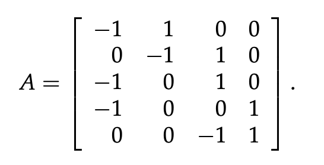

例如，边 ① 从点 1 指向点 2，因此第一行的第一个元素为 -1 代表起点，第二个元素为 1 代表终点。其余无关元素为 0。

#### 9.2.1 环（Loop）

图的 ①②③ 边与 1、2、3 节点构成一个环，我们可以发现在邻接矩阵的前三行中，第三行可由前两行相加得到。这说明图中的**环**对应着邻接矩阵行的**线性依赖**。

### 9.3 邻接矩阵的零空间

如果我们尝试求解 $Ax=0$，我们可以发现当 $x_1$ ~ $x_4$ 都为一个数值时有解。因此我们可以断定 $N(A)$ 的维度为 1。在实际电路场景中，如果每个节点拥有相同的电势，则每个边的电势差为 0。已知节点接地则它的电势为 0，我们可以据此判断其他所有节点的电势。

因为零空间维度为 1，因此我们可以知道 $A$ 的秩为 3。第1，2 与 4 列是枢轴列，这三列对应的节点的边（以这三个节点作为起点的边）连接了所有的节点但不形成一个环；如果一个图没有任何环，可以将它称为树（Tree）。

### 9.4 邻接矩阵的左零空间

已知秩为 3，因此左零空间的维度为 2（$m-r=5-3$）。2 是图中环的数量（最小环），$m$ 是边的数量；秩为 $n-1=3$ 比节点的数量少 1。因此我们可以得到连通图（Connected Graph）的**欧拉公式（Eular's Formula）**：

$\#loops=\#edges-(\#nodes-1)$

即：

$\#nodes-\#edges+\#loops=1$ 

### 9.5 基尔霍夫电路定律（Kirchhoff's Current Law, KCL）

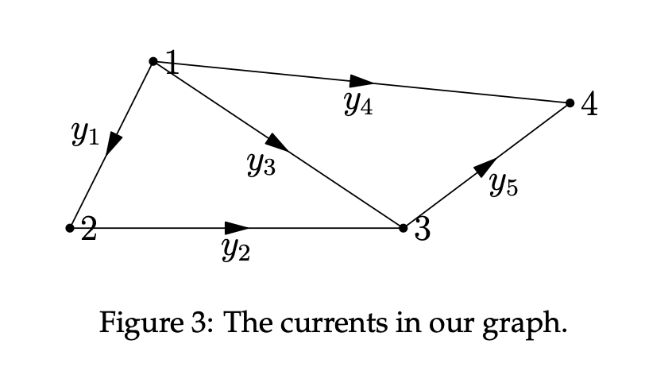

每条边代表邻接矩阵的一行，因此使用 $y_1$ ~ $y_5$ 表示 5 条边。

基尔霍夫定律表明在电路中 $A^Ty=0$。

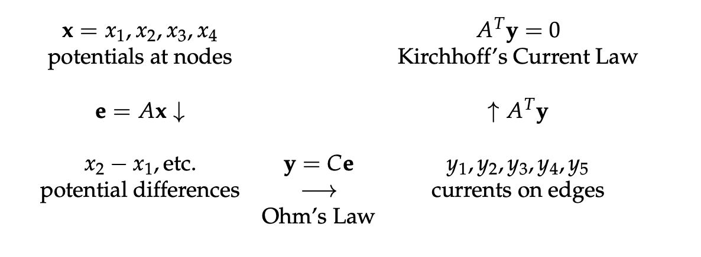

1. $x$ 为各个节点的电势
2. $e$ 表示每个边上的电势差（即电压）
3. 根据欧姆定律（Ohm's Law），$V=IR$；$C$ 为电导矩阵（$C=1/R$），因此 $y=Ce$ 计算各个边上的电流

4. 根据 KCL，流入节点的电流总和等于流出电流的总和，保证电路的电流守恒

我们可以进一步观察 $A^Ty=0$：

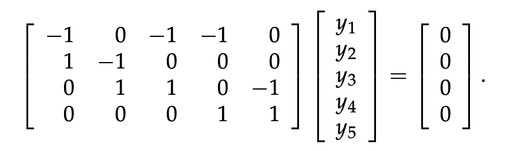

我们将 $A^T$ 的每一行与 $y$ 相乘，都会得到 0。
