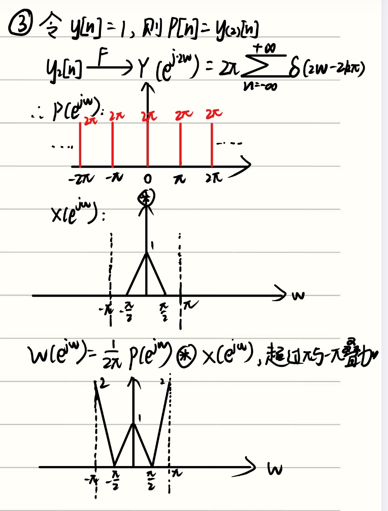
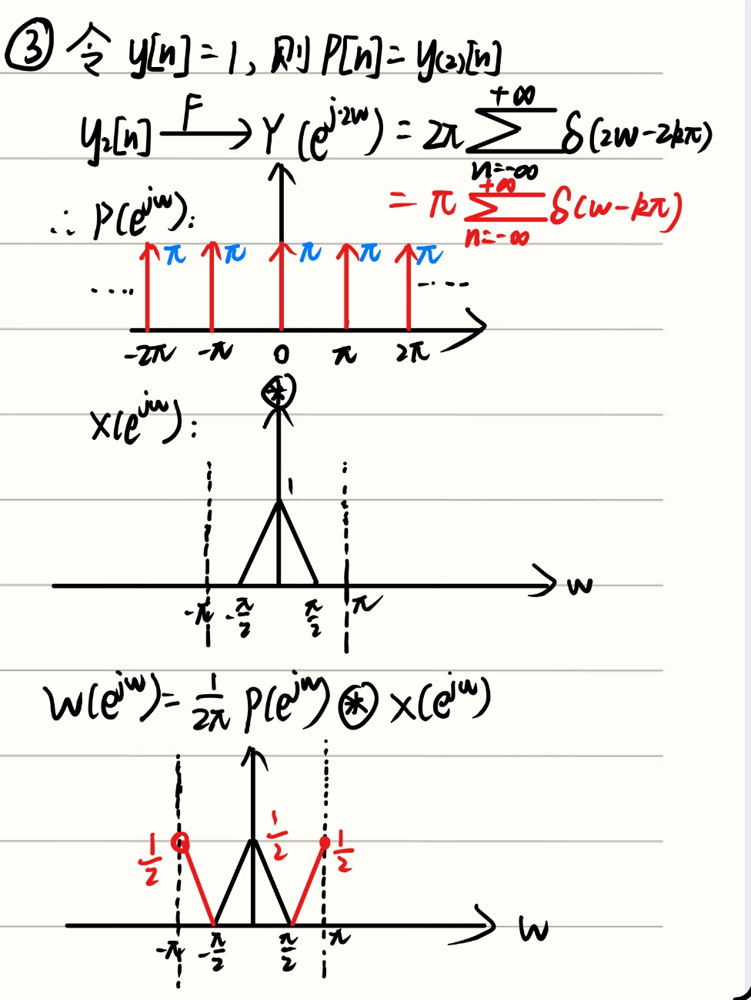
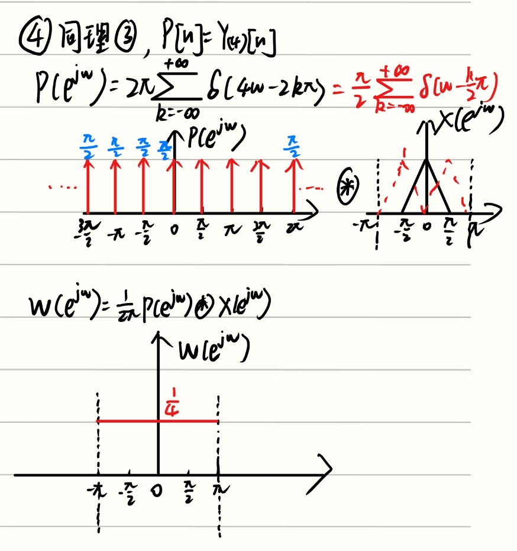

## 收获1：遇到折线图想到==求导/差分==
求下面这个信号的频谱：

---
## 收获二：时域翻转（书本上没有）
我的收获主要是知道了这个公式：

$$
当y]n]=x[-n]时，Y(e^{jw})=X(e^{-jw})
$$

### 我的证明如下：

---
## 收获三：对频域微分的误解，很重要！！！

---

## 4-23中我犯了一个非常值得关注的错误：

### 第一问的第三小问我的错误解法：

### 错误点：

### 错误一：
**$P(\mathrm{e}^{\mathrm{j}\omega})$ 的冲激面积算错了（图中标注了 $2\pi$）**
    我试图通过尺度变换的性质推导 $P(\mathrm{e}^{\mathrm{j}\omega})$，公式 $\delta(2\omega - 2k\pi)$ 根据冲激函数的性质应该化简为化简为 $\frac{1}{2}\delta(\omega - k\pi)$，从而得出冲激串高度为 $\pi$。但是我没有考虑这个性质，直接将冲激串的长度 标成了 $2\pi$，还忘记给它们加向上的箭头了。
    
### 错误二：重点关注！！！
我把这个叠加给搞错了，因为 $P(e^{jw})$ 是以 $2 \pi$ 为周期的，因此 $P(e^{j \pi})\ = P(e^{-j \pi})$，也就是在 $w=\pi和w=-\pi$ 这两个点的 $P(e^{jw})$ 是相等的，所以在计算卷积的时候，不应该把这两个点都计算进来。我们可以取 $w \in [- \pi,\ \pi)$ 或者 $w\ \in (-\pi,\ \pi]$。接着回到这道题，我们只需要在这两个区间中任意挑一个进行积分就行。我挑前一个区间进行积分，那么在$w \in [- \pi,\ \pi)$ 这个区间进行卷积后的结果如下图所示：

其实这道题就是将X(e^{jw})无限平移 $\pi$ 个单位的结果

### 同理第四问应该是这样：
