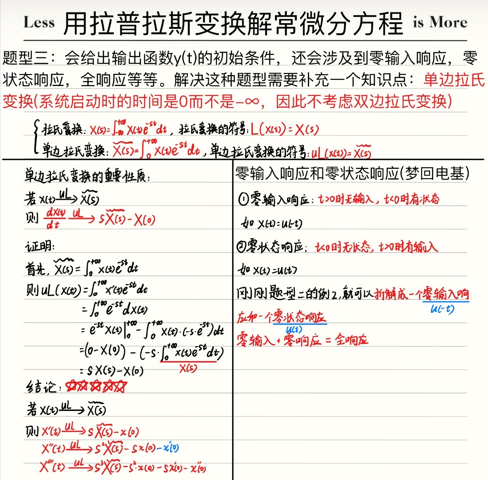
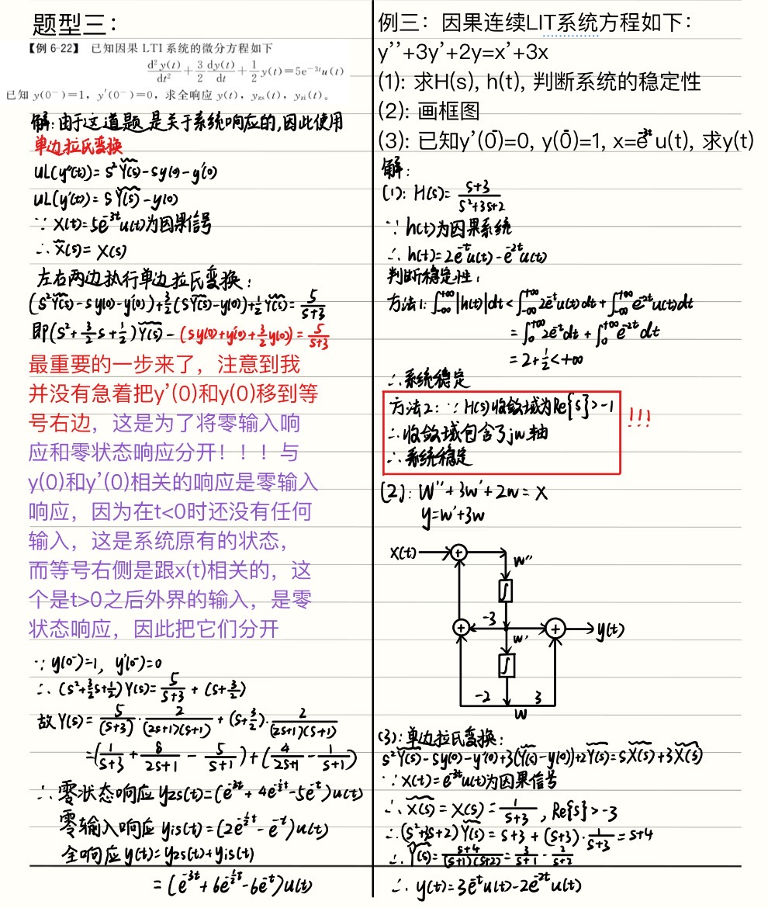

!!! abstract "关于用拉普拉斯变换解常微分方程中的题型三的疑惑"
     第三种题型是关于求解全响应、零输入响应以及零状态响应类型的题目，笔记我也放在这里先
     
     下面是我的几个疑惑。

## 疑惑1: 
为什么求解这些系统响应要用到单边拉氏变换？

### 解答：
因为单边拉氏变换的公式中带有 $y(0),\ y'(0)$ 等。

而题目让你求解一个零输入响应的时候，$y(0),\ y'(0)$ 这些东西一定有一个是非0的，如果这些东西全是0，输入又是0的话那这个系统就是个0啊，所以输入为0的时候这个系统一定有初始状态。因此 $y(0),\ y'(0)$ 这些东西一定有非零的，而双边拉氏变换时域微分时的式子中并不会出现$y(0),\ y'(0)$ 这些东西，因此我们需要用单边拉氏变换来求解。

书本上说求解零状态响应的时候用双边拉氏变换，求解全响应和零输入响应的时候用单边拉氏变换，但其实零状态响应也可以用双边拉氏变换，只不过$y(0),\ y'(0)$ 这些全都为0罢了。

---
## 疑惑二：
例三中的那个第三问，我明明用的是单边拉氏变换，求解出来的是 $\widetilde{Y(s)}$ 而不是 $Y(s)$，为什么最后一步能直接通过

$$\widetilde{Y(s)}= \frac{3}{s+1} - \frac{2}{s+2}$$

得出

$$y(t)=3e^{-t}u(t)-2e^{-2t}u(t)$$

呢？

### 解答：

虽然这道题没有明说这是什么全响应、零状态响应、零输入响应不啦不啦的，但是这类针对系统的响应的题目，尤其是题干中已经给出了$y(0^-)\ 和\ y'(0^-)$ 的值的题目。我们只考虑 $t\ge0$ 时 $y(t)$ 的值，而单边拉氏变换得出的 $\widetilde{Y(s)}$ 恰好是只考虑 $t \ge 0$ 时的 $y(t)$ 而解出的s域的函数，因此我们可以直接将 $\widetilde{Y(s)}$ 进行反变换得到 $y(t)$。

---
### 疑惑三：
例6-22中，题目明明给出了 $y(0^-)=1$ ，说明 $y(t)$ 在 $t<0$ 时也有值，因此 $y(t)$ 中一定含有 $u(-t)$ 的项，但是为什么第三问的答案中全是u(t)而没有 $u(-t)$ 呢？

### 解答：
首先，不可否认的是，通过 $y(0^-)=1$ 可以得出这个系统一定是个有状态的输入，也就是说 $t<0$ 时 $y(t)$ 一定也有值，但是求解系统的响应，我们肯定是只考虑 $t \ge 0$ 时的情况，因为 $t<0$ 时这个系统还没打开，与我们无关，不用管，我们只管系统打开之后的输出。就像我们在打开手机前这个手机已经充了50格电，这50格电就说明这个系统并不是零状态的，但是我们只考虑手机打开之后的情况。

再回到这道题，响应就是考虑 $t \ge 0$ 的时候系统的输出，因此这里不会出现 $u(-t)$
