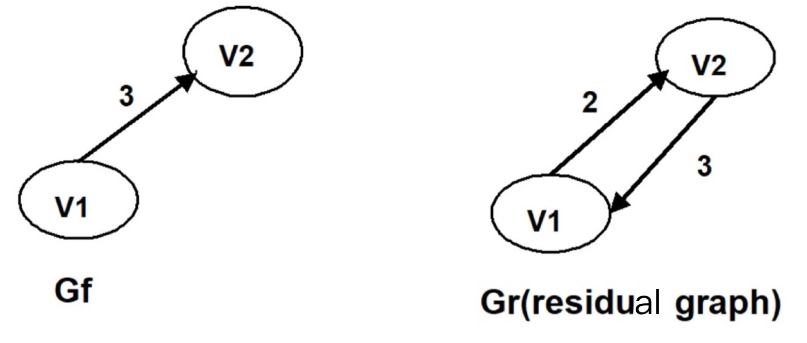

## 2-1
To find the minimum spanning tree with Kruskal's algorithm for the following graph. Which edge will be added in the final step?

- A. (v1,v4)
- B. (v1,v2)
- C. (v4,v6)
- D. uncertain

??? success "解答"
    掌握Kruskal‘s algorithm的思想。将边按权重排好然后一个个加入观察是否会成环，不会成环就加入，会成环就舍弃。
    
	1. 加入v2-v3
	2. 加入v3-v5
	3. 加入v3-v4
	4. 加入v2-v5会成环，舍弃
	5. 加入v5-v6
	6. 加入v3-v6会成环，舍弃
	7. 加入v4-v6会成环，舍弃
	8. 加入v2-v1，至此所有节点成功连通
    
    因此答案选B

## 2-2
The minimum spanning tree of any weighted graph ____

- A. must be unique
- B. must not be unique
- C. exists but may not be unique
- D. may not exist

??? success "解答"
    这个图如果是不连通的就没有最小生成树了，因此答案选D。
    
    如果题目说这棵树是连通的，那么会存在最小生成树但是不唯一。
## 2-3
Given an undirected weighted graph as shown below, its minimum spanning tree is to grow by Prim's algorithm with greedy strategies. Which of the following statement is **correct**?

- A. Start from vertex V6 as the first vertex, the third vertex must be v7.
- B. Start from vertex V4 as the first vertex, the third vertex must be v1.
- C. Start from vertex V5 as the first vertex, the third vertex must be v4.
- D. Start from vertex V2 as the first vertex, the third vertex must be v3.

??? success "解答"
    - 以V6为起点的话，第二个加入的是V5（min{2, 3, 5}=2），第三个是V7(min{1, 3, 4, 5}=1)。因此A正确
    
    剩下三个选项也这么分析，很无脑。

## 2-4

The maximum flow in the network of the given Figure is:

- A. 104

- B. 123

- C. 120

- D. 97

??? success "解答"
    就是用Ford-Fulkerson算法无脑乱弄，有耐心点会弄出来的，答案是104。
## 2-5
When solving the maximum flow problem for graph G, if partial states of the Gf​ ( will be the maximum flow when the algorithm terminates) and Gr​ (residual graph) are shown as the following, what must be the capacity of (v1, v2) or of (v2,v1) in the original graph G?

- A. the capacity of (v1, v2) is 2

- B. the capacity of (v1, v2) is 3

- C. the capacity of (v1, v2) is 5

- D. the capacity of (v2, v1) is 5

??? success "解答"
    Gf中为3说明V1最终流了3个单位的水过去。
    
    Gr中一条2一条3，由于Gf中已经有3了，说明Gr中那个3一定是反向边，剩下的那条2是余量，因此容量为2+3=5，从V1指向V2