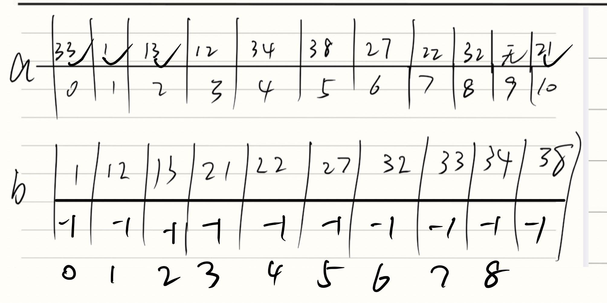

Given a hash table of size N, we can define a hash function H(x)=x%N. Suppose that the linear probing is used to solve collisions, we can easily obtain the status of the hash table with a given sequence of input numbers.

However, now you are asked to solve the reversed problem: reconstruct the input sequence from the given status of the hash table. Whenever there are multiple choices, the smallest number is always taken.

### Input Specification:

Each input file contains one test case. For each test case, the first line contains a positive integer N (≤1000), which is the size of the hash table. The next line contains N integers, separated by a space. A negative integer represents an empty cell in the hash table. It is guaranteed that all the non-negative integers are distinct in the table.

### Output Specification:

For each test case, print a line that contains the input sequence, with the numbers separated by a space. Notice that there must be no extra space at the end of each line.

### Sample Input:

11

33 1 13 12 34 38 27 22 32 -1 21

### Sample Output:

1 13 12 21 33 34 38 27 22 32

这道题的意思是给我们一个已经排好序的哈希表，然后让我们反推插入的顺序。并且规定：如果当前有多个数字都可以作为下一个插入的数字，那么选择最小的那个。


## 我最开始的想法：
先建立一个`int a[N]`用于存储输入进来的那N个数，也就是已经排好的那个哈希表。然后再建立一个`int b[2][N]`，数组b的第一行是将数组a中大于0的数按照大小排好序，第二行全部初始化为-1，-1的意思是尚未被处理，已经被处理的话就按照被处理的顺序标记，即从0标记到`number-1`（number即数组a中大于等于0的数，也就是真正插入这个哈希表中的数的数量）

创建好这两个表格之后，再创建一个`c[N]`也全部初始化为-1，这个表是用来跟`a[N]`做对比的，如果 `c[N]`位置上的数等于`a[N]`位置上的数，那么说明这个位置已经被处理过了，如果不等于的话，说明这个位置上的数还没被处理。

定义完这三个数组之后，我开始建立循环，先建了一个大循环`while (total_count<number)`，然后在这个大循环中再加一个循环`(for int i=0; i<number; i++)`，在这个for循环里面遍历所有`b[i]`，如果`b[1][i]`$\ge 0$ 的话说明已经处理过了，直接continue，如果没处理过的话，就判断这个`b[i]`中存储的元素是否应该在数组a的正确位置上上，如果在的话就正常放，如果不在的话就用线性查找去找它的位置。

**这个想法是正确的，但是我少考虑了一个东西**，就是**每一次的for循环，如果成功加入了一个元素之后，就应该直接break，重新从for(int i=0; i<number, i++)开始从头计算**。为什么要这么做？我们用题目中给的例来看一下。数组b中已经排好序了，首先把1拿出来，1计算来的index就是1，那就正常放啊到位置1里面，把1标记为已处理（`b[0][2]=0`）。再看12，12正常算出来也应该放在位置1上，但是位置1上已经有1了，所以我们应该往2看，此时`c[2]=-1`，而且`c[2]`也不是12的最终位置，所以要先把12放在一边，去看13，13算出来的位置就是2，那就正常把13放在index=2上，把13标记为已处理(`b[1][2]=1`)。==问题来了，按照我原先的思路，处理完13之后，我会顺着13继续往下看21，22，27这些数字。但是，正确的做法应该是处理完13之后再回过头来看比13小的数再13被处理完之后是不是能够被处理了==，因此每一次for循环中，一旦有一个数被处理掉了，那就要重新执行这个循环。

---

### 我改进后的做法

改进完上面那个错误之后，我还剩下一个错误，这个错误必须引起重视。

我原先的代码中，当`if(a[index]==b[0][i])`不成立，进入else分支之后，会计算step，也就是要检查从计算出的 `index`（理想位置）到实际存放位置之间的坑位是否都已经被前面的数字填满。

**但是**我把 $l$ 初始化为了 `1`。这意味着我检查了 `index + 1`，`index + 2` 等等，**但是你完全漏掉了检查最开始的 `index` 本身！**

**为什么在 `else` 里必须检查 `l = 0`（也就是 `index` 这个位置）？**

当数字 $x$ 被挤到了后面（也就是进入了 `else`），根据线性探测的规则，这就意味着：**在把 $x$ 放入哈希表的那一刻，从 `index` 开始，一直到 $x$ 最终落脚的位置之间的所有坑位，都已经被别人占满了！**

因此，想要把 $x$ 取出来输出，它的**先决条件**是：挡在它前面的那些数字，**必须全部都已经先被输出了**。

我最开始觉得，既然循环是按照从小到大的顺序来的，既然之前更小的数都没被放到index这个位置上，那么后面的数更不可能放到这个位置上了。但是这个想法是极其错误的，像这个input的哈希表，27和38的index都应该是5，按照我的想法，那肯定是27要先比38放进来，但是这个input偏偏先把38放进来了。当我们for循环执行到27的时候，还没执行到38，所以index=5这个地方还是空的，但是执行27的时候并没有检查这个地方，而是直接从index从6开始检查，恰好后面都没有问题，就把27先放进来了，这样就出错了，所以一定要检查index本身，而不能从index+1开始检查。

下面是最终正确的代码，将`l=0`改成`l=1`一下子就从5分变成了满分。

```c
#include<stdio.h>
int main(){
    int N;
    scanf("%d", &N);
    int a[N];
    int number=0;
    int b[2][N];
    int c[N];
    for (int i=0; i<N; i++){
        a[i]=-1;
        c[i]=-1;
        b[1][i]=-1;
    }
    for (int i=0; i<N; i++){
        int m;
        scanf("%d",&m);
        a[i]=m;
        if(m>=0){
            b[0][number++]=m;
        }
        else{
            c[i]=a[i];
        }
    }
    for (int i=1; i<number; i++){
        int tmp=b[0][i];
        int j;
        for(j=i-1; j>=0 && b[0][j]>tmp; j--){
            b[0][j+1]=b[0][j];
        }b[0][j+1]=tmp;
    }

    int total_count=0;
    while (total_count<number){
        for (int i=0; i<number; i++){
            if(b[1][i]>=0){
                continue;
            }
            int index = b[0][i]%N;
            if(a[index]==b[0][i]){
                b[1][i]=total_count++;
                c[index]=a[index];
                break;
            }else{
                int step=1;
                while(a[(index+step)%N]!=b[0][i]){
                    step++;
                }
                int flag=0;
                int l=0;
                while(l<step){
                    if(c[(l+index)%N]!=a[(l+index)%N]){
                        flag=1;
                        break;
                    }
                    l++;
                }
                if(flag==0){
                    c[(index+step)%N]=a[(index+step)%N];
                    b[1][i]=total_count++;
                    break;
                }else{
                    continue;
                }
            }
        }
    }
    for(int i=0; i<number; i++){
        for(int j=0; j<number; j++){
            if(b[1][j]==i){
                if(i==0){
                    printf("%d", b[0][j]);
                }
                else{
                    printf(" %d", b[0][j]);
                }
            }
        }
    }
    return 0;
}
```
