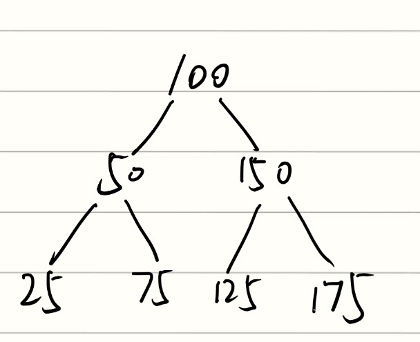

In-order successor（[中序后继节点](https://www.google.com/search?q=%E4%B8%AD%E5%BA%8F%E5%90%8E%E7%BB%A7%E8%8A%82%E7%82%B9&sca_esv=a7c356437a2f7860&sxsrf=ANbL-n4Ei6l9R4om0-t5M9zcDDC5fLA2wA%3A1774866207903&ei=H0_KaZ_pNvfGkPIP1ZHAOQ&biw=757&bih=790&ved=2ahUKEwjo68H1s8eTAxW6JEQIHae9NjkQgK4QegQIARAB&uact=5&oq=in-order+successor%E6%98%AF%E4%BB%80%E4%B9%88%E6%84%8F%E6%80%9D&gs_lp=Egxnd3Mtd2l6LXNlcnAiIWluLW9yZGVyIHN1Y2Nlc3NvcuaYr-S7gOS5iOaEj-aAnTIFEAAY7wUyCBAAGIAEGKIEMgUQABjvBTIFEAAY7wUyBRAAGO8FSPMTUKwMWMMQcAF4AJABAJgBpQKgAYUEqgEDMi0yuAEDyAEA-AEBmAIDoAKPBMICCBAAGO8FGLADwgILEAAYiQUYogQYsAOYAwCIBgGQBgWSBwUxLjAuMqAHuQOyBwMyLTK4B40EwgcDMC4zyAcGgAgB&sclient=gws-wiz-serp&mstk=AUtExfA7Geu56EVXxMrYTwDdjeDXstPZSXQLIgStnYEBs-XvAx4Kd31gelNpw7I9D8pPlLqbaL14mgkghhE993a-U7gJ7Hv0ySuC62bACte7LQLiQgwDUmkKxvKuuu29gALKnZJ8atgNleoZ8jy8jfa2Spssvixm5czJ9YHRNtp_XNtUWBy8benYI6KAl99VDN5A_9V0T8uZJWM2-rsESgi4p8o0kez4ZbToU3FkN_qKfktQXXuepOcb88oQMA2mX2UXyEH0cu0Xnyvh1_cjFMv-V_cX&csui=3)）指==在二叉树（特别是二叉搜索树BST）进行中序遍历（左-根-右）时，位于指定节点“之后”紧邻遍历到的那个节点==。简单来说，它是所有大于当前节点值的节点中，值最小的一个。这道题中100的下一个数是125，也就是说100被删除之后125成了新的节点。由于110<125，因此110插在左子树中，75的右下方。

