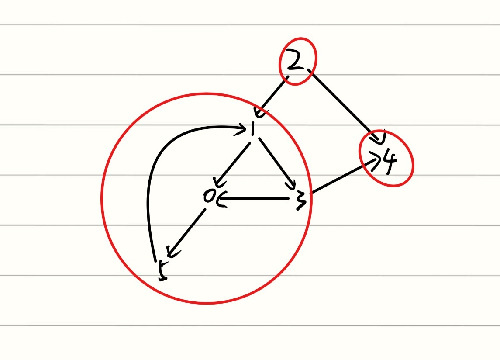

现在问的是最少有可能是多少个节点，那就从Complete Graph出发，若有 $n$ 个节点，则一个Complete Graph就有 $\frac{n(n-1)}{2}$ 条边。

我们考虑一个完全图+一个孤立的节点

- n=9时，考虑 $K_8+$一个孤立的节点：$K_8$只有28条边，不符合
- n=10时，考虑 $K_9+$一个孤立的节点，$K_9$有36条边，因此删掉一条边就能变成35条，还有一个孤立的节点使得这幅图不连通，因此n=10成立。

---

### 考察概念：connected component

问的是最多可能有多少个components，那么就考虑一堆孤立的顶点加上一个complete Graph组成的Graph。

$K_6$ 只有15条边，小于20条，因此不行

$K_7$ 有21条边，删掉一条边就是20条边，删掉了这一条边之后，这7个顶点组成的subgraph仍然是connected。剩下还有83个孤立的顶点，也都是connected components，因此最多有83+1=84个顶点。

---

### 考察概念：Strongly connected component
0, 1, 3, 5这四个点是连通的，但是与2和4不连通，因此它们4个是一个connected component。2与任何节点都不连通，它只出不进，因此自身就是一个connected component，4同理。

---

假设有x个度数为1的节点，y个度数为2的节点，由于所有节点的度数相加为边数的二倍，所以：

$$
x+2y+3*4+4*3=2*16
$$

即$x+2y=8$

当y=4，x=0时，为最小情况。

---

### 考察概念：拓扑结构
#### 什么是 Topological Order (拓扑排序)？

**Topological order是针对“有向图的一种排序方式。

你可以把它想象成 **大学选课** ：

- 图中的每个 **节点** 代表一个任务。
    
- 图中的每个 **箭头** 代表“先决条件”。
    
- 如果有一个箭头从节点 **A** 指向节点 **B**，那就意味着 **必须先完成 A，才能做 B**。
    

所以，一个有效的拓扑排序，就是一个把所有节点排成一排的序列，在这个序列中，所有的箭头方向必须是从前指向后的。简单来说，在给出的排列选项里，任何一个被箭头指着的数字，都不能排在发射箭头的数字前面。