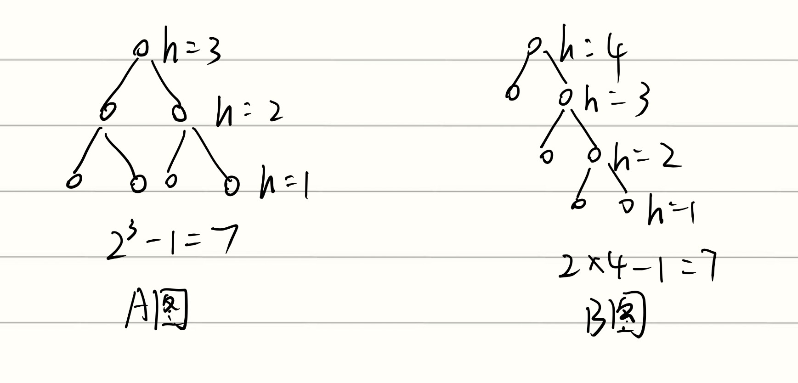
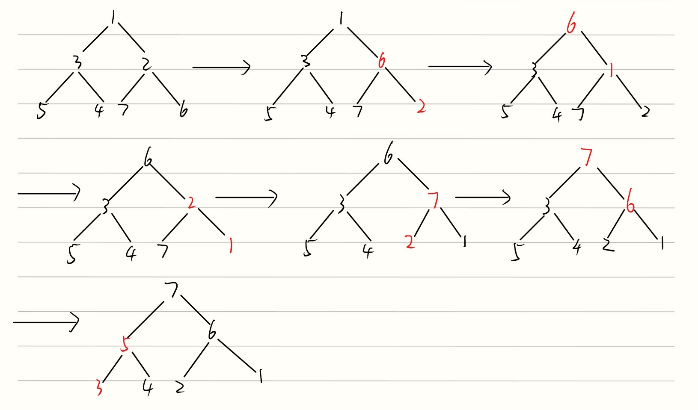
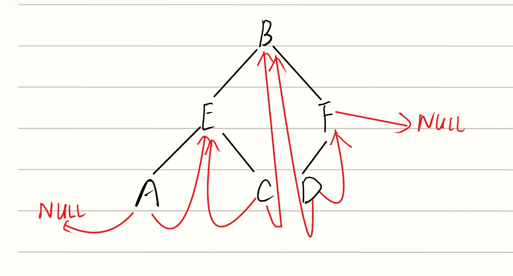
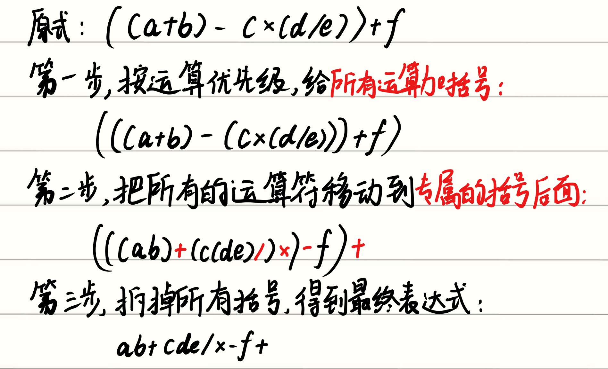

这里记录的是期中复习的时候遇到的自认为质量比较高的题以及我的错题。
## 判断题1
If the most commonly used operations are to visit a random position and to insert and delete the last element in a linear list, then sequential storage works the fastest.

### 模糊概念：线性表、数组以及链表的区别
线性表是一个抽象的数学和逻辑概念，它只是规定了一件事：数据是一条线串联起来的，有先后顺序，而数组和链表是两种数据结构，它们都能够用来表示线性表

- 由于数组的内存是连续的，所以 ==顺序存储的线性表(sequentially stored linear list)== ， **通常简称线顺序表** ，表示的是数组
- 链表的内存并不是连续的，所以==链式存储的线性表(linked linear list)==， **通常简称链表**，允许内存是分散分配的，通过指针进行连接。

那么回到这道题，这道题说的是sequential storage 方式的linear list，也就是数组。下面来看数组的性能：

### 1. 访问随机位置

- **性能：** $O(1)$
- **原理：** 顺序存储在内存中是连续分布的。访问任意位置 $i$ 的元素时，CPU 只需根据首地址和下标进行简单的算术运算即可直接定位。
- **对比：** 链式存储（Linked List）访问随机位置需要从头节点开始遍历，时间复杂度为 $O(n)$。
    
### 2. 在末尾插入和删除

- **性能：** 均摊 $O(1)$
    
- **原理：** * **插入：** 只要数组还有空闲空间，直接在 `size` 索引处赋值并令 `size++` 即可。
    - **删除：** 直接令 `size--` 即可（逻辑删除），不需要移动其他元素。
        
- **对比：** 虽然带尾指针的链表也能实现 $O(1)$ 的末尾插入，但对于**删除**末尾元素，单向链表必须遍历到倒数第二个节点来更新 `next` 指针，效率依然不如数组。

因此这道题是正确的。

---
## 判断题2
The best "worst-case time complexity" for any algorithm that sorts by comparisons only must be $O(NlogN)$

这道题是正确的

在计算机科学中，这是一个非常基础且经典的定理: **基于比较的排序算法，其时间复杂度的理论下界是 $\Omega(N \log N)$。** 也就是说，任何仅仅依靠比较元素大小来进行排序的算法，它能做到的“最好”的最坏情况时间复杂度，绝对不可能低于 $O(N \log N)$。

### 1. 为什么会有这个极限？（决策树模型）

可以用决策树来证明这个数学极限：

- **目标状态：** 假设你要对 $N$ 个不同的元素进行排序，它们总共有 $N!$（$N$ 的阶乘）种可能的排列方式。排序的过程，本质上就是通过提问（比较）来排除错误答案，最终从这 $N!$ 种可能性中锁定唯一正确的那一个。
    
- **二分决策：** 每次比较两个元素（比如 `A > B 吗？`），结果要么是 Yes，要么是 No，这相当于在一个二叉树中选择左分支或右分支。
    
- **数学推导：** 树的高度 $h$ 代表了最坏情况下的比较次数。一棵高度为 $h$ 的二叉树最多有 $2^h$ 个叶子节点。为了能分辨出 $N!$ 种不同的排列，叶子节点的数量必须能够覆盖所有的可能性，即：
    
    $2^h \ge N!$
    
    两边取对数得到：$h \ge \log_2(N!)$
    
    根据斯特林公式（Stirling's approximation），$\log_2(N!)$ 的渐近复杂度恰好是 **$O(N \log N)$**。
    

### 2. 算法实例对比

- **触及极限的算法：** 归并排序（Merge Sort）和堆排序（Heap Sort）的最坏情况时间复杂度都是 $O(N \log N)$。它们是基于比较的排序中，在最坏情况下的“天花板”。
    
- **未触及极限的算法：** 快速排序（Quick Sort）虽然平均情况下极快，但它的最坏情况时间复杂度会退化到 $O(N^2)$（例如当数组已经基本有序时）。

---

## 判断题3
For a sequentially stored linear list of length $N$ , the time complexities for query and insertion are $O(1)$ and $O(N)$ respectively.

这道题是正确的。
### 1. 查询（Query）：$O(1)$

- **原理：** 对于顺序存储（数组），查询通常是指“通过索引访问元素”。因为数据在内存中是连续存放的，系统只需要知道数组的首地址和元素的下标，就能一步计算出目标数据的物理位置。
    
- **结论：** 这个过程的耗时与数组的长度 $N$ 完全无关，所以时间复杂度是极快的 $O(1)$。
    

### 2. 插入（Insertion）：$O(N)$

- **原理：** 在顺序表中进行一般性插入时（比如插在数组的开头或中间），因为内存是紧挨着的，你必须把插入位置之后的所有元素统统往后移动一格，来给新元素腾出空间。
    
- **复杂度分析：**
    
    - **最坏情况：** 插入在表头，需要移动所有的 $N$ 个元素，时间复杂度 $O(N)$。
        
    - **平均情况：** 插入在中间，大约需要移动 $N/2$ 个元素，去掉常数项后依然是 $O(N)$。
        
- **结论：** 在没有特别声明“插在末尾”的情况下，评价一个数据结构的插入复杂度都是看平均或最坏情况，所以是 $O(N)$。

---
## 判断题4
For a sequentitally stored linear list of length $N$, the time complexities for deleting the first element and inserting the last element are $O(1)$ and $O(N)$, respectively.

### 这题是错的，顺序反了
我一开始觉得这两个操作的的时间复杂度都是$O(N)$，因为我以为数组的size是未知的。但是我们在构建sequentially stored linear list这个结构体的时候，一定会在结构体里面定义一个size的变量，来表示这个线性表存放了多少个元素，因此size是已知的。所以说删除第一个元素和插入最后一个元素的操作时间分别是 $O(N)$ 和 $O(1)$。

---

## 判断题5
In a tree of degree 3, we have $n_2+n_3 \ge n_0$, where $n_i$ is the number of degree $i$ nodes for $0 \le i \le 3$
这道题是错误的

死死抓住节点数量=树枝数量+1这个点。

$$
n_0+n_1+n_2+n_3=3*n_3+2*n_2+n_1+1
$$
则 $n_0=2*n_3+n_2+1$，将这个式子带入 $n_2+n_3 \ge n_0$ 会得出 $n_3 \le -1$，显然不成立，因此这题是错的。

---
## 判断题6
If numbers are stored in a singly linked list in increasing order, then the average time complexity for binary search is $O(log(N))$

这道题是错误的

如果说这些数是存在数组里面，那二分查找法是能够实验 $O(logN)$ 的，但是这里用的是链表，我们只能从头遍历，因此平均的时间复杂度是 $O(N/2)$ 也就是 $O(N)$

---

## 判断题7
$log(N!)=\Omega(NlogN)$

这题是正确的，$\Omega$ 表示的是==下界==，由于：

$$
log(N!)=log1+log2+log3+...+log(N) \ge \frac{N}{2}*log(\frac{N}{2})
$$
把分母那个2去掉，因此这道题是对的

---

## 判断题8
Every node in the tree is the root of some subtree.

这道题是正确的

注意：node也包括了leaf，leaf的subtree就是它自己，一个节点也是一个tree，别忘了CS70的graph章节学过的tree！！！

---

## 判断题9
To find 63 from a binary search tree, one possible searching sequence is $(39, 101, 25, 80, 70, 59, 63)$

这道题是错误的

从39出发，由于101比39大，所以101只能是39的右孩子，101往下走走到25，由于25比101小所以25只能是101的左孩子，这就导致了25在39的右子树中，必然是错误的。

---
## 判断题10
Given two sorted lists. $L_1$ and $L_2$，the fastest algorithm for computing $L1\cup L2$ has time complexity $\Theta(N)$

这道题是正确的，之前作业里碰到过

- **操作过程：** 设置两个指针 `i` 和 `j`，分别指向 $L_1$ 和 $L_2$ 的开头。
    
- **比较逻辑：**
    
    - 如果 $L_1[i] < L_2[j]$：把 $L_1[i]$ 放入结果列表，然后 `i` 往前走一步。
        
    - 如果 $L_1[i] > L_2[j]$：把 $L_2[j]$ 放入结果列表，然后 `j` 往前走一步。
        
    - 如果 $L_1[i] == L_2[j]$（处理并集的去重）：把这个值放入结果列表一次，然后 `i` 和 `j`  **同时** 往前走一步。

---
## 单选题1
Suppose that the height of a binary tree is h (the height of a leaf node is defined to be 1), and it has only the nodes of degrees 0 and 2. Then the minimum and maximum possible total numbers of nodes are: 

- $A. \ 2h, \ 2^h-1$
- $B. \ 2h-1, \ 2^{h-1}-1$
- $C.\ 2h-1, \ 2^{h-1}-1$
- $D. \ 2^{h-1}, \ 2^h-1$

注意，这道题定义的高度跟传统的树的高度的定义不同。
节点最多的情况就是这棵树是一个完全二叉树，节点最少的情况入下图的B图所示。下图的A图模拟了h=3时节点最多的情况，B图模拟了h=4时节点最少的情况：


---

## 单选题2
Suppose that the level-order traversal sequence of a min-heap is {1, 3, 2, 5, 4, 7, 6}. Use the linear algorithm to adjust this min-heap into a max-heap. The inorder traversal sequence of the resulting tree is:

A. 3, 5, 4, 2, 6, 1, 7

B. 1, 4, 3, 7, 2, 6, 5

C. 3, 5, 4, 7, 2, 6, 1

D. 4, 1, 3, 7, 6, 2, 5

### 概念考察：Linear algorithm
在堆（Heap）的语境下，Linear Algorithm就是专门用来把一个乱序的数据集合，原地批量改造成一个合法堆的算法。

它具体干了以下两件事：

1. **倒序遍历：** 从整棵树的 **最后一个非叶子节点** 开始，一路倒着往上找，一直找到根节点。
    
2. **逐个下沉（Sift-down）：** 对遍历到的每一个节点，强行执行“下沉”操作。如果不满足堆的规则（比如大顶堆里父节点比子节点小），就把它和子节点交换，让它“沉”下去，把符合规则的节点“捞”上来。

下面是我的演示过程：


---
## 单选题3
If an undirected graph G = (V, E) contains 10 vertices. Then to guarantee that G is connected in any cases, there has to be at least __ edges.

A. 45

B. 37

C. 36

D. 9

题目的意思是，无论如何连接，这个图都是connected的，那么就是将 $K_{10}$ 中的一个点的度数减为1，也就是减去这个点的8条边只剩下一条，此时是最少的情况，因为再减去一条边的话，这个点就成孤立的点了，那么图就不再连通了。所以答案选B

---

## 单选题4

Which of the following statements is TRUE about topological sorting?

A. If a graph has a topological sequence, then its adjacency matrix must be triangular.

B. If the adjacency matrix is triangular, then the corresponding directed graph must have a unique topological sequence.

C. In a DAG, if for any pair of distinct vertices and , there is a path either from to or from to , then the DAG must have a unique topological sequence. 

D. If precedes in a topological sequence, then there must be a path from to .


正确答案是 **C**。

下面我们来逐一分析每个选项，看看它们为什么对或者为什么错：

### 正确选项分析

- **C. In a DAG, if for any pair of distinct vertices $V_i$ and $V_j$, there is a path either from $V_i$ to $V_j$ or from $V_j$ to $V_i$, then the DAG must have a unique topological sequence.**
    
    - **结论：正确。**
        
    - **分析：** 题目中的这个条件“对于任意一对不同的顶点，要么存在从 $V_i$ 到 $V_j$ 的路径，要么存在从 $V_j$ 到 $V_i$ 的路径”描述的是一个 **全序关系** （或者说所有的顶点都被一条主干路径串起来了）。
        
    - 在 DAG 中，这意味着整个图实际上是一条单一的有向线段（比如 $A \rightarrow B \rightarrow C \rightarrow D$），中间可能穿插着一些捷径边（比如 $A \rightarrow C$）。既然所有顶点都有严格的先后到达关系，那么在进行拓扑排序时，每次入度为 0 的节点只会有一个。因此，它的拓扑序列是 **唯一** 的。
        

### 错误选项分析
**首先需要明确的一点是，邻接矩阵是一个二维矩阵，这里说到的三角形是线性代数中学过的矩阵中的三角形，分成上三角和下三角。上三角即这个矩阵的主对角线和主对角线以下的元素都为0。下三角即这个矩阵的主对角线和主对角线以上的元素都为0**

- **A. If a graph has a topological sequence, then its adjacency matrix must be triangular.**
    
    - **结论：错误。**
        
    - **分析：** 一个图有拓扑序列，只能说明它是一个 DAG（有向无环图）。DAG 的邻接矩阵 **不一定** 是三角矩阵。**只有当** 我们按照拓扑排序的顺序来对顶点进行编号，并以此顺序写出邻接矩阵时，它才会是上三角矩阵。如果顶点的编号顺序是随机的，邻接矩阵通常不是三角矩阵。
        
- **B. If the adjacency matrix is triangular, then the corresponding directed graph must have a unique topological sequence.**
    
    - **结论：错误。**
        
    - **分析：** 邻接矩阵是三角矩阵，能说明这个图是一个 DAG。但是它**不能保证**拓扑序列唯一。
        
    - **反例：** 假设有三个节点 1, 2, 3。存在两条边：$1 \rightarrow 2$ 和 $1 \rightarrow 3$。它的邻接矩阵是上三角矩阵。但是它的拓扑序列可以有两个：`1, 2, 3` 或者 `1, 3, 2`。所以拓扑序列不一定唯一。
        
- **D. If $V_i$ precedes $V_j$ in a topological sequence, then there must be a path from $V_i$ to $V_j$.**
    
    - **结论：错误。**
        
    - **分析：** 拓扑序列中 $V_i$ 排在 $V_j$ 前面，仅仅意味着**如果没有**从 $V_j$ 到 $V_i$ 的路径（因为不能违反方向）。它并**不要求**一定有从 $V_i$ 到 $V_j$ 的路径。
        
    - **反例：** 假设图中有两个毫无关联的孤立节点 A 和 B（没有边相连）。那么 `A, B` 和 `B, A` 都是合法的拓扑序列。在 `A, B` 这个序列中，A 排在 B 前面，但它们之间根本没有路径。

---

## 单选题5

In-order traversal of a binary tree can be done iteratively. Given the stack operation sequence as the following: $push(1), \ push(2), \ push(3),\  pop(),\  push(4),\  pop(),\  pop(),\  push(5),\  pop(), \ pop(),\  push(6),\  pop()$ Which one of the following statements is TRUE?

A. 6 is the root

B. 2 is the parent of 4

C. 2 and 6 are siblings

D. None of the above

这道题的意思是，我们可以使用非递归的方法来还原二叉树的in-order遍历方式。

### 1. 核心推导规则

在迭代中序遍历（左 -> 根 -> 右）中，栈操作遵循以下规律：

- **连续的 `push`**：表示沿着树的 **左分支** 一直往下走。例如先 `push(A)` 再 `push(B)`，说明 B 是 A 的左孩子。
- **`pop` 操作**：表示左边走到底了（遇到空节点），从栈中弹出一个节点并**访问它**，然后转向该节点的**右分支**。
- **`pop` 之后紧接 `push`**：刚弹出了节点 A，接着立刻 `push(B)`，说明 B 是 A 的 **右孩子**。
    

### 2. 一步步还原二叉树

我们根据给定的序列，一步步把树“画”出来：

1. **`push(1)`**：1 入栈。它是整棵树的 **根节点 (Root)**。
2. **`push(2)`**：2 入栈，**2 是 1 的左孩子**。
3. **`push(3)`**：3 入栈，**3 是 2 的左孩子**。
    - _当前结构：1 -> 左2 -> 左3_
4. **`pop()`**：弹出 3。说明 3 没有左孩子，此时转向 3 的右分支。
5. **`push(4)`**：紧接着上一步的 pop 入栈，说明 **4 是 3 的右孩子**。
    - _当前结构：3 -> 右4_
6. **`pop()`**：弹出 4。说明 4 没有左孩子，转向 4 的右分支。
7. **`pop()`**：再次弹出，这次弹出的是 2（因为 4 已经被弹出了，栈顶是 2）。说明 4 也没有右孩子，接下来转向 2 的右分支。
8. **`push(5)`**：紧接着上一步弹出 2 之后入栈，说明 **5 是 2 的右孩子**。
    - _当前结构：2 -> 右5_
9. **`pop()`**：弹出 5。转向 5 的右分支。
10. **`pop()`**：弹出 1（栈里只剩 1 了）。说明 5 没有右孩子，左子树全部遍历完毕，转向 1 的右分支。
11. **`push(6)`**：紧跟在弹出 1 之后入栈，说明 **6 是 1 的右孩子**。
    - _当前结构：1 -> 右6_
12. **`pop()`**：弹出 6，遍历结束。
    

### 3. 画出最终的树结构

根据上面的推导，这棵二叉树长这样：


```
       1
     /   \
    2     6
   / \
  3   5
   \
    4
```

---

## 单选题6
For an in-order threaded binary tree, if the pre-order and in-order traversal sequences are

B E A C F D

and

A E C B D F

respectively, which pair of nodes' left links are both threads?

A. B and E 

B. E and F

C. C and F

D. C and D

这道题考察了Threaded binary tree（线索二叉树），实际就是：

- 如果一个节点没有左孩子的话，就从这个节点引出一条线指向遍历过程中这个节点的上一个节点。
- 如果一个节点没有右孩子的话，就从这个节点引出一条线指向遍历过程中这个节点的下一个节点。

这道题是in-order threaded binary，也就是说没有左孩子的话，就让这个节点指向in-order遍历顺序中这个节点的上一个节点。没有右孩子同理，类似的题目出现在作业题里面过。


由于in-order遍历顺序中，A没有左子节点，但是A是第一个遍历的元素，所以A没法指向它之前的元素，所以指向NULL，同理F的右边那根针也指向NULL。因此这道题选D

---

## 单选题7 重中之重

 
### 重要概念：前缀和后缀这两种表达方式

遇到复杂的式子，千万不要在脑子里硬转，用“全部加括号法”可以保证 100% 正确率。我们以 `A + B * C` 为例，目标是转成 **后缀表达式**：

- **第一步：按优先级，给所有的运算加上括号。**

    - 原本是 $A + B \times C$，乘法优先，所以变成：`( A + ( B * C ) )`

- **第二步：把所有的运算符，移动到它“专属”的那个括号位置。**

    - **如果是转后缀：** 就把运算符移动到对应的**右括号**外面。即`( A ( B C )* )+`
    - **如果是转前缀：** 就把运算符移动到对应的**左括号**外面。即`+( A *( B C ) )`
    
- **第三步：把所有的括号像橡皮擦一样擦掉，大功告成！*
    - **后缀结果：** `A B C * +`
    - **前缀结果：** `+ A * B C`

### 套用上面的公式来写出这道题的最终表达式：

知道了最终表达式之后，我们再回头看这个地方该怎么处理：
### 核心规则：

1. **操作数**（字母）：直接输出。
2. **左括号 `(`**：优先级最高，直接压栈。
3. **右括号 `)`**：栈顶元素依次出栈并输出，直到遇到 `(`，然后将 `(` 丢弃。
    - 注意：遇到右括号后，不用把右括号压入栈中，直接把右括号给丢掉。
4. **运算符 (`+`, `-`, `*`, `/`)**：
    - 如果当前运算符优先级 **大于** 栈顶运算符，压栈。
    - 如果当前运算符优先级 **小于或等于** 栈顶运算符，栈顶运算符出栈并输出，然后再继续比较。


|**步骤**|**读取字符**|**动作说明**|**当前栈内元素 (栈底 -> 栈顶)**|**后缀表达式输出**|
|---|---|---|---|---|
|1|`(`|压栈|`(`||
|2|`(`|压栈|`(`, `(`||
|3|`a`|直接输出|`(`, `(`|`a`|
|4|`+`|压栈|`(`, `(`, `+`|`a`|
|5|`b`|直接输出|`(`, `(`, `+`|`a b`|
|6|`)`|弹出 `+`，丢弃 `(`|`(`|`a b +`|
|7|`-`|栈顶是 `(`，直接压栈|`(`, `-`|`a b +`|
|8|`c`|直接输出|`(`, `-`|`a b + c`|
|9|`*`|`*` 优先级高于 `-`，压栈|`(`, `-`, `*`|`a b + c`|
|10|`(`|压栈|`(`, `-`, `*`, `(`|`a b + c`|
|11|`d`|直接输出|`(`, `-`, `*`, `(`|`a b + c d`|
|**12**|**`/`**|**栈顶是 `(`，直接压栈**|**`(`, `-`, `*`, `(`, `/`**|`a b + c d`|
|13|`e`|直接输出|`(`, `-`, `*`, `(`, `/`|`a b + c d e`|
|14|`)`|弹出 `/`，丢弃 `(`|`(`, `-`, `*`|`a b + c d e /`|
|15|`)`|弹出 `*` 和 `-`，丢弃 `(`|(空栈)|`a b + c d e / * -`|
|16|`+`|栈为空，直接压栈|`+`|`a b + c d e / * -`|
|17|`f`|直接输出|`+`|`a b + c d e / * - f`|
|18|结束|弹出剩余运算符|(空栈)|`a b + c d e / * - f +`|

---
## 单选题8（跟上一题同一个类型）

这道题没有正确答案，正确答案应该是+(+

---

## 单选题9

### 首先阐述一下我不太明确的概念：
我觉得 $tail \ pointer$ 和 $dummy\  head$ 是同一个性质，只不过dummy head指向的是这个链表的第一个真正的节点，而tail是这个链表的真正的最后一个节点指向的节点。

但是一旦放到循环链表里面我就摸不清头脑了。首先，在有dummy head的循环链表中，我不知道最后一个节点的next指针指向的节点是dummy head还是第一个真正的节点。

在有tail pointer的循环链表中，应该是tail pointer的next指针指向第一个节点，因为真正的最后一个节点的next指针已经指向tail pointer了

### Gemini解答：

**我之前对tail pointer的理解有误**，$tail\  pointer$ 和 $dummy \ head$ 性质并不一样！！！存在$tail\  pointer$ 的链表，不是最后一个节点指向 $tail pointer$ ，而是 $tail pointer$ 这个指针指向最后一个节点。

再来解释一下我刚刚不清楚的点，在有dummy head的循环链表中 ，最后一个节点的next指针志向的节点是dummy head而非第一个真正的节点。

**遇到这种题的时候，肯定是默认dummy head和tail pointer是唯一已知的节点**


回到这道题，题目要求将链表 `La` 的尾部（tail）与链表 `Lb` 的头部（head）连接起来，并且满足两个条件：

1. **时间复杂度为 $O(1)$**：这意味着我们必须能直接找到 `La` 的尾部和 `Lb` 的头部，不能去遍历链表。
    
2. **最小化额外空间（minimize the extra space）**：这意味着在满足第一点的前提下，链表节点中包含的额外指针数量应尽可能少。

我们来逐一分析选项：

- **A. singly linked circular list with a tail pointer（带有尾指针的单向循环链表）：**
    我们刚刚已经知道了 `tail pointer` 指向这个链表的最后一个节点，而且默认`tail pointer`是已知的，那么 `tail pointer->next` 指向的就是这个链表的最后一个节点，由于这是个循环链表，所以最后一个节点的next指针指向的是第一个节点，因此我们只需要花费 $O(1)$ 的时间就能够找到这个链表的表头和表尾。

        
- **B. singly linked circular list（单向循环链表） / C. singly linked list（单链表）：**
    
    通常如果不特别指明，链表默认只给出 **头指针（head pointer）**。
    
    - 要找到 `La` 的尾部，必须从头节点开始，顺着 `next` 指针一直遍历到最后一个节点。
        
    - **结论：** 找尾节点的过程需要 $O(n)$ 的时间复杂度，不符合题目 $O(1)$ 的要求。
        
- **D. doubly linked circular list with a dummy head node（带有虚拟头节点的双向循环链表）：**
    
    - 双向循环链表确实可以在 $O(1)$ 时间内找到尾节点（虚拟头节点的 `prev` 指针就指向尾节点），因此可以实现 $O(1)$ 时间复杂度的拼接。
        
    - **但是**，双向链表中的每一个节点都需要额外维护一个前驱指针（`prev`），这会导致整体空间消耗变大，没有做到题目要求的“minimize the extra space（最小化额外空间）”。相比之下，选项 A 的单链表结构更节省空间。因此选择A

---
