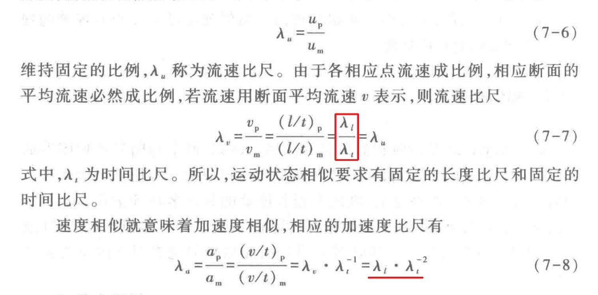

## 1. 相似条件

### 1.1 几何相似

**几何相似**是指原型和模型两个流动的几何形状相似，即两个流场中所有相应的线性变量都具有一个固定的比例关系。

### 数学表达式
设 $L$ 为特征长度，下标 $m$ 代表模型，$p$ 代表原型。线性比例尺  $\lambda_l$ 为：

$$
\lambda_l = \frac{L_p}{L_m}
$$

由此可派生出面积比例尺 $\lambda_A$ 和体积比例尺 $\lambda_V$：

$$
\lambda_A = \frac{A_p}{A_m} = \lambda_l^2
$$

$$
\lambda_V = \frac{V_p}{V_m} = \lambda_l^3
$$

集合相似是通过长度比尺 $\lambda_L$ 来表达的。几何相似时，对应的夹角应相等。严格来说，模型与原型表面的粗糙度也应该同其它线形尺度一样成同样比例。

---

## 2. 运动相似

**运动相似**是指流体运动的速度场相似，即原型和模型两流场各相应点的速度和加速度方向相同，大小各成一固定比例
### 数学表达式
设 $v$ 为流场中某点的速度， $a$ 为加速度。速度比例尺 $\lambda_v$ 和时间比例尺 $\lambda_t$ 分别为：

$$
\lambda_v = \frac{v_p}{v_m}
$$

$$
\lambda_t = \frac{t_p}{t_m} = \frac{\lambda_l}{\lambda_v}
$$

加速度比例尺 $\lambda_a$ 为：

$$
\lambda_a = \frac{a_p}{a_m} = \frac{\lambda_v}{\lambda_t} = \frac{\lambda_v^2}{\lambda_l}
$$

---

## 3. 动力相似

**动力相似**是指原型和模型两流场中各相应点上质点所受的同名力方向相同，大小成一固定比例。

### 数学表达式
流体在运动中会受到多种力的作用（如惯性力 $F_i$、黏性力 $F_v$、重力 $F_g$、压力 $F_p$ 等）。动力相似要求各力比例尺 $\lambda_F$ 统一：

$$
\lambda_F = \frac{(F_i)_p}{(F_i)_m} = \frac{(F_v)_p}{(F_v)_m} = \frac{(F_g)_p}{(F_g)_m} = \dots
$$

由于惯性力普遍存在，通常以惯性力与其他力的比值相等来体现动力相似。
* 当黏性力主导时，要求**雷诺数相等**： $Re_m = Re_p$
* 当重力主导时，要求**弗劳德数相等**： $Fr_m = Fr_p$

### **4. 初始条件和边界条件相似**

正如初始条件和边界条件的提出是微分方程的定解条件一样，初始条件和边界条件的相似是保证两个流动相似的必要条件。在恒定流中，由于运动要素不随时间变化而变化，所以能自然满足初始条件相似；而在非恒定流中，初始条件相似是必需的。

边界条件在一般情况下可分为几何、动力和运动几个方面。所以，只要满足几何相似、运动相似和动力相似，那么边界条件也就自然满足相似了。

几何相似、运动相似和动力相似三者是互相联系的一个整体，三者缺一不可。几何相似是运动相似和动力相似的前提与依据；动力相似是决定两个流动运动相似的主导因素，而运动相似则是几何相似和动力相似的表现。

---
## 2. 雷诺准则与弗劳德准则

### 2.1 雷诺准则 

雷诺数：$Re = \frac{\rho v L}{\mu}$

**雷诺准则数学表达式：** $$
Re_m = Re_p
$$

展开即为：

$$(\frac{\rho v L}{\mu})_m=(\frac{\rho v L}{\mu})_p$$
或
$$
\left( \frac{vL}{\nu} \right)_m = \left( \frac{vL}{\nu} \right)_p
$$

**物理本质：**
保证模型与原型的**惯性力与黏性力**的比值相等。

**主要使用场景：**
* **无自由液面的全浸式流动：**物体完全浸没在流体中运动，且流体表面没有与空气接触的自由交界面（即不产生表面兴波）。
* **黏性力起主导作用的流动：**流动阻力主要由流体的剪切黏性和表面摩擦引起的场景。

---

### 2. 弗劳德准则

**数学表达式：** $$
Fr_m = Fr_p
$$

展开即为：

$$
\left( \frac{v}{\sqrt{gL}} \right)_m = \left( \frac{v}{\sqrt{gL}} \right)_p
$$

**物理本质：**
保证模型与原型的**惯性力与重力**的比值相等。

**主要使用场景：**
* **存在自由液面的流动：**流体运动过程中伴随着表面起伏、波动或重力做功的场景。
* **重力或兴波阻力起主导作用的流动：**物体运动引发的表面波浪（兴波阻力）远大于摩擦阻力，或者重力直接决定流动状态的场景。

