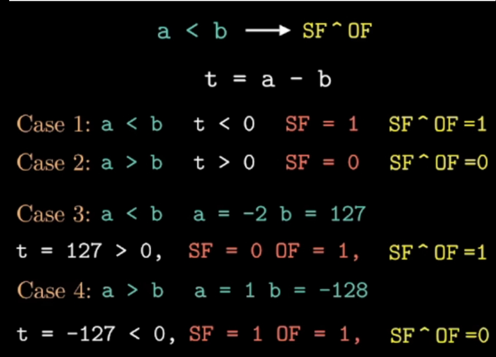
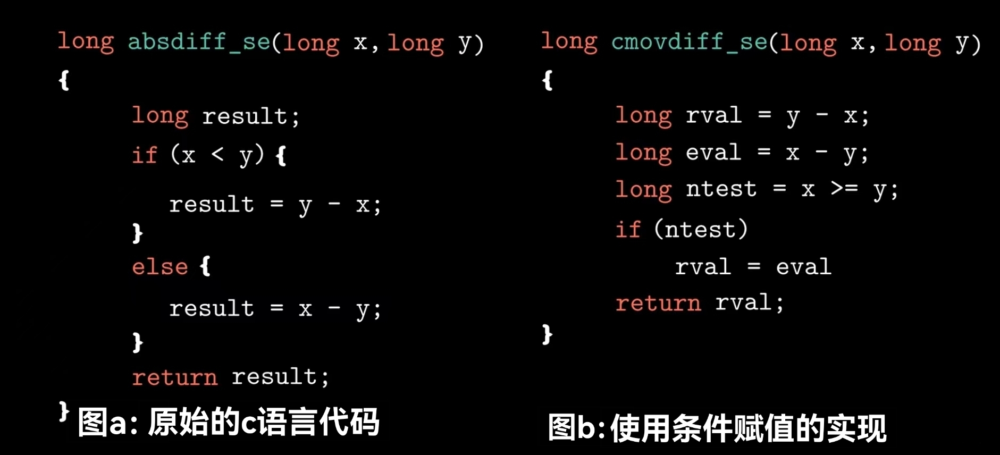

# 3.6控制
到目前为止，我们只考虑了直线代码，也就是一条指令接着一条指令顺序地执行。c语言中某些结构，比如条件语句、循环语句和分支语句，要求有条件的执行。
## 3.6.1 条件码
除了整数寄存器，CPU还维护着一组单个位的条件码寄存器，它们描述了最近的算数或逻辑操作的属性。可以检测这些寄存器来执行条件分支指令。下面是几种最常用的条件码：

- CF（carry flag）：进位标志。最近的操作使最高位产生了进位。可用来检查无符号操作的溢出。
- ZF（zero flag）：零标志。最近的操作得出的结果为0。
- SF（sign flag）：最近的操作得到的结果为负数。
- OF（overflow flag）：最近的操作导致一个补码溢出——正溢出或负溢出

!!! info "information"
    每个条件码都只占1位
    

!!! example "example 1"
    ```c
        int a = 255;
        int b = 1;
        int t = a + b; //此时t发生了进位，那么CF=1 
    ```

!!! example "example 2"
    ```c
        int a = 1;
        int b = -1;
        int t = a + b; //此时t=0，那么ZF=1
    ```

!!! warning
    任何地址的计算都没法改变条件码，包括leaq。
    
    假设 $q$ 是一个指针，那么 $q$ 就是一个地址，无论怎样改变 $q$ 的值，哪怕进位了，变 $0$ 了也不会改变条件码，但是改变 $*q$ 就有可能改变条件码了。
    
    Q：如果我在寄存器 $rbx$ 中存储了一个地址为 $255$，然后我执行 $add$ 操作使这个数变为 $256$，那么这个地址不就发生进位了吗？
    
    A：这个操作并非计算地址的操作，而是数值操作，因此这种操作会发生进位。
    
    拿$addq\ 2(\%rdi, \%rsi, s), \%rax$这个操作进行分析:
    
    1. 计算地址：$Imm+rdi+rsi*s = 2+rdi+rsi*2$这个操作是完全不会改变条件码寄存器的
    
    2. 给rax赋值：上一步计算完地址之后，这个地址指向的值跟rax中的值进行加法运算的时候才有可能改变条件码。

### CMP和TEST
还有两类指令只设置条件码（如果条件码改变了，相应的条件码寄存器中的值也会跟着变换），不改变任何其它寄存器，它们分别为CMP和TEST
!!! example "CMP"
    $cmpq\ \%rax, \%rdx$ 和 $subq\ \%rax, \%rdx$的唯一区别是前者只根据 $\%rdx-\%rax$ 来设置条件码，比如这个差值是0的话那么就将ZF设置成1，但是不更新目的寄存器（此处的目的寄存器是 $\%rdx$）的值；而后者不仅能够通过计算结果来设置条件码，还会更新目的寄存器中存储的值

!!! example "TEST"
    $test\ 与\ and$ 的差别类似 $cmp\ 与\ sub$ 的差别，同样也是 $test$ 只改变条件码而不改变目的寄存器。
    
    $test$ 的其中一个作用：
    
    执行 $testq\ \%rax, \%rax$，若 $rax$ 存储的值为0，那么这个操作就能使条件码寄存器中的ZF从
    0变为1，若不为0则无法改变ZF的值。因此 $test$ 在此便能判断 $rax$ 中的值是否为0。
    
    这个操作不会改变 $rax$ 中的值，因为 $ALU$ 不会将结果传送回去。

---

## 3.6.2 访问条件码
!!! example "example1"
    下面通过这个例子来入手访问条件码
    
    
	- $cmpq\ \%rsi, \%rdi$：比较a和b的值
        - 若 $a=b$ 那么 $ZF=1$ ，反之 $ZF=0$
    - $sete\ \%al$：把ZF的值赋值给 $al$
        - $sete$ 只会检查 $ZF$这个条件码，其余通通不care
    - $movzbl\ \%al, \%eax$：扩展0
        - 所有的条件码都是只有一个字节（8位），因此需要将 $ZF$ 先装在 $al$寄存器中

!!! example "example2 "
    下面来看一个更深的例子
    
    
	- $cmpq\ \%sil, \%dil$：$sil与dil分别为rsi与rdi的低8位$
	- $setl\ \%al //l is short for less$
	    - $setl中的l意为less$ 
	    - 但是电脑机子上显示的a-b<0并不意味着a真的比b小，因为存在溢出的情况
	    - $setl$的效果就是把$SF \wedge OF$的值赋给 $al$
	    - 下面给出4个case说明只有当 $SF \wedge OF=1时，a<b才成立$
	
	

!!! info "常用的几种set"
    
    
	- $setg$（大于）：setl取反之后为大于等于，只要除掉等于的情况就ok
	- $setge$（大于等于）：setl取反即为大于等于
	- $setl$（小于）：已经分析过
	- $setle$（小于等于）：setl或者等于

---
## 3.6.3 跳转指令
正常执行情况下，指令按照它们的出现顺序一条一条地执行。跳转指令会导致执行切换到程序中一个全新的位置。在汇编代码中，这些跳转的目的地通常用一个标号（label）指明。考虑下面的汇编代码序列：
```
      movq $0, %rax        Set %rax to 0
      jmp  .L1             Goto  .L1
      movq (%rax), %rdx    Null pointer dereference（skipped）
    .L1:
      popq %rdx            Jump target
```

- 指令 $jmp\  .L1$ 会导致程序跳过 $movq$ 指令，而从 $popq$ 指令开始继续执行。在产生目标代码文件时，汇编器会确定所有带标号指令的地址，并将跳转目标（目的指令的地址）编码为跳转指令的一部分。
- $jmp$ 指令是无条件跳转。它可以是直接跳转，即跳转目标是作为指令的一部分编码的；也可以是间接跳转，即跳转目标是从寄存器或者内存中读出的。汇编语言中，直接跳转是给出一个标号作为跳转目标，例如上面所示代码中的标号 $.L1$。间接跳转的写法是 $*$ 后面跟一个操作数指示符。
    - $jmp\  *\%rax$：用寄存器中 $\%rax$ 的值作为跳转目标
    - $jmp\ *(\%rax)$：以 $\%rax$ 中的值作为读地址，从内存中读出跳转目标。
- [点此查看多种有条件跳转指令](https://blog.csdn.net/viyana/article/details/131530381)，或者参阅书本139页。

---

## 3.6.4 跳转指令的编码
在汇编代码中，跳转目标用符号标号书写。汇编器，以及后来的链接器，会产生跳转目标的适当编码。跳转指令有几种不同的编码，但是最常用的都是PC相对的。也就是，它们会将目标指令的地址与紧跟在跳转指令后面那条指令的地址之间的差作为编码。这些地址偏移量可以编码为1、2或4个字节。第二种编码方式是给出 “绝对” 地址，用4个字节直接指定目标。汇编器和链接器会选择适当的跳转目的编码。

下面是一个PC相对寻址的例子，这个函数的汇编代码有编译文件branch.c产生。它包含两个跳转：

- 第2行的jmp指令向前跳转到更高的地址
- 第7行的jg指令向后跳转到到较低的地址
```
1    movq    %rdi, %rax
2    jmp     .L2
3  .L3:
4    sarq    %rax
5  .L2:
6    testq   %rax, %rax
7    jg      .L3
8    rep; ret
```
汇编器产生的 ".o" 格式的反汇编版本如下：
```
1    0:    48 89 f8       mov   %rdi, %rax
2    3:    eb 03          jmp   8 <loop+0x8>
3    5:    48 d1 f8       sar   %rax
4    8:    48 85 c0       test  %rax, %rax
5    b:    7f f8          jg    5 <loop_0x5>
6    d:    f3 c3          repz  retq
```

右边反汇编器产生的注释中，第2行中跳转指令的跳转目标指明为 $0x8$ ，第5行中跳转指令的跳转目标为 $0x5$ (反汇编器以16进制格式输出所有数字)。不过，观察指令的字节编码，会看到第一条指令的目标编码（在第二个字节中）为 $0x03$。把它加上 $0x5$，也就是下一条指令的地址，就得到跳转目标地址 $0x8$，也就是第4行指令的地址。

类似，第二个跳转指令的目标用单字节、补码表示编码为 $0xf8$（十进制$-8$）。将这个数加上 $0xd$ （十进制$13$），即第6行指令的地址，我们得到 $0x5$ ，即第三行指令的地址。

这些例子说明，当执行PC相对寻址时， **程序计数器的值** 是  **跳转指令后面的那条指令的地址** ，而不是跳转指令本身的地址。这种惯例可以追溯到早期的实现，当时的处理器会将更新程序计数器作为执行下一条指令的第一步。

!!! tips
    书本141页的那几个习题非常好，理解了这段内容就能秒杀这几道题。

---

## 3.5.6 用条件控制来实现条件分支
将条件表达式和语句从c语言翻译成机器代码，最常用的方式是结合有条件和无条件跳转。例如下面这段c代码，但是它有个副作用，会增加两个计数器，编码为全局变量 $lt\_cnt和ge\_cnt$ 之一。
```c
    long lt_cnt = 0;
    long ge_cnt = 0;
    
    long absdiff_se(long x, long y){
        long result;
        if(x < y){
            lt_cnt++;
            result = y - x;
        }else{
            ge_cnt++;
            result = x - y; 
        }
        return result;
    }
```
这段代码经过GCC产生的汇编代码如下：
```
    long absdiff_se(long x, long y)
    x in %rdi, y in %rsi
    
1   absidiff_se:
2     cmpq     %rsi, %rdi
3     jge      .L2
4     addq     $1, lt_cnt(%rip)
5     movq     %rsi, %rax 
6     subq     %rdi, %rax
7     ret
8   .L2:
9     addq     $1, ge_cnt(%rip)
10    movq     %rdi, %rax
11    subq     %rsi, %rax
12    ret
```
将这个机器代码在转换成c语言，我们称之为函数gotodiff_se。它使用了c语言中的goto语句，这个语句类似于汇编代码中的无条件跳转。使用goto语句通常认为是一种不好的编程风格，因为它会使代码非常难以阅读和调试。本文中使用goto语句，是为了构造描述汇编代码程序控制流的c程序。我们称这样的编程风格为 “goto代码”。
```c
    long gotodiff_se(long x, long y)
    {
        long result;
        if(x >= y)
            goto x_ge_y;
        lt_cnt++;
        result = y - x;
        return result;
    x_ge_y:
        ge_cnt++;
        result = x - y;
        return result;
    }
```

---

## 3.6.6 用条件传送来实现条件分支
实现条件操作的传统方法是使用控制的条件转移。当条件满足时，程序沿着一条执行路径执行，而当条件不满足时，就走另一条路。这种机制简单而通用，但是在现代处理器上，它可能会非常低效。

一种替代的策略时使用数据的条件转移。这种方法计算一个条件操作的两种结果，然后再根据是否满足从中选一个。只有在一些受限制的情况中，这种策略才可行，但是如果可行，就可以用一条简单的条件传送指令来实现它。

图a给出了一种可以用条件传送编译的示例代码。GCC为该函数产生的汇编代码如下，它与图b所示的cmovdiff函数有相似的形式，图b中的函数既计算了 $x-y$ 也计算了 $y-x$ ，然后再比较 $x$ 和 $y$ 的大小来确定返回的值：
```
    long absdiff(long x, long y)
    x in %rdi, y in %rsi
1   absidiff:
2   movq      %rsi, %rax
3   subq      %rdi, %rax
4   movq      %rdi, %rdx
5   subq      %rsi, %rdx
6   cmpq      %rsi, %rdi
7   comvge    %rdx, %rax
8   ret
```


