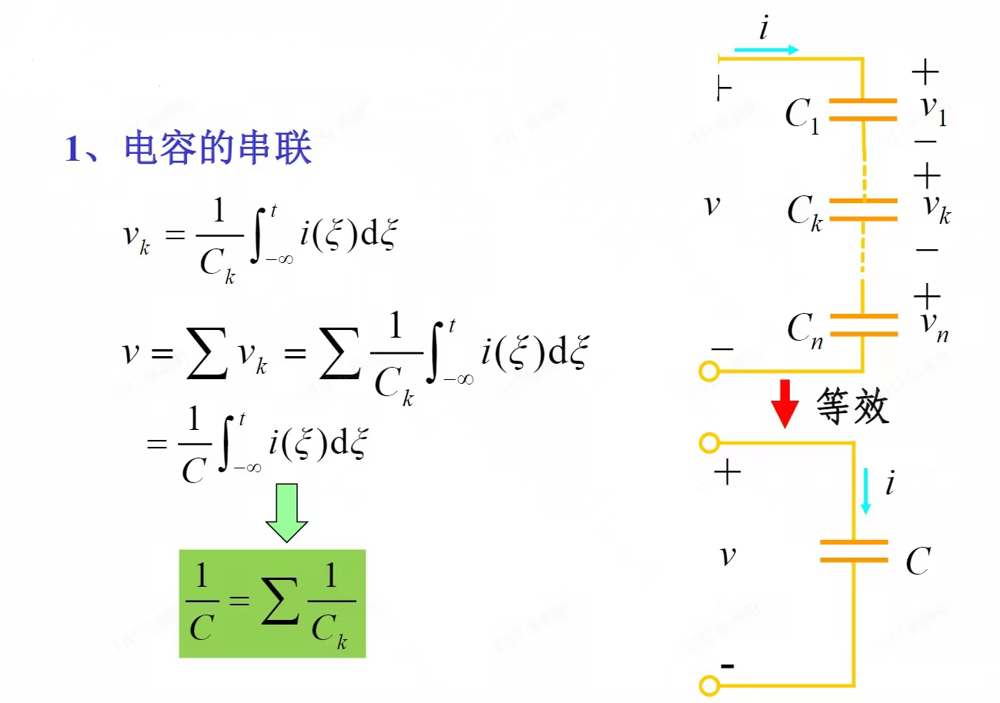

# 2.4.1 电容的串联和并联
!!! tips "1.电容的串联"
    
    

!!! tips "2.电容的并联"
    
    

---

# 2.4.2电感的串联和并联
!!! tips "1.电感的串联"
    
    

!!! tips "2.电感的并联"
    
    
    
---

# 总结：
- 电感在串联和并联的分流以及分压上个电阻是一模一样的，而电容跟电阻相反。
- 我们从阻抗的角度可能更好理解
    - 
    - 电组的阻抗跟R成正比
    - 电容的阻抗跟C成反比
    - 电感的阻抗跟L成正比
