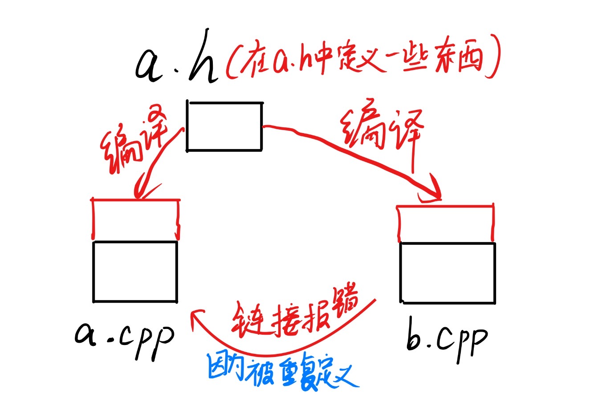

1. A .cpp file is a compile unit (一个 .cpp 文件是一个编译单元)

    - 这重申了前面的概念。一个 .cpp 文件（以及它包含的所有头文件）会被编译器独立处理，生成一个目标文件（.obj 或 .o）。

2. Only declarations are allowed to be in .h (只有声明才允许放在 .h 文件)

    - 这是一个一般原则，但需要注意，它指的是那些不会导致多重定义错误（One Definition Rule, ODR）的元素。

    - 声明（Declaration）： 告诉编译器某个东西（变量、函数、类）存在，以及它长什么样（类型、名称、参数）。它不分配内存。

    - 定义（Definition）： 提供了某个东西的完整实体或实现，并且会分配内存（对于变量）或提供代码体（对于函数）。

3. Specific types of declarations allowed in .h:

    - extern variables (extern 变量)

        - extern 关键字用于声明一个变量，表明该变量的定义（即实际分配内存的地方）在其他的 .cpp 文件中。这样，任何包含该头文件的文件都可以使用这个变量，而不会在编译时分配多余的内存，避免链接时的重复定义错误。

    - function prototypes (函数原型)

        - 函数原型（例如 int myFunction(int x);）是一个声明。它只告诉编译器函数的签名，而不会提供函数体或分配内存，因此可以安全地放在头文件中，被多个 .cpp 文件包含。

    - class/struct declaration (类/结构体声明)

        - 类或结构体的声明（例如 class MyClass { ... };）本身是一种声明，它告诉编译器该类型包含哪些成员和方法。它只是为该类型定义了一个蓝图，不会分配存储空间，因此可以安全地放在头文件中。注意： 类的非静态成员变量在类被实例化时才分配内存；类的静态成员变量需要在一个 .cpp 文件中进行定义（分配内存）。

!!! explanation "用一个形象的图解来解释一下为什么不要在.cpp文件中声明"
    a.cpp文件与b.cpp文件都include"a.h"，此时，因为a.cpp与b.cpp都是独立编译的，所以编译的时候它们都不会报错，a.h中的变量因为被两个源文件都引用了，所以在两边都被编译了一次，因此在链接的时候就会报错了（因为将二者链接时会发现重复编译）。`pragma once`只能避免编译的时候的重复包含，不能避免链接的时候被重复定义。因此我们 **不要把定义放在头文件中**。
    